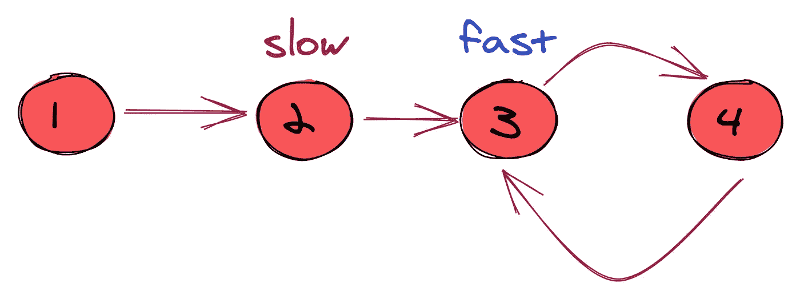
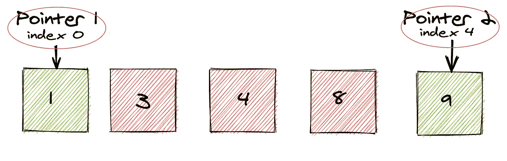

# 二传，两分:有什么区别？

> 原文：<https://levelup.gitconnected.com/two-pass-two-pointer-whats-the-difference-e006698db7c7>

## 两种解决问题的技巧，以及何时使用它们。


Emile Perron 在 [Unsplash](https://unsplash.com?utm_source=medium&utm_medium=referral) 上的照片

双指针技术通常用于优化字符串、数组或链表编码问题的解决方案。在简单的解决方案中，在那些数据结构之一中搜索一组元素，在最坏的情况下，可能具有多项式时间复杂度，例如 O(n)，O(n)，O(n⁴等。然而，在排序数据上使用双指针技术，时间复杂度降低到 O(n)。另一方面，尽管两遍方法也用于解决字符串、数组或链表编码问题，但它不一定是最佳解决方案。

## 什么是两遍法？

两遍方法使用两个独立的循环来解决问题；使用的第一个循环提取一些关于输入状态的信息，第二个循环使用这些信息来解决问题。

例如，排序颜色是 Leetcode 上提供的一个编码问题。问题的关键是将所有的对象就地排序，使相同的颜色(数字)相邻，数字从 0 到 2 排序。

```
Input: [2,0,2,1,1,0]
Output: [0,0,1,1,2,2]
```

虽然两遍方法允许我们在 O(n)的最坏情况时间内解决问题，但空间复杂度也是 O(n)。O(n)是因为需要在一个数据结构中存储每个数字/颜色的出现次数*(我使用了一个数组，但对于哈希映射也是如此，因为它仍然占用内存中的多个槽)*。

```
/**
 * @param {number[]} nums
 * @return {void} Do not return anything, modify nums in-place instead.
 */
var sortColors = function(nums) {
    const colorMap = [0, 0, 0]
    // record the number of occurences for each number/color
    for (let i of nums) {
        colorMap[i] += 1
    }

    let start = 0
    for (let key = 0; key < 3; key++) {
        // use colorMap to change nums in-place
    }
}
```

然而，存在使用两遍方法产生最佳空间复杂度的实例，例如，在 Leetcode 问题中移动零。在这个问题中，输入中的所有零必须在数组的末尾，并且必须就地发生。

```
Input: [0,1,0,3,12]
Output: [1,3,12,0,0]
```

在这种情况下，两遍方法中的第一个循环计算输入中零出现的次数，并将数据存储为整数变量。因此，空间复杂度为 O(1)。

```
/**
 * @param {number[]} nums
 * @return {void} Do not return anything, modify nums in-place instead.
 */
var moveZeroes = function(nums) {
    let count = 0
    for (x of nums) {
        count += x == 0 ? 1 : 0
    }

    let ptr = 0
    let found = 0
    while (ptr < nums.length && found != count) {
        //solve using the count
    }
};
```

## 两点法是什么？

双指针方法使用两个变量来跟踪数据结构中的每个元素。然而，与两遍方法不同，双指针技术为我们提供了一点灵活性来预测、回顾和比较不同的数据窗口。它分析输入的状态，并在循环的每次迭代中对其进行转换。

有两种类型的双指针技术。

**同向:**两个指针都从头开始，但一个是快速运行的指针，而第二个指针是慢速运行的指针。当满足某些条件时，慢速运行指针被更新。这种双指针技术可以帮助我们分析输入的不同窗口，探索和比较输入的子集，或者检测输入中的循环。



图片来自 [AlgoDaily](https://algodaily.com/) 在[使用双指针技术](https://algodaily.com/lessons/using-the-two-pointer-technique/what-is-the-pattern-2?view=article)

这是一个排序颜色的示例解决方案，使用了**同向**方法。注意，慢速指针只有在快速指针搜索了整个数组后才会更新。*除了我提供的这个示例之外，这个解决方案还有很多内容，但这是基本的想法。*

```
/**
 * @param {number[]} nums
 * @return {void} Do not return anything, modify nums in-place instead.
 */
var sortColors = function(nums) {
    let slow_pointer = 0 // slow pointer
    let fast_pointer = n+1 // fast pointer
    // other variables ...

    while (slow_pointer < nums.length) {
        /// do a lot of work here .....fast_pointer ++; // updated on every iterationif (fast_pointer >= nums.length) {
            slow_pointer = nxt
            nxt = slow_pointer + 1
            fast_pointer = nxt
            // ... other variables
        }
    }
};
```

**反方向:**两个指针从输入的不同端开始。它们朝着对方移动，直到满足某种条件。这种双指针技术可以帮助我们在输入中有效地移动数据，比较输入的不同端，它还可以检测循环。



使用双指针技术从[中的](https://algodaily.com/lessons/using-the-two-pointer-technique/what-is-the-pattern-2?view=article)[算法日报](https://algodaily.com/)得到的图像

在这个移动零点的示例解决方案中，在给定的特定条件下，两个指针彼此相向移动。在相反方向的方法中，不一定有“快指针”或“慢指针”，其思想是两个指针以相对相同的速度移动，直到它们重叠。

```
/**
 * @param {number[]} nums
 * @return {void} Do not return anything, modify nums in-place instead.
 */
var moveZeroes = function(nums) {  
    ...
    let pointerA = 0
    let pointerB = nums.length - 1

    while (pointerA != pointerB) {
        if (nums[pointerA] == 0) {
            // ... do something then, update pointer
            pointerB--;
        } else {
            pointerA++
        }
    }
}
```

## 那么你怎么知道什么时候用什么呢？

首先，如果你不知道你在优化什么样的解决方案，你就不可能想到一个最优的解决方案。两点技术是一种优化技术，所以我相信，除非你对你的解决方案有 101%的信心，否则它可能不是最好的解决方案。

我的经验是，如果你遇到一个让你的*两遍方法感觉*刺痛的问题，那么首先选择两遍方法。用它作为你的天真的解决方案是不会错的，一旦你充实了你的答案，你就可以分析你的代码来决定你是否能削减成本。

这也是面试中的绝佳话题。**记住，面试是为了评估你解决问题的能力，而不是你能多快想到一个最佳解决方案。**

你可以炫耀你的技能，谈论:

*   最坏情况下的时间和空间复杂度
*   讨论为什么两遍方法有效或无效
*   在你天真的解决方案中讨论削减成本的方法
*   讨论如何实现双指针技术，并可能伪代码解决方案。

作为一名面试官，如果一个人给了我一个详细、透彻的解决方案分析，我会比一个人马上给我一个最佳解决方案印象更深刻。所以，永远不要害怕或羞于选择一个天真的解决方案，比如先采用两遍方法。

理解这两种方法不会错。在你的实践中，我强烈建议使用两者来解决问题，并对两者进行彻底的分析，就像你在面试一样。你将成为一个更敏锐的问题解决者，并建立与未来团队互动所必需的关键沟通技巧。

*编码快乐！*