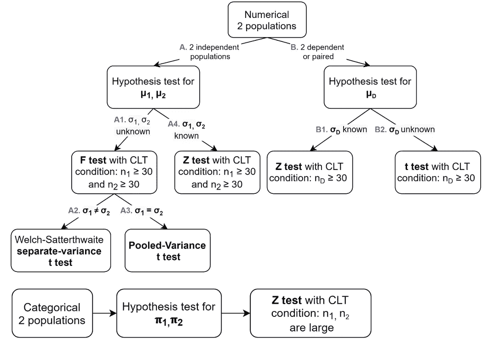
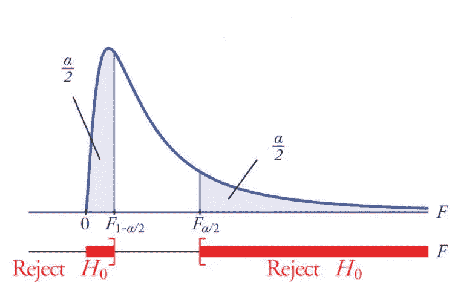
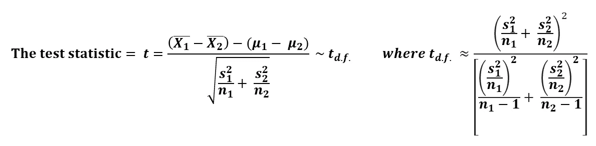
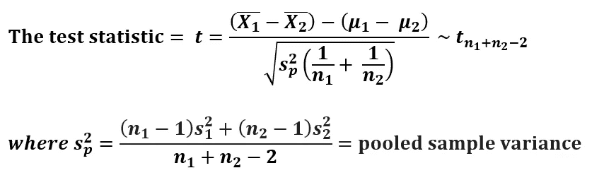
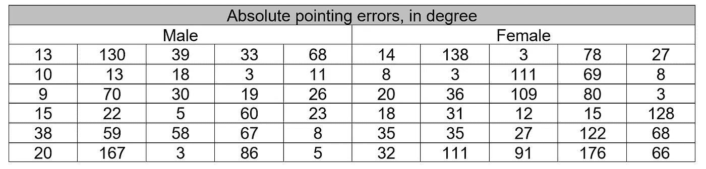
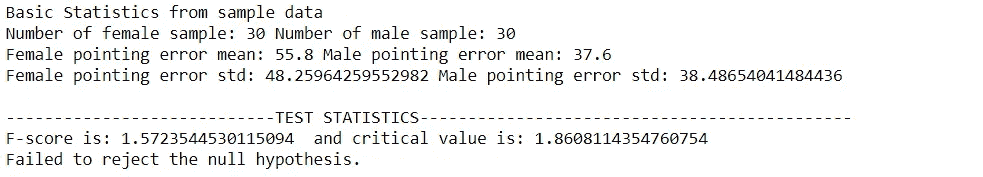
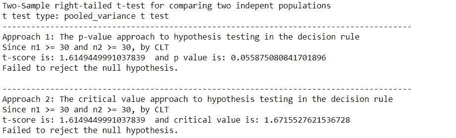
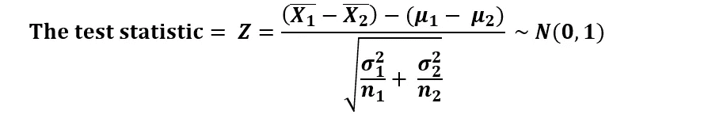
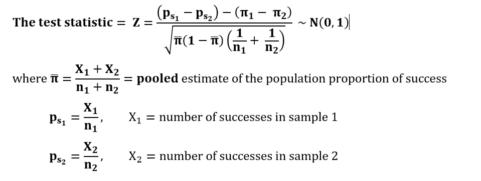

# 使用 Python 进行双样本假设检验

> 原文：<https://levelup.gitconnected.com/two-sample-hypothesis-tests-with-python-43e1b8c52306>

## 执行双样本假设检验的完全初学者指南(带代码！)

在 [Unsplash](https://unsplash.com/?utm_source=medium&utm_medium=referral) 上由 [Rohit Tandon](https://unsplash.com/@rohittandon) 拍摄的照片

假设检验是一种统计检验，用于检验所做的假设，并得出关于总体的结论。在[之前的文章](/how-to-perform-one-sample-hypothesis-tests-with-python-308eae8789fc)中，我已经介绍了如何在不同的情况下进行单样本假设检验。在这篇文章中，我将分享假设检验如何扩展到比较来自两个群体而不是一个群体的样本。

**假设检验的五步过程**与单样本假设检验相同，除了检验统计的计算，概括地说:

1.  定义零假设(H₀)
2.  定义替代假设(H₁)
3.  设置显著性水平(α)
4.  收集数据并计算测试统计

图 1:测试统计取决于不同的情况

5.构建拒绝和非拒绝区域，并得出结论

# A.比较两个独立总体的假设检验

它是针对两个独立的群体或样本，而不是一个群体或样本。它的参数数量是单样本假设检验的两倍。两个独立总体的一个常见假设是，样本是从每个总体中随机抽取**和独立抽取**。****

****如果**总体方差σ未知**，我们需要首先使用 f 检验来检验来自独立总体的方差是否相等。f 检验之后，我们就可以决定做哪个 t 检验了。分离方差 t 检验或混合方差 t 检验。****

# ****A1。比较两个独立总体间方差的 f 检验****

****在 f 检验中，假设总体呈正态分布。当检验等方差假设时，****

****H₀: σ₁ = σ₂
H₁: σ₁ ≠σ₂
给定α
当 s₁ ≥ s₂时，∴ F 应该≥ 1，所以只需要关心右尾临界值:
检验统计量= f =s₁/s₂~ f⃋⃋-⃋，⃋****

********

****图 2: F 分布[1]****

****f 统计量遵循 f 分布，分别有两个自由度:(n₁-1)和(n₂-1)。****

# ****A2。比较两个独立总体平均值的分离方差 t 检验****

****当σ₁和σ₂都**未知**，而σ₁&σ₂**不平等**时。****

********

****双样本独立方差 t 检验(Welch-Satterthwaite)****

# ****A3。比较两个独立总体平均值的混合方差 t 检验****

****当σ₁和σ₂都**未知**，而σ₁&σ₂**不等于**。****

********

****双样本混合方差 t 检验****

> ****2000 年，进行了一项关于陌生环境中性别和方向感与空间定向的关系的实验，其中对波士顿大学 30 名女性和 30 名男性心理学学生的方向感进行了测试。这些学生被带到一个不熟悉的树木繁茂的公园后，接受了空间方位测试(指向南方)。学生们通过移动连接在 360 度量角器上的指针来指示。是否有证据表明，在 5%的显著性水平上，平均而言，男性比女性有更好的方向感？****

********

****表 1:实验数据****

> ****首先给定学生的绝对指向误差，检验男女指向误差总体方差的相等性。****

****设σ₁为
中女性指向误差的真实标准差(std ),σ₂为
中女性指向误差的真实标准差(STD ),首先计算男性和女性样本均值和标准差。****

****遵循上面给出的 f 个测试步骤或 5 个步骤的过程:
h₀:σ₁=σ₂
h₁:σ₁≠σ₂
α= 0.01
假设指向误差对于每个群体来说都是近似正态的，
F = s₁ / s₂ ~ F₂₉，₂₉
遵循图 1 第 A1 部分:****

****第 1 部分:f 检验——比较两个独立总体均值和未知 std 的假设检验****

********

> ****由于我们没有足够的证据证明女性和男性的指向误差的真实 std 不同，我们可以使用混合方差 t 检验来测试男性是否比女性有更好的方向感。****

****设μ₁为女性在
中的真实平均指向误差μ₂为男性在
中的真实平均指向误差现在让我们遵循五个步骤:
H₀: μ₁ ≤ μ₂
H₁: μ₁ > μ₂(右尾检验)
α = 0.05
遵循图 1 第 A3 部分:****

****第 2 部分:t 检验——比较两个独立总体均值和未知 std 的假设检验****

********

****结论:在 5%的显著性水平上，我们没有足够的证据证明男性的真实平均指向误差小于女性。****

# ****A4。比较两个独立总体平均值的双样本 Z 检验****

****当σ₁和σ₂都出名的时候。****

********

****均值的双样本 Z 检验****

# ****B.比较两个相依总体的假设检验****

****如果根据某些特征分组**配对或匹配**，或者当**重复测量**是从分组的**相同集合**中获得时，样本被认为是相关的。****

# ****B1。均值差异和 B2 的配对样本 Z 检验。平均差异的配对样本 t 检验****

****成对样本检验的目的是确定两个相关组之间的任何显著差异。例如，调查新加坡的哪家商店更便宜？冷库 vs NTUC Fairprice 或者屈臣氏 vs 嘉德药房。****

****配对样本 Z 检验和 t 检验可以简化为前一篇文章中的单样本数值假设检验。****

# ****C.比较两个独立总体比例的双样本 Z 检验****

****比例的双样本检验遵循与比例的单样本检验相同的假设检验原则。****

********

# ****推荐阅读****

**** [## 使用 Python 进行单样本假设检验

### 执行单样本假设检验的完全初学者指南(带代码！)

levelup.gitconnected.com](/how-to-perform-one-sample-hypothesis-tests-with-python-308eae8789fc)  [## 卡方检验，用 Python

### 执行卡方检验的完全初学者指南(带代码！)

towardsdatascience.com](https://towardsdatascience.com/chi-square-test-with-python-d8ba98117626)  [## 用 Python 进行 ANOVA 测试

### 执行 ANOVA 测试的完全初学者指南(带代码！)

towardsdatascience.com](https://towardsdatascience.com/anova-test-with-python-cfbf4013328b)  [## 使用 Python 进行双向 ANOVA 测试

### 执行双向 ANOVA 检验的完全初学者指南(带代码！)

towardsdatascience.com](https://towardsdatascience.com/two-way-anova-test-with-python-a112e2396d78)  [## McNemar 的测试，使用 Python

### 执行麦克纳玛测试的完整初学者指南(带代码！)

towardsdatascience.com](https://towardsdatascience.com/mcnemars-test-with-python-e1bab328d15c) 

# 参考

[1]“两个方差相等的 f 检验。”【在线】。可用:[https://saylordotorg . github . io/text _ introductive-statistics/s15-03-f-tests-for-equality-of-two-va . html](https://saylordotorg.github.io/text_introductory-statistics/s15-03-f-tests-for-equality-of-two-va.html)

[2] M .珍妮·肖，J. C .阿卡西奥，R. O .马卡，c .莱昂，“[陌生环境中性别和方向感与空间方位的关系](https://www.sciencedirect.com/science/article/pii/S0272494499901469)， *J. Environ。心理学。*，第 20 卷，第 1 期，第 17-28 页，2000 年。

[3]“标准偏差并不假设相等 SOGA 地球科学部。”【在线】。可用:[https://www . geo . fu-Berlin . de/en/v/soga/Basics-of-statistics/Hypothesis-Tests/Hypothesis-Tests-for-Two-Population-Means/Standard-Deviations-Not-Assumed-Equal/index . html](https://www.geo.fu-berlin.de/en/v/soga/Basics-of-statistics/Hypothesis-Tests/Hypothesis-Tests-for-Two-Population-Means/Standard-Deviations-Not-Assumed-Equal/index.html)

[4]“标准差假设相等 SOGA 地球科学部。”【在线】。可用:[https://www . geo . fu-Berlin . de/en/v/soga/Basics-of-statistics/Hypothesis-Tests/Hypothesis-Tests-for-Two-Population-Means/Standard-Deviations-Assumed-Equal/index . html](https://www.geo.fu-berlin.de/en/v/soga/Basics-of-statistics/Hypothesis-Tests/Hypothesis-Tests-for-Two-Population-Means/Standard-Deviations-Assumed-Equal/index.html)****