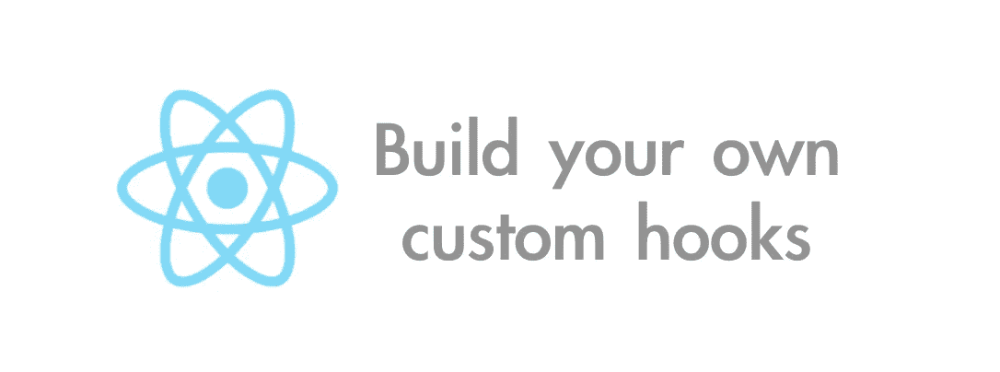

# React 应用程序的两个简单、可重复使用的定制挂钩

> 原文：<https://levelup.gitconnected.com/two-simple-reusable-custom-hooks-for-your-react-apps-a0275724f8ab>



React 的新 Hooks API 提供了一系列非常棒的工具，供您用来创建和管理应用程序。包含的钩子函数有`useState`用于管理组件中的本地状态，`useEffect`用于创建各种生命周期方法以及从外部 API 获取数据，`useContext`允许每个组件使用应用上下文的一个实例。此外，React 允许您创建自己的定制挂钩，使您能够将组件的逻辑(有状态或无状态)提取到外部化的可重用函数中。

根据 [React 文档](https://reactjs.org/docs/hooks-custom.html)，“**自定义钩子是一个 JavaScript 函数，它的名字以‘use’开头，可以调用其他钩子。”**建议使用这种命名约定是为了遵循已经存在的模式。

关于编写你自己的定制钩子，我最喜欢的部分是它们不仅可以在定义它们的应用程序中重用，而且可以在你所有的应用程序中重用。对于我将要描述的两个钩子也是如此。所以让我们开始吧。

# useInputValue

```
import { useState } from "react";export const useInputValue = initialValue => {
  const [value, setValue] = useState(initialValue);
   return {
     value,
     onChange: e => { 
      setValue(e.target.value || e.target.innerText);
    };  
  };
};
```

注意这里我们甚至不需要`React`，因为我们不返回/呈现任何 JSX，这仅仅是一个 JavaScript 函数。`useInputValue`函数只是接受一个初始值，将其设置为从`useState`接收的`value`变量的值，然后返回一个包含该值的对象和一个更新该值的`onChange`函数。我知道这看起来有点奇怪，但是它使得在组件中处理输入更加简洁。让我们看一个如何使用它的例子:

```
import React from "react";
import { Link } from "react-router-dom";
import { useInputValue } from "./hooks/useInputValue";
import { loginUser } from "../api/user"; const Landing = () => {  
const email = useInputValue("");  
const password = useInputValue(""); const handleSubmit = e => {    
  e.preventDefault();    
  loginUser(email.value, password.value);
};...<input type="text" placeholder="Email" {...email} />
<input type="password" placeholder="Password" {...password} />
```

语法最初可能令人不快，但是如果你熟悉[对象传播](https://developer.mozilla.org/en-US/docs/Web/JavaScript/Reference/Operators/Spread_syntax)的话，这实际上很酷。如果你还记得，我们从我们的自定义钩子返回一个对象，所以`email`看起来像这个`{ value, onChange: () => ...}`。这意味着通过将`email`和`password`变量分布在我们的输入上，我们将`onChange`处理程序暴露给了输入，因此这就是我们更新输入值所需要的。请记住，如果我们将 updater 函数命名为除了`onChange`或 React 中的任何其他事件侦听器之外的任何名称，则 spread 语法将不起作用。

# 使用开关

这可能是我最喜欢的，我在我工作的项目中经常使用它。它也非常简洁，可读性很强:

```
import { useState, useCallback } from "react";export const useToggle = (initial) => {  
  const [open, setOpen] = useState(initial);   

  return [open, useCallback(() => setOpen(status => !status))];
};
```

注意我是如何利用 React 提供的`[useCallback](https://reactjs.org/docs/hooks-reference.html#usecallback)`钩子的。这个钩子做了你认为它会做的事情，允许你，根据 React 文档，“*返回一个回调的记忆版本，只有当其中一个输入改变时它才会改变。这在将回调传递给依赖引用相等来防止不必要呈现的优化子组件时很有用。*

说什么？？“记忆化”本身就是一个话题，我不会在这里深入探讨，但是如果你想了解更多，请查看这篇文章。我是这样解释文档的解释的:每当我们使用`useCallback`钩子时，它足够聪明地知道组件是否需要被重新呈现(“引用相等”位)或者切换功能是否需要发生。为了实现这种切换功能，我们又一次有了一个函数，它接收一个初始值，并将其存储在从`useState`接收的状态(`open`)中。然后，它返回一个具有该状态的数组以及一个回调来切换容器的打开状态。仅此而已。

因此，这里有一个我如何使用这个钩子来切换搜索过滤器的查看能力的例子(注意，我使用的是[样式化组件](https://www.npmjs.com/package/styled-components)):

```
import React, { useState, useEffect } from "react";
import { Link } from "react-router-dom";
import { useToggle } from "../hooks/useToggle";
import {  LandingContainer,  FlexContainer,  Button} from "../styled_elements/layout";
import Filters from "./Filters";
import { fetchProducts } from "../actions/index";
import { Pages } from "../styled_elements/layout";
import ProductList from "./ProductList"; const Landing = ({ products, total, pages }) => {  
  const [open, toggle] = useToggle(false);
  const [activePage, setActivePage] = useState(1);

 useEffect(() => {      
  fetchProducts(activePage);
 },
  [activePage] 
 );const handlePageClick = page => setActivePage(page);const pageCrumbs = generatePages();
  return (    
  <>      
{open && <Filters />}      
<LandingContainer>        
  <div>          
   <Pages>{pageCrumbs}</Pages>        
  </div>        
  <FlexContainer>          
    <Button onClick={toggle}>Refine search</Button>
    <Link to="/reviews"><Button>View reviews</Button></Link
  </FlexContainer>
```

请注意，`<Filters />`组件和`toggle`函数的条件呈现被传递给“Refine search”按钮。这只是利用这个钩子的许多不同方法中的一种，它真的适用于你想切换的任何东西。

我就知道这些了。我希望你能从中找到一些用处，或者如果你有任何改进的建议或者你自己的一些窍门，我很乐意听听。

在我离开之前，【useHooks.com】是一个很棒的基于订阅的网站，它提供了大量你能想象到的定制挂钩。如果你想了解更多关于 React 钩子的知识，我强烈建议你去看看。

感谢您的倾听。

[](https://levelup.gitconnected.com)[](https://gitconnected.com/learn/react) [## 学习 React -最佳 React 教程(2019) | gitconnected

### 排名前 49 的 React 教程-免费学习 React。课程由开发人员提交并投票，使您能够…

gitconnected.com](https://gitconnected.com/learn/react)