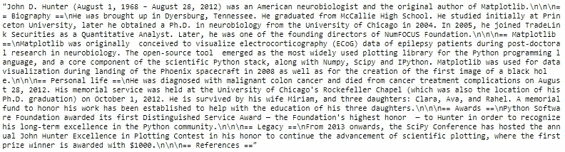
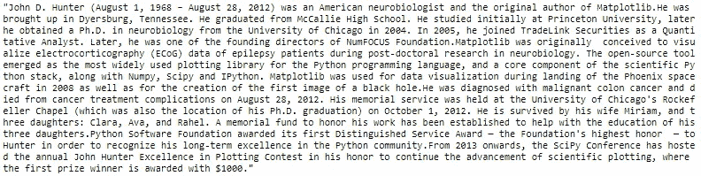
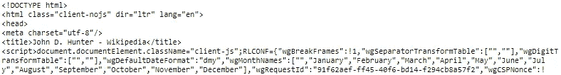
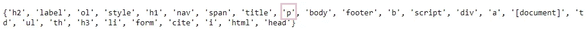
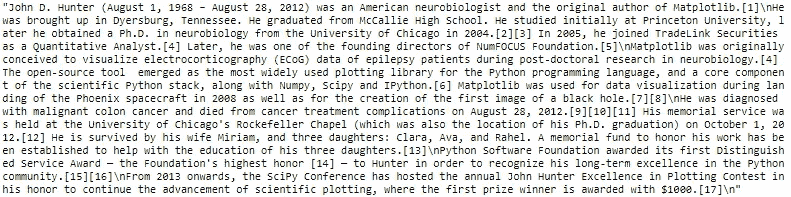
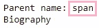
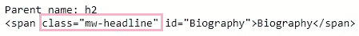

# 用 Python 从维基百科中抓取文本的两种简单方法

> 原文：<https://levelup.gitconnected.com/two-simple-ways-to-scrape-text-from-wikipedia-in-python-9ce07426579b>

这篇文章将首先展示一个**的简单方法**，用几行代码从维基百科中抓取文本，然后用一个更**的通用方法**提取相同的文本，该方法可以应用于其他网站。

我们将从“约翰·d·亨特”的[维基百科页面上抓取文本内容](https://en.wikipedia.org/wiki/John_D._Hunter)💎他是 Python 开发的传奇先驱之一，也是 M [atplotlib](https://matplotlib.org/) 的创造者，这是一个强大的可视化软件包。如果你想更多地了解他和他从中年时期学到的东西，看看这篇有见地、有见识的[演讲](https://www.youtube.com/watch?v=e3lTby5RI54)。尽管视频质量很差，我还是非常喜欢看他的演讲。


来自[的单词云“Python 中的简单单词云”](https://towardsdatascience.com/simple-wordcloud-in-python-2ae54a9f58e5)

# 0.Python 设置🔧

我假设读者(👀是的，你！)可以访问并熟悉 Python，包括安装包、定义函数和其他基本任务。如果你是 Python 的新手，[这个](https://www.python.org/about/gettingstarted/)是一个很好的起点。

我已经在 Jupyter Notebook 中使用并测试了 Python 3.7.1 中的脚本。

在我们开始之前让我们确定你已经安装了以下库:
◻ **简易方式:** *维基百科、* ◻ **通用方式:** *urllib* 和 *BeautifulSoup*

# 1.使用维基百科的简单方法🍰

维基百科包旨在使从维基百科中提取数据变得容易和简单，它确实做到了这一点。👏

我们可以使用几行代码从维基百科页面中提取文本内容:

```
# Import package
import wikipedia# Specify the title of the Wikipedia page
wiki = wikipedia.page('John D. Hunter')# Extract the plain text content of the page
text = wiki.content
text
```



文本

Ta-da❕我们刚刚提取了文本内容！看到有多简单了吗？如果您在最后一行使用`print(text)`而不是`text`，您会注意到它被很好地格式化为新的行和标题。

假设我们只想保留每个段落的主体，而不想保留其他内容，那么我们必须做一些清理:
◼️删除由“==”包围的标题:`re.sub(r'==.*?==+', '', text)` ◼️用“”(一个空字符串)替换“\n”(一个新行):`.replace('\n', '')` 输出*文本*是一个字符串(可以使用`type(text)`进行检查)，这允许我们利用字符串方法或任何其他可以在字符串上使用的操作。

```
# Import package
import re# Clean text
text = re.sub(r'==.*?==+', '', text)
text = text.replace('\n', '')
text
```



就这样，我们刚刚从维基百科上搜集了一些文本。简单的方法，滴答。✅

*如果你想了解更多关于这个包的信息，这里的*[](https://wikipedia.readthedocs.io/en/latest/code.html#api)**就是文档。**

# *2.使用 urllib 和 BeautifulSoup 的一般方法🍜*

*让我们使用一种更通用的方法来提取相同的数据，这种方法可以用于其他网站。*

```
*# Import packages
from urllib.request import urlopen
from bs4 import BeautifulSoup# Specify url of the web page
source = urlopen('[https://en.wikipedia.org/wiki/John_D._Hunter').read()](https://en.wikipedia.org/wiki/John_D._Hunter').read())# Make a soup 
soup = BeautifulSoup(source,'lxml')
soup*
```

**

*汤的样本提取物*

**soup* 的这种看起来像胡言乱语的输出有什么意义吗？让我们一起试着理解它。*

**汤*包含页面上的所有内容，由更小的元素组成，其中大部分是我们不需要的(例如表格、引用)。使用下面的脚本，我们可以找出*汤*中有哪组元素:*

```
*print(set([text.parent.name for text in soup.find_all(text=True)]))*
```

**

*元素*

*在我们的例子中，我们感兴趣的是那些被标记为 *< p >* 的段落，它代表*段落。我们可以使用下面的脚本找到所有段落:**

**Psst，如果你好奇想了解更多关于其他元素的信息，试着用集合中的另一个元素来改变‘p’(参考上面的元素集合)。**

```
*# Extract the plain text content from paragraphs
text = ''
for paragraph in soup.find_all('p'):
    text += paragraph.text

text*
```

**

*文本*

*我们快到了。让我们做一点清理，以获得前一部分的准确输出:
◼️删除括号中的脚注上标:`re.sub(r'\[.*?\]+', '', text)` ◼️用' '(空字符串)替换' \n '(新行):`.replace('\n', '')`*

```
*# Import package
import re# Clean text
text = re.sub(r'\[.*?\]+', '', text)
text = text.replace('\n', '')
text*
```

*Yay❕:我们用一种更通用的方法提取了完全相同的文本。一般方式，打勾。✅*

# *3.最终代码📃*

*这个最终的代码是一个略有不同的版本，其中脚本被调整为保留段落标题，因此这两种方法都有两个可用的示例可供参考。这可能比整理前面章节中已经显示的代码更有用。*

*结束之前的最后一点:如果您想知道如何在 gist 的第 38 行中找到正确的名称和属性，我是这样做的:
1)我运行下面的脚本并滚动输出，直到我找到一些段落标题的文本，比如说传记，并发现它们的父名称是`span`。请记住寻找传记的第二个实例，因为第一个实例将用于内容表。在这种情况下，它们都有相同的标签。*

```
*for s in soup.find_all(text=True):
    # Check out the parent name
    print(f'Parent name: {s.parent.name}')
    # Check the text
    print(s)*
```

**

*2)我使用下面的脚本研究了所有的标签及其细节。我再次滚动输出，找到一些段落标题的文本，比如传记(记得参考第二个实例)，并发现标题有`class="mw-editsection"`。*

```
*for s in soup.find_all('span'):
    # Check out the parent name
    print(f'Parent name: {s.parent.name}')
    # Check the text
    print(s)* 
```

**

*这是一个尝试和错误，但我很高兴这样做。我希望你也是！*

**

*照片由[多梅尼科·洛亚](https://unsplash.com/@domenicoloia?utm_source=medium&utm_medium=referral)在 [Unsplash](https://unsplash.com?utm_source=medium&utm_medium=referral) 拍摄*

**您想访问更多这样的内容吗？媒体会员可以无限制地访问媒体上的任何文章。如果您使用* [*我的推荐链接*](https://zluvsand.medium.com/membership) ，*成为会员，您的一部分会费将直接用于支持我。**

*谢谢你看我的帖子。我希望你已经学到了一些东西，✂️.如果你感兴趣，这里有我的其他帖子的链接:
◼️[Python 中的简单单词云](https://towardsdatascience.com/simple-wordcloud-in-python-2ae54a9f58e5)
◼️️[NLP 简介-第 1 部分:python 中的预处理文本](https://towardsdatascience.com/introduction-to-nlp-part-1-preprocessing-text-in-python-8f007d44ca96)
◼️[NLP 简介-第 2 部分:词条满足和词干的区别](https://medium.com/@zluvsand/introduction-to-nlp-part-2-difference-between-lemmatisation-and-stemming-3789be1c55bc)
◼️[NLP 简介-第 3 部分:TF-IDF 解释](https://medium.com/@zluvsand/introduction-to-nlp-part-3-tf-idf-explained-cedb1fc1f7dc)
◼️[NLP 简介-第 4 部分:监督](https://medium.com/@zluvsand/introduction-to-nlp-part-4-supervised-text-classification-model-in-python-96e9709b4267)*

*再见🏃💨*