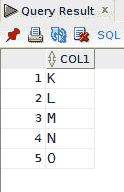
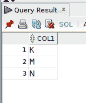
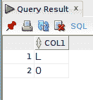
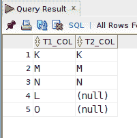
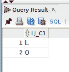

# 两个 SQL 查询来查找在一个表中存在而在另一个表中不存在的行。

> 原文：<https://levelup.gitconnected.com/two-sql-queries-to-find-rows-present-in-one-table-but-not-another-5db9692f5685>

有时在查询 SQL 表时，您希望找到缺失的行，而不是存在的行。在这篇文章中，我将演示两个查询，您可以使用它们来确定在一个表中出现但在另一个表中丢失的行…

[链接到摄影者](https://pixabay.com/images/id-2527458/)。

自我推销:

如果你喜欢这里写的内容，尽一切办法，把这个博客和你最喜欢的帖子分享给其他可能从中受益或喜欢它的人。既然咖啡是我最喜欢的饮料，如果你愿意，你甚至可以给我买一杯！

**注意**:对于本文中的示例查询，我使用的是 Oracle 数据库。您的特定 SQL 实现可能与我使用的查询类似或完全不同。

我有两个简单的表，每个表都有一个数据类型为`CHAR`的列，我将它们用于示例数据:

期望的结果是编写一个返回“L”和“O”的查询，因为这些行不在 **TAB2** 表中。

## 查找缺失行的查询 1:减去集合运算符

`MINUS`是甲骨文中相当于`EXCEPT` 的集合运算符。`MINUS`只返回那些出现在第一个`SELECT`语句中，而在第二个`SELECT`语句中找不到的行，同时从结果集中删除重复的行。

我们可以使用`MINUS`并轻松找出哪些行在表 **TAB1** 中，哪些行不在表 **TAB2** 中。第一个`SELECT`应该来自**表 1** ，因为这是查询`MINUS`防止任何行在第二个`SELECT`中找不到。

( ***Pro 提示*** :记住使用集合操作符，比如`MINUS`，对于涉及的`SELECT`语句，列数和数据类型应该匹配。)

返回的行具有表 **TAB2** 中没有的 **COL1** 值“L”和“O”。

我坚持每周写一封关于我正在学习并感兴趣的 SQL/PHP 的邮件。如果这听起来像是你想参与的事情，请使用此[注册](https://digitalowlsprose.ck.page/1b35a06295)(异地链接)表格进行订阅。谢谢大家！

## 查找缺失行的查询 2:左连接，空值过滤

A `LEFT OUTER JOIN`返回左*表中的所有行和右*表中的任何匹配行。在*右*表中没有匹配的地方，一个`LEFT OUTER JOIN`返回`NULL`。让我们访问一个示例查询以获得全面理解:

由于 **TAB1** 行的‘L’和‘O’在 **TAB2** 中不匹配，`NULL`返回到`JOIN`的 **TAB2** 侧*侧*。有了这些知识，我们可以过滤结果集的*侧*，只保留那些**tab 2**col**col 1**值为`NULL`的行。

( ***亲提示*** :记住，`NULL`不等同于任何东西。甚至不是另一个`NULL`。因此，当通过`NULL`过滤时，相等测试不起作用，将返回一个空集。过滤`NULL`时必须使用`IS NULL`。或者反过来，`**IS NOT NULL**`，如果逻辑指示如此。)

同样，根据需要返回值为“L”和“O”的行。

## 查找缺失行的查询:读者建议

现在轮到你了。您会使用哪些其他查询来实现这些结果？请在下面的评论区告诉我关于他们的一切。

一如既往，如果你有任何问题或看到代码中的任何错误，请通过评论让我知道。建设性的意见有助于我提供准确的博客帖子，我非常感激。

进一步阅读

*   [如何使用 Oracle SQL 中的 NVL 和 NVL2 函数](https://joshuaotwell.com/how-to-use-the-nvl-and-nvl2-functions-in-oracle-sql/)(非现场链接)
*   [ORDER BY 如何在 GROUP BY 查询中受到限制](https://joshuaotwell.com/how-order-by-is-restricted-in-group-by-queries/)(非现场链接)
*   [如何使用 Oracle SQL Developer 插入数据](https://joshuaotwell.com/how-to-insert-data-using-oracle-sql-developer/)(非现场链接)

喜欢你读过的？看到什么不正确的吗？请在下面评论，感谢阅读！！！

# 行动的号召！

感谢你花时间阅读这篇文章。我真心希望你发现了一些有趣和有启发性的东西。请在这里与你认识的其他人分享你的发现，他们也会从中获得同样的价值。

访问 [Portfolio-Projects 页面](https://wp.me/P28ctb-3KD)查看我为客户完成的博客帖子/技术写作。

[**给我买杯咖啡！**](https://ko-fi.com/joshlovescoffee)

要在最新的博客文章发表时收到来自本博客(“数字猫头鹰散文”)的电子邮件通知(绝不是垃圾邮件)，请点击“点击订阅！”按钮在首页的侧边栏！(如有任何问题，请随时查看 [Digital Owl 的散文隐私政策页面](https://wp.me/P28ctb-3gI):电子邮件更新、选择加入、选择退出、联系表格等……)

请务必访问[“最佳”](https://joshuaotwell.com/where-blog_post-in-digital-owls-prose-best-of/)页面，收集我的最佳博客文章。

[Josh Otwell](https://joshuaotwell.com/about/) 作为一名 SQL 开发人员和博客作者，他热衷于学习和成长。其他最喜欢的活动是让他埋头于一本好书、一篇文章或 Linux 命令行。其中，他喜欢桌面 RPG 游戏，阅读奇幻小说，并与妻子和两个女儿共度时光。

免责声明:本文中的例子是关于如何实现类似结果的假设。它们不是最好的解决方案。所提供的大多数(如果不是全部)示例都是在个人发展/学习工作站环境中执行的，不应被视为生产质量或就绪。您的特定目标和需求可能会有所不同。使用那些最有利于你的需求和目标的实践。观点是我自己的。

*原载于 2021 年 7 月 28 日 https://joshuaotwell.com***。**