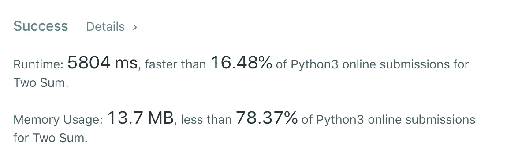
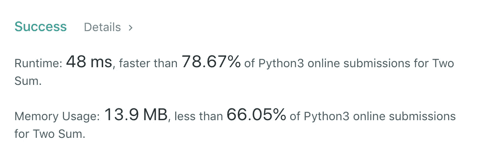

# Python 中两个 Sum 面试问题

> 原文：<https://levelup.gitconnected.com/two-sum-interview-problem-in-python-c1d84b029d35>


由 [ThisisEngineering RAEng](https://unsplash.com/@thisisengineering?utm_source=unsplash&utm_medium=referral&utm_content=creditCopyText) 在 [Unsplash](https://unsplash.com/s/photos/whiteboard?utm_source=unsplash&utm_medium=referral&utm_content=creditCopyText) 拍摄的照片

# 问题是:

给定一个整数数组，返回两个数的索引**和**，这样它们加起来就是一个特定的`target`。

你可以假设每个输入都有 ***恰好*** 一个解，并且你不能两次使用*相同的*元素。

**示例:**

```
Given nums = [2, 7, 11, 15], target = 9,Because nums[**0**] + nums[**1**] = 2 + 7 = 9,
return [**0**, **1**].
```

# **解决方案:**

关于这个问题，我真正欣赏的一点是，解决这个问题有多种方式，每种解决方案都需要不同的思维方式，然后你才能得出解决方案的想法。

## 强力解决方案:

解决这个挑战的第一个方法可能是大多数人第一次看到这个问题时想到的方法。该解决方案的伪代码如下所示:

```
for each number X in list of numbers:
    for each number Y in list of numbers starting from X:
        if X+Y equal target number, return indices
```

问题是最坏情况下的运行时间是 O(n)。如果您要搜索的两个数字在列表的末尾，您将需要多次遍历所有的数字，一次在“X”循环中，一次在“Y”循环中。

这将会给你正确的答案，但是运行时间很慢，并且在大量数字的情况下，这可能会很成问题。

```
def twoSum(self, nums: List[int], target: int) -> List[int]:
        for i in range(len(nums)):
            for j in range(i+1, len(nums)):
                if nums[i] + nums[j] == target:
                    return [i, j]
```



这个解决方案非常慢，即使内存使用不是太糟糕

如果你在一家大公司的面试中，这是你的最终解决方案，在那里他们可能会非常强调效率，你可能会有麻烦。

## 字典解决方案:

在花了一些时间思考这个问题后，我得出了一个不同的解决方案，正如我上面提到的，这需要一个不同的思考角度。

这个解决方案利用了一个字典(或关键值图)，正如我在之前的一篇文章中提到的，由于它的超级快速的价值查找，在面试挑战中非常有用。

我们的想法是，不要寻找两个数字相加得到目标数字，而是执行以下操作:

```
instantiate an empty dictionaryfor each number in list of numbers:
    result = subtract number from target number
    look for result in the dictionary (instant lookup)
    if found:
        return index of number and index of dictionary lookup result
    else:
        add number to dictionary as key with value being the index
```

将思维方式从“number1 + number2 = target”转换到“target - number1 = number2”起初并不太容易，但是这样做不仅允许使用键值映射，而且只需要数字列表的一次迭代，这意味着最坏情况下的运行时间为 O(n ),这明显优于蛮力方法的 O(n)。

```
def twoSum(self, nums: List[int], target: int) -> List[int]:
        dictionary = {}
        answer = []

        for i in range(len(nums)):
            secondNumber = target-nums[i]
            if(secondNumber in dictionary.keys()):
                secondIndex = nums.index(secondNumber)
                if(i != secondIndex):
                    return sorted([i, secondIndex])

            dictionary.update({nums[i]: i})
```



48 毫秒和平均内存使用量，我对这个解决方案相当满意。

你想看到我崩溃吗？下面评论一下！

感谢阅读！关于软件开发实践的一些技巧，请查看我的系列文章