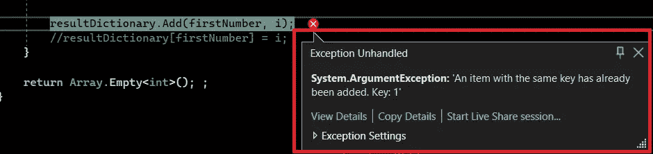
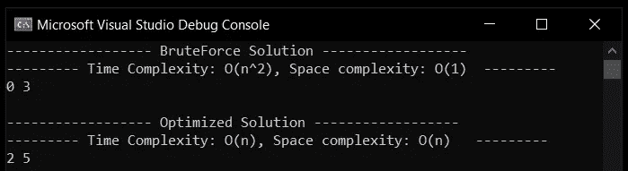

# 两个 Sum — LeetCode 的 C#解决方案，同时采用 O(n)和 O(n)方法

> 原文：<https://levelup.gitconnected.com/two-sum-leetcodes-solution-in-c-with-both-o-n-and-o-n%C2%B2-approach-4a98bf626f70>

照片由在 [Unsplash](https://unsplash.com?utm_source=medium&utm_medium=referral) 上拍摄

# 介绍

让我们看看下面这个问题的多种解决方案，

**问题**:假设你有 2 个输入，第一个是数组，第二个是目标:是数组中 2 个元素的和。你所要做的就是找到这两个数字并返回它们的索引。

听起来很容易，但考虑到不同的测试案例，这可能很有挑战性。

输入 1: { 2，7，11，15 }，目标:9-答案是[0，1]，因为 2+7 = 9

输入 2: { 3，2，4 }，目标:6-答案是[1，2]，因为 2+4 = 6

输入 3: { 0，3，2，0 }，目标:0-答案为[0，3]，因为 0+0 = 0

在我们开始编码之前还有几点。

1.  在方法的开始总是有验证。
2.  寻找边界值测试用例。

让我们开始吧。

# 解决方案 1:强力方法

马上，我们可以做的是添加数组的 2 个元素，并将结果与目标进行比较。为了执行加法，我们需要将数组中的一个元素与数组中的所有其他元素相加，以涵盖所有的可能性。使用这种强力方法，当我们在循环中迭代两次时，我们将得到 O(n ) 的时间复杂度和 O(1) 的空间复杂度

清单 1:

# 解决方案 2:优化的方法

这里我们不用比较数组的每个元素，而是用数学。这将避免数组迭代两次。
我们来看看提供的是什么样的信息。我们有两个数组元素，好的，我们也有一个目标。现在，我们可以围绕这些信息构建我们的逻辑，并且可以有一个优化的解决方案。

我们需要一个合适的数据结构来保存键值对。在 C#中，我们有一个字典。

但是为什么是键值对呢？因此，键可以保存数组的元素，值将保存该元素的索引(预计将返回)。

让我们来看第一个测试案例:输入 1: { 2，7，11，15 }，目标:9 —答案是[0，1]，因为 2+7 = 9

1.  如果我开始遍历一个循环，我会到达第一个元素 2。
2.  接下来，让我们从目标 9 中减去这 2:将得到 7。
3.  让我们将 2 及其索引添加到字典中，现在字典将有[2，0]
4.  进行第二次迭代。下一个值是 7。
5.  再次演绎:9–7:将得到 2。我们将看看字典里是否有 2 这个词条。是的，它有。这是求和的两个索引，所以只需返回字典中的值(索引为 2)和 I 的当前值(索引为 7)。因为 2 + 7 = 9。

使用这种优化的方法，我们将得到**时间复杂度:O(n)** ，因为我们迭代循环一次，并且**空间复杂度将是 O(n)** 。

清单 2:

注意我是如何评论字典的。Add()，原因是字典不能添加具有相似关键字的条目，所以您会遇到这样的测试用例:{ 1，1，2，1，1，2 }和 target: 4。

请参见图 1，当我试图用上面的测试用例运行程序时，抛出了一个错误。

图 1:一个例外

因此，我们现在要做的是，在字典中只保留一个条目。因此使用括号来添加值，而不是添加函数。对于解决方案 2 中的测试用例，字典将有这个条目[2，0]

清单 3 中的代码片段是带有 main 方法的全部代码。

清单 3:

图 2 是清单 3 的输出。

图 2:两个和的输出

你就是这么做的。

# 摘要

我们已经讨论了一个最常见的面试问题的两种可能的解决方案。永远支持优化解决方案，它证明了你的逻辑能力。

注意:附加的源代码运行在。NET 6。

问题链接:【https://leetcode.com/problems/two-sum/】T4

在 Linkedin 上找到我！！

 [## Rikam Palkar -软件工程师-小天鹅-威德福| LinkedIn

### 通过编写可伸缩的代码让世界变得更美好。我从来没有在大学里发现我对编码的热情，也没有在…

www.linkedin.com](https://www.linkedin.com/in/rikampalkar/)