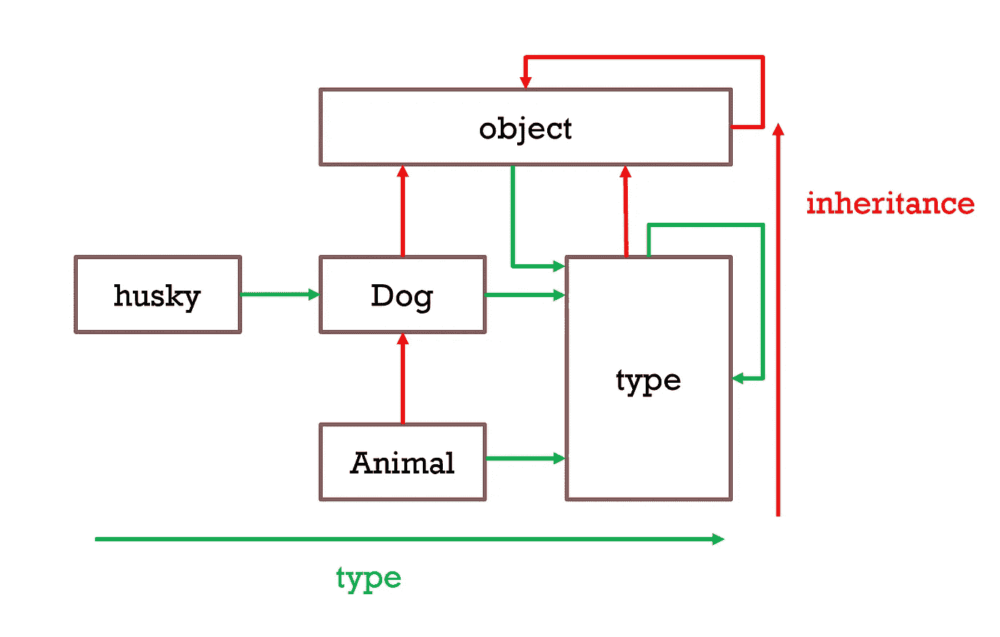

# Python 不仅仅是一个普通的 OOP:对象和元类

> 原文：<https://levelup.gitconnected.com/two-types-of-abstractions-in-python-instance-of-inherited-from-e436a63cfcfd>



# 所有的数据类型都是对象

我们都知道如何使用`class`关键字定义数据类型并调用其实例对象。

```
class Dog:
    def __init__(self, name):
        self.name = name
    def bark(self):
        print('Barking...')# instantiate a Dog object
husky = Dog(name)
```

然而，在 Python 中，你可能不知道的是**类本身是一个对象**，作为`type`类的一个实例。

```
>>> type(Dog)
<class 'type'>
```

更有甚者，**所有的原语类型都是对象**，如下例。

```
>>> PI = 3.14
>>> text = 'human language'
>>> type(PI)
<class 'float'>
>>> type(text)
<class 'str'>>>> type(float)
<class 'type'>
>>> type(str)
<class 'type'>
```

然而，尽管它们都是 Python 对象，但我们可以将它们分为`type`对象、类对象(如`Dog`、`float`、`str`)和实例对象(如`husky`、`PI`、`text`)。

*   实例对象由类对象定义。
*   类对象由`type`定义。

# Python 中的两种抽象

大多数人都知道，当我们定义一个`Dog`类时，它会自动继承`object`。如你所料，它也是一个类对象。

换句话说，Python 在**继承**(子类-超类)方面类似于其他面向对象的程序(OOPs)。

但是，Python 对于类对象还有另外一个独特的抽象: **type。正如我们在上一节中讨论的，这种类型抽象是所有数据类型成为对象的基础。作为继承抽象中的超类对超类，更高层的对象被定义为该类型抽象中的**元类型**或**元类**。**

让我们通过 Python 内置函数来看看`Dog`的继承对象和元类。

```
# Check what objects Dog inherits from
print(Dog.__bases__) # (<class 'object'>,)# Check what is the metatype of Dog 
print(type(Dog))  # <class 'type'>
```

Python 提供了检查继承抽象的`issubclass`和检查类型抽象的`isinstance`函数。

```
# True => Inherited from the superclass: object
print(issubclass(Dog, object)) # True => Instance of the metaclass: type
print(isinstance(Dog, type))
```

在这种情况下，类`Dog`继承自`object`(我们称之为**超类)**，是`type` (我们称之为**元类)**的实例。

有趣的是，一个类对象的实例化对象是在**类型**抽象(instance-class)中定义的，即类的实例与类的元类相同。

```
type(husky) # <class '__main__.Dog'>
```

# 自定义超类和元类

我们可以自定义超类和元类，而不是默认的对象和类型。

*   定制超类:我们可以将`Animal`类定义为`Dog`的超类。然后，`Dog`可以自动从它的`Animal`继承初始化和`run()`行为。当然，我们也可以覆盖子类中的方法。

```
class Animal(object): 
    def __init__(self, name):
        self.name = name
    def run(self):
        passclass Dog(Animal): 
    pass
```

*   为狗定制的元类`DogMeta`。

> 有趣的是，`CarMeta`必须继承`type`类才能成为元类。

```
class DogMeta(type):
     passclass Car(metaclass=DogMeta):
    pass
```

## **元类的 Python 核心模块**

内置的`abc`(***A***bstrat***B***ase***C***lass)模块提供了使用元类的工具，而不是定义一个定制的元类。常见的类对象有两种:(1)使用元类`ABCMeta`；(2)继承`ABC`:由于`*ABC*`类有元类`*ABCMeta*`，从`*ABC*`继承的类也得到元类`*ABCMeta*`，这样用户就看不到关于元类的任何逻辑

## 元类的实际用法

元类的实际用途很少。Python 提供它来克服传统 OOP 语言的限制。但是，随之而来的是杂乱的逻辑。具体用法可以参考本页。

# 分级编码

感谢您成为我们社区的一员！更多内容见[升级编码出版物](https://levelup.gitconnected.com/)。
跟随:[推特](https://twitter.com/gitconnected)，[领英](https://www.linkedin.com/company/gitconnected)，[简讯](https://newsletter.levelup.dev/)
**升一级正在转型的理工大招聘➡️** [**加入我们的人才集体**](https://jobs.levelup.dev/talent/welcome?referral=true)