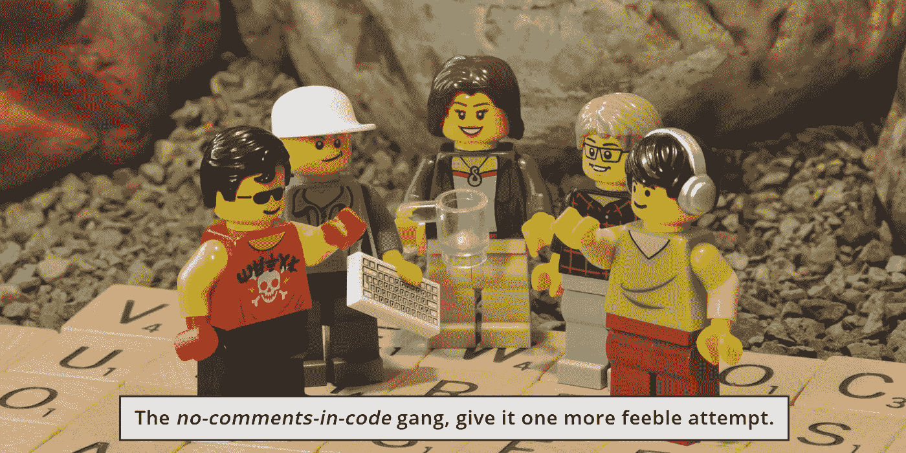
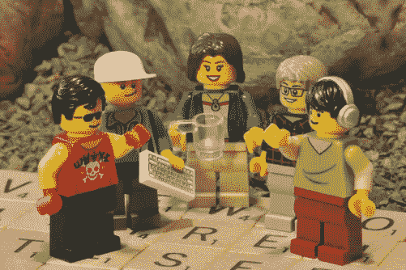

# 我们需要改变我们对代码维护的态度

> 原文：<https://levelup.gitconnected.com/tws-019-we-need-to-change-our-attitude-about-code-maintenance-9f0bda22a19e>

## 代码评审和代码注释的六条基本规则

在这一集中，纠结网络服务的技术团队面对他们对代码注释的不同意见。

Antoní刚刚读完*又一篇关于代码注释的贬低文章，这次他没有心情放过它。他和克拉丽莎讨论了一下，决定是时候直面这个问题了。如果他不能说服他的同行*在那里*，至少他可以尝试影响他自己的队友。*

克拉利萨以几句话开始了全体会议。“我知道你们一直在努力为我们的客户创建干净的代码，我认为这是显而易见的，所以谢谢你们。

“但我注意到，当发现漏洞时，有些人不愿意帮忙。这种感觉似乎是“如果不是我的代码出了问题，那么我就不应该去修复它。”

“我们需要改变我们对代码维护的态度。我想就我们如何在这里把事情做得更好进行一次公开讨论。让我们开始吧，安东尼有几句话要说。”

安东尼仍然坐着，但抬头看着克拉丽莎，开始说道:“我认为我们正在进行的代码审查完全错误。有太多的橡皮图章正在进行。当你审查某人的代码时，你必须超越我们为编码标准所采用的规则。简单地说出风格上的东西是不可接受的——糟糕的缩进、放错位置的花括号、骆驼大小写的名字，以及诸如此类的东西——它们不是我们应该关注的。

“我们需要专注于理解。比如，你真的明白你在复习什么吗？当你的队友不在身边时，你还能维持代码吗？”

德文和肯恩坚定地坐在他们的座位上。作为高级开发人员，他们以前经历过这种情况。

伊万娜看向一边。埃内斯托转移了重心。作为新来者，他们感受到了压力。

安东尼开门见山地说，“流传的那句话，‘不是我的马戏团，不是我的猴子’在我们的团队里没有位置。除了没礼貌，也没修复 bug。更重要的是，它对我们任何人都没有帮助——实习生、大三学生、大四学生，我们任何人——它只是不能帮助我们提高我们的技能。”

伊凡娜大胆地说出了接下来的尴尬:“我似乎被突然分配了很多吉拉的门票。我没有能力处理的问题。既然他们比我更了解代码，把他们分配给 Devin 或 Ken 不是更有意义吗？”

“嗯，这就是我想说的，”安东尼回答，“如果你觉得你想把它还给他们，那么代码就有问题。或者更准确地说，是文件中不清楚的东西。”

伊万娜明白了这一点，“没错，当我阅读你的代码时，我对正在发生的事情有了更好的理解。但是当我阅读没有好注释的代码(或者没有任何注释的代码*)时，我不得不绞尽脑汁，一切都变慢了。”*

*Devin 可以看到这将会发生什么，并进入防御模式，“这听起来很好，但当你阅读评论时会发生什么，他们是错误的？你有多经常看到很久以前写的评论已经不再适用了？或者更糟的是，那些*似乎适用于*但不准确的评论，会把你引向错误的方向。”*

*他停顿了一秒钟，然后迈开大步，“有多少样板注释在糟蹋我们的代码库？有多少待办事项永远无法完成？有多少重构和注释掉的部分把事情搞得一团糟？我不叫那个干净的代码！”*

*没等任何人反驳这个论点，肯就插了进来。“我坚信干净的代码不需要注释——它应该是自文档化的。使用好的变量名，并使用说明它们做什么的函数。如果有什么东西坏了，就读取代码并修复它。”*

*Devin 和 Ken 一直在附近，所以他们的信念都很强。但是伊万娜犹豫不决，看着安东尼说:“把与你的*代码相关的吉拉门票分配给我怎么样？我很乐意为之努力。让其他人拿走他们代码的吉拉门票。”(不知何故，伊万娜发现安东尼的代码比德文或肯的代码更容易理解。)**

*“不，”安东尼感到困惑，因为他没有把自己的意思表达清楚。他顶风前进，“这正是我们不想做的。*

*“事情是这样的，我希望每个人都能理解我们的集体代码库。你不需要成为专家，但你至少需要能够阅读它，理解它在做什么。不应该有*我的*码和*你的*码。这是*我们的*代码，句号。”*

*然后他制定了法律，“如果我们不能很好地注释我们的代码，让其他人能够阅读和理解它，那么我们将不得不建立结对编程。”*

*沉默。没有人想去那里。*

*Ken 是*无代码注释帮*的明确领导者，他又做了一次无力的尝试。“你是说我们需要记录每个函数，以及进出每个函数的每个变量？当我写一个像`getUserName`这样的访问器时，我必须说明这个函数做什么，它返回什么？当我创建一个保存枚举值的模块时，我必须在每个值上加一个注释，即使名字是 SUCCESS、SUCCESS_WITH_DATA 和 FAILED？”*

*安东尼选择忽略他轻率的评论，而是这样回答他。*

*以下是我的一些指导方针*

1.  *以你是为自己写评论而不是为别人写评论的态度开始，那么你就不会变得迂腐或啰嗦。*
2.  *如果没有注释也有足够的上下文来理解正在发生的事情，那么不要觉得有必要写一个。*
3.  *如果一个评论没有传授补充知识，它就没有做好它的工作。注释不应该简单地重复代码所说的内容。*
4.  *在提交拉取请求之前，请再次查看您的注释，以确保它们准确描述了您刚刚创建的内容。*
5.  *当你审查别人的代码时，也要审查注释。如果评论不清楚，请退回。*
6.  *当你在修复一个 bug 时，你发现一个注释是错误的或者令人困惑的，修复它。如果真的不需要，就加粗删了。*

*“对我来说，代码和注释不是两件独立的事情。它们是共生的。”*

*“共生？”Devin 斥责他，“我得到的代码受益于评论，但代码受益于评论吗？真的吗？”*

*“好吧，”安东尼知道自己有点言过其实，“互补。我们就这么办吧。”*

*这有助于降低室内的温度。*

*唯一没有插话的是埃内斯托。作为团队中最新的一个，他在整个交流过程中静静地坐着，希望没有人会叫他出去。私下里，他觉得他需要做得更好，但同时他也像德文和肯一样对评论有一些疑虑。他很高兴听到安东尼用灰色而不是黑色和白色来描述事物。*

*克拉丽莎和安东尼逗留了一会儿，其他人则回到了战壕。"那么，你认为鼓舞士气的讲话会持续多久？"克拉丽莎问。*

*“大概两个星期，然后这些家伙又会回到他们的老路上去。尽管如此，我还是对年轻人充满希望。我有机会和他们沟通。”*

**

*《代码帮》里的“无可奉告”，再给它一次无力的尝试。*

**没有* [*迷你图人物*](https://readwritetools.com/meet-the-team.blue) *在制作这一段纠结的网络服务插曲中受到伤害。**