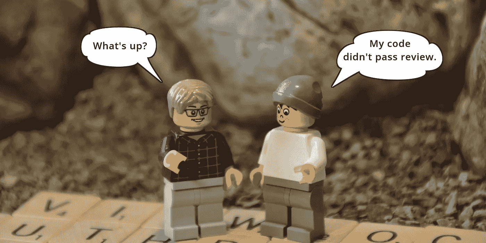
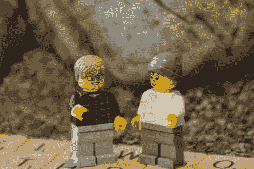

# FOR(I = 1951；团队的最新成员 I <=2020; I++): The History of Computer Programming FOR Loops

> 原文：<https://levelup.gitconnected.com/tws-021-the-history-of-computer-programming-for-loops-ce02d9171d4e>

*Ernesto 无意中成为高级程序员 Antoní和 Ken 在 FOR 循环使用问题上的牺牲品。*



他们在星巴克偶然相遇，都在回办公室的路上。肯发现自己和安东尼单独在一起。他大胆地提出了一个话题，“那么你对 JavaScript 的 *iterable* 协议有什么看法？”

“嗯，”安东尼犹豫了一会儿，“我想对于没有数字索引的收藏来说，这是一个很好的解决方案。”

"好的，但是对于规则数组呢？"肯在钓鱼。“我的意思是，使用`for..of`语法而不是普通的`for`循环。我正在考虑从现在开始在任何地方使用 iterables。”

“我当然在 ES6 地图上使用可迭代协议，”安东尼开始说道，但他不想就闪亮的新玩具展开争论，所以他转移了话题，“但我不是这方面的专家。”

肯没有进一步追问，他们就此打住。

几天后，安东尼被埃内斯托搭讪，后者看起来很不安。“怎么了？你有心事吗？”

“我的代码没有通过审查，”Ernesto 开始说道，“Ken 让我重新设计我的一个函数——它使用了一个`for`循环——看看我是否可以使用`for..of`语法来写它。他希望我们现在就这样做。”

“我不能参加你的战斗，”安东尼回答道，试图保持中立，但清楚地知道这将走向何方。“让我问你这个。你有一个好的技术理由来解释为什么它应该是这样或那样的吗？如果你没有，为什么不试着跟随他的脚步呢——谁知道呢，也许你会学到一些新东西。”

埃内斯托没想到会有这样的回答。他认为安东尼会是一个盟友。“我现在告诉你，这只会拖延事情，占用我更多的时间，最终只能完成同样的事情。没有性能提升。可疑的安全益处。也许将来会有更多的维护问题。”他准备冲出去。

安东尼审时度势，采取了不同的策略。"让我告诉你一个关于`FOR`圈的故事."他小心翼翼地走进去，试图在事态扩大之前平息下来。这是它的要点。。。。

在我第一堂编程课的第一周，我学习了`DO`循环——

`DO I = 1, 100, 2`

我对计算机或计算机语言几乎一无所知，但这句话让我看到了各种可能性。这当然是 FORTRAN。后来，我在一家财富 500 强公司找到了一份工作，在那里我编写了同样的功能代码，就像这样—

`PERFORM A-PARA VARYING I FROM 1 BY 2 UNTIL I > 100`

猜猜那是什么语言？*面向商业的通用语言*，也称为 COBOL。与此同时，在工作之余，我建造了一台微型计算机，并用 BASIC 语言对它进行编程。你瞧，同样的模式出现在那里，只是这次不是`DO`或`PERFORM`，而是——

`FOR I = 1 TO 100 STEP 2`

那是我第一次接触编程语言中的关键字。我最近了解到*的前身是 ALGOL，它是第一种拥有*复合语句*的语言。ALGOL 表达了同样的东西——*

`for i:=1 step 2 until 100`

那么`for`这个关键词是从哪里来的呢？事实证明，这句话来自瑞士数学家海因茨·鲁蒂豪斯，他于 1951 年在其高级编译器 *Superplan* 中创造了术语`für`作为关键词。后来，当 Rutishauser 在 1958 年开发 ALGOL 时，他决定将其英语化为“for”。从那以后它就一直伴随着我们。

每一种语言都使用不同的语法，但是每一种语言都提供了相同程度的特异性。您可以提供索引的起始值和结束值、增量因子和索引变量名。

在我开始编程的时候，按照惯例，索引变量名总是`I`，其中`J`用于嵌套循环，而`K`用于双重嵌套循环。

单个字母`I`而不是`INDEX`是因为 BASIC 在开始时只使用了足够的内存来存储单个字母的变量名。在 FORTRAN 中，整数变量必须以字母`I`到`M`开头，因为字母`A`–`H`和`N`–`Z`是为浮点数保留的。

当时，这些语言都无法应对我面临的挑战:构建面向行的文本编辑器。就在那时，我遇到了这个小宝石—

`for (i=0; i < 100; i++) { ... }`

这是 C 语言。所有这些都在这里:关键字`for`、括号、分号、花括号、从零开始的索引、由三部分组成的复合语句以及华丽的加号运算符！简直太完美了。

事实上，它是如此的完美，以至于接下来的语言都向它致敬。C++完整地保留了这一辉煌瑰宝的每一部分，甚至以它的名字命名了 operator。接下来是 Java，它也坚持完全相同的语法。然后是 Perl。然后是 PHP。

它的美在于它的多功能性。

只要看看增量器。如果你使用`i--`，你就有办法逆向进行——这是一个关键的需求，无论你何时开始从一个数组中移除的东西。您可以通过使用`i+=2`轻松地只定位数组的偶数/奇数元素。

看评价者。不是仅仅在 100 次迭代后停止，你可以基于一个变化的值停止，类似于`result > 0.0001`。你也可以在多种情况下暂停，比如`(i < 100 && result > 0.0001)`。

即使是不起眼的发起者。除了`i=0`，你还可以添加一个逗号，同时初始化另一个变量，所以`i=0, result=1.0`

除了多功能性之外，它还非常优雅。当分解成几个部分时，对应的表达式变得难以处理，有时这三个部分最终会彼此分离——

```
i=0;
    do {
        ...
        i++;
    }
    while (i < 100);
```

Antoní用大量的赞美结束了他的独白，“在 70 年的计算机编程语言中，`for`循环在通用性或优雅性方面从未被击败。这是完美的形式和功能。”

埃内斯托不知道该如何回应。安东尼已经说得很清楚了。但是仍然有手头的事情。他没有解决这个问题，因为他跑去赶 5 点 15 分向北的火车。

第二天早上，埃内斯托鼓起勇气去找肯，他是这场混乱的催化剂。"所以我一直在仔细考虑，想回到你的代码审查上来."

“什么？你指的是什么？”

"关于`for`循环的东西."

“哦，那个！”肯对此不屑一顾，好像这没什么。“我只是在大声思考。不要那么认真。”他显然改变了主意。“我们不可能停止使用`for`循环，它们在编程中总会有一席之地。”



*没有* [*minifig 人物*](https://readwritetools.com/meet-the-team.blue) *在这个纠结的 Web Services 剧集制作中受到伤害。*