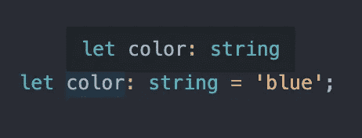
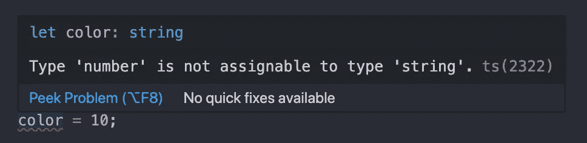
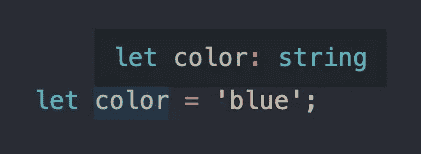
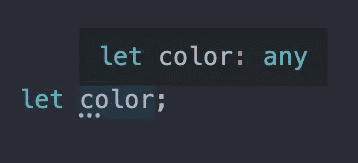
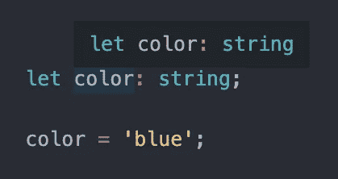
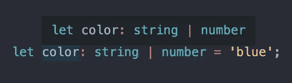
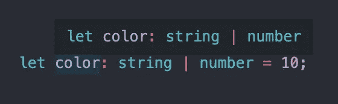

# TypeScript 中的类型注释与类型推理

> 原文：<https://levelup.gitconnected.com/type-annotation-vs-type-inference-in-typescript-85ba2194ebe1>

## 如何在 TypeScript 中向变量添加类型


由[卢卡·马丁尼](https://unsplash.com/@lucamartini?utm_source=medium&utm_medium=referral)在 [Unsplash](https://unsplash.com?utm_source=medium&utm_medium=referral) 上拍摄

欢迎来到打字世界！JavaScript 语言的超集，其中每个值都有一个与之关联的类型。

在本文中，我们将通过理解类型注释和类型推断之间的区别来尝试使用 TypeScript。我假设您有一些 JavaScript 经验，并且了解基本类型，比如字符串、数字和布尔值。如果您不熟悉类型，请查看下面的文档开始学习。

 [## 手册—基本类型

### 学习 TypeScript 的第一步:基本类型。

www.typescriptlang.org](https://www.typescriptlang.org/docs/handbook/basic-types.html) 

## TL；速度三角形定位法(dead reckoning)

> 类型注释:我们显式地告诉 TypeScript 类型
> 
> 类型推断:TypeScript 隐式地计算出类型

# 类型注释

类型注释意味着我们告诉 TypeScript 值是什么类型。为了将一个类型明确地赋给一个值，我们将在变量声明后添加一个冒号和类型。下面的代码将变量`color`的类型指定为`string`。

```
let color: string = 'blue';
```



现在，如果我们试图将`color`变量重新赋值给字符串以外的任何东西，我们将会得到一个错误。

```
// We manually assign the type to string
let color: string = 'blue';// This will cause an error since color must be a string
color = 10;
```



我们可以对数字、布尔值或任何其他类型做同样的事情。

# 类型推理

类型推断是 TypeScript 用来猜测类型的系统。如果在一个表达式中声明一个变量并初始化它，TypeScript 将知道该类型。

在下面的代码中，我们没有显式地给`color`变量分配类型。因为我们将其初始化为值`'blue'`，TypeScript 知道 color 必须是一个`string`并为我们分配类型。这是类型推理。

```
// TypeScript will assign the type to string
let color = 'blue';
```



现在，如果我们试图将颜色重新分配给字符串以外的任何东西，我们将得到与以前相同的错误。

# 我们什么时候需要使用类型注释？

类型推断使我们很容易使用 TypeScript，但是你不能总是依赖它如你所愿地工作。那么我们什么时候需要使用类型注释呢？

## 延迟初始化

一个例子是，如果我们在一行中声明一个变量，然后在稍后初始化它。如果我们只是声明一个没有类型的变量，TypeScript 会给这个变量一个类型`any`。这是我们想要避免的。

```
// TypeScript will assign the type to any
let color;
```



为了解决这个问题，我们将在声明变量时对类型进行注释。现在，TypeScript 知道这个值必须是一个字符串。如果我们试图将它赋给其他任何东西，它将显示一个错误。

```
// We manually assign the type to string
let color: string;
color = 'blue'
```



## 分配多种类型

第二个例子是，如果我们想赋予一个值多种类型。我们可以使用一个`|`字符将一个变量设置为多种类型。

在下面的代码中，`color`变量现在可以是字符串或数字。

```
let color: (string | number) = 'blue';
```



## 功能类型

我们需要注释类型的另一个例子是在处理函数的时候。函数也有类型推断，但是有时候返回的类型不是我们想要的。处理函数中的类型是我们将在以后的文章中深入探讨的另一个主题。现在，只要知道在处理函数时，直接注释类型可能是个好主意。

感谢阅读！我希望本文能让您对 TypeScript 有一个简要的了解，并理解类型注释和类型推断之间的区别。

如果你正在考虑学习 TypeScript，但不确定你是否应该，我会说试试吧。它的受欢迎程度正在上升。现在很多公司都在用，会给你打开更多的工作机会。如果您来自另一种静态类型语言或者了解 JavaScript，那么这个转换不会太难。

查看下面的文章，继续学习关于 TypeScript 的知识。

[](https://js.plainenglish.io/functions-and-interfaces-working-together-in-typescript-34d2abba3fc6) [## 在 TypeScript 中一起工作的函数和接口

### 如何在 TypeScript 中向函数添加类型和使用接口

js .平原英语. io](https://js.plainenglish.io/functions-and-interfaces-working-together-in-typescript-34d2abba3fc6)