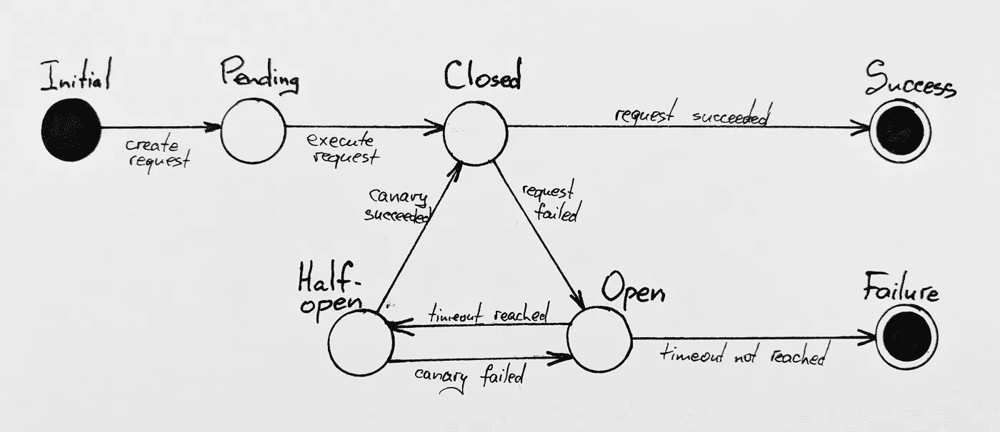

# 类型级有限状态机

> 原文：<https://levelup.gitconnected.com/type-level-finite-state-machines-6714f849255>

在本文中，我将通过使用 TypeScript 中有限状态机的实现，让您对设计解决方案时的类型优先方法有一个直观的了解。

# 什么是有限状态机

[有限状态机](https://en.wikipedia.org/wiki/Finite-state_machine)(也称:有限状态自动机或简称状态机)是一种计算的数学模型，它由一系列可能的状态、一个初始状态和一组状态之间的条件(或无条件)转移来定义。有限状态机广泛应用于工程，语言学，生物学，数学。它们非常适合描述具有有限状态集的系统:网络请求、问卷、自然语言解析器，甚至复杂的业务流程(如果你想更深入地了解这个主题，请参见 [BPM](https://en.wikipedia.org/wiki/Business_process_modeling) )。

# 示例:带有断路器的网络请求

对于我们的例子，让我们看看使用[断路器模式](http://medium.com/@yuriybogomolov/circuit-breaker-in-a-functional-world-9c555c8e9527)的简单网络请求，并使用 FSM 对其建模。

我们的状态列表将是请求状态和断路器状态的混合:

*   请求从未被执行(*初始*状态)；
*   请求当前正在执行(*待定*状态)；
*   请求成功(*成功*状态)；
*   请求失败(*失败*状态)；
*   断路器打开(*打开*状态)；
*   断路器半开(*半开*状态)；
*   断路器闭合(*闭合*状态)。

我们的初始状态(显然)是“请求从未被执行”。

我们的过渡条件是:

*   从*初始*到*待定*:无条件；
*   从*待定*到*关闭* : *cb_closed* 状态；
*   从*关闭*到*打开* : *req_fail* 状态(“正常请求失败”)；
*   从*关闭*到*成功* : *req_ok* 状态(“正常请求已成功”)。
*   从*打开*到*失效*:无条件；
*   从*打开*到*半开* : *cb_timeout* 状态(“断路器已达到其冷却超时”)；
*   从*半开*到*开* : *金丝雀 _ 失败*状态(“金丝雀请求失败”)；
*   从*半开*到*关闭* : *金丝雀 _ok* 状态(“金丝雀请求已成功”)；

因此，我们的有限状态机可以用下图表示:

正如你所看到的，一个相当复杂的过程可以被描述(和描绘！)用一个简单的有向图。很容易推理，很容易理解，也很方便分析可能的错误。所以让我们继续下一部分——在类型级别上编码这个 FSM。

# 类型级设计

> 为了给你一个关于类型优先方法的介绍，我会试着在处理任务时表达我的想法。如果您熟悉类型级方法，可以跳过这一节，直接进入实现部分。

让我们大声思考——我们如何使用类型来描述 FSM 的每个部分？首先，状态列表的概念可以用一个简单的 sum 类型来表示:

看看这个转换:它有三个清晰可见的部分:*上一个*状态、*下一个*状态，以及一个*动作*，当转换发生时执行该动作。

如果我们要创建一个普通的旧 JavaScript 对象(POJO ),我们会将这个想法表达为一个带有三个参数的`function`,返回一个带有三个字段的`object`类型。在类型级别上，它可以用同样的方式表达，使用泛型类型。我们唯一需要的运行时部分是 action，它是一个简单的函数:

现在我们可以定义我们的转换了。我将使用`string[]`作为有效载荷，所以我可以记录转换:

请注意，`Noop`转换有点棘手，因为它应该可以在*任何*两个状态之间插入，从而产生与输入状态相同的输出状态。因此，我把它变成了一个具有固定的`S`类型参数的泛型类。

为了方便起见，我将定义一组“函数构造器”——将实例化出转换类的简单函数。你马上就会明白为什么它们很方便:

现在我们终于准备好表达我们第一次从源状态到目标状态的 FSM 转换了！

# 现实生活中的例子

> —好吧，那很好，但它和现实生活有什么共同点呢？—好奇的读者可能会问，所以我想向您展示一个使用所述方法的网络请求者(又名“fetcher”)的真实例子。抓紧，因为它将引入一些新概念，如 [IORef](https://github.com/gcanti/fp-ts/blob/master/docs/modules/IORef.ts.md) 和[monad，以及它将使用我的](https://medium.com/@gcanti/functional-typescript-either-vs-validation-66c52f28ce1f)[断路器 monad](https://github.com/YBogomolov/circuit-breaker-monad) 包！

我们从有限状态机状态的定义开始。这里我不会仅仅使用字符串文字的总和；相反，我将创建具有运行时标签的简单包装器。在`circuit-breaker-monad`包中使用了这种方法，我将坚持这种方法，以使我的代码风格保持一致。

接下来，我们为运行时数据定义一些接口。我将使用一个很棒的 [MockAPI](https://www.mockapi.io/) 来模拟一些数据。

接下来我将修改`Transition`类以更好地满足我们的需求。它应该包含一个将在转换期间调用的异步方法:

接下来，让我们定义我们的转换来表示上图。请注意，每次转换的有效载荷可能不同！

下一部分是定义我们的实际请求承诺，由断路器包要求。这里我将使用 [AbortController](https://developer.mozilla.org/en-US/docs/Web/API/AbortController) 实验 API 在超时后取消我的请求:

我们代码的主要部分— `step`函数，它在给定 FSM 当前状态的情况下生成一个`Transition`:

最后，让我们定义一个递归方法`executeFSM`，这将使它的用法简单一点:

最后，让我们试一试！

你可以在[我的公共要旨](https://gist.github.com/YBogomolov/1a0ebbd1303f4eab21ff87ec90fa331a)中找到完整的例子。请注意，由于过时的类型，您需要修补`node-fetch`的`RequestInit`接口，以包含一个`signal`，如下所示:

# 结论

我希望这篇小文章能帮助你掌握有限状态机的类型级方法。我很乐意讨论你的想法，所以请回复我，电报回复 [@ybogomolov](https://t.me/ybogomolov) ，推特回复 [@YuriyBogomolov](https://twitter.com/YuriyBogomolov) 或通过[yuriy.bogomolov@gmail.com](mailto:yuriy.bogomolov@gmail.com?subject=Circuit%20Breaker%20as%20a%20Monad%20feedback)。

 [## 学习 TypeScript -最佳 TypeScript 教程(2019) | gitconnected

### 18 大 TypeScript 教程-免费学习 TypeScript。课程由开发人员提交并投票，从而实现…

gitconnected.com](https://gitconnected.com/learn/typescript)