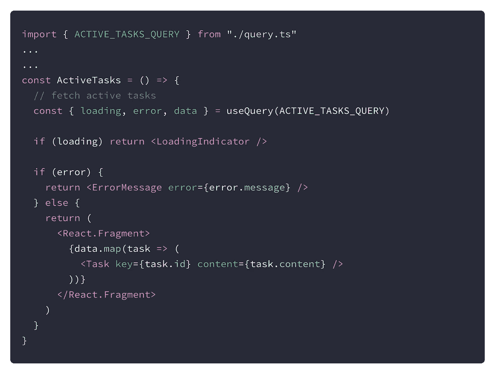
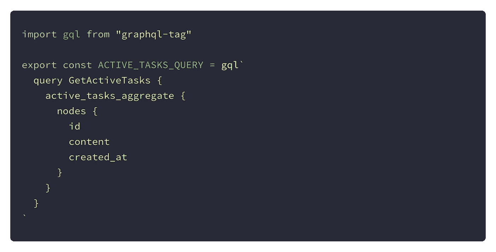
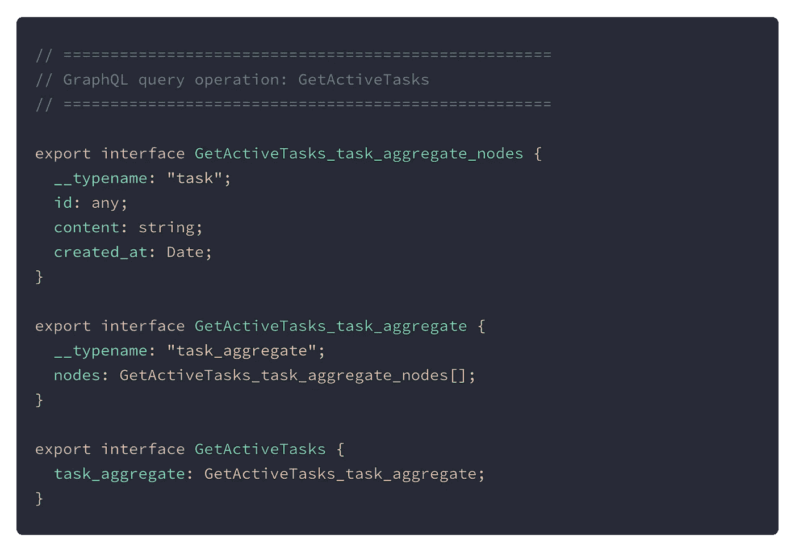
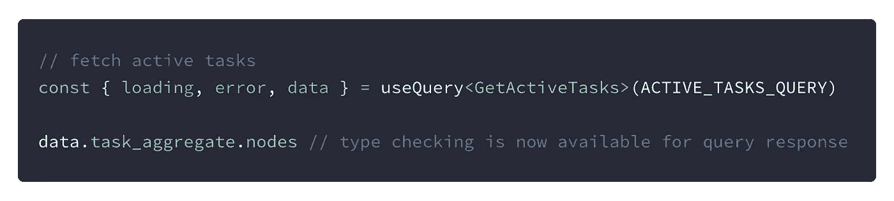

# 类型安全丰富！用于 GraphQL 驱动的应用程序的 Apollo 工具

> 原文：<https://levelup.gitconnected.com/type-safety-galore-apollo-tooling-for-your-graphql-powered-app-f363c8325061>

## 生成静态类型以提高客户端类型安全性变得更加容易。


照片由 [Niketh Vellanki](https://unsplash.com/@thenikyv?utm_source=medium&utm_medium=referral) 在 [Unsplash](https://unsplash.com?utm_source=medium&utm_medium=referral) 上拍摄

> 我不使用 Apollo Graph Manager，我的模式托管在其他地方。这对我还有用吗？

是啊！

> 这听起来工作量很大。

它不是。

> 我不使用打字稿。**丹阿布拉莫夫** [**也没有**](https://twitter.com/dan_abramov/status/1082460320009015296?lang=en) **也没有。**

1.  类型安全！== Typescript
2.  这篇文章将会回避 TS 和 JS 的争论🙏
3.  可以为其他目标生成代码，包括 Scala、Swift、Flow 和 Typescript。我在一个 Typescript + React 原生项目中使用它。

如果您已经将 GraphQL 集成到您的客户端应用程序中，正在使用任何受支持的目标，并且对类型安全感到疑惑，那么这篇文章就是为您准备的。

# 先决条件

本指南假设您已经基本掌握了 GraphQL 和 Apollo Client，并不适合绝对的初学者。初学者可以通过完成由 Apollo 提供的这个优秀的全栈教程来开始他们的旅程，它涵盖了从创建一个图到构建一个 React-powered 客户端并使用该图的所有内容。

确保你有:

1.  使用 GraphQL 和 Apollo 客户端设置您的应用程序。
2.  如果你的服务器需要授权头，建立一个“dotenv”文件。我将在本指南中使用 [dotenv](https://github.com/motdotla/dotenv) 。
3.  使您的 GraphQL 端点可通过`localhost`或远程服务器(如 Heroku)访问

# 装置

## 安装软件包

让我们从安装必要的包开始。

```
# Yarn
yarn add -D apollo dotenv      
# npm   
npm install --dev apollo dotenv
```

## 配置阿波罗

配置 Apollo 的最快方法是在我们项目的根目录下使用一个配置文件。如果您还没有一个文件，可以选择创建一个`dotenv`文件。

```
# make sure you are at the project root
cd <PROJECT_ROOT> 
touch apollo.config.js
touch .env
```

在`apollo.config.js`中粘贴以下内容。这使用环境变量配置了我们的端点和授权头。在你的`.env`里加上`GRAPHQL_ENDPOINT`和`BEARER_TOKEN`。

```
require("dotenv").config()module.exports = { client: { service: { url: process.env.GRAPHQL_ENDPOINT, headers: { "Authorization": "Bearer " + process.env.BEARER_TOKEN, }, }, },}
```

我们差不多完成了。😉

不，说真的。我们现在需要做的就是配置一个`package.json`脚本，这样我们就完成了。

## 配置`package.json`

将这一行添加到您的`package.json`中的脚本部分:

```
"codegen": "apollo codegen:generate <output_path> --includes=<files_to_include> --target <your_target> --outputFlat"
```

乍一看，似乎有很多东西需要消化，所以这里有一个细目分类:

`<output_path>`:我们希望生成的类型出现在我们的项目结构中。

`<files_to_include>` : Glob 模式，Apollo 将使用它来查找 GraphQL 查询和片段，为其生成类型。

`<your_target>`:支持的目标类型`(scala | flow | swift | typescript)`之一。

`— outputFlat`:将生成的文件放在输出目录下，而不是放在源文件旁边。**完全可选**，所以我们可以自由选择我们想要的目录结构。

下面是一个例子，以防您被众多的选项弄糊涂，想要调整现有的命令:

```
"codegen": "apollo codegen:generate app/generated/types/ --includes='./app/**/*.ts?(x)' --target typescript --outputFlat"
```

## 就是这样！

一个配置文件、一个 package.json 脚本和几个依赖项之后，代码生成就完成了。您可以轻松地提交生成的类型，并保持机密，如授权令牌和端点的安全。

这是我们需要将类型生成集成到我们的应用程序中的配置的基本最小示例。接下来，让我们使用我们已经集成的东西，并快速了解 Apollo Tooling 在我们的 GraphQL 之旅中为我们提供了哪些好处。🚀

这个非常简单的例子使用了@apollo/react-hooks。我们的后端是一个托管在 Heroku 上的 Hasura GraphQL 实例。下面是 React 客户机中的基本查询设置。



获取和渲染任务



用于提取任务的查询

现在在项目根中运行`yarn codegen`将自动检测`app/components/active-tasks`目录中的查询并生成所需的类型。本例中生成的类型如下所示:



任务查询的生成类型

现在，您可以将导出的接口作为"*类型参数"*传递给`useQuery`，瞧！



一个更有用的场景是当我们`useMutation`时，期望执行变异的变量很容易出错或者完全忽略。类型检查帮助我们避免这些错误，并改善开发人员的体验。✔️

感谢阅读！🥂