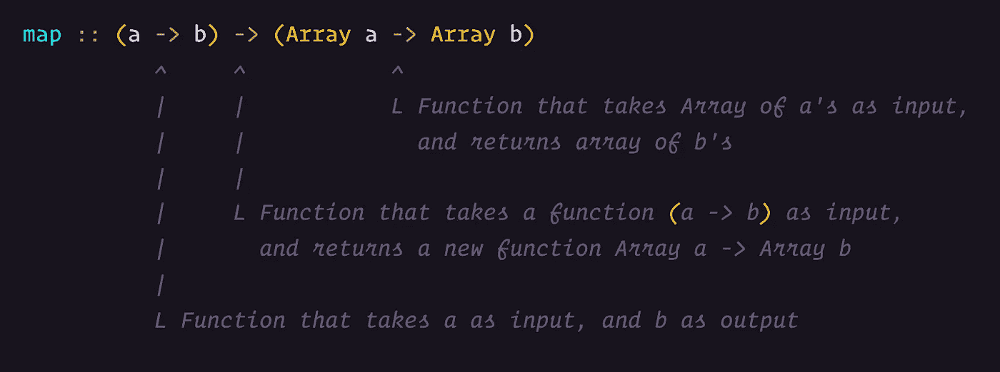

# 类型签名—面向 JavaScript 开发人员的函数式编程

> 原文：<https://levelup.gitconnected.com/type-signatures-functional-programming-for-javascript-developers-28ea03dc1192>


如果有一种不用理解每一行就能推理出彼此代码的方法，那不是很好吗？如果有一个对所有函数式程序员通用的系统呢？似乎好得难以置信？

在本文中，我们将探讨 Hindley-Milner 型系统。一个帮助你在你的函数上写简单注释的系统，它将提供我们理解正在发生的事情所需要的所有信息。

欢迎来到面向 JavaScript 开发人员的函数式编程的第六部分。我们已经非常接近将 FP 应用到现实世界的水平了。理解本文中提出的概念非常重要，因为您将立即在程序中使用它。类型签名是代码作者和读者之间的纽带。不管你是在一个更大的团队中，还是你既是读者又是作者。

# 类型

让我们从思考什么是*类型*开始，以及为什么我们在像 JavaScript 这样的动态语言中关心它们。重要的是要记住，本系列不是专门针对 JavaScript 的教程，而是关于函数式编程的。JavaScript 是一个很好的学习工具，因为很多人都熟悉它。

但是，请记住，您可以将这些概念带入任何语言。当然，有些语言比其他语言更适合，但是 FP 仍然是一个全球性的东西。这是关于*如何*编码的思维模式。在 FP 中，*类型*对于帮助你推理你的程序非常重要。所以从现在开始，即使你正在编写像 JavaScript 这样的动态语言，也是时候开始关心类型了。我保证你不会开始使用 TypeScript 或其他操纵语言的东西。如果你愿意，当然可以，但是我在这里教你的东西都不需要。

不管怎样，什么是*类型？嗯，你已经知道不少了。比如`String`、`Integer`和`Boolean`。同样，如果你读过[上一篇文章](/safe-containers-in-javascript-functional-programming-for-javascript-developers-67a32838e9d9)，你就已经了解了`Maybe`和`Either`。一旦它们与另一个类型组合，它们也是类型。例如`Maybe String`是一种*类型。*注意，我们写的第一个字母大写。按照惯例，这有助于我们看到我们正在使用一个具体的*类型，*而不是更一般的类型。您可能已经猜到，*类型*可能是语言中已经存在的类型，或者是我们自己创建的类型。*

# 我们的第一个签名

```
// myAwesomeVariable :: String
const myAwesomeVariable = 'Time for Type Signatures'
```

嗯，你看看那个美女！这是我能想到的最简单的类型签名。

`::`的左边是变量名，右边是*类型*。但是`::`是什么意思呢？它们是“是……的成员”的缩写。所以当你读取这个类型签名的时候，可以翻译成“myAwesomeVariable 是 String 类型的成员”。看，这并不难，对吧？

我们来看下一个。

```
// toUpper :: String -> String
const toUpper = s => s.toUpperCase();
```

这里我们介绍箭头`->`。箭头代表一个函数，左边是输入，右边是输出。注意，我们不关心函数是如何实现的。我们只关心输入和输出。你同意一个名为`toUpper`的函数接受一个`String`并返回一个`String`告诉我们足够开始使用它吗？

让我们再看几个例子:

```
// capitalize :: String -> String
const capitalize = s =>
    s.replace (/^./, c => c.toUpperCase ());// add :: Integer -> Integer -> Integer
const add = a => b => a + b;
```

看一看`capitalize`。它的实现可能看起来很复杂。但是你真的需要理解那部分才能开始使用它吗？类型签名告诉你，你所需要担心的就是给它传递一个`String`。还有签名承诺你会拿回一个`String`。这个函数的名字至少应该给你一个提示，告诉你这个`String`会是什么样子。

现在，让我们做更高级的签名，`add`。这里我们有两个箭头。让我们来看看我们已经知道的。箭头代表一个函数，左边是输入，右边是输出。现在，关注第一个`->`。看到`Integer`是输入很容易。但是产量是多少呢？也许如果我把它放在括号里，它会变得更清楚。

```
// add :: Integer -> (Integer -> Integer)
```

你现在明白了吗？第一个函数返回一个新函数，它将一个`Integer`作为输入并返回一个`Integer`。这些括号在开始时可能有用，但是随着你获得更多的经验，你会发现你不需要它们来解释它。至少不是在`add`这么简单的事情上。值得注意的是`add`是一个[化的](/functional-programming-for-javascript-developers-currying-2d16766909e9)函数。这是函数式编程中一个非常重要的概念，这样我们就可以[组合](/functional-programming-for-javascript-developers-compose-508d71b4e7b8)并部分应用函数。

# 一般类型

有时，我们有一个函数，它适用于任何类型。让我们来看看函数`head`，它接受一个`Array`，并返回那个`Array`中的第一项。这里是`head`的不安全版本(数组为空会崩溃)。

```
const head = arr => arr[0];
```

返回的项目是什么类型的？什么都有可能，对吧？我们如何表达这一点？

```
// head :: Array a -> a
```

我们通常使用小写字母来表示任何类型。注意，`a`、`b`、`c`等等很常见。如果你仔细看，这个签名告诉我们一些别的东西。因为我们对输入和输出使用了相同的字母，我们知道我们返回的是`Array`中相同类型的项。太好了，现在我们有了更多的信息。总而言之，通过查看`head`的签名，我们知道它接受 *any type* 的一个`Array`，并返回一个与`Array`包含的类型相同的单个项目。有了这个名字`head`，我现在对这个函数的功能有了一个很好的直觉。

作为参考，让我们也为安全版本写签名。

```
// head :: Array a -> Maybe a
```

这个版本告诉我，我现在可以安全地调用这个函数了，我要么得到一个`Just(a)`要么得到一个`Nothing`返回。如果你不知道我现在在说什么。请阅读关于[安全容器](/safe-containers-in-javascript-functional-programming-for-javascript-developers-67a32838e9d9)的文章。

请记住，有些函数可以返回与输入完全不同的内容。以`Array`的长度为例。

```
// length :: Array a -> Integer
```

试着看看这个签名，看看你能不能自己写这个函数。

# 类型约束和函子

为了教你关于类型签名的下一部分，我需要介绍一个新的可能很难的单词。在之前的一篇文章中，我谈到了`map`以及它可以在许多不同的*类型上工作的事实，*不仅仅是数组。嗯，有一个数学词汇可以用来描述可以被映射的*类型*。这些*类型*的例子有`Array`、`Either`和`Maybe`。这个词就是`Functor`。将它称为`mappable`或类似的东西很有诱惑力，但我们真的想忠于已经建立的数学术语。所以请原谅我。这些词我会在后面的文章里多教你一些(有不少)。

好吧，为了简单起见，我们假设`Array`是一个`Functor`(这种说法不完全正确，但是现在不用担心这个)。为什么知道这一点很重要？嗯，因为现在你知道你可以安全地克服它。没有这些知识，我不可能为`map`函数写出一个好的签名。

想想吧。不写很多字，我们如何表达可以被映射的东西？

让我们看一个签名的例子，如果它只对数组有效的话(请注意，这是我们在以前的文章中定义的`map`函数)。

```
//    map :: (a -> b) -> Array a -> Array b
const map = f => xs => xs.map(x => f(x));// The function is used like this:
map (item => item + 1) ([1, 2, 3]) // [2, 3, 4] 
```

我用一张图来解释一下这个。因为乍一看它相当复杂。



请花点时间真正理解这个签名。一旦你理解了这一点，你就非常接近阅读签名的专家了。

现在，我真的希望你明白这一点。因为现在我们要制作一个适用于所有`Functors`的签名，而不仅仅是`Array`。

```
// map :: Functor f => (a -> b) -> f a -> f b
```

所以左边的粗箭头`=>`是为了给你更多关于右边的字母是什么意思的提示。为了真正把它注入你的大脑，让我们用一些`Functors`代替`f`。

```
// map :: Functor Array => (a -> b) -> Array a -> Array b// map :: Functor Maybe => (a -> b) -> Maybe a -> Maybe b
```

这有道理吗？记住，最后两个只是你如何在头脑中转换类型约束的例子。

好了，这基本上是你现在需要知道的关于类型签名的全部内容。我建议你立即开始使用它们。这需要一点时间来适应。如果您不确定自己的某个函数的正确签名是什么样子，请随时问我。我很乐意帮忙。

当我们试图推理代码时，类型签名是我们首先要考虑的。有些人说很难理解功能代码。好吧，开始为他们解释类型签名。这将表明，它不必像最初看起来那么复杂。

在本系列的其余部分，我将使用类型签名。对我来说，在这之前没有用完它们真的很痛苦。

哇，你已经走了很长一段路。你应该拍拍自己的背。仍然想知道这个词是什么意思。在下一篇文章中，我将尝试进一步澄清这一点。下次见！快乐的函数式编程！