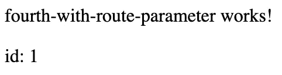
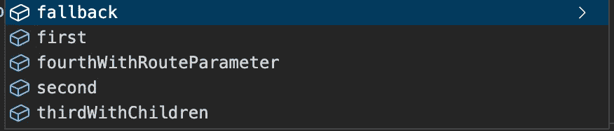

# 🚚Angular 应用程序中的类型化路由路径管理

> 原文：<https://levelup.gitconnected.com/typed-route-path-management-in-an-angular-application-c50a0f89cec3>

# 问题是

如果您在过去几年中开发过任何 Angular 应用程序，您可能会在应用程序的应用程序或路由模块中看到一些类似这样的代码:

这是我们的应用程序的路由配置，当我们将 RouterModule 导入我们的模块时会用到它:

然后，我们可以使用组件中的`Router`服务导航到这些路线:

或者我们可以在模板中使用`routerLink`指令:

虽然这是 Angular 在其[文档](https://angular.io/guide/router)中推荐的用于设置路线的结构，但它的主要缺点是大量使用硬编码字符串。如果我拼错了路径，或者决定更改路径，会发生什么情况？因为我们使用硬编码的字符串，Typescript 无法让我们知道我们提供给`routerLink`指令或`navigateByUrl`函数的值是无效的路由。当然，当我们改变路线时，我们可以在代码编辑器中使用 find all 和 replace，但是依靠他人或未来的自己来记住这样做并不是一个好主意。

# **初步解决方案**

我们可以将 routes 对象中的所有硬编码字符串移动到一个名为`AppRoutesNames`的单独类中。我们将使每个路由路径成为一个静态只读属性，这样我们就可以访问它，而不需要初始化该类的一个实例。

然后我们将删除 route 对象中的硬编码字符串，并用对我们的`AppRouteNames`类中的路由路径的引用来替换它们。

之后，我们可以将`AppRouteNames`类导入到我们的组件中，并使用 route path 作为`navigateByUrl`函数的值。

这太棒了！我们的代码库中不再有重复的硬编码字符串。然而，这个解决方案确实有一些问题。如果我们想在组件的 HTML 中使用静态路由路径属性，我们需要在组件中添加`AppRouteNames`类作为受保护的属性:

然后我们可以在模板中使用`AppRouteNames`类:

这是可行的，但是将`AppRouteNames`类作为属性添加到我们想要在模板中使用路由路径的每个组件将变得非常繁琐。

# 提供 AppRouteNames 类

我们可以通过添加`AppRouteNames`类作为提供者来消除创建`AppRouteNames`类属性的一些繁琐。首先，我们将从`AppRouteNames`类的所有属性中删除`static`关键字:

接下来，我们将为`AppRouteNames`类在`AppModule` 中的 providers 数组中添加一个新的提供者:

既然我们已经从`AppRouteNames`类的所有 route path 属性中移除了 static 关键字，我们还需要改变我们向`RouterModule`提供路由的方式。我们将传入一个空数组，而不是常量`Routes`变量:

然后，我们将常量`Routes`变量更改为常量函数`buildRoutes`，它接受我们的`AppRouteNames`类，并使用该参数来访问我们的 route config 中的路由路径:

为了向`RouterModule`提供这个路由配置，我们将在`AppModule`中为`AppRouteNames`添加另一个提供者。我们将使用从`@angular/router`导入的注入令牌`ROUTES`作为我们要提供的东西，使用工厂和我们的`buildRoutes`函数来返回路由配置，将`multi`设置为 true，并确保将`AppRouteNames`类指定为依赖项:

因此，我们现在可以将`AppRouteNames`类作为受保护的成员注入到我们的组件中，并以更传统的方式使用它的类属性。这是组件类中的样子:

以及它现在是如何在模板中使用的:

不再需要添加`AppRouteNames`类作为组件的属性。相当光滑！

# 但是等等…还有更多(问题)！

记得我说过我们最初的解决方案有几个问题吗？好吧，如果我们只使用`FIRST_CHILD_COMPONENT`属性，尝试导航到嵌套在路由配置中的`THIRD_COMPONENT_WITH_CHILDREN`路由下的`FIRST_CHILD_COMPONENT`路由，会发生什么。

后备组件页面

我们没有导航到我们的`FirstChildComponent`，而是被重定向到我们的备用路由，这表明我们已经通过了我们的路由器一个无效的路由路径。如果我们回到我们的`AppRouteNames`类，看一看`FIRST_CHILD_COMPONENT`属性，我们可以看到值仅仅是`'first-child-component'`。虽然这种设置可能适用于我们路由配置的第一层上的任何路由，但是每当我们需要导航到嵌套在另一个路由下的路由时，我们需要包括父路由路径和我们试图导航到的组件的路由路径。我们可以通过用斜线连接`THIRD_COMPONENT_WITH_CHILDREN`和`FIRST_CHILD_COMPONENT` 路线路径来暂时解决这个问题:

现在，这个链接成功地将我们带到了`FirstChildComponent`页面:

嵌套在 ThirdComponentWithChildren 页面下的 FirstChildComponent 页面

但是我的天啊，这个解决方案太丑了。如果我们在路由配置中有一个以上的嵌套层会怎样？我们将不得不继续添加父路径，以及它们之间的斜线。在我们想要使用嵌套路由的任何地方重复这种逻辑违反了 DRY 原则，并且会很快过时。

# 改进我们的 AppRouteNames 类

虽然我们的类中并不是所有的路由路径都是嵌套的，但是如果所有路由的结构都是相同的就更好了。我们要做的第一件事是在我们的`AppRouteNames`类中重命名所有的路由路径，在它们前面加上前缀`RELATIVE_`。除了在我们的路由配置中，备用路由路径不会在任何地方使用，所以我们可以不使用它。

这些前缀为`RELATIVE_`的路由路径是我们将在路由配置中使用的路由路径，我们将其传递给`AppModule`中的`RouterModule`。我们需要更改路由配置，以使用这些新的相对路由路径。

对于打算在路由配置之外使用的每个路由路径，我们将创建另一个具有相同名称的属性，没有前缀`RELATIVE_`。该属性可以是相对管线路径，或者对于嵌套组件，是从一系列相对路径构建的管线路径。

对于我们的嵌套路由路径，我们可以通过向我们的`AppRouteNames`类添加一个私有帮助函数来进一步增强这一点，该函数接收 URL 段并用斜杠将它们连接在一起，因此我们不必记得自己做这件事。

然后我们可以回到我们最初只使用`FIRST_CHILD_COMPONENT`路线路径的地方，并将它**改回**到只使用`FIRST_CHILD_COMPONENT`。

现在，这使我们正确地使用了嵌套组件，在我们的模板中没有字符串连接！

嵌套在 ThirdComponentWithChildren 页面下的 FirstChildComponent 页面

虽然这确实解决了我们的嵌套路由问题，但它使`AppRouteNames`类的属性数量增加了一倍，这可以在一个更大的应用程序中累加起来。这种解决方案在处理包含路由参数的路由路径时也会遇到问题。

# **处理路线参数**

到目前为止，我们还没有使用任何利用 Angular 的路线参数的路线。我们可以从将相对路由路径添加到我们的`AppRouteNames`类开始。

然后，我们可以在`buildRoutes`功能中将该路线添加到我们的路线配置中。

在这种情况下，我们不能为完整的路由路径使用另一个类属性，因为我们希望能够动态生成`:id`部分。相反，我们将使用一个将`id`作为字符串的函数。我们仍然可以使用`buildURL`助手函数来构建 URL，但是由于相对路由路径的`:id`部分，我们将不能在函数内部使用它，而是必须复制路由路径的`'fourth-component'`部分。

现在，我们可以在模板中使用这个路由路径:

将我们导航到 id 为 1 的组件:

id 为 1 的第四个组件

但是，这又把我们带回了最初的重复字符串问题，虽然它们并没有贯穿整个代码库，但感觉我们不应该在这一点上重复字符串。如果有一种方法可以访问我们的路由路径作为一个类型化的对象，并避免重复的字符串，而不必在一个单独的类中指定一堆路由路径和构建函数，除了我们的路由配置之外，会怎么样？

# ngx-高级路由器

这个问题促使我构建了 [ngx-advanced-router](https://www.npmjs.com/package/ngx-advanced-router) 。它的功能是替代 Angular 的默认`RouterModule`，它允许您将路由配置指定为可注入的服务，并快速方便地访问您的路由路径。我们可以从在 Angular 项目中安装这个包开始:

`npm install --save ngx-advanced-router`

接下来，我们需要创建一个扩展`AdvancedRouteService`的新服务。扩展这个类需要我们实现一个抽象属性:`routesConfig`。这个属性是我们放置一个类似的路由配置的地方，我们在前面的`buildRoutes`函数中返回了这个配置。然而，我们将拥有一个带有键和路由对象作为值的对象，而不是路由对象的数组。下面是我们从`buildRoutes`函数转换路由配置时的样子:

需要注意的一点是，我们将实际的路由路径字符串移回了路由配置中，就像本文开始时那样。另一件要注意的事情是，我们不仅可以为路径传入一个字符串，还可以传入一个函数，如路径上所示的`fourthWithRouteParameter`路线。

要使用这个服务，我们将返回到我们的`AppModule`，并从 providers 数组中删除`AppRouteNames`和`ROUTES`提供者，以及从 imports 数组中删除`RouterModule`。相反，我们将把带有`forRoot`函数的`AdvancedRouterModule`添加到 imports 数组，传入我们新创建的 route 服务:

在我们注入`AppRouteNames`类的`AppComponent`中，我们将导入`AppRouteService`。为了使用这个服务来访问我们的路由路径，我们将使用服务的`routes`属性。基于我们之前在服务中设置的路由配置，访问该属性为我们提供了一组很好的自动完成选项。

如果我们想要导航到“第一条”路线，我们可以使用`path`属性，它返回完整的路线路径。

对于有孩子的路由，除了`path`属性之外，它们还有一个`children`属性，这也给了我们一个很好的自动完成列表。

下面是访问该子路由路径的完整代码:

对于包含路由参数的动态路由，如`fourthWithRouteParameter`路由，routes 对象为我们提供了一个函数，其参数与我们在路由配置中设置的函数参数相同。我们可以调用这个函数，然后访问`path`属性来获取完整的路由路径。

就是这样！该解决方案解决了我们面临的所有问题:

1.  **没有重复的字符串** 现在字符串在 route config 中只使用一次，`routes`属性用于访问 route paths 中的其他所有内容。
2.  **没有额外的组件属性** 我们的路由服务使用 Angular 的依赖注入，因此不需要仅仅为了访问我们的路由路径而向我们的组件添加属性。
3.  **无即兴路线路径构建** 路线服务负责为我们构建路线路径，无论它们是在根级别还是 5 级深度。
4.  **无相对路线路径** ngx-advanced-router 负责以其寻找的格式向 Angular 的`RouterModule`提供路线，并向您提供绝对路线路径。
5.  **无需额外的路线路径类** 在路线服务中声明一次你的路线设置，在`AdvancedRouterModule.forRoot()`函数中使用，就大功告成了！

请在评论中告诉我你的想法！我乐于接受让这个包更好的建议。