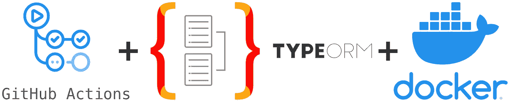
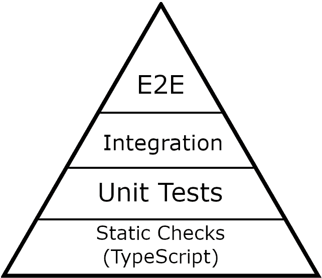
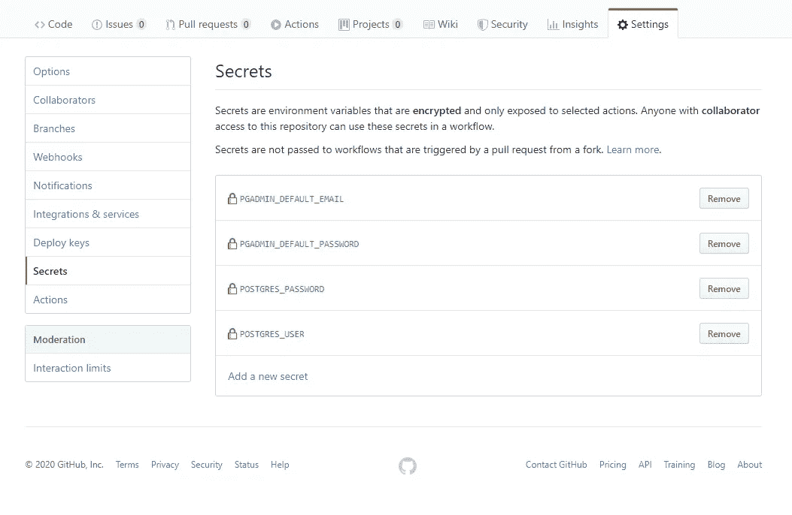
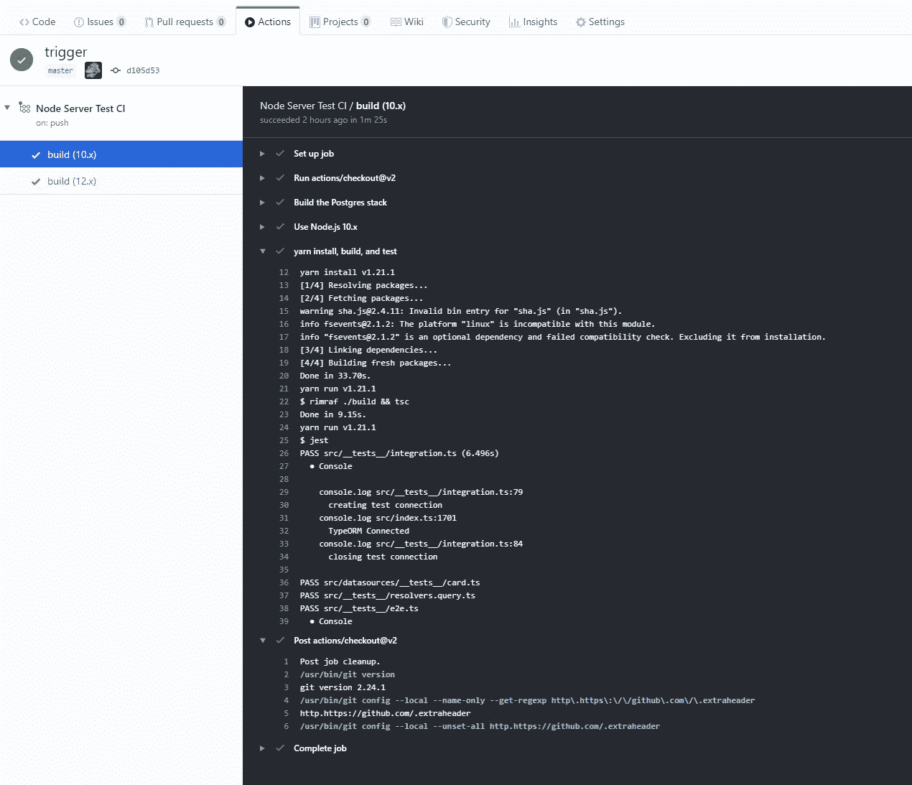

# 使用 Docker + GitHub 动作进行类型测试

> 原文：<https://levelup.gitconnected.com/typeorm-testing-with-docker-github-actions-6dc8a5dbe913>

## 如何使用 TypeORM/TypeScript/GraphQL API 进行单元、集成和 E2E 测试(2020 年 2 月 1 日更新)

来自 [Pexels](https://www.pexels.com/photo/man-wearing-black-and-white-stripe-shirt-looking-at-white-printer-papers-on-the-wall-212286/?utm_content=attributionCopyText&utm_medium=referral&utm_source=pexels) 的[创业股票照片](https://www.pexels.com/@startup-stock-photos?utm_content=attributionCopyText&utm_medium=referral&utm_source=pexels)

## 介绍

弄清楚如何为 ORM 编写自动化测试可能非常困难。解决这个问题有许多不同的方法，很难找到好的解释。这篇文章是关于我开发 ORM 测试、策略以及如何让它们与 GitHub actions (CI)一起工作的经验。我使用的是[类型的 ORM](https://typeorm.io/#/) ，但是本文中的思想应该适用于其他 ORM 实现。

我使用 TypeORM 已经一年多了，我在一个大型商业应用程序上使用过它，我将在 2020 年再次使用它，使用一个我正在开发的名为 [BrainStrike](https://github.com/seandearnaley/brainstrike-typescript-starter) 的[node . js](https://nodejs.org/)[TypeScript](https://www.typescriptlang.org/)/[Apollo graph QL](https://www.apollographql.com/)初学者工具包。我想用我相信的技术堆栈做一个“涅槃”项目，一些组件相对较新，所以我必须深入研究几种技术。BrainStrike 在 GitHub 上，这是一个相对简单的教育项目。当它准备好的时候，我将会分享更多。

作为一名 web 开发人员，拥有一个开发现代应用程序的工作方法总是好的，并且保持您的工具是最新的也是很重要的…栈决策是非常重要的。我是 GraphQL 和 TypeScript 的忠实粉丝，所以这是显而易见的选择，我选择 TypeORM 作为数据库连接，因为它功能丰富，对 TypeScript 有很好的支持。

我对这个项目有几个目标:

1.  使用所有现代组件开发一个**全栈**示例。服务器 API +客户端。
2.  让**完全定型**，绝对最少使用类似`any`型的逃生舱口。
3.  工作，**实用端到端式安全**。GraphQL + TypeScript 都是类型化语言，都适合代码生成。
4.  它应该有一个**伟大的开发者体验**。TypeORM 建模和 GraphQL API 提供了一个非常好的 DX。我打算从开发工具包中学到更多。(完成后，我会评估体验的质量，但我已经学到了很多关于什么可行，什么不可行的知识)。
5.  客户端和服务器的**单元、集成和端到端测试**(用 TypeScript 编写)的工作示例。

今天我将写下最后一个目标。**测试**。

所有项目都有不同的需求，我不认为为每个项目部署这种堆栈是明智的，您应该根据您可用的开发资源进行考虑，例如，时间、现金流、团队组成等。我从事企业应用软件的工作。我想在一个堆栈上实践，这个堆栈可以在生产中被团队使用好几年。

本文假设您已经有了一个包含 Node.js 和 TypeORM 的项目，如果您还没有的话，您可能需要安装 [Docker](https://www.docker.com) 并获得一个免费的 [GitHub](https://www.github.com) 帐户。我的例子是用打字稿写的。

## 什么是 ORM？，什么是 TypeORM？我为什么要用它？

[TypeORM](https://typeorm.io/#/) 是 JavaScript 和 TypeScript 的对象/关系映射工具。ORM(对象/关系映射)是一种用于与数据库交互的抽象，TypeORM 真正的优点是它支持现代 JavaScript 特性，并且具有类型脚本的类型安全性。

我在过去 10 年中参与的大多数项目都没有使用过 ORM。因为传统的 ORM 解决方案已经失宠，我已经习惯于推出自己的映射解决方案。

我在 90 年代/21 世纪初使用过 ORM。他们以接口臃肿、抽象漏洞和性能不佳而闻名。我过去吃过苦头，所以我对使用 TypeORM 仍然有些恐惧。软件行业充斥着不兑现的承诺，但是对于数据库建模来说，事情已经有了巨大的改善。

这仍然是一个复杂的问题，你必须坚持使用关系结构，但是这里的意图是让我的手脏起来，并使用现代框架找到边缘案例。我降低了对 ORM 的期望。

如果您必须使用 JavaScript/TypeScript 与数据库进行交互，尤其是在您开始一个新项目时，您应该考虑 TypeORM。如果您需要特定于数据库的特殊功能，或者需要与现有解决方案集成，将会面临一些挑战，如果您希望获得领先的性能，您可能需要迁移您的数据库或编写自己的查询构建器，但是 TypeORM 生成的查询相对来说得到了很好的优化和改进。

GitHub Actions + TypeORM + Docker

## 什么是测试？，单元测试、集成测试和 E2E 测试之间有什么区别——我们为什么要这么做/为什么要这么做？

自动化测试是一个很大的话题，超出了本文的范围，但是我想简单介绍一下这个话题，这样你就知道为什么它很重要了。

单元测试被设计用来自动测试一个单独的代码单元。通常，你提供一些输入，并测试你是否得到正确的输出。考虑一下，如果你和一个团队一起工作，有人修改了一些东西，在一个特定的单元中引入了一个 bug。您的构建系统可以被配置为防止代码在错误报告中被提交并带有适当的反馈。

集成测试顾名思义——它们涉及测试各种集成单元的交互，而不是孤立地单独测试。

E2E 测试有时被称为功能测试，或者浏览器测试，或者 UI 测试，或者冒烟测试(是的，有这么多不同的术语真烦人)。E2E 测试被定义为测试系统的完整功能。它们运行速度较慢，通常模拟真实的用户交互，所以在浏览器应用程序的情况下，这涉及到模拟用户四处点击并与应用程序交互。这里我们正在测试一个 GraphQL API。

我曾在很少甚至没有自动化测试的公司工作过，这非常具有挑战性。在过去的十年中，由于敏捷方法，测试变得更加重要。

这是开发人员的一个挫败点。我曾经遇到过敏捷“教练”来到遗留系统，这些遗留系统被技术债务所克服，将测试作为一个口号来提倡(因为它在宣言中)，假装他们已经通过建议解决了问题，然后继续忽略自动化测试并优先考虑面向客户的特性，因为这让利益相关者高兴，忽视开发人员的快乐并加重技术债务…这种策略将不可避免地回来咬你，但他们仍然可以责怪开发人员，毕竟，他们确实提倡测试！

我对痴迷于敏捷的管理者保持警惕，如果他们没有评估他们管理的系统的话。软件必须同样敏捷——好的领导者很难找到，如果他们只是简单地推动宣言，那是另一个危险信号。这意味着责任将被转嫁给开发商。当一个经理蔑视开发人员时，这很能说明问题。这是糟糕的领导，老板在这个千年里是一个过时的概念。领导者应该有测试的技术策略，在过程中提供帮助，并为自动化测试和 QA 测试(如果可能的话)分配时间。

如果你试图在一个现有的系统中添加测试，这可能是非常具有挑战性的，因为这个系统可能是在没有考虑测试的情况下仓促/拙劣地开发的，使得有效的测试几乎不可能。

测试应该是你最初设计考虑的一部分，而不是事后的想法。我已经了解到，所有代码提交中覆盖范围发生变化的地方都应该有适当的测试，因为带着测试思想编写的代码与不带测试思想的代码是不同的。

当您知道代码必须通过测试时，您倾向于创建更合适的抽象，尤其是如果您必须编写它们的话。如果开发人员/经理只是试图在没有测试的情况下获得一个特性，它几乎肯定会成为一个有着复合技术债务的老鼠窝。

考虑单元测试。单元是最小的可测试软件组件。为了使一个单元可测试，它不仅要小，而且要对它的依赖关系进行特殊的考虑，你可能需要将一个依赖关系注入到一个单元中来单独测试它。你的依赖性适合测试吗？如果是老模块，无法正常测试怎么办？

集成和 E2E 测试需要考虑环境。您也许能够为您的本地机器编写一个好的集成测试，但是这个测试能够被部署到另一个环境中吗？它能在环境矩阵中旋转吗？如果你不得不嘲笑一些东西，它有多复杂呢？依赖关系必须模仿哪些依赖关系？

测试金字塔

单元测试、集成测试和 e2e/冒烟测试通常被称为测试金字塔。单元测试在最底层(嗯，从技术上来说，但是我已经用 TypeScript 表示静态检查作为第一测试层)，然后是集成，最后是 E2E，单元测试被认为是最便宜/最快/价值最高的，随着你在金字塔上向上移动，事情变得越来越昂贵(和慢)。

有一些关于你应该有多少覆盖率的争论，有些人说 50%，有些人说 80%，少数人说 100%。我属于 100%阵营，我自己离那个目标很远，但我总是努力达到 100%，因为它鼓励深思熟虑的开发，从 99%达到 100%可能非常具有挑战性，但通过增加最后 1%可以学到很多东西。这在生产中通常是不可实现的，因为事情进展得太快了，但这是值得努力的，我会鼓励 backlog 任务尽可能地提高覆盖率。

考虑一个初学者工具包，您希望建立一些模式，使其更容易构建。没有经过测试的初学者工具包将是一场噩梦。测试应该**而不是**稍后添加。

## 好的，那么 ORM 测试呢？

到目前为止，您可能已经开始思考如何为使用 ORM 的系统实现测试了。这不是小事，因为本质上一个 ORM 可以有许多复杂的基本分类法，很难分离。我能够相对容易地找出如何对我的数据源模型进行单元测试，但是当我进行集成测试时，事情变得非常棘手。

主要的问题是模仿和存根，一起测试几个 ORM 单元经常涉及到建立几个依赖关系，其中很多依赖于连接和数据库自检。考虑模式同步或迁移之类的事情，以测试您是否会遇到困难。如果你想模仿这些(特别是用 TypeScript ),你将会写一大堆不合理的模仿代码，而且会频繁地破坏**。**

**您不希望进行难以管理的单元测试，因为它们不会提高生产率。它们会对你的开发工作产生有害的影响。我曾经参与过单元测试很差的项目，它们必须重写，修复单元测试比编写模块花费的时间还要长。**

**像许多人一样，在接近这个主题时，我谷歌了短语“**如何在不触及数据库的情况下单元测试 TypeORM】”。我得到了最受欢迎的结果:2017 年的一期 GitHub 仍然有效，我读了整本书。这是一个有趣的讨论，但它花了一段时间才能看到任何一种关于实际方法的共识，更不用说“正确”的方法了。****

**有一些建议；您可以尝试模仿一切(噩梦般的，太多的代码)，其他用户主张使用运行在内存中的 SQL lite 连接，这非常快，但这种方法的问题是它仅限于 SQL lite 特性。我选择的数据库是 Postgres，我使用了时间戳列，但是 SQL Lite 不支持时间戳。**

**值得庆幸的是，到 2019 年底，一种流行的方法开始出现，它有点反直觉，因为它确实涉及到访问数据库——一个专用的测试数据库。我对这种技术做了一些研究，我知道大波士顿地区的几家科技公司已经成功部署了这种技术。**

**好的，我们有一个方法，但是最好的方法是什么呢？这必须合并到您的构建过程中，因为您希望 pull 请求能够运行测试。您可以有一个专用的服务器实例来测试某个地方，并且您可以编写您的测试连接来连接到那个地方。我想要一些更容易管理的东西，一些可以存在于我的 Git 存储库中的东西。**

**我意识到，对于我的用例，我可以使用一个 [Docker](https://www.docker.com/) 容器很容易地建立一个测试数据库并销毁它。我只需要在 Git 中编写一个`docker-compose.yml`文件，然后在执行测试之前连接一个 CI 工作流来启动 Docker。我不得不再次决定用什么来做 CI。**

**我认为这是一个尝试 GitHub 动作的好时机。GitHub 动作对于初学者工具包来说是很棒的，因为如果有人将资源库分支到 GitHub 中，他们会立即得到相同的测试。**

**既然我们已经介绍了我们的基本原理并决定了我们的方法，那么让我们进入本质吧！**

## **Docker 撰写**

**Docker 是一种旋转集装箱的工具。我已经创建了一个`[docker-compose.yml](https://github.com/seandearnaley/brainstrike-typescript-starter/blob/master/server/docker-compose.yml)`文件，用于下载 Postgres 和 Postgres 管理图像，并且我正在使用一个 bash 脚本来生成多个包含相关用户信息的表:**

**[服务器](https://github.com/seandearnaley/brainstrike-typescript-starter/tree/master/server) /docker-compose.yml**

**注意这个 docker-compose 文件使用了环境变量，它还引用了一个启动脚本来生成两个数据库，`brainstrike`和`brainstrike_test`。你实际上并不需要 PgAdmin，但我发现它在本地开发时很有用。**

**[服务器](https://github.com/seandearnaley/brainstrike-typescript-starter/tree/master/server)/[pg-init-scripts](https://github.com/seandearnaley/brainstrike-typescript-starter/tree/master/server/pg-init-scripts)/create-multiple-PostgreSQL-databases . sh**

**[服务器](https://github.com/seandearnaley/brainstrike-typescript-starter/tree/master/server) /.env.example(用自己的信息更新)**

**如果你已经安装了 Docker，你可以用命令`docker-compose up -d`来启动这个容器，d 代表“分离”,意思是它在后台运行。**

# ****单元测试示例****

**在我们进入一个 TypeORM 单元测试的例子之前，让我们看一下我的入口文件，看看我是如何建立连接和测试连接的。这个文件中有一些东西，但实际上它是一系列用于启动服务器的函数，或者在测试的情况下，启动测试服务器:**

**[brain strike-typescript-starter](https://github.com/seandearnaley/brainstrike-typescript-starter)/[server](https://github.com/seandearnaley/brainstrike-typescript-starter/tree/master/server)/[src](https://github.com/seandearnaley/brainstrike-typescript-starter/tree/master/server/src)/index . ts**

**我有这些非常简单的[卡](https://github.com/seandearnaley/brainstrike-typescript-starter/blob/master/server/src/entity/Card.ts)和[类别](https://github.com/seandearnaley/brainstrike-typescript-starter/blob/master/server/src/entity/Category.ts)类型的实体，在本文中我将只关注[卡](https://github.com/seandearnaley/brainstrike-typescript-starter/blob/master/server/src/entity/Card.ts)。下面是一个名为 [CardAPI](https://github.com/seandearnaley/brainstrike-typescript-starter/blob/master/server/src/datasources/card.ts) 的 Apollo 数据源，在其构造函数中接受一个`repos`对象。仓库是一个[类型的仓库](https://github.com/typeorm/typeorm/blob/master/docs/repository-api.md)的容器。我将模仿这个`repos`对象，并将其注入到卡单元测试中。**

**CardAPI 数据源[服务器](https://github.com/seandearnaley/brainstrike-typescript-starter/tree/master/server) / [src](https://github.com/seandearnaley/brainstrike-typescript-starter/tree/master/server/src) / [数据源](https://github.com/seandearnaley/brainstrike-typescript-starter/tree/master/server/src/datasources) /card.ts**

**我选择不对单个数据源存储库使用测试数据库连接，因为模仿`repos`对象相对容易，最好是隔离测试单元——它们不会在集成或 E2E 环境中运行。**

**如果您查看 [__tests__](https://github.com/seandearnaley/brainstrike-typescript-starter/tree/master/server/src/datasources/__tests__) 文件夹，我们可以找到卡数据源的[第一个单元测试](https://github.com/seandearnaley/brainstrike-typescript-starter/blob/master/server/src/datasources/__tests__/card.ts):**

**CardAPI 单元测试[服务器](https://github.com/seandearnaley/brainstrike-typescript-starter/tree/master/server) / [src](https://github.com/seandearnaley/brainstrike-typescript-starter/tree/master/server/src) / [数据源](https://github.com/seandearnaley/brainstrike-typescript-starter/tree/master/server/src/datasources)/[_ _ 测试 __](https://github.com/seandearnaley/brainstrike-typescript-starter/tree/master/server/src/datasources/__tests__) /card.ts**

**很简单，但是对于[集成](https://github.com/seandearnaley/brainstrike-typescript-starter/blob/master/server/src/__tests__/integration.ts)和 [E2E](https://github.com/seandearnaley/brainstrike-typescript-starter/blob/master/server/src/__tests__/e2e.ts) 测试，我们将使用测试数据库连接。**

**我使用 jest globalSetup 文件(通过 jest.config.js 配置)，这允许我清除测试数据库并重新运行同步和迁移:**

**[brain strike-typescript-starter](https://github.com/seandearnaley/brainstrike-typescript-starter)/[服务器](https://github.com/seandearnaley/brainstrike-typescript-starter/tree/master/server)/[src](https://github.com/seandearnaley/brainstrike-typescript-starter/tree/master/server/src)/jest . global setup . ts**

## **集成测试示例**

**brain strike Server[Server](https://github.com/seandearnaley/brainstrike-typescript-starter/tree/master/server)/[src](https://github.com/seandearnaley/brainstrike-typescript-starter/tree/master/server/src)/[_ _ tests _ _](https://github.com/seandearnaley/brainstrike-typescript-starter/tree/master/server/src/__tests__)/integration . ts**

## **E2E(端到端)测试示例**

**brain strike Server[Server](https://github.com/seandearnaley/brainstrike-typescript-starter/tree/master/server)/[src](https://github.com/seandearnaley/brainstrike-typescript-starter/tree/master/server/src)/[_ _ tests _ _](https://github.com/seandearnaley/brainstrike-typescript-starter/tree/master/server/src/__tests__)/e2e . ts**

**这些测试的重要之处在于它们使用了我们的测试数据库连接。**

## **GitHub 操作配置项**

**下一个重要部分是设置我们的 [GitHub 动作](https://github.com/seandearnaley/brainstrike-typescript-starter/blob/master/.github/workflows/nodejs-server-test.yml)来启动 CI 环境，这只是一个在 [GitHub 动作工作流文件夹](https://github.com/seandearnaley/brainstrike-typescript-starter/tree/master/.github/workflows)中的 YAML 文件，注意它是如何从 secrets 对象中提取我们的环境变量的。这些是通过 GitHub 中“Secrets”下的“settings”选项卡配置的(见下一个截图)…我知道我在这里为我们的 Docker 和 Node 步骤杜平了一些代码，它们使用相同的 env 变量。不幸的是，GitHub actions 还不支持像锚和别名这样的 YAML 特性，否则我会把它们放在同一个锚中。**

**BrainStrike [仓库](https://github.com/seandearnaley/brainstrike-typescript-starter)有一个 monorepo 结构，所以服务器和客户端有单独的文件夹，并有相应的动作。注意服务器测试如何有一个`on>push>paths`配置，这意味着这个工作流在被触发之前监视服务器文件夹的推送。**

**该代码还为 Node 10.x 和 Node 12.x 建立了一个测试矩阵，这些测试将同时运行，如果其中一个失败，整个测试将失败。**

**[。github](https://github.com/seandearnaley/brainstrike-typescript-starter/tree/master/.github) / [工作流](https://github.com/seandearnaley/brainstrike-typescript-starter/tree/master/.github/workflows) /nodejs-server-test.yml**

****

**配置 GitHub 机密**

****

**服务器操作触发的输出**

## **结论+后续步骤**

**现在你有了，用 TypeORM 和 GitHub 动作完成自动化测试的一种方法！**

**接下来你需要完成你的单元测试(这只是一个完整测试套件的部分例子)，如果你的 Docker 容器很大，你需要构建更多的容器，那么构建起来会很慢，而且每次测试都会把容器吹走，你可能需要考虑如何缓存 Docker 来加快构建速度。**

**您可能还想考虑将您的整个应用程序放入 Docker compose，因为使用像 [AWS](https://aws.amazon.com/) 这样的服务可以更容易地部署/测试整个容器。**

**我希望这篇文章能帮助你——祝你的项目好运！**

## **资源**

**[brain strike](https://github.com/seandearnaley/brainstrike-typescript-starter)/[node . js](https://nodejs.org/)/[TypeScript](https://www.typescriptlang.org/)/[Apollo](https://www.apollographql.com/)/[typesorm](https://typeorm.io/#/)**

**[GitHub 动作](https://github.com/features/actions) / [Docker](https://www.docker.com)**