# TypeScript 中的类型

> 原文：<https://levelup.gitconnected.com/types-in-typescript-64d079728a39>

就其本质而言，JavaScript 是一种动态类型语言。这意味着任何变量都可以包含任意数量的数据类型，包括字符串、数字、数组、对象、函数等。JavaScript 变量的类型由赋值决定。这意味着当我们给一个变量赋值时，JavaScript 运行时解释器决定了该变量的类型。

但是，运行时也可以根据变量的使用方式或与其他变量的交互方式来重新分配变量的类型。例如，它可以给字符串分配一个数字。

鉴于这种灵活性，事情可能会以多种方式出错。

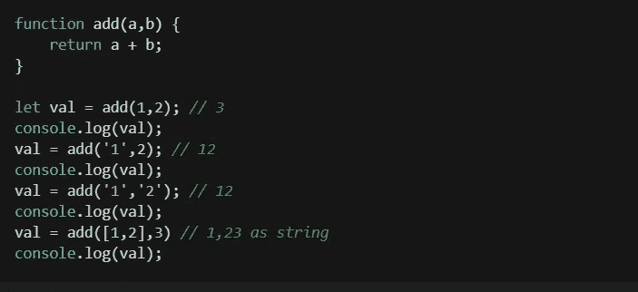

程序员有责任确保代码按预期使用，并验证所有可能出错的情况。像下面这样的检查就可以了。

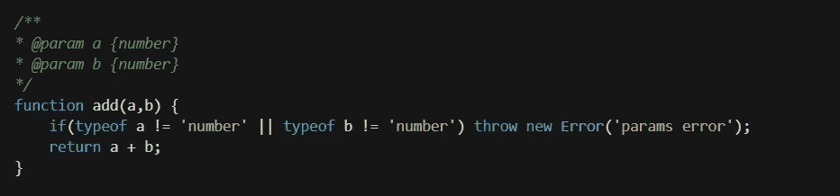

太好了！这会告诉使用该方法的人只输入数字作为参数，并在输入错误的参数时抛出运行时错误。

我们可以使用`parseInt`将所有内容转换为`number`，但是对于参数是对象、数组、未定义或 null 的情况，这仍然不起作用。这样的例子不胜枚举。

除了爱好项目之外，很难编写出安全的 JavaScript 来保证它的正常运行。

TypeScript 不同。一旦我们声明了一个变量，我们就不能改变它的类型。这有助于确保我们编写的代码将按预期运行。让我们看看上面例子的一个类型脚本版本。

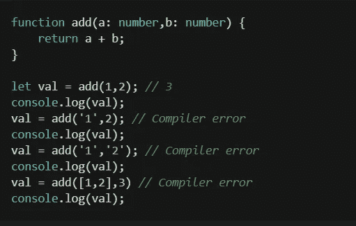

这个程序将不再编译，因为我们已经指定只有类型`number`被允许作为函数的参数。如果我们在 IDE 中查看这个，我们会看到这些错误，就像在任何其他强类型语言中一样。

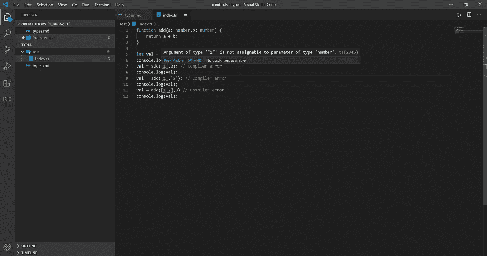

# 让我们探索这些类型

## 基本类型

1.  布尔型
2.  线
3.  数字
4.  排列
5.  bigint
6.  标志
7.  任何(选择退出类型检查)
8.  void(不返回)
9.  null(没有值)
10.  未定义(未给定值)
11.  从不(函数执行从不到达最后一行)
12.  目标
13.  未知(有一些价值，我们不知道它是什么)

点击查看所有类型[的详细信息。在](https://www.typescriptlang.org/docs/handbook/basic-types.html) [TS 3.0](https://www.typescriptlang.org/docs/handbook/release-notes/typescript-3-0.html#new-unknown-top-type) 中增加了`unknown`。

## 我们在哪里以及如何使用类型

这个列表并不详尽。这些是我个人认为有用的一些观点。

1.  **声明变量**

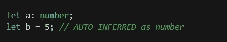

2.**声明函数**

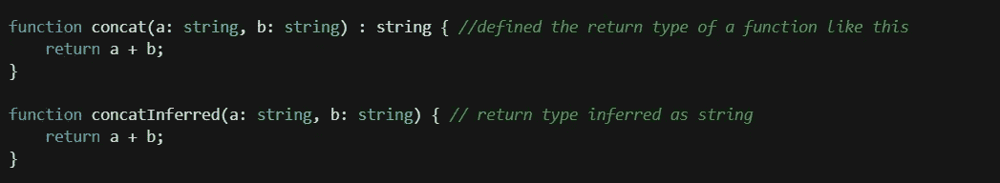

3.**具有鸭子类型的复杂类型**(看起来像鸭子，走路像鸭子，那么它可能是一只鸭子)

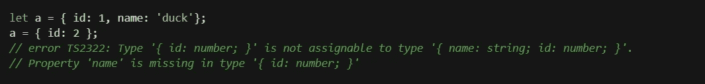

4.**数组类型**

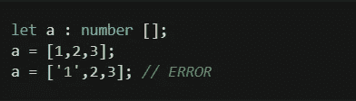

5.**跳过特殊情况的类型检查(使用任何类型)**。

这应该用作从程序外部(如数据库或服务器请求参数)接收数据的临时解决方案，并在应用程序内部使用之前，在检查后转换为适当的类型。

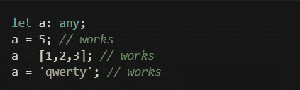

6.**类型铸造**

> 这实际上并没有改变类型，只是告诉编译器如何看待一个变量。

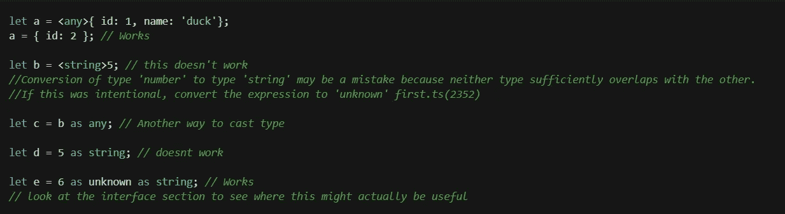

7.**具有类型别名的联合类型(多种类型的混合)**

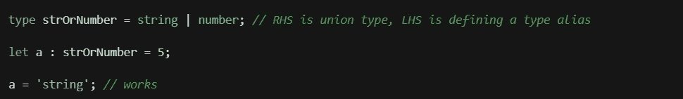

8.**函数中的联合类型**

在某些情况下，这需要类型保护。

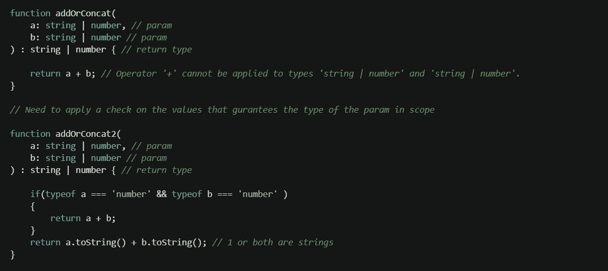

9.**元组**

具有定义的长度和每个成员类型的数组。

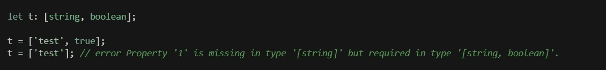

10.**可选元素**

使用`?`告诉编译器某个东西是否可选。如果我们将默认值设置为参数，这也可以在函数中实现。

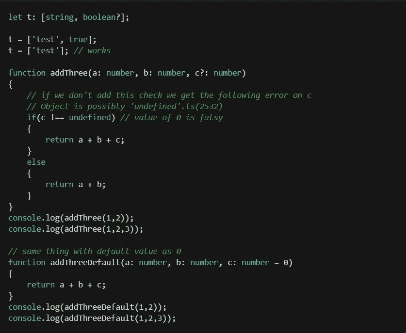

11.**枚举为类型**

> 当我们使用数字时，这有点问题

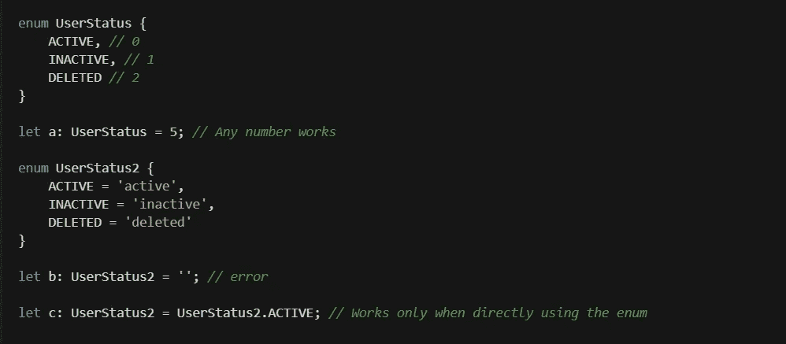

12.**接口类型**

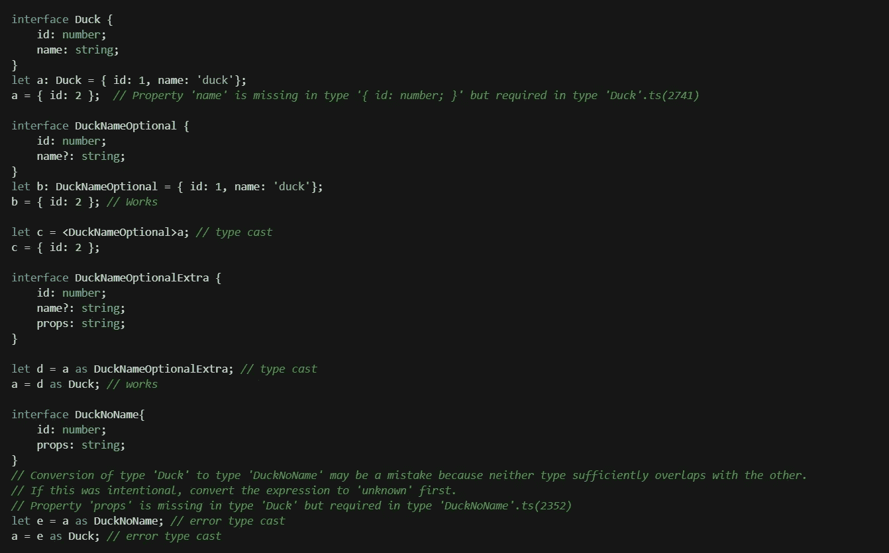

我之前在#6 中提到的`as unknown as Type`在某些情况下是有用的。

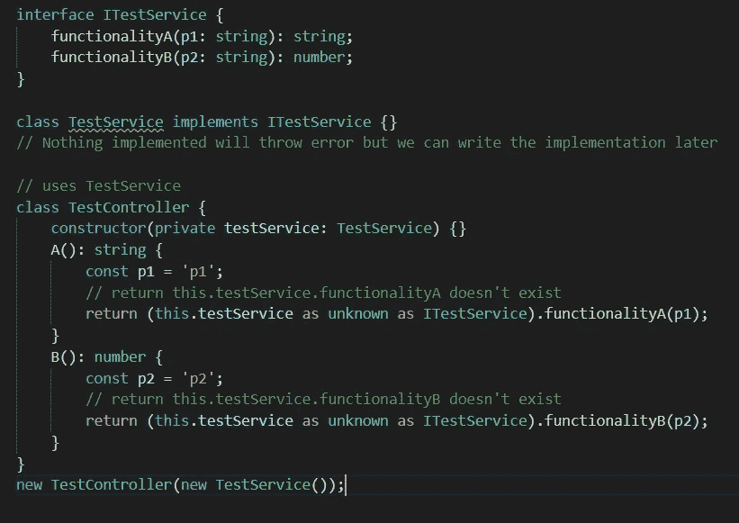

想象一下 **TestService** 控制所有的数据库模型。我们知道我们想要的功能。如果我们想在决定最终的数据库实现之前先完成用例逻辑的构建，我们可以尝试上面的方法。

接口在 JavaScript 中不存在。当 TypeScript 编译完成后，它们都将**不复存在**。它们只能在 TypeScript 中用于规划和类型检查。如果我们删除 TestService 中的`implements ITestService`，上面的程序可以被编译，但是它实际上不会工作，因为`functionalityA`和`functionalityB`在 TestService 中不存在。

> 我纯粹是在计划一个新特性时使用它，并且我想在以后推出实现的某个部分。

13.**分类为类型**

> 我已经提到了一些关于类型系统的问题。TypeScript 被编译成 JavaScript，强制某个东西成为类型`*any*`会使它的行为像在 JavaScript 中一样。除非用例特别要求，否则这是不可取的。

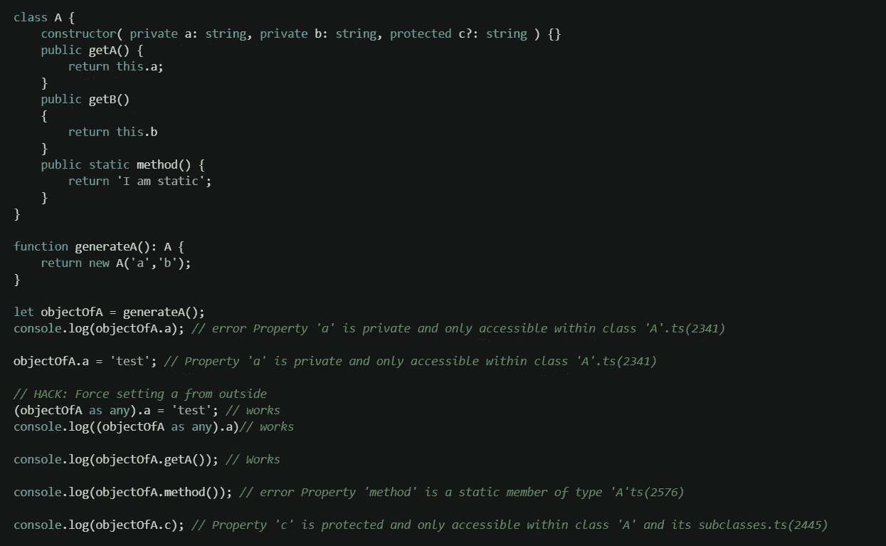

让我们试着在继承上花点时间。我们将创建一个名为 B 的 A 的子类，并将其转换为 A。

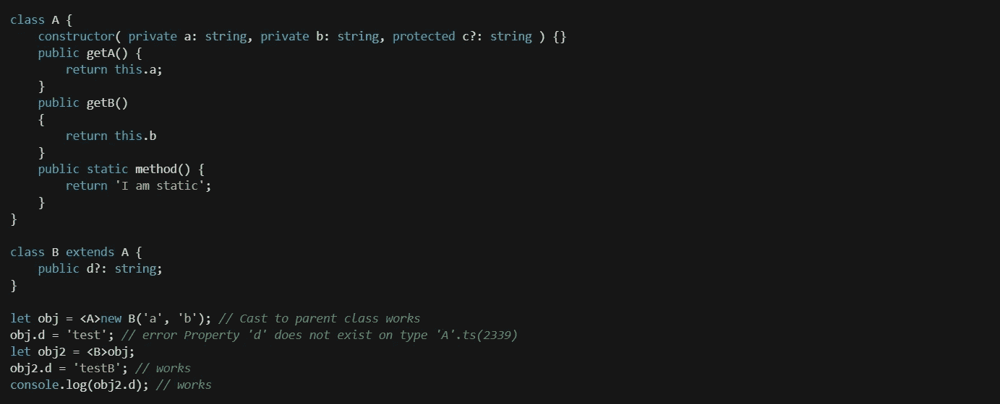

我们可以通过将属性类型转换为父类来限制只在子类中可用的属性。有一个警告。对变量进行造型只是告诉编译器以那种特定的方式来看待它。它不会改变正在进行造型的基础对象。

为了说明，让我们创建一个名为 c 的子类。它将有一个公共属性`d`，该属性将有一个默认值。当我们创建一个 A 的对象并将其强制转换为 C 时，它的行为非常出乎意料。

此外，如果我们试图将的对象强制转换为任何具有不同属性集的类，我们会得到一个错误。

类型转换也可以用来创建抽象的类的**实例。**

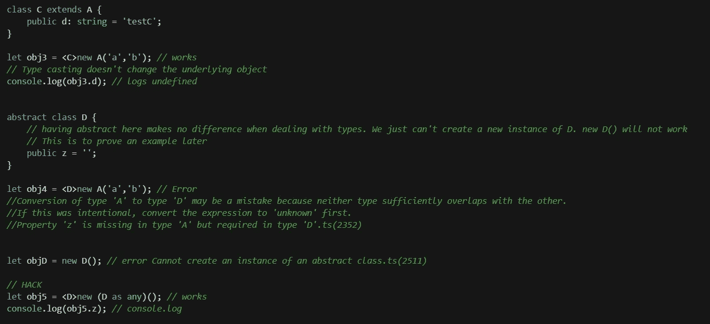

14.**仿制药**

泛型是一种编写代码的方式，可以处理任何类型的对象，但仍然保持对象类型的完整性。这是一个巨大的话题。我会单独写一下。这里我只举一些基本的例子。

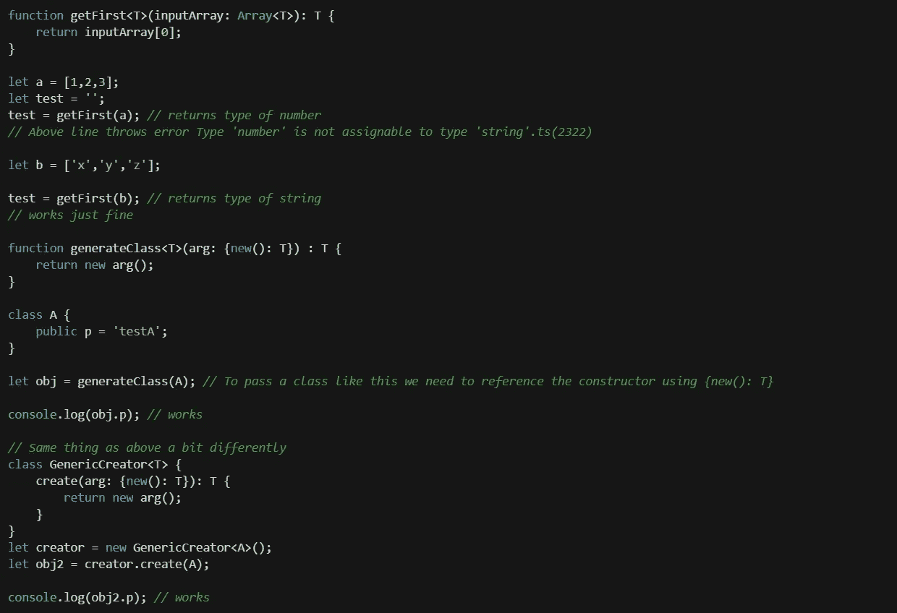

我们可能会用得最多的仿制药。

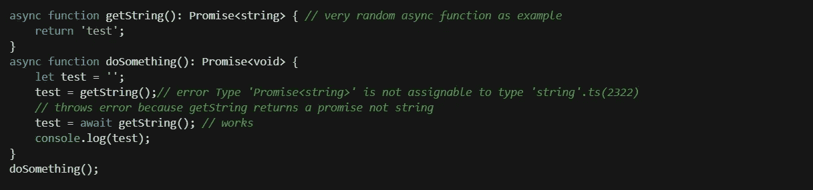

要像这样使用`Promise<string>`，我们需要在 tsconfig.json 中设置`"target": "es6",`

*Medium 没有语法突出显示，这款有很多代码。所以我用截图代替 gists。*

延伸阅读:

1.  [基本类型](https://www.typescriptlang.org/docs/handbook/basic-types.html)
2.  [未知](https://www.typescriptlang.org/docs/handbook/release-notes/typescript-3-0.html#new-unknown-top-type)
3.  [高级类型](https://www.typescriptlang.org/docs/handbook/advanced-types.html)
4.  [接口](https://www.typescriptlang.org/docs/handbook/interfaces.html)
5.  [类型兼容性](https://www.typescriptlang.org/docs/handbook/type-compatibility.html)
6.  [类型推断](https://www.typescriptlang.org/docs/handbook/type-inference.html)