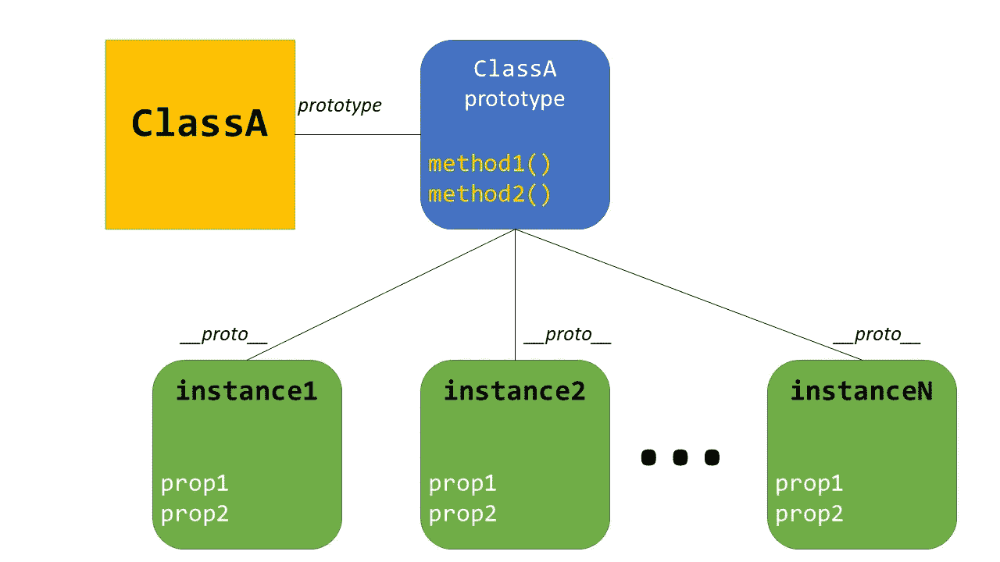
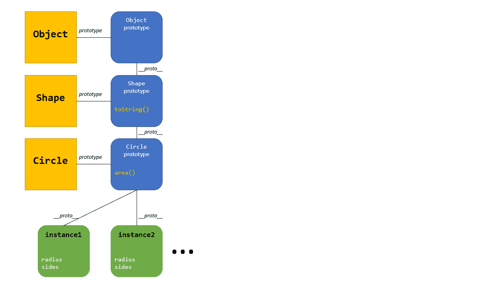

# 打字稿 4.3 —我反对，法官大人！

> 原文：<https://levelup.gitconnected.com/typescript-4-3-i-object-your-honour-2db0368c07cb>

为了庆祝 TypeScript 4.3，我看了一下 TypeScript 的面向对象特性，并看看这个版本带来的新特性。


TypeScript 为面向对象编程和面向函数编程都提供了很好的支持(我不说函数编程，因为我不想让纯粹主义者追杀我)。

在这篇文章中，我将回顾 TypeScript 中的 OO 支持，并展示在 [TypeScript 4.3](https://devblogs.microsoft.com/typescript/announcing-typescript-4-3/) 中提供的最新 OO 特性。

我将快速介绍:

*   基本类机制&基于原型的系统
*   可访问性和参数属性
*   继承、类型和类型断言
*   访问器和 4.3 对不同类型的支持
*   ECMAScript Private 和 4.3 对方法和访问器的扩展
*   4.3 的新`override`关键字

# 打字稿 OO 评论

## 类、对象和原型，天啊！

JavaScript 中的面向对象编程总是有点奇怪，随着 TypeScript 成为 JavaScript 的超集，一些恐惧仍然悬而未决。

用于管理类的[原型系统](https://developer.mozilla.org/en-US/docs/Learn/JavaScript/Objects/Object_prototypes)来自其他面向对象的语言，如 Java、C#或 C++，可能会感觉奇怪。在 JavaScript 中，类实际上在内存中创建一个对象，就像任何其他对象一样，包含该类的所有实例共享的公共功能(通常是方法)。这个对象是**原型**，通过类的`prototype`属性和所有实例的`__proto__`属性来访问。



当我们实例化一个类的对象时，我们实际上创建了一个新的 ***空白*** 对象，但是这个空白对象有一个指向共享实例的原型，所以*继承了*它的行为。构造函数运行，通常用属性填充*空白*对象。

在过去，这在我们实际上将类写成函数并操纵函数/类的原型时更为明显。

当然，从 ECMAScript 2015 (ES6)开始，我们有了合适的类语法:

这种语法也适用于 TypeScript:

但是要意识到底层的*行为*是相同的，有构造函数和原型对象。

## 可访问性、属性和参数属性

注意，在 TypeScript 的`Circle`类中，我们必须定义一个`radius`属性。此属性可以配置为私有、受保护或公共(默认为公共)。这些可访问性修饰符也适用于方法。

在构造函数中，通常情况下，我们用传递给构造函数的参数初始化`radius`属性。这可以通过向构造器参数添加一个可访问性修饰符来简化，使其成为一个 [**参数属性**](https://www.typescriptlang.org/docs/handbook/classes.html#parameter-properties) 。这消除了属性声明和初始化的需要。

我们也可以将属性限定为`**readonly**`。这也有助于创建参数属性。

最后，我们也可以在构造函数之外初始化属性。甚至使用其他属性和方法。

## 遗产

[原型链支持 OO 继承](https://developer.mozilla.org/en-US/docs/Web/JavaScript/Inheritance_and_the_prototype_chain)，使用`extends`很容易实现。



## 铅字里有什么

对于 TypeScript 中的类，要记住的一个关键概念是，由于其原型，对象*是类的实例*。

然而，当我们从 JSON 中反序列化时，我们正在重新创建与我们编写的任何类都没有链接的对象。它们将**而不是**作为序列化之前最初创建它们的类的实例出现，并且它们没有任何方法。

即使我们包含了类型断言，也是如此。认识到类型断言不是强制转换；我们只是做一个断言。我们通知编译器一些它自己不能推断的事情。这通常发生在 I/O 边界或者调用非类型化的 JavaScript 时。然而，我们有可能给出不正确的信息——比如断言一个基本对象是一个类的实例。

这就是为什么在传输数据时使用没有方法的**接口**通常更好。您可能会发现，由于这个原因，使用 TypeScript 时，您倾向于使用更加面向函数的方法，使用遵循接口的基本对象和将这些对象作为输入的自由函数。

# 最新功能

## 带转换的访问器

访问器对于提供一个像属性一样使用的接口很有用，但是其背后有更复杂的逻辑。使用`get`和/或`set`，我们可以将属性绑定到 getter 和/或 setter 函数。例如，这在创建计算属性时非常有用。

在这里，`diameter`看起来和感觉上都像是消费者的属性，但实际上它调用的是读写`radius`的函数。

TypeScript 4.3 增加了对 setter 类型多于 getter 类型的支持。这对于支持编写最终将被转换为规范类型的多种数据类型非常有用。比如下面，我们可以把`diameter`写成一个数字或者字符串，但是我们总是读回一个数字。

虽然您不希望在任何地方都这样做，但是用类似的行为包装现有的 API 是很有用的。在 4.3 中，我们还支持在一个接口中指定单独的 getter 和 setter 类型。

唯一的限制是 getter 类型*必须*可分配给 setter 类型。

## 真正的私有成员

值得注意的是，像 TypeScript 中的许多东西一样，`private`和`protected`修饰符只在编译时适用。他们在那里帮助和保护开发者。在运行时，当所有内容都被转换成 JavaScript 时，所有属性都将存在于对象中，并且是可访问的。这包括我们将对象序列化到 JSON 的时候。

连载出来的是:

```
{
    "key": "123",
    "id": "abc"
}
```

为了提供真正的隐私，TypeScript 在版本 [3.8](https://www.typescriptlang.org/docs/handbook/release-notes/typescript-3-8.html#ecmascript-private-fields) 中增加了对 [ECMAScript 私有字段](https://developer.mozilla.org/en-US/docs/Web/JavaScript/Reference/Classes/Private_class_fields)的支持。这只是 JavaScript 的第三阶段提案(在撰写本文时),但从 3.8 版本开始，它就是类型脚本语言的一部分。这些字段以`#`为前缀。

这存储了对象外部的字段/属性的值，所以当我们序列化时，私有字段不存在。因此，这个`Secrets`类的一个实例连续出现如下:

```
{}
```

将它编译成旧的 JavaScript 很有趣——它为每个字段创建了一个模块级`WeakMap`,一个对象必须在这个结构中查找它的字段值，使用它自己作为键。

[TypeScript 4.3](https://devblogs.microsoft.com/typescript/announcing-typescript-4-3/) 扩展了 ECMAScript 私有支持，以包括方法和访问器。

## 覆盖中的清晰度

在 TypeScript 4.3 之前，当在子类中重写方法时，只需使用相同的名称。当基类改变但子类没有更新时，这可能会导致细微的错误。例如，当基类方法被移除时。

TypeScript 4.3 引入了`override`关键字来显式地将方法标记为被重写。如果没有合适的基本条目可以覆盖，则会标记一个错误。这也能更好地向读者传达意图。

为了避免中断-改变，当一个方法在没有这个关键字的情况下覆盖一个基方法*时，一个新的编译器开关`--noImplicitOverride`会标记错误。*

# 结论

我希望这是对 TypeScript 中面向对象支持的有用总结。如您所见，TypeScript 4.3 为这种范式增加了一些有用的特性。

如果你还没有这样做，看看我的帖子，展示了 [TypeScript 4.1](https://medium.com/swlh/crazy-powerful-typescript-4-1-features-26036f4de6bc) 和 [TypeScript 4.2](/crazy-powerful-typescript-tuple-types-9b121e0a690c) 中一些有用的特性。

另外，一定要看看我们的[打字稿](https://instil.co/courses/typescript-introduction/)课程。我们也很乐意使用 TypeScript 提供 [Angular](https://instil.co/courses/introduction-to-angular/) & [React 培训](https://instil.co/courses/react-with-typescript/)。我们几乎为世界各地的公司提供服务，并且很乐意根据您团队的水平和具体需求定制我们的课程。来看看我们是否能帮助你和你的团队。

原贴[此处](https://instil.co/blog/typescript-43-objects/)。