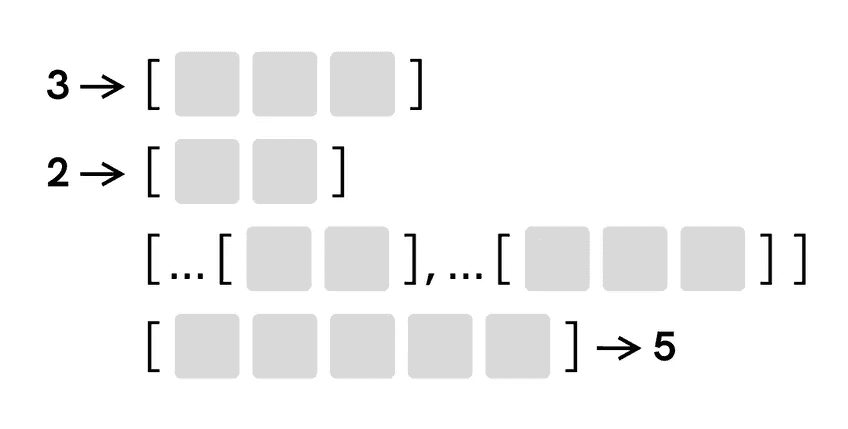
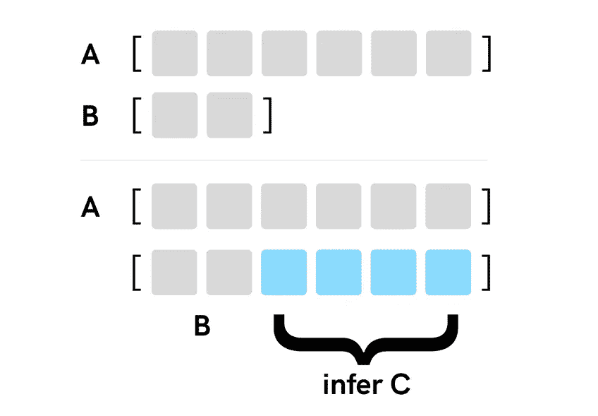

# 打字稿:高级而深奥

> 原文：<https://levelup.gitconnected.com/typescript-advanced-and-esoteric-d88560f51767>


在本文中，我们将探索使 TypeScript 更具动态性的鲜为人知的特性。

第一部分将介绍依赖泛型来创建新类型的动态类型，这些新类型可能看起来非常不同，这取决于它们接收的类型参数。这一部分将包括属性访问器、条件、推断和递归类型，它属于“高级”类别。

在第二个“深奥”的部分，我们将使用这些类型来实现数字文字的加减逻辑。没有 JavaScript，只有类型。如果您已经知道如何使用上述高级类型，请直接跳到该部分。

## 属性访问器

当我们使用描述具有嵌套结构的对象的类型时，我们可以使用属性访问器语法来基于父类型的属性和子属性派生新类型。考虑这样一种类型，它表示一个 API 响应，在其`data`属性中包含一个用户列表:

```
type ApiResponse = {
  data: Array<{
    firstName: string
    lastName: string
    age: number
  }>
  meta: {
    page: number
    count: number   
  } 
}
```

我们可以使用属性访问器语法来创建一个新的类型，通过访问`data`属性来表示用户列表:

```
type UserList = ApiResponse["data"]

// is equal to
// => type UserList = Array<{ firstName: string, lastName: string, age: number }>
```

为了更进一步，我们可以使用数组访问器语法并为单个用户创建一个类型:

```
type User = UserList[number]

// is equal to
// type User = { firstName: string, lastName: string, age: number }
```

这是使用属性访问器的一种非常常见的方式，但是当我们将属性访问器与泛型类型结合起来时，事情就变得更有趣了。当我们将泛型的类型参数限制为特定的类型集时，我们可以使用属性访问器语法来访问属于该类型集的类型的属性。例如，我们可以将类型参数限制为`any[]`(包括所有数组类型)，并访问任何数组上可用的属性。在下面的例子中，我们访问了`length`属性，该属性创建了一个与`X`数组中的元素数量相等的数字文本类型:

```
type Length<X extends any[]> = X["length"]

type Result1 = Length<[]>         //  => 0
type Result2 = Length<[1, 2, 3]>  // => 3
```

虽然这种类型`Length`在实际应用中并不十分有用，但是在本文后面我们讨论 TypeScript 的更深奥的用法时，它会派上用场。不过现在，我们可以用它来演示两个有趣的想法。

第一个是关键字`extends`的使用。它的确切含义是`extends`左侧的一个类型集合包含在右侧的一个类型集合中。在实践中，这些超类型/子类型关系会变得非常复杂，很难解释，因此根据上下文，我们可以将它们理解为“继承自”、“等于”，甚至“看起来有点像”的关系。通过本文中的例子，我们将看到`extends`的不同用法。

其次，我们可以得出 TS 类型的语法和模仿其功能的 JavaScript 函数的语法之间的相似性:

```
// a type
type Length<X extends any[]> = X["length"]

// a function
const length = (array: any[]) => array.length
```

注意不同类型的标记如何映射到 JS 函数的标记:

*   类型名→函数名
*   类型参数→函数参数
*   类型参数限制→函数参数类型
*   类型定义→函数体

记住这种映射是有用的，因为它会使理解更复杂的类型变得更容易。

## 条件类型

条件类型允许我们在类型定义中引入 if/else 逻辑，并使它们更加动态。在 TypeScript 中，我们总是使用三元语法来定义条件语句。它们以使用`SomeType extends SomeOtherType`符号的条件本身开始，后面是该条件的 true 和 false 分支。

下面是一个非常基本的条件类型，它将根据收到的类型参数创建`true`或`false`文字类型:

```
type IsOne<X> = X extends 1 ? true : false

type Result1 = IsOne<1>      // => true
type Result2 = IsOne<2>      // => false
type Result2 = IsOne<"1">    // => false
```

也可以嵌套多个三元运算符来描述更复杂的条件。在下面的示例中，我们定义了一个提取某些数组类型的项目类型的类型:

```
type ItemType<A> = A extends Array<number>
  ? number
  : A extends Array<string>
  ? string
  : A extends Array<boolean>
  ? boolean
  : unknown

type Result1 = ItemType<Array<number>>  // => number
type Result2 = ItemType<Array<string>>  // => string
type Result3 = ItemType<Array<{}>>      // => unknown
```

`ItemType`的这个实现只支持数字、字符串和布尔数组，否则将默认为`unknown`类型。我们可以包含更多的嵌套三元运算符来支持其他类型，但这很快就变得不切实际了。有一种更好、更健壮的方法来实现这个逻辑，但是为了理解它，我们需要先了解类型推断。

## 类型推断

条件类型本身是有用的，但是当与关键字`infer`一起使用时，它们变得特别强大。这个关键字让我们在我们的`extends`约束中定义一个变量，所以我们可以稍后从类型定义中引用或返回这个变量。

为了让它发挥作用，我们将重新定义我们的`ItemType`，使其变得通用并支持任何类型的数组:

```
type ItemType<A> = A extends Array<infer I> ? I : unknown

type Result1 = ItemType<number[]>      // => number
type Result2 = ItemType<string[]>      // => string
```

在上面的例子中，我们对`extends`使用了类似的逻辑，只是我们没有为数组指定确切的项目类型，而是让 TypeScript 计算出来并保存在`I`类型变量中，然后我们可以返回它。

条件类型和`infer`关键字的组合出现在 TS 附带的许多实用程序类型中。一个这样的类型是`Awaited`，它“解开”一个承诺，并返回该承诺将解析的值的类型。考虑到不同种类的承诺，`Awaited`的具体实现更加复杂，但简化版与我们的`ItemType`非常相似:

```
type Unwrap<T> = T extends Promise<infer I> ? I : never

type Result = Unwrap<Promise<{ status: number }>>  // => { status: number }
```

TS 自带的另一个有趣类型是`ReturnType`。这个函数将函数类型表达式作为参数，并从该函数的返回类型创建一个类型:

```
type ReturnType<T extends (...args: any) => any> = 
  T extends (...args: any) => infer R 
    ? R 
    : any

type Result = ReturnType<(s: string) => number>  // => number
```

在这个实现中，我们两次依赖于关键字`extends`。左边的一个确保只有函数类型可以传入，右边的一个定义了条件。该条件将`T`参数与函数签名进行匹配，丢弃其参数类型，只保留返回类型`R`。

## 递归类型

递归类型是一种在其定义中引用自身的类型。递归类型有许多应用，但最常见的应用之一是替代循环。TypeScript 没有专门的关键字来进行循环，但是我们可以通过使用递归来重复执行一些逻辑，从而绕过这个限制。

为了看到递归的作用，我们将再次参考`ItemType`，只是这一次我们将使用 N 维数组(数组的数组):

```
type ItemType<A> = A extends Array<infer I>
  ? ItemType<I>
  : A

type Result1 = ItemType<number[]>      // => number
type Result2 = ItemType<number[][][]>  // => number
```

这里需要注意的重要一点是，我们在定义中引用了`ItemType`。这允许我们通过“剥离”数组层并将结果传递回`ItemType`来检查数组项类型是否是数组本身。只有当我们到达内部项目类型时，条件才变为假，我们才退出循环。

## 变得深奥

既然我们已经讨论了所有这些类型，让我们看看它们的实际应用。通常，我会提倡用现实生活中的例子来练习，但不是在这种情况下。这些类型派上用场的用例并不常见，需要长时间的讨论来理解每个用例的上下文，这将不可避免地将注意力从重要的东西上转移开。所以我们不去真实世界，而是去有趣和深奥的地方。

我们将实现`Add`和`Sub`类型，这两种类型各有两个数字参数，并对它们进行加减运算。这些类型根本没有任何实际用途，但它们会给我们提供大量机会，以创造性的方式实践我们所学的知识。

**加法**

让我们首先构建`Add`类型，它应该是这样工作的:

```
type Add<A extends number, B extends number> = // to be defined

type Result = Add<3, 2>   // => 5
```

我们遇到的第一个问题是，TypeScript 不能对数字文字做太多事情(也不能对其他基本类型做太多事情)。TypeScript 并不是为这种方式而设计的，承认它的局限性很重要。然而，如果我们看看数组类型，我们会发现我们可以使用一个 spread 操作符，这个简单的事实给了我们很多控制。

使用 spread 操作符，我们可以进行相当多的转换——我们可以连接数组，获取数组的第一个和最后一个元素，以及追加、预先考虑和删除单个元素。正如您可能已经猜到的，我们将使用数组来绕过我们提到的数值的限制。

为了实现我们的`Add`类型，我们将遵循以下步骤:

1.  将数值转换为大小相等的元组
2.  将得到的数组连接成一个新数组
3.  获取这个数组的长度，它等于数值的总和

这是这个算法的一个可视化表示:



使用数组加法

让我们从将数字文字转换成元组开始。在 JavaScript 中有多种方法可以做到这一点，但是考虑到 TS 的限制和缺乏适当的循环，我们必须使用递归来达到预期的结果。我们一会儿将讨论类型实现，但首先，让我们来看一段模拟我们将要实现的逻辑的 JavaScript 代码:

```
const toTuple = (n: number, arr: any[] = []) => {
  if (arr.length === n) {
    return arr
  } else {
    const newTuple = [...arr, 0]
    return toTuple(n, newTuple)
  }
}

toTuple(3)    // => [0, 0, 0]
```

这里，我们从一个空数组开始，不断向其中追加新的项，并递归地调用函数，直到获得数组中预期的项数。这里任意使用值`0`,因为我们不关心数组项的值，而只关心它们的总数。

既然我们已经理解了逻辑应该如何工作，我们可以创建我们的`ToTuple`类型(同时利用我们之前创建的`Length`类型):

```
type ToTuple<N extends number, T extends any[] = []> =
  Length<T> extends N
    ? T
    : ToTuple<N, [...T, 0]>
```

接下来，我们需要一种连接两个元组的方法。这可以通过将两个元组扩展成一个新的元组来容易地实现:

```
type Concat<A extends any[], B extends any[]> = [...A, ...B]
```

最后，为了得到总和，我们需要得到结果元组的长度。我们已经有了可以做到这一点的类型，所以我们只需要把所有的部分放在一起:

```
type Add<A extends number, B extends number> = Length<
  Concat<ToTuple<A>, ToTuple<B>>
>

type Result1 = Add<1, 1>    // => 2
type Result2 = Add<2, 5>    // => 7
```

**减法**

`Sub`类型的签名如下:

```
type Sub<A extends number, B extends number> = // to be defined

type Result = Sub<6, 2>   // => 4
```

对于这种类型，我们也要依赖数组，但是逻辑会有所不同。为了从数组`A`中减去数组`B`，我们将:

1.  如果是，推断剩余部分
2.  获取余数的长度

这是一个直观的表示:



使用数组的减法

我们可以重用前一个示例中的`ToTuple`和`Length`类型，因此得到的类型如下所示:

```
type Sub<A extends number, B extends number> = 
  ToTuple<A> extends [...ToTuple<B>, ...infer U]
    ? Length<U>
    : unknown

type Result1 = Sub<5, 2>  // => 3
type Result2 = Sub<3, 3>  // => 0
type Result3 = Sub<2, 5>  // => unknown
```

如您所见，前两种情况如预期的那样工作，但是如果数组`B`大于数组`A`，就会出现问题。根据减法的基本性质(`2 - 5 = -(5 - 2)`)，这个问题的解决方案是`A`和`B`交换位置，将结果的符号改为负数:

```
type Sub<A extends number, B extends number> = 
  ToTuple<A> extends [...ToTuple<B>, ...infer U]
    ? Length<U>
    : Negative<Sub<B, A>>
```

我们还没有`Negative`类型，我们来定义一下。首先，我们可以使用字符串插值轻松地附加一个减号:

```
type Negative<N extends number> = `-${N}`
type Result = Negative<5> // => "-5"
```

结果，我们得到一个字符串文字类型，为了将它转换成一个数字，我们将使用 TypeScript >= 4.8 中的一个新特性，它允许我们在条件类型中对`infer`类型变量使用`extends`约束:

```
type ToNumber<T> = T extends `${infer N extends number}` 
  ? N 
  : never

type Negative<N extends number> = ToNumber<`-${N}`>

type Result = Negative<5>  // => -5
```

这非常强大，因为我们现在可以检查我们的类型`T` *是否看起来像*一个字符串，其中*的内容看起来像*一个数字，甚至可以推断并返回该数字。

有了这些，我们可以确认我们所有的测试用例都如预期的那样工作:

```
type Sub<A extends number, B extends number> = 
  ToTuple<A> extends [...ToTuple<B>, ...infer U]
    ? Length<U>
    : Negative<Sub<B, A>>

type Result1 = Sub<5, 2>  // => 3
type Result2 = Sub<3, 3>  // => 0
type Result3 = Sub<2, 5>  // => -3
```

既然我们已经实现了`Add`和`Sub`类型，重要的是要承认，除了没有实际用途，它们也有一些缺陷。其中之一与计算复杂性有关——对于递归类型，TypeScript 编译器的最大调用堆栈深度为 1000，因此任何超过这个深度的数字都不起作用。另一个原因是我们的类型都不能处理负数，因为我们不能创建负长度的元组。

话虽如此，健壮的生产就绪型实现并不是我们的目标。相反，我们开始以创造性的方式实践我们所学的不同类型，而不会被具体用例的细枝末节分散注意力。

## 结论

尽管如今 TypeScript 被广泛采用，但这种语言所提供的许多强大功能仍然相对不为人知。这些功能包括属性访问器，以及条件类型、推断类型和递归类型。诚然，这些类型的存在是为了解决我们不经常面临的非常具体的问题，但无论如何，在你的武器库中拥有它们是很重要的，以便有机会使用它们。

*原载于*[*https://konstantinlebedev.com*](https://konstantinlebedev.com/typescript-advanced-esoteric/)*。*