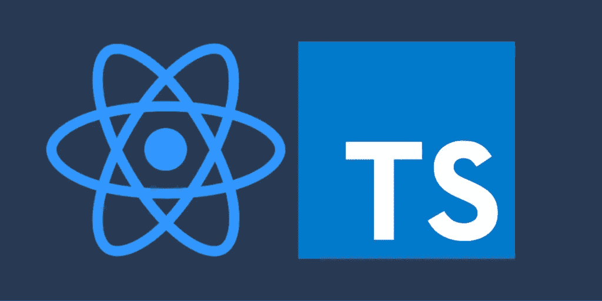
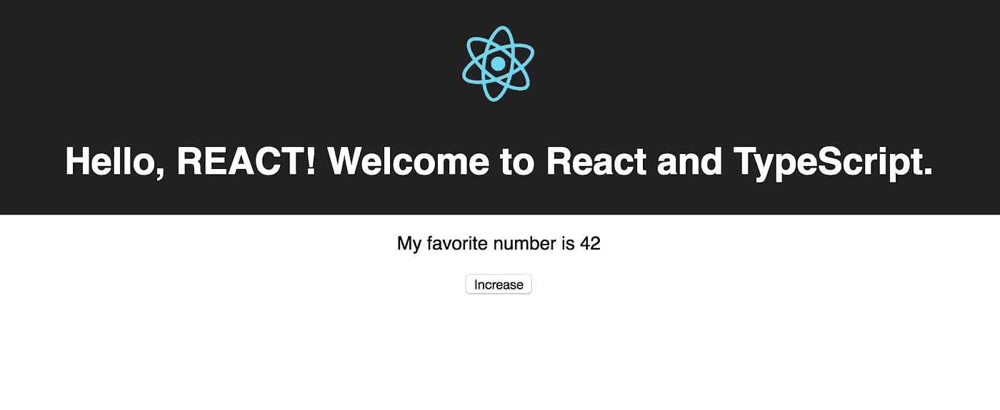

# 使用 create-react-app 键入脚本并做出反应:设置您的第一个应用程序的分步指南

> 原文：<https://levelup.gitconnected.com/typescript-and-react-using-create-react-app-a-step-by-step-guide-to-setting-up-your-first-app-6deda70843a4>

## 零配置开始使用您的第一个 TypeScript 和 React 应用程序



**更新 2/9:** 类型已经更新，包含了使`SFC`不再是有效定义的钩子。如果您注意到任何其他问题，请评论。

本教程将向您展示如何通过使用`create-react-app` (CRA)在不需要任何配置的情况下使用 TypeScript 快速开始构建 React 应用程序。我们假设您的计算机上已经安装了节点和 NPM。你的 TypeScript/React 应用程序开箱即可运行，无需弹出 CRA。此外，您将学习如何构建自己的组件并使用 TypeScript 管理`props`和`state`。

[](https://gitconnected.com/learn/react) [## 学习 React -最佳 React 教程(2019) | gitconnected

### React 的前 48 门课程。教程由开发者提交并投票，让你找到最好的反应…

gitconnected.com](https://gitconnected.com/learn/react) [](https://gitconnected.com/learn/typescript) [## 学习 TypeScript -最佳 TypeScript 教程(2019) | gitconnected

### 打字稿的前 17 门课程。教程由开发者提交并投票，使您能够找到最好的…

gitconnected.com](https://gitconnected.com/learn/typescript) 

你也可以在 GitHub 上找到完整的[源代码。](https://github.com/treyhuffine/typescript-create-react-app)

# 安装创建-反应-应用

`create-react-app`是一个命令行工具，允许开发者使用合理的默认值和零配置轻松创建新的 React 应用。

```
npm install -g create-react-app
```

注意:这一步现在是可选的。可以使用`npx`安装 TypeScript，这将在下一节中显示。

# 用 TypeScript 初始化 React 应用程序

调用带有附加 TypeScript 选项的`create-react-app`命令，使用 TypeScript 作为默认 JS 语法来生成 React 应用程序。

```
npx create-react-app my-app --typescript
```

> `npx`是 npm 5.2 发布的一个命令，允许您执行 CLI 命令和注册表托管的可执行文件，这意味着不再需要全局安装。

如果你以前用过`create-react-app`，这个应该看起来很眼熟。附加信息是添加`--typescript`标志。这个标志告诉 CRA 使用 TypeScript 作为默认语法，并添加适当的配置使其开箱即用。

这将生成以下文件和文件夹结构:

```
my-app/
├─ .gitignore
├─ node_modules/
├─ public/
├─ src/
 | — — index.tsx 
 | — — registerServiceWorker.ts
 | — — logo.svg
 | — — App.tsx
 | — — App.test.tsx
 | — — App.css
 | — — index.css
 | — — assets/
├─ package.json
├─ tsconfig.json
├─ tsconfig.test.json
└─ tslint.json
```

以下是各部分的说明:

*   `tsconfig.json`声明 TypeScript 选项。它位于 TypeScript 项目的根目录，指示编译器设置和要包含的文件。
*   `tslint.json`是由[t 棉绒](https://github.com/palantir/tslint)使用的棉绒设置。
*   `public`是将被提供的静态资产的文件夹，例如 HTML 文档和清单文件。
*   `src`持有 app UI 代码。这包括我们的 TypeScript 组件和 CSS 样式。传统的`index.js`档已经被`index.tsx`取代，成为切入点。

# 用声明文件反应类型脚本的类型

除了配置 TypeScript 编译之外，我们还接收将 TypeScript 与 React 一起使用所需的所有声明文件。声明文件用于描述用原生 JavaScript 编写的文件类型——它可以被视为 JavaScript 和 TypeScript 之间的接口。这些文件以`@types`声明为前缀。`create-react-app` TypeScript 配置附带了以下声明文件。

*   `@types/jest`
*   `@types/node`
*   `@types/react`
*   `@types/react-dom`

这些是通过 NPM 安装的，可以在您的`package.json`文件夹中找到。

# 对类型脚本的修改做出反应

要将 React 与 TypeScript 一起使用，您必须对如何构建标准 React 应用程序进行一些小的修改。

## 使用。JSX 的 tsx 文件

除了新的 TypeScript 文件`.ts`之外，还有一个新的文件扩展名`.tsx`。这是在 React 组件文件中包含 JSX 语法时应该使用的扩展。您还需要将`jsx`设置为 true，这是默认设置。TypeScript 能够将 JSX 直接编译成 JavaScript。更多信息，你可以查看 JSX 上的[打字稿文档。](https://www.typescriptlang.org/docs/handbook/jsx.html)

## 导入 React 和 ReactDOM

您可能会注意到，在默认组件中使用以下语法:

```
import * as React from 'react';
import * as ReactDOM from 'react-dom';
```

你不能再`import React from 'react';`。React 被导出为不使用默认导出的 CommonJS 模块。在这一点上，不需要知道确切的原因，只需要知道应该如何导入 React 以使其工作。这也意味着您将组件声明为`class App extends React.Component {...}`。


创建和维护一份简历并不有趣。相反，让我们为你生成一份令人敬畏的简历:) [**简历生成器>**](https://gitconnected.com/resume-builder)

[](https://gitconnected.com/resume-builder) [## 软件工程师简历生成器和示例| gitconnected

### 使用您的个人资料中的详细信息构建一份有价值的简历模板。从你的投资组合网站链接到你的简历或…

gitconnected.com](https://gitconnected.com/resume-builder) 

# 建筑构件

使用 TypeScript 的最大好处之一是您不再需要使用`prop-types`包。将 TypeScript 用于 props 和 state 有一个轻微的学习曲线，但是一旦您理解了它，它就比 React 默认方法强大得多。

您将为您传递属性的每个组件定义一个属性`interface`。这声明了对象的形状和与键相关联的类型。此外，您必须为类组件的`state`声明一个接口。

## 功能组件

为了用 props 演示一个功能组件，我们将用我们自己的`<Header/>`组件替换`App.tsx`中的`<h1>`标题。从创建`./src/Header.tsx`开始。它会收到一个道具`name`，这个道具会向这个人的名字问好。在我们的文件中，我们将创建一个功能组件:

我们从导入 React 开始。然后我们用`name?`的单串道具声明`interface IProps`。我们将使名称可选，所以我们用一个`?`来表示。将一个键标记为可选意味着它的类型可以是`string | undefined`。

当我们创建`Header`组件时，请注意`React.FC<Props>`。“FC”代表功能组件(接口`React.FunctionComponent`的简称)。虽然这个声明不是必需的，但是它允许我们使用`defaultProps`和`children`。最后，我们将`props`类型声明为`IProps`，引用我们创建的接口。

> 注意:在 React 的以前版本中，我们使用了`SFC`，它代表“无状态功能组件”，随着 React 钩子在 v16.8 中的引入，它不再是真实的。

## 类别组件

为了展示类组件的基本原理，我们将用一个计数器替换`App.tsx`中的`<p>`描述。类和功能组件之间的一个关键区别是类组件可以维护自己的状态。另一个主要区别是访问生命周期方法的能力，这超出了本教程的范围。

创建一个`./src/Description.tsx`文件并添加以下代码。

我们首先为`IProps`和`IState`声明一个接口。将有一个可选的正确调用`countBy`，它将决定增量值。组件本身将使用其状态来维护`count`。

组件用类型`IProps`和`IState`声明为
`class Description extends React.Component<IProps, IState> {`，而`defaultProps`声明为静态变量。该状态用 0 的`count`初始化。

`increase`功能用于递增计数器。`countBy`提取为`const countBy: number = this.props.countBy!;`。感叹号`!`向 TypeScript 表明我们知道该值将存在，并且不抛出潜在的`undefined`错误。最后，我们创建 HTML 来连接组件。

## 您最终的 create-react-app 带有 TypeScript 组件

在我们的`App.tsx`中，我们导入刚刚创建的组件，并替换来自 CRA 的默认 HTML。`name`属性和`countBy`属性必须与子组件中声明的类型相匹配。由于道具都是可选的，所以也可以不定义，会用到`defaultProps`。

这就是您开始使用 TypeScript 并做出反应所需的全部内容！您的应用程序现在应该具有新的功能，并且完全可以使用 TypeScript 运行。运行以下命令，查看应用程序的工作情况:

```
yarn start
```



如果你对 React 和 TypeScript 感兴趣，请关注 g[it connected publication](https://levelup.gitconnected.com)获取更多我们即将推出的教程。我们将向您展示如何使用 TypeScript 构建生产质量 React 应用程序。

*如果您觉得这篇文章有帮助，请点击*👏*。* [*关注我*](https://medium.com/@treyhuffine) *了解更多关于 React、Node.js、JavaScript 和开源软件的文章！也可以在*[*Twitter*](https://twitter.com/treyhuffine)*或者*[*git connected*](https://gitconnected.com/treyhuffine)*上找到我。*

```
Recommend & Share
```