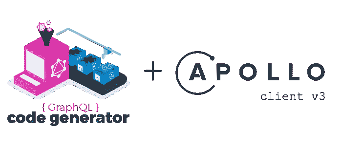
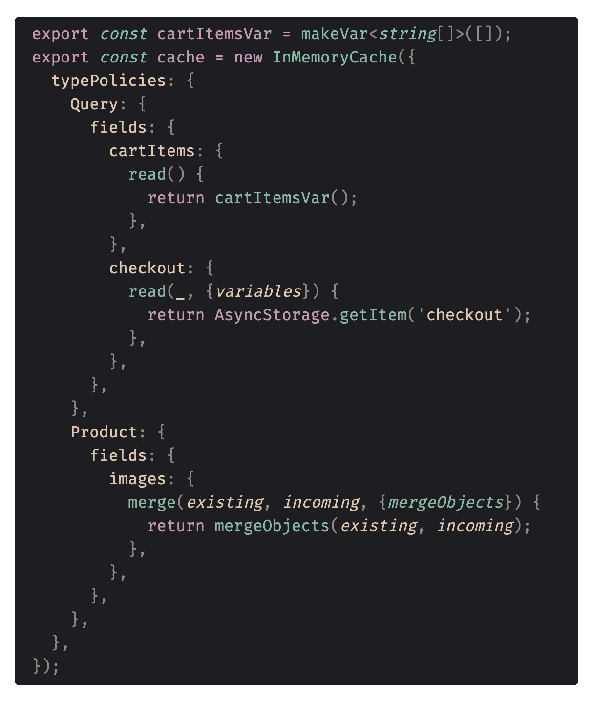
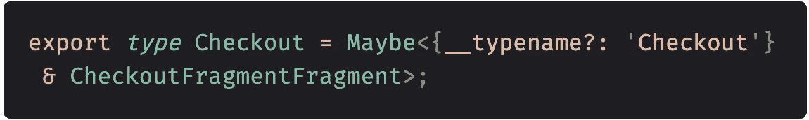
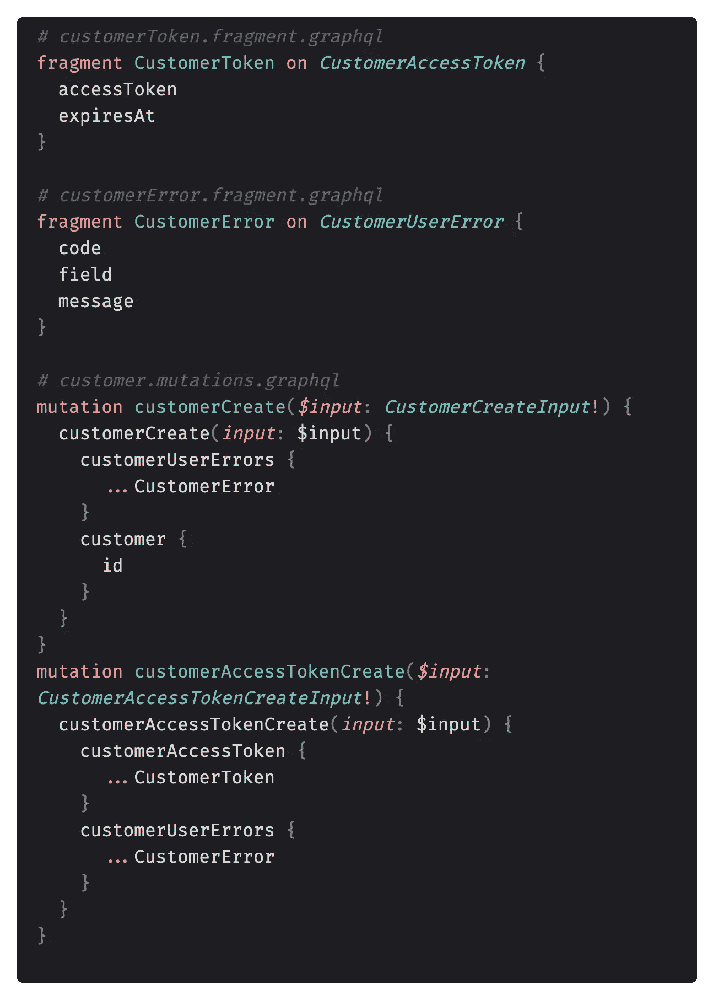
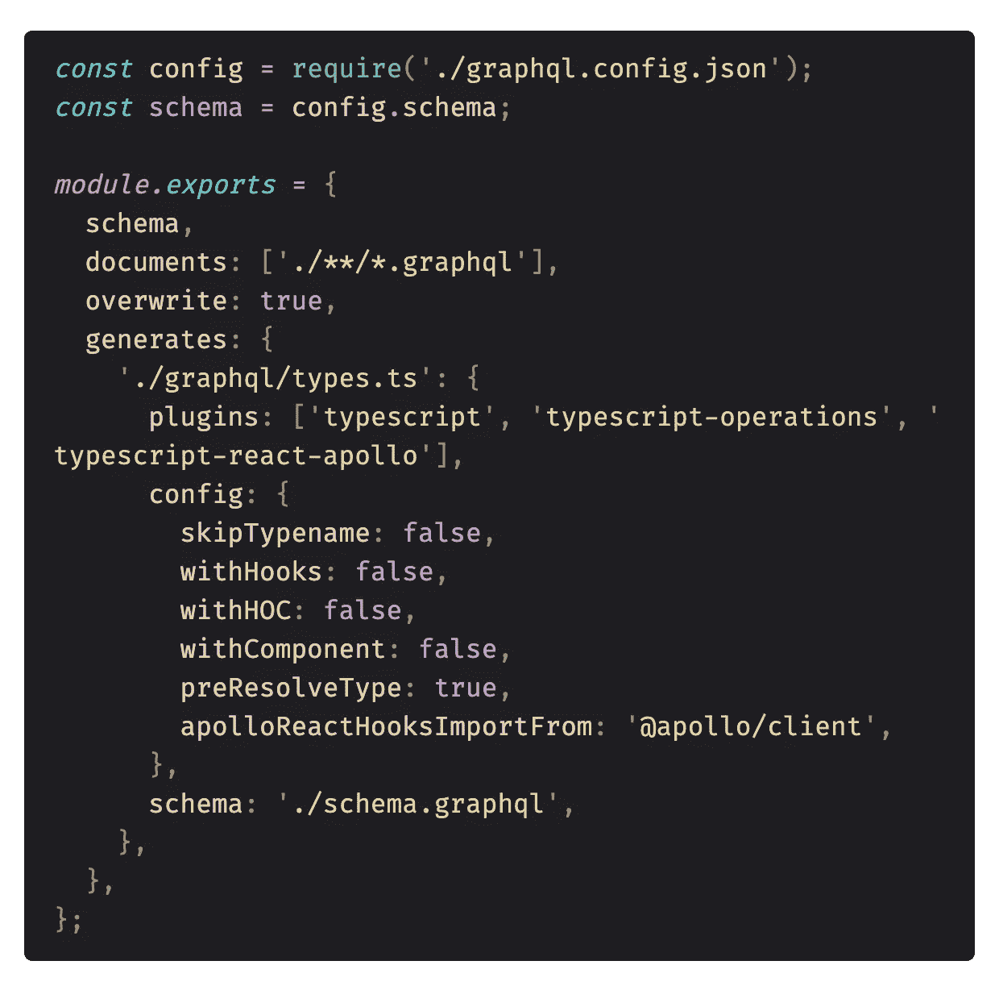
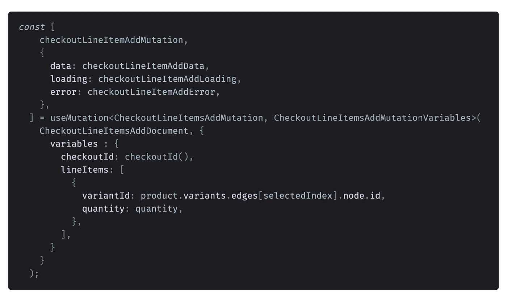

# TypeScript、Apollo 客户端和 GraphQL 代码生成器——一个三角恋。

> 原文：<https://levelup.gitconnected.com/typescript-apollo-client-and-graphql-code-generator-a-love-triangle-df4cb46c9442>

在过去的两个月里，我一直在为一家基于 Shopify 平台的客户商店开发店面 iOS 应用程序。由于 Shopify 使用 GraphQL——一种查询语言和运行时系统——来访问其 API，我认为这将是深入学习 graph QL 的好时机。我以前有过使用 REST 的经验，使用 GraphQL 简直就是一见钟情。作为一个 TypeScript 的超级粉丝，我很喜欢所有的东西都是完全类型化的，都是模式的一部分，并且都可以通过单个端点访问，而不像 REST 那样每个数据部分都有不同的 url。

我选择的客户端是 Apollo Client v3，它非常平滑地集成了 React Native，并通过其缓存和 React 变量或使用@client 标记的仅本地字段提供了简单的操作挂钩和全局状态管理系统。

在我之前参与的项目中，我使用 Redux 作为本地状态管理，我非常喜欢 Redux 的控制流和逻辑。Apollo 在开始时有点难以理解，但过了一段时间，老实说，我开始喜欢使用 Apollo Client，而不是 Redux，这是因为 Apollo 将数据存储在缓存中，并且只在内存缓存中没有数据时才尝试从服务器获取实际需要的数据，所有这些都可以使用缓存策略进行配置。我还发现，使用带有反应性变量的 Apollo，我的组件中的反应性和数据订阅更加直观，也更容易实现。

Apollo 缓存声明中的类型策略示例

Apollo Client 还附带了一个基于 GraphQL 模式生成客户端类型的工具。我一开始一直在使用它，虽然这个工具运行良好，但我最近偶然发现了 GraphQL 的另一个工具 GraphQL Code Generator，它做同样的事情，但我发现它使用起来更加直观。

到目前为止，让 GraphQL 代码生成器与 TypeScript 无缝协作的一些技巧对我很有用:

*   用片段！—这一点我怎么强调都不为过。片段是 GraphQL 类型的可重用单元，生成器将为每个片段创建一个类型，因此在查询中使用片段将使在应用程序中重用相同的数据类型变得更加容易。这也将有助于访问嵌套类型

利用片段访问嵌套数据类型

*   当使用片段时，您不需要在。 **graphql** 文件，只需使用片段的名称——此时代码生成器将为片段和操作生成类型，并将它们包含在同一个文件中。
*   将所有操作写在单独的文件中，并正确命名。我会建议类似于: ***【组件】。【操作】。graphql*** ，其中**组件**是组件或数据类型的名称，**操作**是突变、查询或片段， ***。graphql* 为扩展**。

使用单独片段的示例:

*   为**使用具有代码突出显示和完成的 VSCode 扩展。graphql** 文件。我推荐: [VSCODE-GraphQL 扩展](https://github.com/graphql/vscode-graphql)
*   在主根文件夹中为配置创建一个 **codegen.js** 。使用。js 而不是。yml，因为你从 VSCode 得到了本机代码语法。以下是我的配置文件示例:

*   如果您希望代码生成器为您生成 React 挂钩，那么设置 **withHooks : true** 。我更喜欢自己编写钩子，只使用生成的类型——这可能会有争议，因为通过使用代码生成器生成的钩子代码，你基本上将 Apollo 逻辑包装在另一层中，因此它与应用程序更加解耦，但就我个人而言，我更喜欢自己编写钩子逻辑，只使用类型。
*   注意，这里我还有一个**模式**选项，它只指向我的本地模式。我的服务器模式是在我在这里导入的 **graphql.config.json** 文件中声明的。它包含 Shopify GraphQL API 的端点和带有 Storefront API 键的头。
*   将 **preResolveTypes** 设置为 true 会强制生成器使用更简单的类型，并在可能的情况下解析为使用 TypeScript 原语。这也是个人喜好。
*   GraphQL 代码生成器也可以在手表模式下使用，因此无论何时您更改任何**。graphql** 文件生成器将重新创建这些类型。
*   ！！不要修改生成的文件，因为每次运行代码生成器时都会重写它。
*   要运行生成器，只需将以下脚本添加到**package . JSON**:**" generate ":" graph QL-codegen—config codegen . js "**

生成类型后，只需从您想要使用的组件中的生成文件中导入单个类型:

现在我将保持这篇文章的简短，但是很快我一定会写一篇更深入的文章。我还计划写更多关于如何使用 Apollo 客户机进行本地状态管理的文章，因为我发现让 Apollo 处理服务器和客户机状态比试图将其与其他服务集成要容易得多。