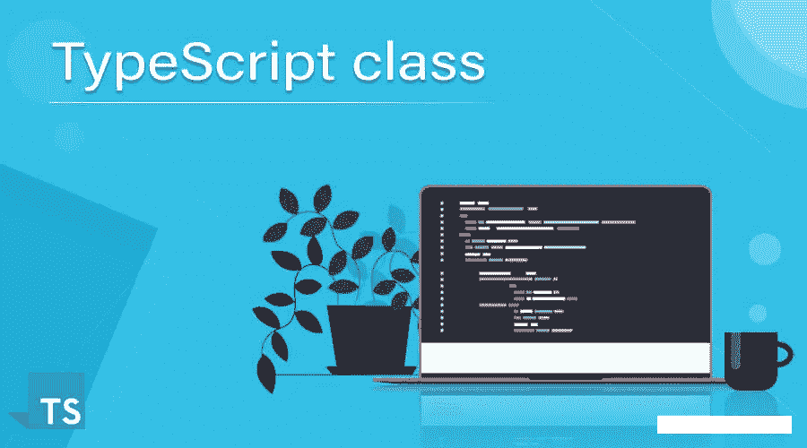

# 类型脚本类——从零到英雄

> 原文：<https://levelup.gitconnected.com/typescript-classes-from-zero-to-hero-a429a3c96189>

本文旨在演示和解释以下问题/概念:

*   Typescript 中的基本类概念及其语法
*   类中的数据修饰符
*   Typescript 中的类继承(子类)
*   Typescript 类中的接口

在我们开始之前，如果你只是一个打字初学者。以下是一些有助于您开始的好资源:

*   打字稿官方手册(阅读材料)
*   [打字稿速成班](https://www.youtube.com/watch?v=BCg4U1FzODs)(视频资料)

TL；DR 代码报告[此处](https://github.com/caopengau/typescript-class-demo)。让我们开始吧…



# Typescript 中的基本概念及其语法

## 阶级的基本概念

类就像对象的蓝图。它们用于定义对象的形状和创建新对象。一个类可以有属性和方法。它们主要用于面向对象的编程语言，如 C#、Java 和 C++。您可能已经使用了 JavaScript 或其他语言的类。类是在 ES6 (ECMAScript 2015)中引入的，在 Typescript 中也可用。

## 语法和用法

现在我们可以在文件`Animal.ts`中创建一个名为`Animal`的基类。Typescript 中的类需要有一些属性，以便我们以后可以使用它们。让我们也`export`我们的类，这样它可以被其他脚本使用。

```
export class Animal {
  name: string;
  age: number;
  species: string;
  move: Function = () => { console.log("moving") }; // default a move function for all animal
  alive: boolean;
} 
```

现在，您可能在访问这个类时遇到了错误

```
Animal.ts:2:3 - error TS2564: Property '...' has no initializer and is not definitely assigned in the constructor.
```

让我们定义构造函数

```
export class Animal {
  name: string;
  age: number;
  species: string;
  move: Function = () => {
    console.log("running");
  };
  alive: boolean = true;
  constructor(
    name: string,
    age: number,
    species: string,
    alive: boolean,
    move?: Function
  ) {
  }
}
```

之后，我们需要设置我们的属性值。我们可以通过使用`this`关键字来做到这一点。

```
export class Animal {
  name: string;
  age: number;
  species: string;
  move: Function = () => {
    console.log("running");
  };
  alive: boolean = true;
  constructor(
    name: string,
    age: number,
    species: string,
    alive: boolean,
    move?: Function
  ) {
    this.name = name;
    this.age = age;
    this.species = species;
    this.alive = alive;
    if (move) this.move = move;
  }
}
```

`this`关键字用于在构造函数中设置我们类的属性值。

创建类后，我们可以创建它的一个新实例。我们可以通过创建一个名为`animal`的新常量或变量，并将其赋给我们类的一个新实例来实现。您可以通过使用`new`关键字来创建我们的类的新实例。

然后，您需要传入在构造函数中传递的相同参数。创建一个文件`main.ts`并尝试用 animal 类创建一个`pet`。

```
import { Animal } from "./Animal";const dogMove = () => {
  console.log("gallopping");
};
const pet = new Animal("Fido", 3, "dog", true, dogMove)
```

> ***注意:*** *当你创建一个我们类的新实例的时候会调用构造函数。*

现在让我们试着打印出我们类的值。

```
import { Animal } from "./Animal";const dogMove = () => {
  console.log("gallopping");
};const pet = new Animal("Fido", 3, "dog", true, dogMove)
console.log(pet)Output:Animal {
  name: 'Fido',
  age: 3,
  species: 'dog',
  alive: true,
  move: [Function (anonymous)]
}
```

您也可以选择要打印的值。

```
console.log(pet.name); // Output: Fidoconsole.log(pet.age); // Output: 3console.log(pet.species); // Output: dogconsole.log(pet.alive); // Output: trueconsole.log(pet.move); // Output: [Function (anonymous)]pet.move(); // Output: gallopping
```

# 类中的数据修饰符

数据修饰符用于定义类属性的访问级别。我们可以将类的属性定义为`public`、`private`或`protected`。

```
export class Animal {
  public name: string; // default access level.
  private age: number; // private access level.
  protected species: string; // protected access level.
  move: Function = () => {  // default access level.
    console.log("running");
  };
  alive: boolean = true;  // default access level.
  constructor(
    name: string,
    age: number,
    species: string,
    alive: boolean,
    move?: Function
  ) {
    this.name = name;
    this.age = age;
    this.species = species;
    this.alive = alive;
    if (move) {
      this.move = move;
    }
  }
}
```

*   `public`:这是默认的访问级别。这意味着可以从代码中的任何地方访问属性/方法。
*   `private`:这意味着属性/方法只能从类内部访问。
*   `protected`:这意味着属性/方法只能从类及其子类中访问。我们将在下一节学习子类。

# 类继承(子类)

子类用于扩展我们的类的功能。我们可以创建一个扩展(继承)现有类的新类。现在我们可以创建一个继承自`Animal`类的子类`Dog`。

```
export class Animal {
  public name: string; // default access level.
  private age: number; // private access level.
  protected species: string; // protected access level.
  move: Function = () => {  // default access level.
    console.log("running");
  };
  alive: boolean = true;  // default access level.
  constructor(
    name: string,
    age: number,
    species: string,
    alive: boolean,
    move?: Function
  ) {
    this.name = name;
    this.age = age;
    this.species = species;
    this.alive = alive;
    if (move) {
      this.move = move;
    }
  }
}// `Dog` class inherits from `Animal` class.
export class Dog extends Animal {
  breed: string; // `breed` an extra property to the `Dog` class.
  constructor(
    name: string,
    age: number,
    species: string,
    alive: boolean,
    breed: string,
    move?: Function
  ) {
    // `super` keyword is used to call the constructor parameters of the parent class.
    super(name, age, species, alive, move);
    // `breed` property is set to the value of `breed` parameter.
    this.breed = breed;
  }
}
```

让我解释一下这里发生了什么。首先，我们创建一个名为`Dog`的新类，它扩展了`Animal`类。然后我们为`Dog`创建一个构造函数，它调用`Animal`类的构造函数。然后我们向`Dog`类添加一个新的属性`breed`。

注意，我们不需要在`Dog`类中定义`Animal`的任何属性。这是因为`Dog`类通过关键字`super`从`Animal`类继承了那些属性。这是一个关键字，用于调用父类的构造函数参数。我们可以使用`super`从`Animal`类中获取`name`、`age`和`species`属性的值。

现在我们可以为我们的 Dog 类创建一个新实例。

```
const dog = new Dog("Fido", 3, "dog", true, "Labrador", dogMove);console.log(dog);Output:Dog {
  move: [Function: dogMove],
  alive: true,
  name: 'Fido',
  age: 3,
  species: 'dog',
  breed: 'Labrador'
}
```

# 阶级遗产

在 TypeScript 中，一个类可以实现接口来执行特定的契约(类似于 Java 和 C#这样的语言)。创建一个`Task.ts`文件

```
// Task.ts
interface Task{
    name: String; //property
    run(arg: any):void; //method
}

class MyTask implements Task{
    name: String;
    constructor(name: String) {
        this.name = name;
    }

    run(arg: any): void {
        console.log(`running: ${this.name}, arg: ${arg}`);
    }
}// main.tsimport { MyTask, Task } from "./Task";let myTask: Task = new MyTask('someTask');
myTask.run("test");// Output: running: someTask, arg: test
```

# 重写类的 toString 方法

```
class Animal {
  ...
  toString(): string {
    return `${this.name} is a ${this.species} and is ${this.age} years old.`;
  };
  ...
};const pet = new Animal("Fido", 3, "dog", true, dogMove);// To string will be called when concatenating strings
// console.log(pet) will not work as expectedconsole.log(`${pet}`) // Output: Fido is a dog and is 3 years old.
```

# 结论

现在您已经了解了 Typescript 中类的基础知识。您可以使用类做许多其他事情，因此您可以到官方文档中了解更多信息。这里可以找到[。如果你忘记了什么，你可以随时回到这篇文章。我建议在你的主项目或副项目中使用类。我希望你喜欢这篇文章！](https://www.typescriptlang.org/docs/handbook/2/classes.html)

## 应该用类代替函数吗？

这是一个在社区中经常被问到的问题，很难找到一个好的答案。我个人认为类更加灵活和易于维护，但是它们需要一些额外的复杂性来设置。我会在更重要的项目中使用类，但是在较小的项目中，函数是一个很好的选择。

## 延伸阅读:

*   [TypeScript 必备基础——类型别名和接口](/typescript-must-know-fundamentals-for-your-next-tech-interview-or-project-255ae70df0a3)
*   [像专家一样使用打字键盘](/use-typescript-keyof-like-a-pro-56f3a3d06b73)
*   [使用类和装饰器的下一级 Typescript 运行时类型验证](/next-level-your-typescript-runtime-type-validation-using-class-and-decorators-ddd2ce3c86f3)
*   [掌握类型脚本泛型:终极指南](/mastering-typescript-generics-the-ultimate-guide-3a62afeff44)
*   [打字技巧和提示:立即成为专业人员](https://bootcamp.uxdesign.cc/typescript-tricks-and-tips-become-a-pro-in-no-time-5390aba151be)
*   [TypeScript 中的泛型——愚蠢简化的基础知识](/generics-in-typescript-must-know-fundamentals-stupidly-simplified-e7b4d7ffc0e3)
*   [Typescript 遗漏了这一点，但你不应该—运行时类型验证](/typescript-missed-this-but-you-shouldnt-runtime-type-validation-aa8a81ce4289)
*   [Typescript 枚举陷阱和解决方案必须知道](/typescript-enum-pitfalls-and-solutions-must-know-bb971cb0f7d2)
*   [掌握类型脚本泛型—终极指南—基本接口技术](https://bootcamp.uxdesign.cc/mastering-typescript-generics-the-ultimate-guide-essential-interface-techniques-86e793cf1fc)
*   Javascript 开发者经常错过的 Typescript 特性
*   [掌握 TypeScript 中的交集和并集类型:终极指南和基本技术](/mastering-intersection-and-union-types-in-typescript-the-ultimate-guide-essential-techniques-49aa9f6a188a)

如果你觉得这个指南有帮助，请鼓掌并跟我来。通过[这个链接](https://medium.com/@caopengau/membership)加入 medium，访问我和所有其他优秀作家在 medium 上的所有优质文章。