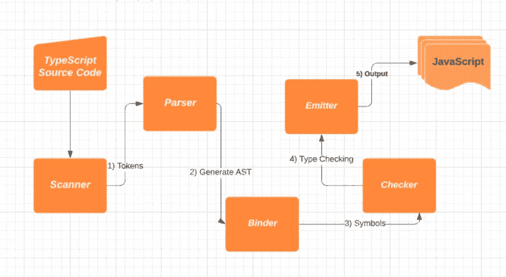
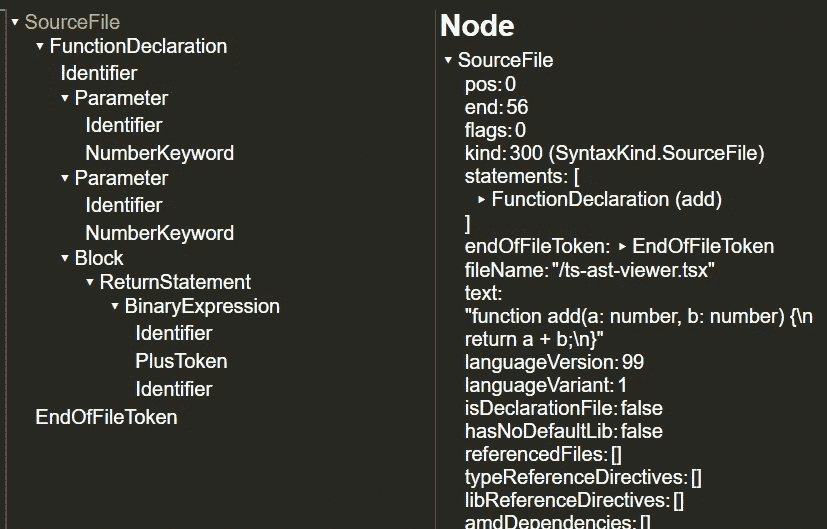

# TypeScript 编译器和编译器 API(第 1 部分)

> 原文：<https://levelup.gitconnected.com/typescript-compiler-and-compiler-api-part-1-4bb0d24a565e>

## 解释了 TypeScript 编译器的内部


[步行者](https://unsplash.com/@walkator?utm_source=unsplash&utm_medium=referral&utm_content=creditCopyText)在 [Unsplash](https://unsplash.com/s/photos/code?utm_source=unsplash&utm_medium=referral&utm_content=creditCopyText) 上拍照

在使用 TypeScript 几年后，我觉得我对这种语言有了很好的理解，只是我不知道编译器内部是如何工作的。

最近，我有机会深入了解这个我知之甚少的领域，并想与你分享我所学到的东西。

了解 TypeScript 编译器和 API 的内部机制可能对你的日常工作没有直接的帮助。然而，如果您需要改进构建管道，或者开发定制工具，这将是非常有价值的。

作为关于 TypeScript 编译器的两篇文章的第 1 部分，我们将讨论 TypeScript 编译器的内部过程。

## 编译器流程概述

TypeScript 编译器将源代码转换成 JavaScript 文件。以下是该过程的概述。

1.  TypeScript scanner 扫描源代码并将其转换为令牌流。
2.  解析器解析令牌流得到 AST ( [抽象语法树](https://en.wikipedia.org/wiki/Abstract_syntax_tree))；
3.  Binder 遍历 AST 并生成一系列符号，并将这些符号连接到相应的节点。
4.  Checker 执行类型检查。这一步需要大部分时间。
5.  Emitter 生成最终输出:基于 AST 的 JavaScript 文件。



编译过程

## 关键组件

以下是编译器源代码的关键部分

*   程序:它是编译器的核心。它在 [program.ts](https://github.com/Microsoft/TypeScript/blob/main/src/compiler/program.ts) 中定义。它由源文件和编译器选项组成。
*   编译器主机:它被程序用来与系统交互
*   系统:编译器用来与操作系统交互的接口。
*   其他子组件:扫描器(`[scanner.ts](https://github.com/Microsoft/TypeScript/blob/main/src/compiler/scanner.ts)`)、解析器(`[parser.ts](https://github.com/gcanti/parser-ts)`)、绑定器(`[binder.ts](https://github.com/microsoft/TypeScript/blob/master/src/compiler/binder.ts)`)、检查器(`[checker.ts](https://github.com/microsoft/TypeScript/blob/main/src/compiler/checker.ts)`)、发射器(`[emitter.ts](https://github.com/Microsoft/TypeScript/blob/master/src/compiler/emitter.ts)`)

## 扫描仪

编译的第一步是[词法分析](https://en.wikipedia.org/wiki/Lexical_analysis)。就是把源代码转换成一系列的令牌，并对每个令牌进行分类。

扫描器的目的是执行词法分析，识别标记以及它们在源文件中的位置。扫描器的主要逻辑是读取输入字符，并在[扫描](https://github.com/Microsoft/TypeScript/blob/94b4f8b79e370020cb31995e8fb0b78f9ba94349/src/compiler/scanner.ts#L1237)方法中模拟 [DFA](https://en.wikipedia.org/wiki/Deterministic_finite_automaton) (确定性有限自动机)。TypeScript 扫描仪源代码是[这里是](https://github.com/Microsoft/TypeScript/blob/94b4f8b79e370020cb31995e8fb0b78f9ba94349/src/compiler/scanner.ts)。

在 CompilerHost 的驱动下，Parser 初始化一个 singleton Scanner 实例，并使用它来获取令牌流。它使用它的解析器函数根据扫描器的输出创建 AST。

## 大西洋时间

如上图“编译流程”所示，流程的关键是

```
Source => tokens => AST => symbols => Type checking => JavaScript
```

AST 是整个过程的核心。AST 就像一棵源代码语法树。这棵树有许多节点。节点包含相关源代码中节点的类型、构造和位置。

为了更好地理解 AST，我们可以使用 [AST 查看器](https://ts-ast-viewer.com/)。对于如下的简单函数

```
function add(a: number, b: number) {
   return a + b;
}
```

AST 树看起来像这样



AST 及其根节点

上面的右侧部分是这个 AST 的根节点。它表示源文件。根包含两个子节点:一个`FunctionDeclaration` 和代表源文件结尾的`EndOfFileToken`。`FunctionDeclaration`包括两个`parameter` 节点和一个`Block` 节点。在 Block 节点内部，有一个包含一个`BinaryExpression`的`ReturnStatement` 。

检查器如何基于 AST 执行类型检查？要回答这个问题，我们首先需要了解 binder 是如何工作的。

## 活页夹和检查器

[*绑定器*](https://github.com/microsoft/TypeScript/blob/main/src/compiler/binder.ts) 横向绑定一个 AST，并为每个节点创建一个符号。

```
AST => Binder => Symbols+AST => Checker => Type checking
```

符号是语义系统的基石。它是命名声明，将 AST 中的声明节点连接到构成同一实体的其他声明。

符号有两个重要属性:

*   `members`:类、接口或文字实例成员
*   `exports`:模块导出

有了来自`members` 和`exports`的信息，我们将能够用它的符号识别一个类实例或模块。

Binder 创建符号后，检查器使用符号和 AST 来检查给定代码的语义。

checker 是一个有 20，000 多行代码的程序。这表明处理类型检查有多复杂。毫不奇怪，类型检查是整个过程中最耗时的步骤。

## 发射器

发射器可以发出 JavaScript 文件或类型定义文件。当被`Program`调用时，最终输出(很可能是 JavaScript 文件)由`emit` 函数生成。

```
AST + Checker => emitter => JS
```

以上概述只是触及了 TypeScript 编译器的皮毛。如果你有兴趣了解更多，我推荐你读一读《打字稿深潜》这本书。

## 摘要

现在我们对 TypeScript 编译器的内部过程有了基本的了解。

编译器内部的知识是有用的。我们可以在 AST 之上开发一个定制的 linter，或者静态分析工具。这类工具的一个很好的例子是 VSCode 使用的语言服务器。

TypeScript 提供的另一个强大工具是编译器 API。它公开了一个丰富的 API，允许我们与 TypeScript 交互。如果需要的话，我们可以用它来构建一个定制的编译器。

在第二部分中，我们将讨论语言服务器，以及如何利用 TypeScript 编译器 API。