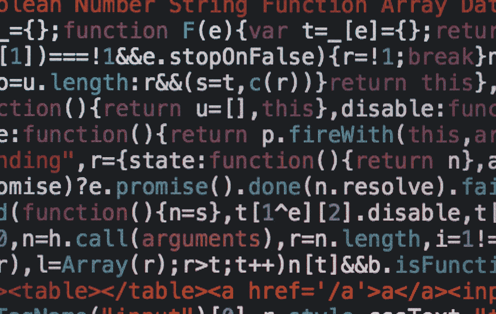
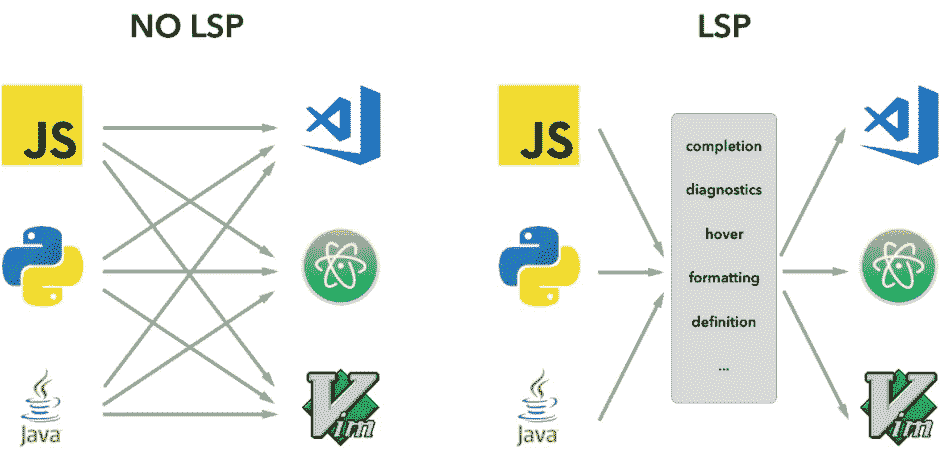
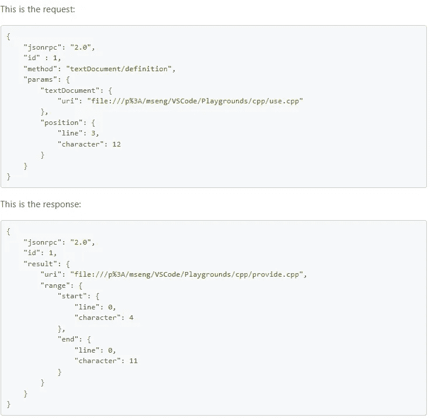
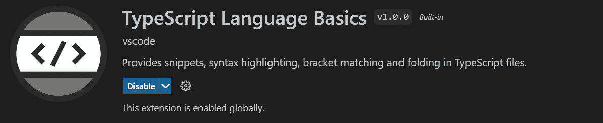
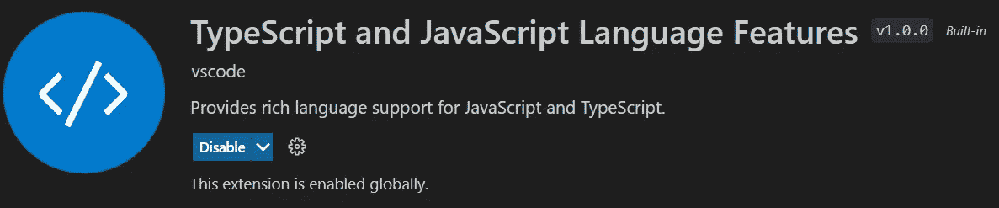
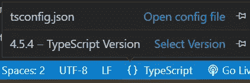
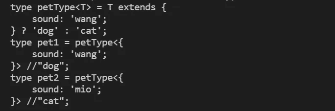

# 类型脚本编译器和编译器 API(第 2 部分)

> 原文：<https://levelup.gitconnected.com/typescript-compiler-and-compiler-api-part-2-c71f90a1b313>

## 介绍语言服务器服务和编译器 API



由[马库斯·斯皮斯克](https://unsplash.com/@markusspiske?utm_source=unsplash&utm_medium=referral&utm_content=creditCopyText)在 [Unsplash](https://unsplash.com/s/photos/code?utm_source=unsplash&utm_medium=referral&utm_content=creditCopyText) 上拍摄的照片

在文章的第 1 部分[中，我们讨论了 TypeScript 编译器的内部过程。](https://medium.com/gitconnected/typescript-compiler-and-compiler-api-part-1-4bb0d24a565e)

利用从第 1 部分学到的知识，让我们看看 TypeScript 编译器 API 的更实际的用法。在第 2 部分中，我们将讨论语言服务器服务以及 VSCode 如何使用它。我们还将带着示例浏览 TypeScript 编译器 API。

## 语言服务器服务

语言服务器协议(LSP)最初是由微软在 2015 年开发的，作为一种通信标准，在 VS 代码中提供自动完成、代码导航等语言支持功能。它旨在以分散的方式公开语言支持服务。

在 LSP 之前，语言支持特性是在每个 IDE 中单独实现的。这种方法会导致重复劳动、性能低下和维护问题。



来源:[**https://code.visualstudio.com/**](https://code.visualstudio.com/)

通过 LSP，语言服务标准化了语言工具和 IDE 之间的通信。它可以用任何语言实现，并在自己的进程中运行，以避免性能成本。任何实现 LSP 的 IDE 都可以从中受益。

LSP 定义了客户端和服务器之间的通信协议。客户端通常是一个 IDE 插件，而服务器作为一个单独的进程运行。客户端和服务器使用 [JSON-RPC](https://en.wikipedia.org/wiki/JSON-RPC#:~:text=JSON%2DRPC%20is%20a%20remote%20procedure%20call%20protocol%20encoded%20in%20JSON.&text=JSON%2DRPC%20allows%20for%20notifications,which%20may%20be%20answered%20asynchronously.) 协议进行通信。示例请求和响应消息如下所示。



来源:[https://Microsoft . github . io//language-server-protocol/overviews/LSP/overview/](https://microsoft.github.io//language-server-protocol/overviews/lsp/overview/)

## LSP 和 VSCode

在 VSCode 中，通过内置的 TypeScript 插件提供现成的 TypeScript 语言支持。语法高亮特性是通过`TypeScript Language Basics`插件提供的。



智能感知特性是由`TypeScript and JS language features` 插件提供的。



这两个插件都利用语言服务器来提供这些特性。该插件监听 VSCode 事件，通过 LSP 调用语言服务器，并将结果发送回 VSCode。

VSCode 中的 TypeScript 语言服务器称为独立服务器(tsserver.js)。独立服务器侦听从客户端(插件)发送的消息，并将消息发送到 typescript-core 进行处理。

VS 代码附带了 TypeScript 语言服务的最新稳定版本。它可以是与工作区 TypeScript 版本(在 package.json 中定义)不同的版本。如果您点击屏幕底部状态栏上的“TypeScript ”,将会显示一个弹出窗口，允许您在两个版本之间切换。



当类型脚本版本不同时

## 编译器 API

TypeScript 编译器 API 是一块隐藏的宝石。编译器 API 公开了极其强大的工具来以编程方式处理 TypeScript 代码，并使构建自动化工具或创建您自己的自定义 linter 变得简单明了。

要开始使用编译器 API，您需要安装“typescript”模块。

```
npm install -g typescript
npm install -D @types/node
```

正如文章的[第 1 部分所解释的，编译器 API 的几个关键概念是:](/typescript-compiler-and-compiler-api-part-1-4bb0d24a565e)

*   Program:表示应用程序，它包含所有源文件和类型定义文件。
*   源文件:包含源代码文本的表示，我们也可以从中提取抽象语法树(AST)。
*   CompilerHost:代表操作系统，使用 API 访问外部资源，即读取文件。
*   TypeChecker:从 AST 中的节点提取类型信息。

在[官方维基页面](https://github.com/microsoft/TypeScript/wiki/Using-the-Compiler-API)上，有许多例子说明了 API 提供的丰富特性。

为了对编译器 API 有一个基本的了解，下面显示了几个简单的任务。

**从代码**中获取源文件

```
import * as ts from "typescript";const filename = "test.ts";
const code = `console.log('hello');`;
const sourceFile = ts.createSourceFile(
   filename, code, ts.ScriptTarget.Latest
);
```

**从源文件中获取程序**

```
const defaultCompilerHost = ts.createCompilerHost({});
const program = ts.createProgram(
   ["test.ts"], {}, defaultCompilerHost
);
```

在编译器 API 中，转换器 API 是最强大的工具之一。让我们来看看如何使用它。

## 使用编译器转换器 API 修改源代码

Transformer API 允许开发人员将 ts 文件转换为 js 文件。它还可以在编译时操作源代码。

转换器 API 的核心是`TransformerFactory` 和`transformer` 类型。`Transformer`类型只是一个接受`Node`并返回`Node`的函数。`TransformerFactory` 返回一个`Transformer`回调。

```
export type TransformerFactory<T extends Node> = (context: TransformationContext) => Transformer<T>;export type Transformer<T extends Node> = (node: T) => T;
```

这里我们用一个虚构的例子来说明 transformer API 的用法。在下面的源文件中，我们有一个条件类型`petType`。我们还基于`petType`衍生了两种类型。我们的目标是推断类型值，并使用 transformer API 添加到后面的注释中。

```
// test.ts
type petType<T> = T extends { sound: 'wang' } ? 'dog': 'cat';type pet1 = petType<{ sound: 'wang' }>;
type pet2 = petType<{ sound: 'mio' }>;
```

首先，让我们定义一个`TransformerFactory`如下。

变压器功能的要点是:

*   `ts.visitNode(node, visitor)` -用于访问根节点，即`SourceFile`
*   `ts.visitEachChild(node, visitor, context)` -用于访问节点的每个子节点
*   我们将上下文传递给`TransformerFactory`函数，并返回源文件。
*   `visit` 函数被定义为遍历源文件 AST 的每个节点

在 visit 函数中，我们添加了以下逻辑来推断类型值

请注意，`typeCheker` 用于检索节点的类型，然后我们使用`addSyntheticTrailingComment` 添加尾部注释。

完整的源代码

下面的输出显示了添加了正确推断类型的尾部注释。



## 摘要

在本文中，我们介绍了语言服务和 TypeScript 编译器 API。我们还通过一个虚构的例子来演示 transformer API。

虽然它只是触及了 TypeScript 编译器 API 的表面，但我希望它能激发您的兴趣，进一步探索它并将其应用到您的工作中。

*如果您还不是 Medium 的付费会员，* [***您可以访问此链接***](https://sunnysun-5694.medium.com/membership) *。你可以无限制地阅读媒体上的所有报道。我会收你一部分会员费作为介绍费。*