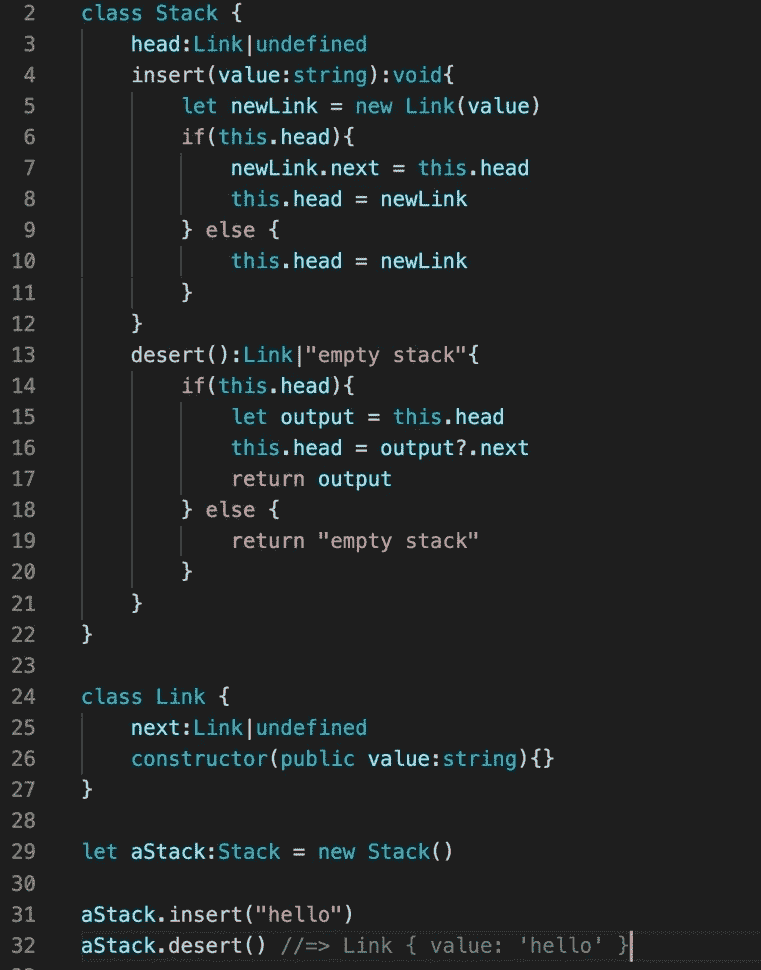

# 打字稿:10 分钟数据结构。

> 原文：<https://levelup.gitconnected.com/typescript-data-structures-in-10-minutes-4cd785272ad0>


什么是数据结构？它们有多种方式来构造对象，以实现多种时间效率。

选择一种编程语言，取其最简单的 *key:value* object，用不同的方式连接它们以获得不同的效率。

# 排列

大多数现代语言允许我们用你能想象到的最直接的方式来表达这些。这是一个如此广泛使用的结构，以至于几乎每个人都将它识别为括号中的一些逗号分隔值。


在许多动态语言中，一切都是底层的对象。另一种看待数组的方式是把数组看作是一些具有严格有序值的对象。


这些本质上是一回事。

## 数组运算

*   插入— O(n)
*   删除— O(n)
*   读取一个值— O(1)
*   搜索某个值— O(n)

如果您对这种结构有一个较低层次的了解，您就可以猜测任何给定操作的效率。以 insert 为例。如果我们在索引 2 上放一些新的东西，那么现有的索引 2 会放在哪里呢？数组的唯一规则是它是一个严格有序的列表。为了使数组避免在索引 2 处有两个项目，它必须将索引 2 处的旧值向下移动到索引 3。那么旧的索引 3 必须向下移动到索引 4。

这就是为什么插入和删除的复杂度为 O(n)(最坏的情况下)

严格顺序的好处是允许我们的条目查找总是为 O(1)。

# 元组

元组和数组是一样的，除了它通常是不可变的。(不变性的严重程度因语言而异。)

元组的长度不能更改。我们在创建时定义它的长度(通常是值)。如果不替换其中一个现有值或者用更大的元组替换整个元组，就无法插入和删除值。

元组是最常用的数据库字段，通常可以通过将第零个值作为占位符放在删除发生的位置来处理删除操作。因此，删除和插入在理想情况下可能是 O(1 ),但在非理想情况下可能比 O(n)更差。否则，读取一个值总是 O(1)。


# [数]矩阵

矩阵是数组或元组，只是子值也是数组或元组。

一般来说，矩阵通常是元组，因为我们不想在对矩阵进行变异时，以一些令人憎恶的东西结束。


矩阵具有与元组或数组相同的操作复杂性，除了任何给定值的开销通常更高。

有趣的是，我们可以根据需要将矩阵做成多维的，并且仍然可以获得恒定的时间访问。

```
let ahumbleMatrix = [[[["hello"],[],[],[]],[[],[],[],[]],[[],[],[],[]],[[],[],[],[]]], [[[],[],[],[]],[[],[],[],[]],[[],[],[],[]],[[],[],[],[]]], [[[],[],[],[]],[[],[],[],[]],[[],[],[],[]],[[],[],[],[]]], [[[],[],[],[]],[[],[],[],[]],[[],[],[],[]],[[],[],[],[]]], [[[],[],[],[]],[[],[],[],[]],[[],[],[],[]],[[],[],[],[]]]]
```

例如，我们仍然可以通过串起我们的分支，在恒定的时间内访问这个第四维矩阵中的“你好”。这使得矩阵成为无数基于网格或 3d 建模应用的理想结构。(如国际象棋或 3d 图形)

```
ahumbleMatrix[0][0][0][0] //=> hello
```

# 单向链表

单链表类似于数组，只是值没有严格的索引。它们的结构是严格的，但仅由顺序链接定义。

最常见的是，这被实现为一个对象列表，该列表引用行中的下一个对象。


通常，我们会实现这个结构来盲目地添加新的对象，这样我们就不必显式地列出所有的链接，但是我这样做是为了让你能清楚地看到这个结构是如何工作的。

每个链接都是一个对象，具有引用下一个对象的某种属性。

对于正常实现，我们没有任何引用任何特定对象的特殊键，因此访问时间在最坏的情况下是多项式 O(n)。

然而，由于我们没有为每个对象建立严格的索引，所以我们可以在固定的时间内对引用进行插入和删除。

## 单链表操作

*   插入— O(1)
*   delete-O(1)(如果我们已经知道要删除的值在哪里)否则最坏的情况是 O(n)
*   读取一个值— O(n)(最坏的情况)
*   搜索某个值— O(n)(最坏的情况)

# 循环链表

它类似于链表，只是尾部会引用头部而不是 undefined。因此，it 的运营效率或多或少是相同的，只是略有差异。

## 循环链表操作

*   插入— O(1)
*   delete-O(1)(如果我们已经知道要删除的值在哪里)否则最坏的情况是 O(n)
*   在特定位置读取一个值— O(n)(最坏的情况)
*   搜索某个值— O(n)(最坏的情况)

# 双向链表

它类似于单链表，只是它通过在两个方向上顺序引用来维护结构。


再说一次，我这样写纯粹是出于教育目的。这个特殊的片段甚至不能运行，但是它向我们展示了双向链表是如何工作的。

循环双向链表中的每个对象都将引用它的前一个和后一个对象。

为了在实践中实现这一点，您将不得不创建一个函数来盲目地附加链接，而不是像我在这里所做的那样显式地定义每个链接。

## 循环双向链表操作

*   插入— O(1)
*   delete-O(1)(如果我们已经知道要删除的值在哪里)否则最坏的情况是 O(n)
*   在特定位置读取一个值——O(n )(在最坏的情况下，但平均比单链表快)
*   搜索某个值— O(n)(在最坏的情况下，但平均比单链表快)

# 堆

与列表类似，堆栈是一个顺序的对象列表，其中每个对象都引用下一个对象。区别在于栈总是在列表的最前面插入和丢弃。堆栈以“先进后出”为基础运行。

事实上，每个栈都是一个链表，但不是所有的链表都是栈。堆栈是列表的一个子类型。



## 堆栈操作

*   插入— O(1)
*   pop — O(1)
*   找到 O(n)的某个特定值(最坏的情况)

# 长队

像栈一样，所有的队列都是链表，但不是所有的链表都是队列。队列是链表的一个子类型。

同样，这是一个链表，除了插入总是发生在头部，丢弃总是发生在尾部。这是一种“先进先出”的结构。


## 队列操作

*   插入— O(1)
*   pop — O(1)
*   找到 O(n)的某个特定值(最坏的情况)

# 二叉树

二叉树只是一个有额外步骤的列表。想象一个链表，除了每个链接都分支到另外两个链接。树有各种各样的形状、大小和计算效率。你可能永远也不会被问到关于其他树的问题，除非你正在做一些疯狂的学术项目，或者如果你试图建立一个新的 DBMS，但是我认为无论如何阅读它们都是一个好的实践。

他们最终看起来像这样


此外，树是挑剔的结构，可以根据插入或弹出的值发生变化。二叉树有可能变异成链表。一些树的变体没有已知的方法，可以在没有显著变化的情况下插入和弹出，但是我离题了。

大多数频繁变异的树必须定期重组以保持平衡。

制作二叉树最典型的方法是用一个数字键或数值来定义它在树中的位置。在每个根，它将根据要放置的值向左或向右路由。


现在，你可能会问我，“我如何从二叉树中删除一个节点？

这是一个非常好的问题。如果你在谷歌上搜索“如何从二叉树中删除一个节点”,你会找到一大堆没有提供该操作代码的文章。

为什么？你猜对了。是因为人懒，删除动作只是复杂到在实现上造成了“努力”障碍。大多数爱好者至少知道如何在理论上做到这一点，但他们不想去额外的一英里。

我就是那些人中的一个。

这就是如何从二叉树中删除

[https://www . geeks forgeeks . org/binary-search-tree-set-2-delete/](https://www.geeksforgeeks.org/binary-search-tree-set-2-delete/)

一棵树的美丽在于每一个动作都会将它的结构一分为二。

## 二叉树操作

*   插入-O(日志号)
*   delete-O(log n)(最好的情况下，是 2(log n))
*   搜索— O(登录号)

# 图表

图是有额外步骤的树。图形可以是列表或树。把图想象成一个大的范畴，我们可以在其中定义任意数量的结构。事物的定义更加宽泛，形状更加自由。矩阵可以是图形。您可以用图形实现网格。一切皆有可能。

想象一个二叉树，除了任何给定的节点可以有任何数量的子节点，并且任何子节点可以连接到任何其他节点。


描述这种结构的另一种方式是说有几个 b 树在它们的根部相连。(b 树和二叉树是一样的，除了它在每一层可以有任意数量的子树。)

为了保持我们的优雅，我们应该理所当然地称之为图表。


这是能想象到的最简单、最无用的图表，但它确实是一个图表。这就是我们制造一个的容易程度。消除所有的威胁。

## 图形操作

*   insert —最好为 O(1)，最坏为 O(n)(平均来说更接近 O(1))
*   delete —最好为 O(1)，最坏为 O(n)(平均来说更接近 O(1))
*   搜索—(很大程度上取决于图的结构和用于搜索它的算法，但通常情况下，您最多可以搜索到 O(log n ),最差可以搜索到 O(n)。)

# 结论

是的，我知道我应该用大ω和大θ来区分最好和最坏的时间复杂度。原谅我，我试着快速简单。

这就是我今天要讲的，谢谢大家。

有时候我会做一些轻松的日志。请检查他们！祝你愉快。

[**制作一个看起来像是大人设计的个人网站**](https://medium.com/dev-genius/make-a-personal-website-that-looks-like-it-was-designed-by-an-adult-a02d7262002e)

[**做一个侮辱我的 rust API**](/make-a-rust-api-that-insults-me-3cac9db8c2bd)

[**今天切换到打字稿**](/make-the-switch-to-typescript-today-b22c1b8d8f84)

[**为任何函数键入签名**](/typescript-type-signatures-for-any-function-c21a22596d1c)

[**你的网站看起来应该像脸书**](/there-is-a-reason-why-your-website-should-look-like-facebook-kickstarter-linkedin-etc-87db4459a94a) 是有原因的