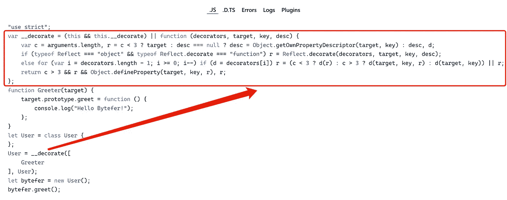

# 6 分钟内打字稿装饰工

> 原文：<https://levelup.gitconnected.com/typescript-decorators-in-6-minutes-daa9660f8286>

## 原来 TypeScript 的装修工并不难，一篇文章让你掌握 4 类装修工！


克里斯托弗·高尔在 [Unsplash](https://unsplash.com?utm_source=medium&utm_medium=referral) 上拍摄的照片

欢迎来到**掌握打字稿**系列。本系列将以动画的形式介绍 TypeScript 的核心知识和技术。让我们一起学习吧！以前的文章如下:

*   [**不再混淆 TypeScript 的类型和接口**](https://javascript.plainenglish.io/no-more-confusion-about-typescripts-type-and-interface-63c39418ae35)
*   [**使用 TypeScript 像 Pro 一样映射类型**](https://javascript.plainenglish.io/using-typescript-mapped-types-like-a-pro-be10aef5511a)
*   [**使用 TypeScript 条件类型像亲**](https://javascript.plainenglish.io/use-typescript-conditional-types-like-a-pro-7baea0ad05c5)
*   [**使用 TypeScript 交集类型像亲**](https://javascript.plainenglish.io/using-typescript-intersection-types-like-a-pro-a55da6a6a5f7)
*   [**使用打字稿推断像亲**](/using-typescript-infer-like-a-pro-f30ab8ab41c7)

如果你用过 Angular 或者 Nest.js，应该对 decorators 比较熟悉。

```
import { Controller, Get } from '@nestjs/common';

@Controller('cats')
export class CatsController {
  @Get()
  findAll(): string {
    return 'This action returns all cats';
  }
}
```

在上面的代码中`@XXX`是语法糖，要启用实验装饰器特性你必须在命令行或`tsconfig.json`文件中启用`experimentalDecorators`编译器选项。

```
{
  "compilerOptions": {
     "target": "es2016",
     "experimentalDecorators": true
   }
}
```

有四种主要类型的装饰者:

*   类装饰者
*   物业装饰
*   方法装饰者
*   参数装饰器

接下来，我将分别介绍这 4 类装修工。

# 类装饰者

类装饰者，顾名思义，习惯于装饰类。对应于类装饰器的类型在`lib.es5.d.ts`文件中定义:

```
// node_modules/typescript/lib/lib.es5.d.ts
declare type ClassDecorator = <TFunction extends Function>
  (target: TFunction) => TFunction | void;
```

从类装饰器的类型定义中可以看出，它接收一个表示要装饰的类的参数。根据类装饰器的定义，我们可以创建一个`Greeter`装饰器来给装饰后的类添加一个`greet`方法:

```
// user.ts
function Greeter(target: Function): void {
  target.prototype.greet = function (): void {
    console.log("Hello Bytefer!");
  };
}

@Greeter
class User {}

let bytefer = new User();
(bytefer as any).greet();
```

当您成功运行上述代码时，终端将输出结果— `Hello Bytefer!`。类装饰器看起来很简单，但现在问题来了。如果想自定义`greet`方法的输出，应该怎么做？为了满足这个功能，我们需要使用**装饰工厂**。

# 装饰工厂

所谓装饰工厂，就是在被调用后，返回装饰器。利用高阶函数的特性，让我们更新前面定义的`Greeter`函数:

```
function Greeter(msg: string) {
   return (target: Function): void => {
    target.prototype.greet = function (): void {
        console.log(msg);
    };
   }
}
```

更新完`Greeter`装饰工厂后，我们需要以如下方式使用它:

```
@Greeter("Hello TypeScript!")
class User {}

let bytefer = new User();
(bytefer as any).greet();
```

当您成功运行上述代码时，终端将输出结果— `Hello TypeScript!`。**需要注意的是，我们可以为同一个类使用多个类装饰器。**例如，在下面的代码中，我添加了一个`Log`类装饰器:

```
function Log(target: Function): void {
  target.prototype.log = (msg: string) => {
    console.log(`From ${target.name}: `, msg);
  };
}

@Log
@Greeter("Hello TypeScript!")
class User {}

let bytefer = new User();
(bytefer as any).greet();
(bytefer as any).log("Hello Kakuqo!");
```

在上面的代码中，我们向`User`类添加了 2 个装饰器，之后，我们可以调用`User`实例上的`greet`和`log`方法。

```
Hello TypeScript!
From User:  Hello Kakuqo!
```

# 物业装饰

属性装饰器习惯于装饰类的属性。其对应的类型声明如下:

```
// node_modules/typescript/lib/lib.es5.d.ts
declare type PropertyDecorator = 
 (target: Object, propertyKey: string | symbol) => void;
```

属性装饰函数有两个参数:`target`和`property`。根据 property decorator 的定义，让我们定义一个 property decorator `logProperty`来跟踪用户对一个属性的操作。

```
function logProperty(target: any, key: string) {
  let value = target[key];

  const getter = function () {
    console.log(`Getter for ${key} returned ${value}`);
    return value;
  };

  const setter = function (newVal: any) {
    console.log(`Set ${key} to ${newVal}`);
    value = newVal;
  };

  // Replace the property
  if (delete target[key]) {
    Object.defineProperty(target, key, {
      get: getter,
      set: setter,
      enumerable: true,
      configurable: true,
    });
  }
}
```

一旦我们有了`logProperty`属性装饰器，我们就可以将它应用到类的属性上。例如，我在`User`类的`name`属性上使用了`logProperty`装饰器:

```
class User {
  @logProperty
  public name: string;

  constructor(name: string) {
    this.name = name;
  }
}

const user = new User("Bytefer");
user.name = "Kakuqo";
console.log(user.name);
```

当您成功运行上述代码时，终端将输出结果:

```
Set name to Bytefer
Set name to Kakuqo
Getter for name returned Kakuqo
Kakuqo
```

除了能够修饰类的属性，我们还可以修饰类的方法。

# 方法装饰者

方法装饰者习惯于装饰类的方法。其对应的类型声明如下:

```
// node_modules/typescript/lib/lib.es5.d.ts
declare type MethodDecorator = <T>(
  target: Object, 
  propertyKey: string | symbol, 
  descriptor: TypedPropertyDescriptor<T>
) => TypedPropertyDescriptor<T> | void;
```

与属性装饰器相比，方法装饰器多了一个描述符参数。参数的类型如下:

```
interface TypedPropertyDescriptor<T> {
    enumerable?: boolean;
    configurable?: boolean;
    writable?: boolean;
    value?: T;
    get?: () => T;
    set?: (value: T) => void;
}
```

如果不需要使用泛型，也可以使用`PropertyDescriptor`接口:

```
interface PropertyDescriptor {
    configurable?: boolean;
    enumerable?: boolean;
    value?: any;
    writable?: boolean;
    get?(): any;
    set?(v: any): void;
}
```

根据方法装饰器的定义，让我们定义一个方法装饰器`logMethod`来跟踪类成员方法的调用。

```
function logMethod(
  target: Object,
  propertyKey: string,
  descriptor: PropertyDescriptor
) {
  let originalMethod = descriptor.value;
  descriptor.value = function (...args: any[]) {
    console.log(`Before invoking method: ${propertyKey}`);
    let result = originalMethod.apply(this, args);
    console.log(`After invoking method: ${propertyKey}`);
    return result;
  };
}
```

一旦我们有了`logMethod`方法装饰器，我们就可以将它应用到类的成员方法上。例如，我在`User`类的`greet`成员方法上使用了`logMethod`装饰器:

```
class User {
  @logMethod
  greet(msg: string): string {
    return `Hello ${msg}!`;
  }
}

let user = new User();
let msg = user.greet("Bytefer");
console.log(msg);
```

当您成功运行上述代码时，终端将输出结果:

```
Before invoking method: greet
After invoking method: greet
Hello Bytefer!
```

掌握了方法装饰器之后，我们就可以定义一些有用的方法装饰器了。如`delay`、`throttle`等。

**延迟**

```
function delay(milliseconds: number = 0): any {
  return function(target: any, propertyKey: string, descriptor: PropertyDescriptor) {
    const originalMethod = descriptor.value;

    descriptor.value = function(...args) {
      setTimeout(() => {
        originalMethod.apply(this, args);
      }, milliseconds);
    };
    return descriptor;
  };
}
```

**油门**

```
const throttleFn = require('lodash.throttle');

function throttle(milliseconds: number = 0, options = {}): any {
  return function(target: any, propertyKey: string, descriptor: PropertyDescriptor) {
    const originalMethod = descriptor.value;
    descriptor.value = throttleFn(originalMethod, milliseconds, options);
    return descriptor;
  };
}
```

最后，我们来介绍一下参数装饰器。

# 参数装饰器

参数装饰器习惯于在方法中装饰参数。其对应的类型声明如下:

```
// node_modules/typescript/lib/lib.es5.d.ts
declare type ParameterDecorator = (
 target: Object, 
 propertyKey: string | symbol, 
 parameterIndex: number) => void;
```

根据参数装饰器的定义，我们来定义一个方法装饰器`logParameter`:

```
function logParameter(target: Object, key: string, parameterIndex: number) {
  console.log(`The parameter in position ${parameterIndex} at ${key} has been decorated`);
}
```

有了`logParameter`装饰器，我们将它应用于`User`类中`greet`方法的 msg 参数:

```
class User {
  greet(@logParameter msg: string): void {
    console.log(msg);
  }
}

let user = new User();
user.greet("Bytefer");
```

当您成功运行上述代码时，终端将输出结果:

```
The parameter in position 0 at greet has been decorated
Bytefer
```

现在已经介绍了 4 个 decorator，如果想知道 decorator 是如何工作的，可以使用[**TypeScript Playground**](https://www.typescriptlang.org/play?#code/GYVwdgxgLglg9mABAcQE4FN1XagFFAQ1QHMsAuRAMXGnjAEoKA3OGAE0QG8AoRRQklgB0AB1RwoEgJ4j0Q4hiyIAvIlCRYCRLkaIW7Lrz6IICAM5wANnMtxiuAEQAJdJduIAQlOzAcAQgd6AG4jAF8Q0O5uAAE0TGxUbghLAjMzRABVMxwuSO5rKEQAI290X1QVRDB0AHdM7Lxg7lwSnxzUxAIwKXp5RSgdIKA)查看编译好的 JavaScript 代码。



在开发 decorators 时，我们通常也会使用[**reflect-metadata**](https://github.com/rbuckton/reflect-metadata)库来处理元信息。比如开发一个 **IoC** 容器或者扩展一个 web 框架的功能。如果你想了解更多关于 decorator 的知识，我推荐你连夜阅读[](https://github.com/seanpmaxwell/overnight)**项目的源代码(TypeScript decorator for the express js Server。)，比 Nest.js 框架更容易理解。**

**如果你喜欢学习 TypeScript，可以在 [Medium](https://medium.com/@bytefer) 或者 [Twitter](https://twitter.com/Tbytefer) 上关注我，阅读更多关于 TS 和 JS 的内容！**

**

[Bytefer](https://medium.com/@bytefer?source=post_page-----daa9660f8286--------------------------------)** 

## **掌握打字稿系列**

**[View list](https://medium.com/@bytefer/list/mastering-typescript-series-688ee7c12807?source=post_page-----daa9660f8286--------------------------------)****46 stories**************