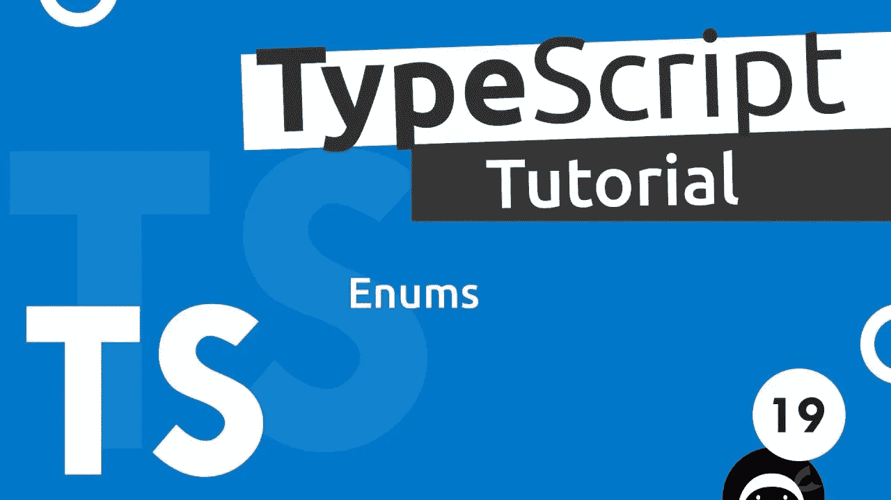

# Typescript 枚举陷阱和解决方案必须知道

> 原文：<https://levelup.gitconnected.com/typescript-enum-pitfalls-and-solutions-must-know-bb971cb0f7d2>

本文旨在演示 Typescript 枚举的当前问题，并推荐其正确用法/替代方法。



# 问题是

假设我们有一个只定义了键的基本枚举`Status`。

```
enum Status {
  NotStarted,
  InProgress,
  Done,
}
```

## 当前的行为

它输出一个奇怪的对象，并拖入了额外的内容。

```
console.log(status) // output below
// {
//   '0': 'NotStarted',
//   '1': 'InProgress',
//   '2': 'Done',
//   NotStarted: 0,
//   InProgress: 1,
//   Done: 2
// }
```

如果我们想看到每个枚举值，这就是它

```
console.log(Status.NotStarted); // 0
console.log(Status.InProgress); // 1
console.log(Status.Done); // 2

// not intuitive but getting the keys by indexing with the numeric value
console.log(Status[0]) // NotStarted
console.log(Status[1]) // InProgress
console.log(Status[2]) // Done
```

## 冒险的改变

然后一个新的需求进来了，我们想要添加一个新的状态`InReview`。如果我们只是将它添加到错误的位置，问题就出现了，这很容易发生。

```
enum Status {
  NotStarted,
  InProgress,
  InReview,
  Done,
}
console.log(Status.InReview); // this is 2
console.log(Status.Done); // 3 which is not 2 any more, a breaking change
```

# 解决方案

## **1。实施开发实践**

为了避免弄乱枚举值
的内部索引/编号，只在末尾添加新值，但是这样做，我们失去了按照我们喜欢的顺序对枚举值进行排序的能力(在这种情况下，not started->in progress->in review->Done 对许多进程来说看起来很直观和自然)

```
enum Status {
  NotStarted,
  InProgress,
  Done,
  InReview,
}
```

## 2.将枚举定义为键值对

```
enum Status {
  NotStarted = 'NotStarted',
  InProgress = 'InProgress',
  Done = 'Done',
}
console.log(Status.NotStarted); // NotStarted
console.log(Status.InProgress); // InProgress
console.log(Status.Done); // Done
```

这种做法似乎很常见，以复制代码的轻微代价解决了问题。

## 3.使用联合

```
type Status = 'NotStarted' | 'InProgress' | 'Done';
```

## 延伸阅读:

*   [TypeScript 必备基础知识—类型别名和接口](/typescript-must-know-fundamentals-for-your-next-tech-interview-or-project-255ae70df0a3)
*   [像专业人士一样使用 Typescript keyof】](/use-typescript-keyof-like-a-pro-56f3a3d06b73)
*   [打字稿类——从零到英雄](/typescript-classes-from-zero-to-hero-a429a3c96189)
*   [使用类和装饰器的下一级 Typescript 运行时类型验证](/next-level-your-typescript-runtime-type-validation-using-class-and-decorators-ddd2ce3c86f3)
*   [掌握类型脚本泛型:终极指南](/mastering-typescript-generics-the-ultimate-guide-3a62afeff44)
*   [打字技巧和提示:立即成为专业人士](https://bootcamp.uxdesign.cc/typescript-tricks-and-tips-become-a-pro-in-no-time-5390aba151be)
*   [TypeScript 中的泛型——愚蠢简化的基础知识](/generics-in-typescript-must-know-fundamentals-stupidly-simplified-e7b4d7ffc0e3)
*   [Typescript 遗漏了这一点，但你不应该—运行时类型验证](/typescript-missed-this-but-you-shouldnt-runtime-type-validation-aa8a81ce4289)
*   [Typescript 枚举陷阱和解决方案必须知道](/typescript-enum-pitfalls-and-solutions-must-know-bb971cb0f7d2)
*   [掌握类型脚本泛型—终极指南—基本接口技术](https://bootcamp.uxdesign.cc/mastering-typescript-generics-the-ultimate-guide-essential-interface-techniques-86e793cf1fc)
*   【Javascript 开发者经常忽略的 Typescript 特性
*   [掌握打字稿中的交集和并集类型:终极指南和基本技巧](/mastering-intersection-and-union-types-in-typescript-the-ultimate-guide-essential-techniques-49aa9f6a188a)

如果你觉得这个指南有帮助，请鼓掌并跟我来。通过[链接](https://medium.com/@caopengau/membership)加入 medium，获取我和所有其他优秀作家在 medium 上发表的所有优质文章。