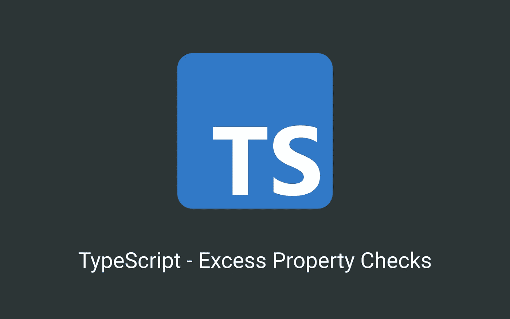

# TypeScript —超额属性检查

> 原文：<https://levelup.gitconnected.com/typescript-excess-property-checks-6ffe5584f450>

## 了解 TypeScript 的核心原则之一——多余属性检查。



TypeScript 的核心原则之一是它是一个*结构类型系统*。简而言之，只要你提供一个具有所需属性的类型，TypeScript 就可以拥有额外的属性，让我们来看一个例子:

但是当我们试图直接给对象赋值时:

我们得到以下(有点令人惊讶的)错误:

```
Type ‘{ x: number; y: number; meaningOfLife: number; }’ is not assignable to type ‘Point’.
Object literal may only specify known properties, and ‘meaningOfLife’ does not exist in type ‘Point’.
```

当 TypeScript 在赋值中遇到 object literal 或者作为参数传递给函数时，它会触发一个叫做**超额属性检查的动作。**

与结构类型相反，它检查对象是否具有**精确的**属性。如上所述，作为参数传递给函数的对象文字也是如此:

一个有趣的行为是使用 ***“弱类型”*** —所有字段都标记为*可选*的类型。在这种情况下，即使在分配中间变量时，也会执行超额属性检查操作:

## 变通办法

我们可以，**虽然不推荐**，解决多余的属性检查。
第一种方法是使用*中间变量，*这种方法有效，因为你首先将对象文字赋值给一个非类型变量，然后第二次赋值不进行额外的属性检查:

第二种方法是使用类型断言: