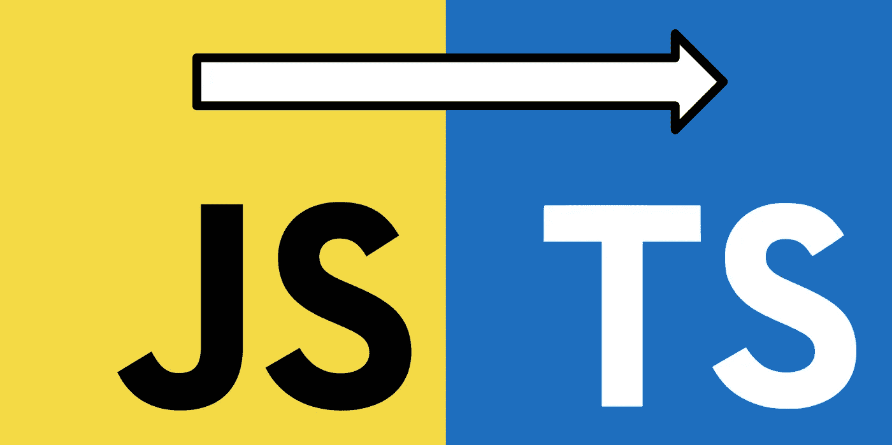

# Javascript 开发人员经常忽略的 Typescript 特性

> 原文：<https://levelup.gitconnected.com/typescript-features-javascript-devs-often-missed-de7af098a364>

JS 开发人员有时很难在 Typescript 中创建好的类型，并且经常使用著名的`any`或`unknown`。这篇文章旨在告知一些关于如何使用`Pick`、`Omit`、`partial`、`readonly`和智能类型推理的提示，这些将在日常生活中对你有所帮助。

首先，我想说明的是**好的打字帮助你少思考，减少检查实现的时间**。在函数式编程中，函数定义也是如此重要。你的类型应该严格定义你的数据结构。



让我们开始吧…

# 挑选和省略

这两个是 Typescript 附带的关键字的一部分。这些有助于防止每次我们需要类似的东西时重写接口。让我们看一个真实的例子。

假设我们正在创建一个用于某些组件的商店。

```
interface Stores {
  user: User,
  theme: Theme
  // ... some others
}
```

如果我们想要定义我们的组件的道具，这些道具也带有一些商店，我们不需要像这样复制它:

```
interface AvatarProps {
  user: User,
  rounded: boolean
  // ... some others
}
```

相反，我们可以使用这些关键字来防止重复这些类型，并减少一些错误，如为用户属性添加另一种类型。

```
interface AvatarProps extends Pick<Stores, "user">{
  rounded: boolean
  // ... some others
}
```

`**Pick**` **只需创建一个新类型，其密钥与我们传递的第二个类型相匹配**。想象一下这个函数有两个参数，第一个是整个类型，第二个是我们需要“挑选”的名字的联合。请记住，一个联合是两个或更多类型的连接，在这种情况下，我们使用一个固定的字符串来匹配每个键。

```
interface Foo {
  key1: number,
  key2: number,
  key3: number
}type FooPicked = Pick<Foo , "key1" | "key2">/*This will result in a type like that:interface FooPicked {
  key1: number,
  key2: number
}*/
```

`**Omit**` **做同样的事情但顺序相反。我的意思是，它将“忽略”所有与 union 匹配的键，而不是获取所有与 union 匹配的键。**

```
interface Foo {
  key1: number,
  key2: number,
  key3: number
}type FooOmited = Omit<Foo , "key1" | "key2">/*This will result in a type like that:interface FooOmited {
  key3: number
}*/
```

# 部分的

我们正在谈论商店，所以让我们继续。在这种情况下，让我们考虑行动，突变，或任何会做更新。例如，让我们以 React 在类中使用的旧 setState 为例。

```
// state
this.state = {
  foo: "foo",
  bar: "bar"
}// mutation
this.setState({
  foo: "foo"
})
```

方法`setState`需要接收的只是整个状态的一部分，但是我们不能使用 Pick 或者省略，因为我们不知道哪个会是被省略的键。因此，对于这些情况，我们需要发送一个“部分接口”,它将与整个接口合并。

```
// state
interface State {
  foo: string,
  bar: string
}// mutation
type SetState = (value: Partial<State>) => State;
```

但是这个`Partial`在幕后是做什么的，嗯没那么复杂。**只是给每个一级属性加了可选。**

```
// stateinterface State {
  foo: string,
  bar: string
}type PartialState = Partial<State>;/*This will result in a type like that:interface PartialState {
  foo?: string,
  bar?: string
}*/
```

你可以找到另一个需要用到它的案例。请记住，只将 optional 放在第一级属性中，如果您嵌套了一个对象，子属性将不会受到它的影响。

# 只读的

如果你喜欢处理不可变的数据，也许你会喜欢这个关键字。 **Typescript 允许你决定你的对象的哪些属性可以修改或者不可以修改。**继续商店，如果您将使用 Flux 架构，您不希望允许状态被修改，您只想在每个动作中重新创建状态。

因此，对于这些情况，将这些属性设为 readonly 是有帮助的，因为如果有人试图修改它，它将抛出一个错误。

```
interface Stores {
  readonly user: User,
  readonly theme: Theme
  // ... some others
}
```

此外，您可以使用 Readonly 修饰符

```
type ReadonlyStores = Readonly<Stores>
```

当您尝试修改任何值时，将会看到一条错误消息。

```
const store: ReadonlyStores = {
  user: new User(),
  theme: new Theme(),
  // ... some others
}stores.user = new User()
// Error: Cannot assign to 'user' because it is a read-only property.
```

**重要的**

**该检查将在编译时抛出错误，但不会像** `**const**` **那样在运行时抛出错误。**意思是如果你有一段 typescript 没有跟踪的代码，它会很容易在运行时修改你的属性。只是防止从文件中跳过 typescript 规则。

# 推理类型的巧妙运用

Typescript 有一个非常强大的推理算法。这意味着有时我们不需要明确变量的类型，因为它会直接为你输入。

```
let a = "a" // Typescript infer that it will be a "string"
a = 3 // It'll throw an error// Just need to specify the type if you are not passing a value to the variable
let a: string;
a = "a"// In another way it will be typed as any
let a; // typescript typed as any (some config will prevent this automatic any type)
a = "a"
a = 3 // it will NOT throw an error
```

我们可以利用这种超能力为自己谋利。继续我们的商店，而不是创建这样的界面…

```
interface Stores {
  user: User,
  theme: Theme
  // ... some others
}const stores: Stores = {
  user: new User(),
  theme: new Theme()
}
```

…我们可以让 typescript 负责自动创建它。

```
const stores = {
  user: new User(),
  theme: new Theme()
}type Stores = typeof stores;
```

常见的`typeof`关键字在 typescript 中有了新的功能。它将返回 typescript 推断的变量声明的类型。**所以两个代码都在做同样的事情。**

我喜欢这个特性，因为在这些情况下，类型完全依赖于声明。如果你添加一个新的字段，你只需要把它添加到声明中，它会立即传播到类型。相反，在手动界面创建中，您需要自己传播它，这可能会带来一些错误。

## 延伸阅读:

*   [TypeScript 必备基础知识—类型别名和接口](/typescript-must-know-fundamentals-for-your-next-tech-interview-or-project-255ae70df0a3)
*   [像专业人士一样使用打字键盘](/use-typescript-keyof-like-a-pro-56f3a3d06b73)
*   [打字稿类——从零到英雄](/typescript-classes-from-zero-to-hero-a429a3c96189)
*   [使用类和装饰器的下一级 Typescript 运行时类型验证](/next-level-your-typescript-runtime-type-validation-using-class-and-decorators-ddd2ce3c86f3)
*   [掌握类型脚本泛型:终极指南](/mastering-typescript-generics-the-ultimate-guide-3a62afeff44)
*   [打字技巧和提示:立刻成为专业人士](https://bootcamp.uxdesign.cc/typescript-tricks-and-tips-become-a-pro-in-no-time-5390aba151be)
*   [打字稿中的泛型——愚蠢简化的必备基础知识](/generics-in-typescript-must-know-fundamentals-stupidly-simplified-e7b4d7ffc0e3)
*   [Typescript 遗漏了这一点，但你不应该—运行时类型验证](/typescript-missed-this-but-you-shouldnt-runtime-type-validation-aa8a81ce4289)
*   [Typescript 枚举陷阱和解决方案必须知道](/typescript-enum-pitfalls-and-solutions-must-know-bb971cb0f7d2)
*   [掌握 TypeScript 泛型—终极指南—基本接口技术](https://bootcamp.uxdesign.cc/mastering-typescript-generics-the-ultimate-guide-essential-interface-techniques-86e793cf1fc)
*   [掌握 TypeScript 中的交集和并集类型:终极指南和基本技巧](/mastering-intersection-and-union-types-in-typescript-the-ultimate-guide-essential-techniques-49aa9f6a188a)

如果你觉得这个指南有帮助，请鼓掌并跟我来。通过[链接](https://medium.com/@caopengau/membership)加入 medium，获取我和所有其他优秀作家在 medium 上发表的所有优质文章。

# 分级编码

感谢您成为我们社区的一员！在你离开之前:

*   👏为故事鼓掌，跟着作者走👉
*   📰查看[升级编码出版物](https://levelup.gitconnected.com/?utm_source=pub&utm_medium=post)中的更多内容
*   🔔关注我们:[Twitter](https://twitter.com/gitconnected)|[LinkedIn](https://www.linkedin.com/company/gitconnected)|[时事通讯](https://newsletter.levelup.dev)

🚀👉 [**加入升级人才集体，找到一份惊艳的工作**](https://jobs.levelup.dev/talent/welcome?referral=true)