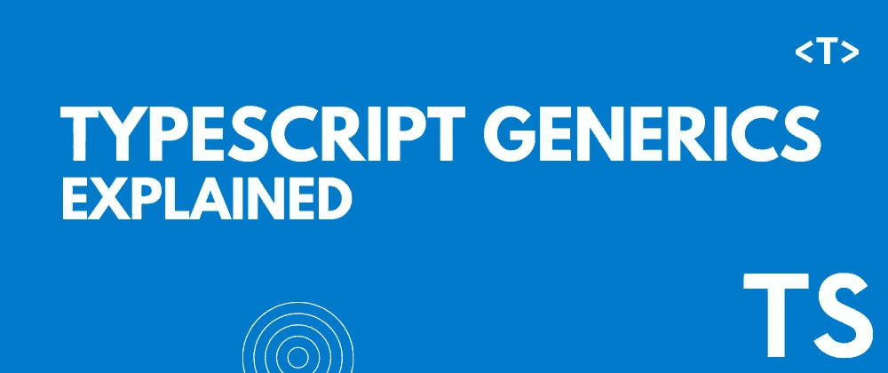

# Typescript 泛型很容易解释

> 原文：<https://levelup.gitconnected.com/typescript-generics-explained-easily-aafc634d8391>



在本文中，我将解释 Typescript 中泛型的基础知识。

typescript 中的泛型可能会令人困惑，但它非常简单。这是一个伟大而有用的功能。我将尽可能简单地解释它。

# 视频教程

# 什么是泛型？

让我给你举个简单的例子:

```
const printNum = (num: number) => {
    console.log(num)
}printNum(12)
printNum(92)
printNum(2)// result
// 12
// 92
// 2
```

该函数将一个数字作为参数，并将其打印在控制台上。num 参数可以是任何值。我们不知道。每当您调用带有参数的函数时，`num`参数就会变成该参数值。

Typescript 泛型有点像这样。但是我们期望类型，而不是期望值作为参数。我们将类型作为参数传递。我认为 typescript 泛型名称有点误导。这个名字让它看起来很复杂。但事实并非如此。应该叫类型参数之类的。

让我们看看它是如何工作的:

```
const createNewUser = (user: object) => {
    const newUser = { ...user, active: true, power: 100 } return newUser
}const user = createNewUser({ name: 'John Doe', age: 21 })console.log(user)
console.log(user.name) // error: Property 'name' does not exist on type '{ active: boolean; power: number; }'.
```

这个函数接受一个必须是对象的用户参数。我们将使用用户对象的属性创建一个新的用户对象，并添加 active 和 power 属性。将返回新的用户对象。

我们正在创建一个新用户，该函数将一个用户对象作为参数传递。最后，我们打印用户对象。

我们没有任何错误。但是如果我们试图访问`age`属性的`name`,我们会得到这样的错误:

```
Property 'name' does not exist on type '{ active: boolean; power: number; }'.
```


因为`user`参数有对象类型，但是我们没有指定任何属性和它们的类型。所以编译器不知道包括什么类型。

我们可以通过指定一个接口来解决这个问题:

```
interface User {
    name: string
    age: number
}const createNewUser = (user: User) => {
    const newUser = { ...user, active: true, power: 100 } return newUser
}const user = createNewUser({ name: 'John Doe', age: 21 })console.log(user)
console.log(user.name) // works fine
```


但是不同的用户可能需要不同的属性。所以，如果你使用一个单一的界面，那么你就不能为不同的用户使用它。

这就是 Typescript 泛型发挥作用的地方。我们可以期待一个函数的类型参数。当我们调用函数时，我们也可以传递类型。

```
const createNewUser = <T>(user: T) => {
    const newUser = { ...user, active: true, power: 100 } return newUser
}const user = createNewUser({ name: 'John Doe', age: 21 })console.log(user)
console.log(user.name) // works fine
```

我们通过在函数名后添加`<>`来向函数添加类型参数(泛型)。然后可以指定类型参数名。你可以随便叫它什么，但是大多数人使用`T`是为了简单。

然后我们将用户指定为类型`T`。现在，无论您将在函数调用中传递什么参数，`user`都将是那个类型。想传什么类型都可以。但是如果你想让`T`成为一个特定的类型，那么你可以扩展那个类型。

```
const createNewUser = <T extends object>(user: T) => {
    const newUser = { ...user, active: true, power: 100 } return newUser
}const user = createNewUser({ name: 'John Doe', age: 21 })console.log(user)
console.log(user.name) // works fine
```

现在你总是要传递一个对象。
你也可以在函数调用中传递类型。如果总想传一些接口怎么办？

```
const createNewUser = <T>(user: T) => {
    const newUser = { ...user, active: true, power: 100 } return newUser
}interface User {
    name: string
    age: number
}const user = createNewUser<User>({ name: 'John Doe', age: 21 })interface User2 extends User {
    country: string
}const user2 = createNewUser<User2>({
    name: 'John Doe',
    age: 21,
    country: 'BD',
})
```

这一次，我们创建了两个用户界面，并将用户界面作为参数传递。
而那两个用户对象将是他们的接口类型。

我希望你现在明白了一切。如果没有，我再举个例子。

```
interface User<T> {
    name: string
    age: number
    extraInfo: T
}
```

我们有这个`User`接口和`extraInfo`属性可以是任何类型。我们只是不知道。但是不要放过`any`式。


这就是我们使用泛型的原因。

```
interface User<T> {
    name: string
    age: number
    extraInfo: T
}interface Address {
    city: string
    country: string
}const user: User<Address> = {
    name: 'Anjan',
    age: 20,
    extraInfo: {
        city: 'Dhaka',
        country: 'BD',
    },
}
```

现在`extraInfo`的类型是`Address`。

# 泛型中的多种类型。

```
interface User<T, A> {
    name: string
    age: A
    extraInfo: T
}const user: User<Address, number> = {
    name: 'Anjan',
    age: 20,
    extraInfo: {
        city: 'Dhaka',
        country: 'BD',
    },
}
```

# 默认类型

```
interface User<T, A = number> {
    name: string
    age: A
    extraInfo: T
}const user: User<Address> = {
    name: 'Anjan',
    age: 20,
    extraInfo: {
        city: 'Dhaka',
        country: 'BD',
    },
}
```

# 无耻的插头

我用 React 和 Styled 组件做了一个 Xbox 登陆页面克隆。我希望你会喜欢它。
请考虑喜欢这个视频，订阅我的频道。


这个博客到此为止。我试图简单地解释事情。如果你卡住了，你可以问我问题。

顺便说一下，我正在一家公司寻找一个新的机会，在那里我可以用我的技能提供巨大的价值。如果你是一名招聘人员，正在寻找一个精通全栈 web 开发并对变革世界充满热情的人，请随时联系我。此外，我愿意谈论任何自由职业者的项目。我可以在[上班](https://www.upwork.com/freelancers/~01371a902900049821)

# 联系人

*   邮箱:[thatanjan@gmail.com](mailto:thatanjan@gmail.com)
*   linkedin: [@thatanjan](https://linkedin.com/in/thatanjan/)
*   投资组合:[安健](https://thatanjan.me/)
*   Github: [@thatanjan](https://github.com/thatAnjan/)
*   Instagram(个人): [@thatanjan](https://instagram.com/thatAnjan/)
*   推特: [@thatanjan](https://twitter.com/thatAnjan)