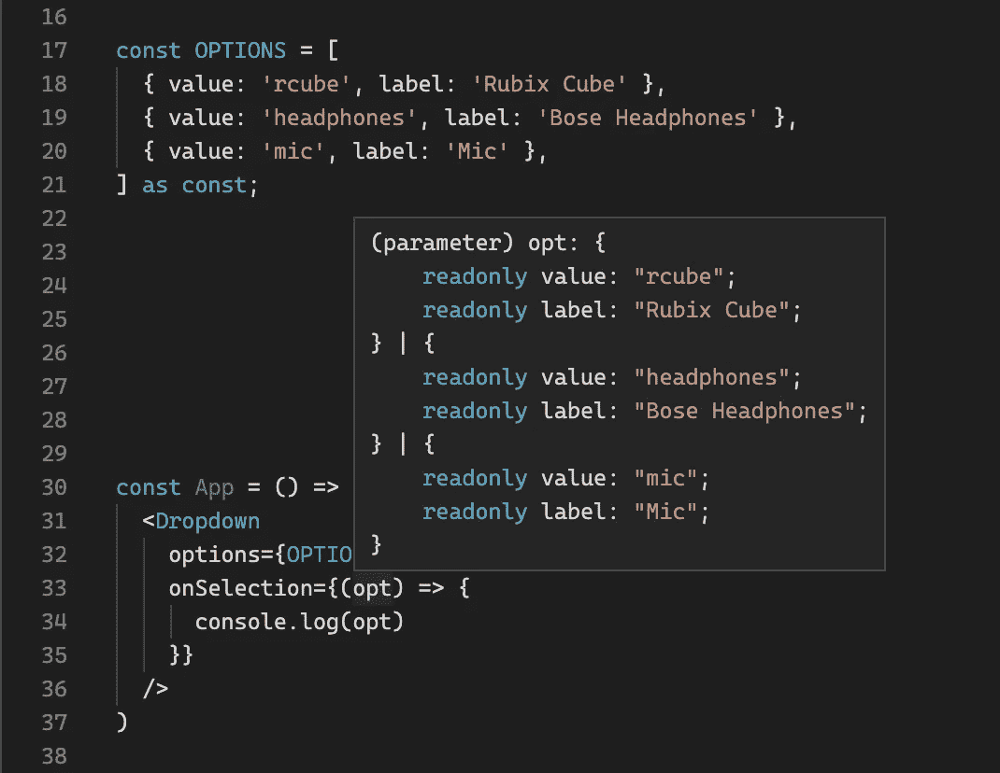
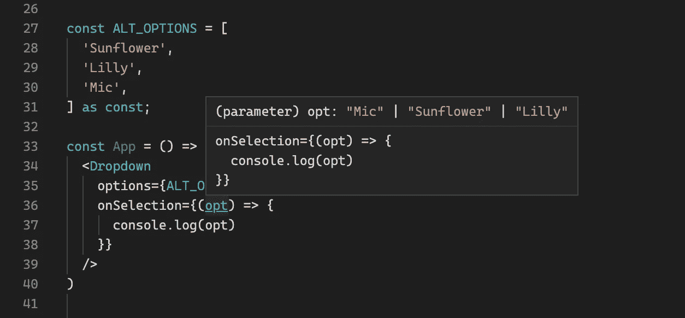
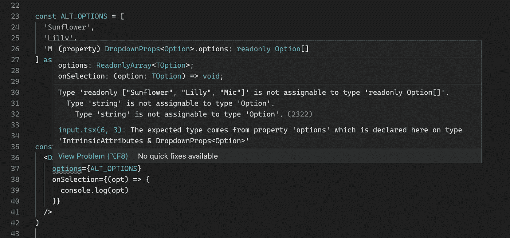

# 类型脚本泛型—让我们面对现实

> 原文：<https://levelup.gitconnected.com/typescript-generics-lets-get-real-77b2e2d566cc>

> 这是 TypeScript 泛型的真实故事，精心挑选，用通俗的术语描述，为什么人们会使用它们，并展示真实世界的例子——以发现当泛型不再礼貌，开始变得真实时会发生什么。

TypeScript 在最近几年得到了很好的发展，但是这篇文章并不是要说服你为什么它比切片面包好(我们都知道它是这样的！)而是为了帮助你学习。许多第一次接触 TypeScript 的开发人员对泛型的概念感到困惑。[文档](https://www.typescriptlang.org/)虽然令人惊叹，但通常缺乏容易联系和识别的真实用例。如果你像我一样，眼见为实——或者更恰当地说，你是一个喜欢少说多做的视觉学习者。

# 开胃菜——什么？WIIFM？

在我们进入现实生活的例子之前，我们需要简单地介绍一下:

*   什么是仿制药？
*   为什么会有人用它？wiifm？

**什么:**考虑泛型最简单的方法是将其视为一个常规参数，传递给你编写的任何旧函数，只有一个关键区别——它是一个*类型*参数，这意味着它与某个东西的*类型(结构)*直接相关。

你可能会问自己，这对我有什么好处？为什么需要传递一个*类型*参数，这就是重用性发挥作用的地方。TypeScript 文档在解释这方面做得很好，没有必要重新发明它——[如果你想了解更多，可以去看看并阅读。](https://www.typescriptlang.org/docs/handbook/2/generics.html)

# 主菜——真实世界的例子

好的，现在让我们来看看现实生活中的例子，i̶n̶f̶a̶m̶o̶u̶s̶著名的下拉菜单！

# 为什么是下拉菜单？

下拉菜单非常适合，因为它通常有一个回调函数，将用户选择的值传递给它。根据下拉列表显示的选项，在用户选择之后传递给这个回调的值可能会有很大的不同。我们希望能够为各种不同的选项重用下拉列表，并让我们的回调为我们提供正确的类型。

对于这个例子，我将使用 React，但是同样的概念也适用于您选择的首选框架/库。出于本文的目的，我将放弃下拉菜单的实际实现，而专注于签名。基本签名如下所示:

注意函数签名中的尖括号，它声明了我们的泛型类型参数`<TOption>.`

**专业提示:**你可能经常会看到名为`T`或`E`的泛型，或者一些模棱两可的字母或短语。对于从用户那里抽象出来的复杂开源软件来说，这可能没问题，但是在你自己的代码库中，这是一个小丑的举动，你永远不应该这么做。相对于它实际代表的内容，尽可能具体地命名它。例如，你不会命名一个关于某个东西是否正在加载的布尔变量`foo,`，你会吗？

现在，我们已经声明了我们的泛型*(并且没有小丑化妆)*然后我们可以将它传递给我们的接口，表示我们的接口接受的道具类型`DropdownProps<TOption>.`:

*   `options`传递了一个泛型类型的数组。
*   `onSelection`回调将我们的泛型类型作为参数传递给调用者，创建我们正在寻找的灵活的、可重用的代码。

在下拉菜单的下面用法中，我们传递一个对象数组作为我们的`options`道具。当我们将鼠标悬停在`onSelection`回调中的`opt`参数上时，请将注意力集中在它的类型上。TypeScript 知道它将是我们数组中的一个对象！我们甚至可以析构`({ value, label }) => {}`，TypeScript 对此会非常满意。

这一次大约在*(下)*我们传递了一个字符串数组，通过泛型的力量，我们的回调参数仍然被正确地输入了！

# 公正的奖赏——更进一步

看一下我们的例子，这里缺少了一个相当常见的用例。通过一个泛型是很棒的，但是它允许一个开发者通过*任何东西*。我们很有可能在组件中有逻辑，它依赖于特定的结构来传递选项。这就是`extends`关键字发挥作用的地方。

把`extends`想象成一家俱乐部的保镖。保镖限制谁可以进入俱乐部，类似的方式`extends`将限制什么可以作为通用参数传入。通过使用它，我们可以说我们只想要允许的某种结构的东西。让我们调整我们的函数签名，用`label`和`value.`的键来执行一个对象

在上面，我们创建了一个新的类型`Option`,它具有前面讨论过的形状。此外，我们在泛型声明中添加了`TOption extends Option`,这仅仅意味着我们传递的任何东西都应该与我们的`Option`类型具有相同的结构。

当我们看一下前面的例子(如下)并传递我们的字符串数组时，这次我们得到了一个错误，神奇的`extends`挽救了局面。

**Pro 提示:**在 React 中当你声明一个泛型参数时，TypeScript 可以推断出其形状，但是，如果你需要/想要显式地传递它，可以通过下面的语法来完成:

你可以创建一个新的类型并传递它，而不是内联的`typeof OPTIONS[number]`。

就这样，伙计们，请随意在 [TypeScript playground](https://www.typescriptlang.org/play?#code/JYWwDg9gTgLgBAJQKYEMDG8BmUIjgcilQ3wG4AocmATzCTgHkwZgIA7OAXjgG84A3FABsArkgBccAM4wowNgHNScISgBGSIZJlzFcAL4Vy8mEiiZ09ACI4wAEwgB3NgAVbUgDwAVJi3YA+XnI4OAhmVjYpSWQUBzYhagBBKCgUam9fCP8KEPYAZU0kDAjJAAowvzZJH3D2AEouQP4IYDsKfUpMETZi9jgbMIdnDNqOJAAPUzY7KUZRwNK+CoipABpQtgKhIsqDSQH7J1d3Ecr-Bp5KEKIYESgOUuCQuA8RITgAen8nuvIO8jQ7BkjBcXgAkgwAHJ5LhwADaTz4glEEgIUDQIg0+HWqg0WgICExwHGcAAwpikPgDKtEQJhGJJPgABaoOxgJnsJBSbEqdSaRkAIQgUnoAAlWezOdzqbTkQyCCBgGgebj+QQALJKqn6GkAXTgKFmgMiMCMxuBiQAMl4APoMUEQ6GwhEhfB5bqYIROMzYp74S3AIQJX2uzXKvUGo1A02Uc3wRJgMCw0oNTgLJ4eb4hDwHIZsDw0OgQTAg8FQvJwtgiEAaKC6rPPZZAzg8e1l6EdZ4bLY7CIt8rMVOBS5dkLmiDbAB0XoUA5gvy7+n0cCeX1XHxeuaO68boykLattrbjrync+G9ym0KvTY-bYKBASCHQRCHwvz3HU5nizg98fBgXc9niXFdXw3NdszXX5KCAA) 中摆弄代码，如果您发现这很有帮助，请一如既往地鼓掌！