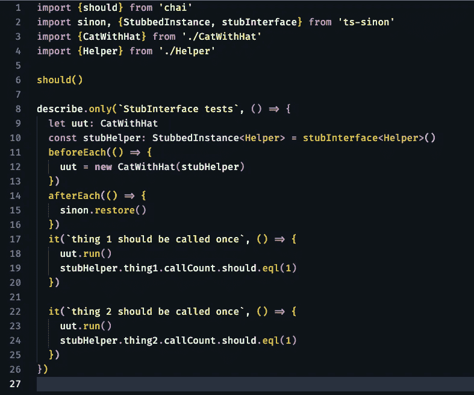

# ts-sinon 的打字稿

> 原文：<https://levelup.gitconnected.com/typescript-gotcha-with-ts-sinon-6b947d0945a2>

## [JavaScript 和类型脚本测试](https://gentille.us/b3601fb73472?sk=0dc73c81df810c0f181c432c9db3e085)

## npm 包 ts-sinon 可能非常有用，但是你必须记住 sinon.restore()可能不像你认为的那样工作。

在这个例子中，我们将有一个我们想要进行单元测试的主类，它将使用第二个辅助类。这是我们想要测试的主要类。

测试中的单元

这里是助手类。

做事情的助手类

以下是失败的单元测试:

CatWithHat 单元测试—存根所有的助手—失败

如果你是第一次接触`ts-sinon` ，它允许你做的一件事就是在一个**单独的**行(上面的行`10` )中剔除**所有**接口的方法。在`beforeEach`中，我们创建了我们的测试单元类，并传入了该类的存根版本。在每个测试中，我们调用`run`方法。我们希望两种方法`thing1 and thing2`都运行过一次。我们有一个`afterEach`，我们天真地希望我们的 stubHelper 从问题所在的`sinon.restore().`开始重置。第二个`it`因`expected 2 to deeply equal 1`错误而失败。

没有在这里做任何事情。我们的`Helper`的`StubbedInstance`正在生成一个 sinon 没有跟踪的对象。有几个非常简单的修复方法。一些比另一些更好。*如果你认为移动*`*uut.run() into*`*`*beforeEach*`*会有帮助，但事实并非如此。**

*您可以在`afterEach` 挂钩中添加几个`resetHistory()`调用，如下所示:*

**

*使用 resetHistory()进行测试-通过*

*所有的测试都通过了，但是这看起来很脆弱，在更大的真实世界测试中跟踪起来可能会很痛苦。不太痛苦的是，只需移动`beforeEach`钩内的短截线。您需要将变量声明放在钩子之外，这样每个`it`都可以断言存根。*

**

*在每次传递之前创建 stubHelper*

*我们可以去掉`beforeEach`，用`testSetup()` 函数清理掉悬空的`let statements`。该解决方案如下所示:*

**

*使用 testSetup()函数—通过*

*我还取出了`afterEach()`钩子，因为它没有做任何事情，但是如果使用了其他存根，真正的测试可能仍然需要它。在[阅读了 Kent C. Dodds 的这篇文章后，我的团队最近一直在尝试减少代码中嵌套(和`beforeEach`钩子)的数量。](https://kentcdodds.com/blog/avoid-nesting-when-youre-testing)*

**文章的* [*代码在 GitHub*](https://github.com/Rolias/blog-posts/tree/master/src/stub-interface) *中有。**

*还有更多 [JavaScript/TypeScript 测试](https://gentille.us/b3601fb73472?sk=0dc73c81df810c0f181c432c9db3e085)技巧文章。*

*平静地编码。*