# typescript+哈比神+BullMQ ===优雅队列

> 原文：<https://levelup.gitconnected.com/typescript-hapi-bullmq-elegant-queue-a41ddc2e4c3d>

我引起你的注意了吗？我必须承认，也许“优雅的队列”有点夸张，但不管怎样，这是一个简单的队列。让我们直接进入它。

H 情况是这样的。当一个用户在你价值十亿美元的平台上注册时，你必须给他们发一封欢迎电子邮件，并附上优惠券代码，让他们在你这个神奇的网站上消费！让我们从头开始构建电子邮件发送服务，它将对作业进行排队，这样用户就不必在帐户注册期间等待。

在开始编码之前，让我们先安装所有必要的包。首先，创建一个新文件夹。我把我的文件夹命名为‘hapi-bull MQ’(感谢我的创造性思维！)，您应该选择自己的文件夹名称。然后进入该文件夹并运行 npm init -y。这将创建一个 package.json 文件

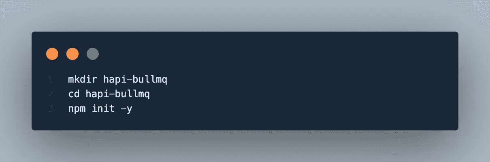

创建一个文件夹，并在该文件夹中运行 npm init

现在打开 package.json 文件，更新 main 和 scripts 部分，如下所示，

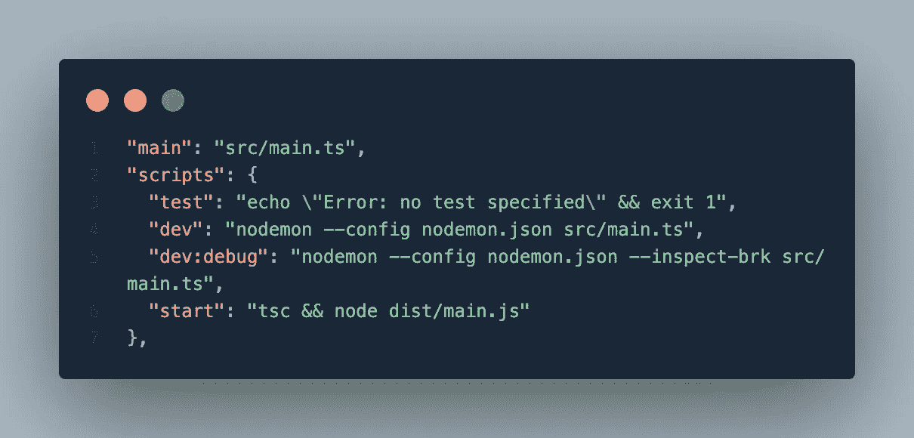

package.json

然后，运行以下命令来安装所有必需的节点模块及其依赖项

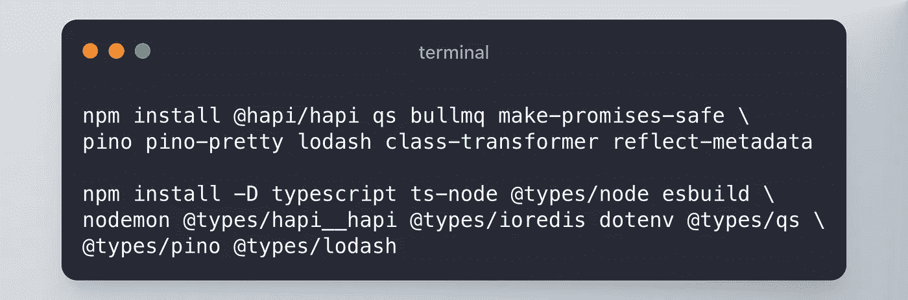

npm 安装命令

因为我们使用 typescript，所以为了构建解决方案，我们需要 tsconfig.json 文件。您可以通过运行`tsc --init`或手动创建来生成一个。相应地更新这些值

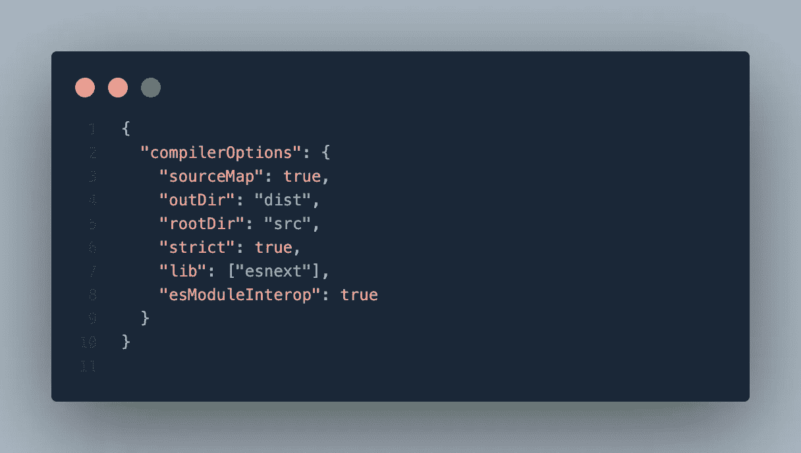

tsconfig.json

将环境价值保持在。环境文件。所以让我们创造一个，

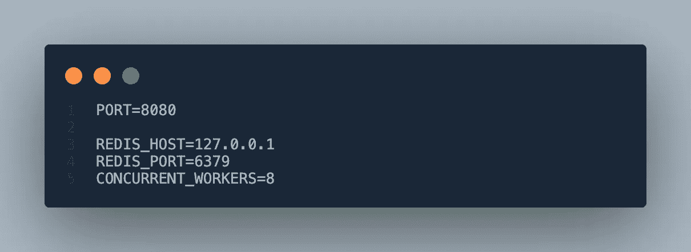

。包封/包围（动词 envelop 的简写）

这个解决方案使用 [BullMQ](https://docs.bullmq.io/) 来构建队列。它是一个 [Node.js](https://nodejs.org) 库，实现了一个构建在 [Redis](https://redis.io) 之上的快速且健壮的队列系统。我将推荐每个人通读文档。

我已经使用 Docker Compose 在我的本地机器上安装了 Redis。这是我的 docker-compose 文件的样子。您可以按照自己的方式安装 Redis。但是，您需要更新。相应的 env 文件。

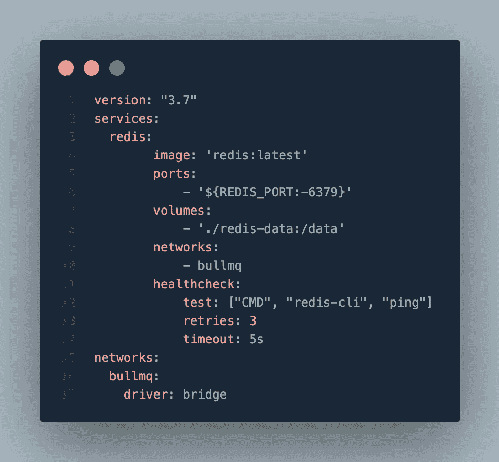

docker-compose.yml

我们已经完成了设置部分，所以让我们开始编码。首先，创建一个 src 文件夹，所有的 typescript 文件都将存放在这个文件夹中。在 src 文件夹中，创建一个名为 **queue** 的新文件夹，我们在其中保存所有与队列相关的代码，以及一个 **utils** 文件夹，我们将在其中保存所有必要的小代码片段。

我们都同意，console.log 是一个很好的日志工具。然而，对于后端系统，我更喜欢在中使用 p [。js，并将在这个项目中使用它。这是设置的样子。](https://getpino.io/)

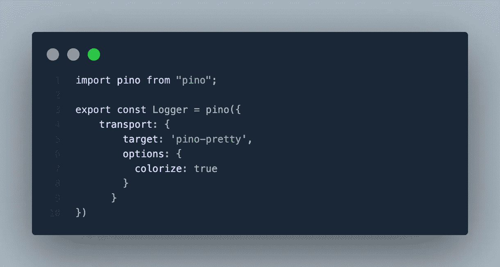

src/utils/logger.ts

现在让我们将所有与 BullMQ 和队列相关的配置保存在一个文件中，该文件位于**队列**文件夹中

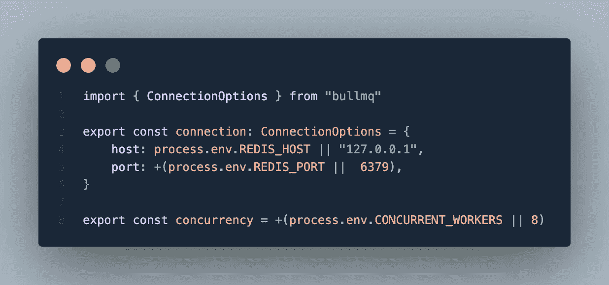

src/queue/配置. ts

我们系统中创造的所有工作岗位都遵循一个标准，这一点非常重要。这样，当 worker 系统处理作业时，它知道如何继续并相应地处理错误。因此，让我们创建一个工作蓝图。

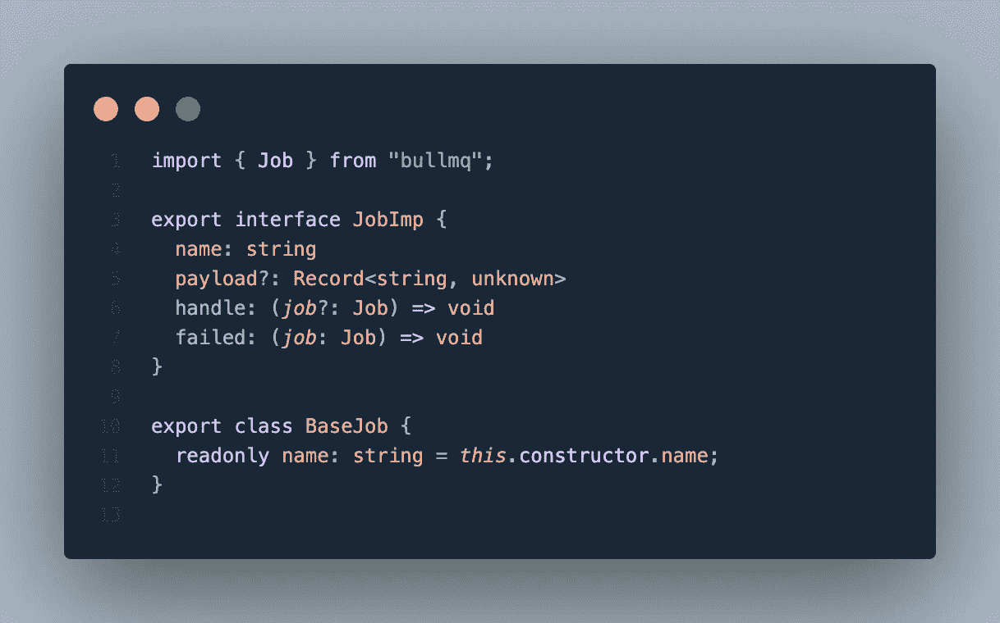

src/queue/jobs/job . definition . ts

现在我们有了每个工作展示的定义，让我们创建一个欢迎电子邮件工作。每个作业都必须扩展 **BaseJob** 类并实现 **JobImp** 接口。这一部分至关重要，因为我们将在后面看到它是如何帮助工人的。

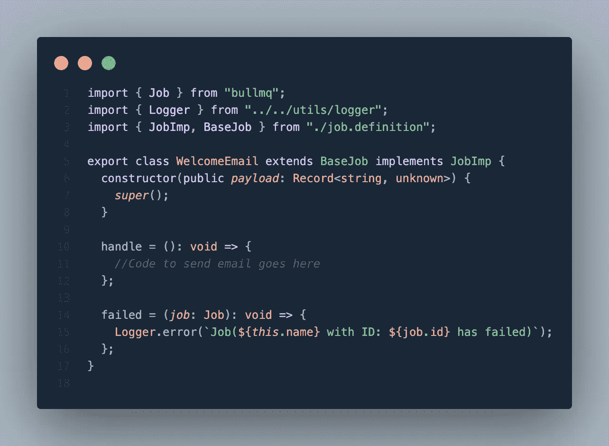

src/queue/jobs/welcome-email . job . ts

当 worker 从 Redis 队列表中选择作业时，它不知道它是什么作业实例。因此，为了帮助工人解决这个问题，我实现了一个提供者，它跟踪我们系统中的所有作业。任何新创建的工作**必须**映射到这里。您可以在第 6 行看到，我是如何在 provider.ts 文件中注册 WelcomeEmail 作业类的

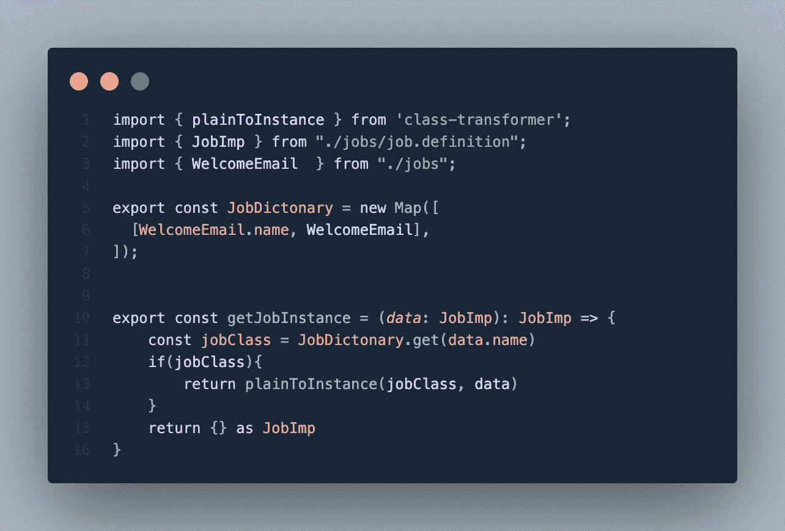

src/queue/jobs/provider.ts

您可能已经注意到，为了在 provider.ts 文件中导入 WelcomeEmail 类，我没有调用完整的路径。如果你不知道诀窍，我已经使用了汇总出口的方法。只需在 jobs 文件夹中创建一个 index.ts 文件，然后导出所有作业类，如下所示

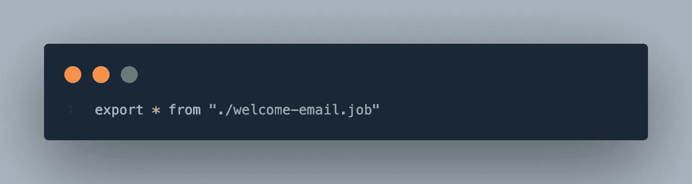

src/queue/作业/索引. ts

我们已经定义了“WelcomeEmail”工作。现在我们需要一个会处理这项工作的工人。让我们创建默认工人。

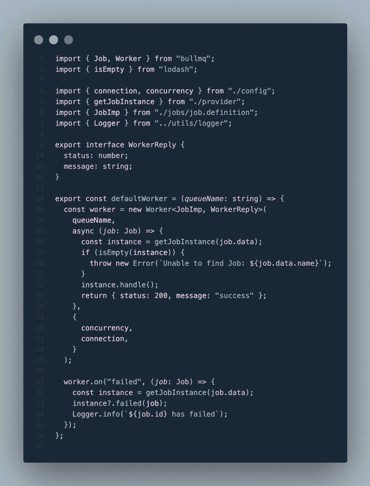

src/queue/worker.ts

这个工人独自一人什么也做不了。除非 QueueScheduler 帮助编排和管理队列的工作线程，否则这是没有用的。下面的代码创建了一个名为“default-queue”的队列，并为 defaultQueue 设置了一个调度器(如果没有将队列名作为函数参数传递的话)。

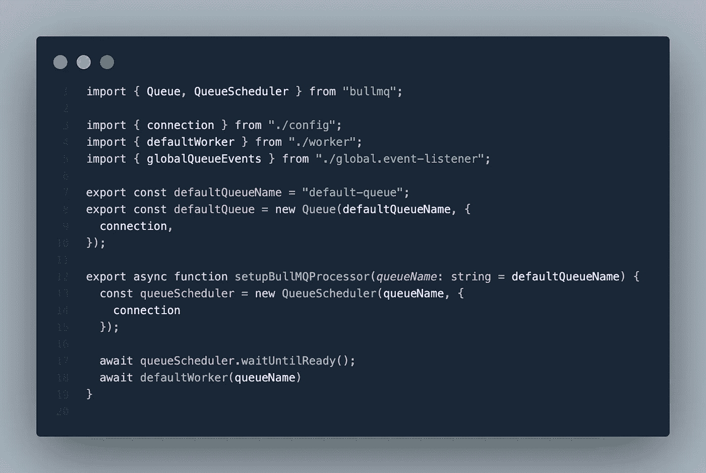

src/queue/queue.ts

最后，是时候把所有东西放在一起了。在 **src** 文件夹下创建一个 **main.ts** 文件，并遵循下面的代码。代码可能看起来很复杂，但它做了三件事。首先，它使用[哈比神](https://hapi.dev/)启动一个 Http 服务器，然后设置**队列**，最后启动服务器。我想在第 36 到 50 行引起你的注意。 **/register** api 调用负责将 WelcomeEmail 作业添加到队列中。这里，我为新创建的作业创建了一个唯一的名称。你可以给任何你想传的名字。对我来说，我想给每一份新的 WelcomeEmail 工作起一个独特的名字。

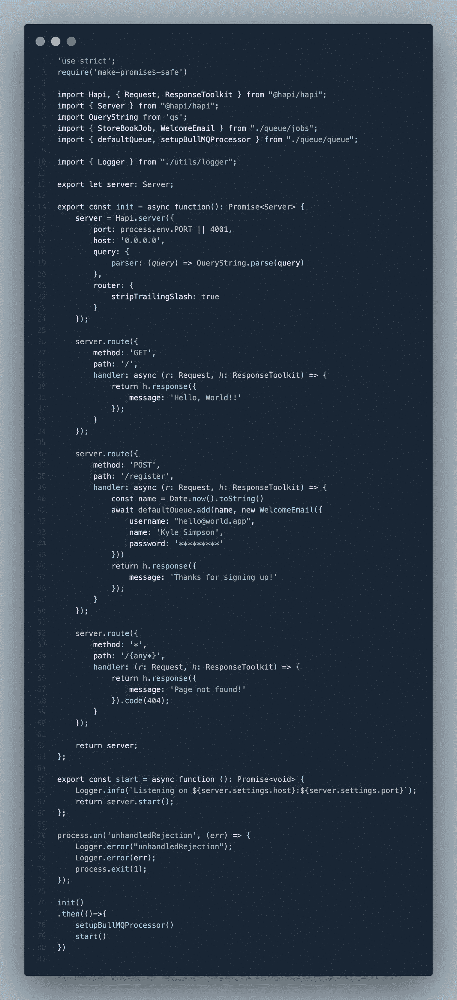

src/main.ts

好了，现在是关键时刻了。按照所有的说明，这将工作或它是一个没有汉堡教程。

> 让我们运行 npm 运行 dev，shell we。。。