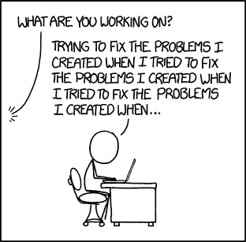

# TypeScript: JavaScript 更负责任的表亲

> 原文：<https://levelup.gitconnected.com/typescript-javascripts-more-responsible-cousin-58d1f045a7b2>

我从我的[定期博客系列](https://marthaller-jr.medium.com/exploring-creative-code-week-one-d94f44b416fb)中抽出一点时间来讨论创造性代码，因为我认为这个话题非常重要。虽然我每周都在提高我的 p5.js 设计技能(并在这个过程中提高我的 JavaScript 技能)，但我仍然是一名专业的全栈软件工程师，渴望构建比我发现的世界更好的应用程序和网站。因此，我需要保持我的技能与时俱进。

在我的专业工作室 building [hearth.io](https://hearth.io/) 里，我让自己接触到了用于构建网络的最新技术。我一直沉浸其中的一项技术完全改变了我对 JavaScript 开发的看法:TypeScript。通过学习 TypeScript，我可以感觉到自己正在成为一名更精确、更博学、更高效的 JavaScript 开发人员，我想在这里分享一些我所学到的东西。

打字稿标志

为了充分理解 TypeScript 的强大和它所解决的问题，我们需要更深入地研究 JavaScript 的历史。1995 年 9 月，网景公司委托才华出众的程序员 Brendan Eich 开发一种新的脚本语言，他以闪电般的速度只用了十天就完成了。现在，我必须非常努力地在十天内构建一个 web 应用程序，更不用说从头开始设计一种全新的语言了，所以我向艾希先生致敬。虽然没有人能预料到接下来会发生什么，但可以肯定地说，JavaScript ***取代了*** 。尽管 JavaScript 有一段时间处于休眠状态，但它最终在使用中爆发了。今天，JavaScript 已经席卷了开发人员的世界，并且一直被全球专业程序员评为最常用的语言。

(主要)感谢艾希先生

但是任何使用过 JavaScript 的人都知道它有一些…怪癖。在我看来，JavaScript 开发中最令人沮丧的方面无疑是输入系统。为了进一步解释，在 JavaScript 中你可以声明一个变量，比如`let x = 10`，它在运行时将是一个`number`数据类型，但是稍后在同一个程序中给同一个变量赋另一个值——比如说`x = “Jacob”`，它将作为`string`运行。这导致几乎不可能找到错误，许多熟练的 JavaScript 开发人员实际上已经竭尽全力试图找到难以消除的错误。

埃隆·马斯克在编程之前和之后

输入[打字稿](https://www.typescriptlang.org/)。微软的人足够聪明，他们看到了一个不可思议的机会，可以用一个更实用的输入系统来利用 JavaScript 的力量，从而让工程师在他们编写的代码中更加明确。在最基本的层面上，TypeScript 是 JavaScript 的一个*超集*，它允许静态类型。

更简单地说，TypeScript 迫使开发人员在编写变量时声明变量的类型*。有了更严格的，有些人可能会说更负责任的编程方法，开发人员可以更容易地发现他们的错误。正如像 [Clean Code](https://www.amazon.com/Clean-Code-Handbook-Software-Craftsmanship/dp/0132350882/ref=sr_1_1?dchild=1&keywords=clean+code&qid=1622646055&sr=8-1) 这样的经典案例告诉我们的那样，工程师花在阅读代码上的时间与写代码的时间很容易达到 10:1。因此，能够用 TypeScript 发现错误不仅仅是一个方便的工具，它重新定义了编写 JavaScript 的方法，使团队的效率成倍提高。*

与所有技术博客一样，我们可以通过深入研究代码来更深入一点。下面是一个简单的 JavaScript 程序，演示了 JS 如何允许我用一个类型声明两个值，然后在同一个程序中将这些值重新分配给两个不同的类型:

正如您可以清楚地看到的，JavaScript 让我们可以任意混合和匹配变量。但是假设我们忘记了我们重新分配了这些值；这种事经常发生。如果我们的程序不可避免地开始产生意想不到的行为，谁也说不准这些错误可能发生在哪里。我们将彻底检查我们的程序，找出我们的问题。再说一次，这些都是相当简单的错误，想象一下，如果我们遇到真正棘手的事情。

h/t: xkcd

然而，通过使用 TypeScript，我们可以走在错误的前面。以下面的代码片段为例，它与上面的代码片段相似。不过，这一次我们将使用 TypeScript，而不是普通的 JavaScript:

哇！TypeScript 在我们的代码运行之前捕捉错误！这是非常强大的，将给予我们和我们的团队快速识别错误的能力，并且潜在地根本不将它们写入我们的程序。

但是 TypeScript 有更多的特性使我们的代码更加简洁。更具体地说，TypeScript 允许我们*注释*我们的代码，显式声明我们期望变量包含的数据类型:

通过声明`x`将是一个`number`并且`y`将是一个`string`，我们可以很容易地在程序的整个生命周期中指向我们的变量的数据类型。虽然这看起来是对我们编写代码方式的一个小小的改进，但我们现在已经确定 JavaScript 代码中的任何错误都与键入无关，实际上从我们的代码中消除了一整类错误。TypeScript 甚至可以验证代码中不存在于对象上的值，如下所示:

众所周知，TypeScript 迅速成为编程社区中最受欢迎的语言之一。尽管毫无疑问 JavaScript 将长期存在，但 TypeScript 提供的吸引力对专业开发人员来说太有吸引力了。

堆栈溢出 2020 开发者调查

除了类型化系统之外，TypeScript 还有许多方面，我在这里就不再赘述了。例如，所有有效的 JavaScript 代码也是有效的 TypeScript 代码，由 TypeScript 编译器或 [Babel](https://babeljs.io/) 编译。这实质上意味着团队可以逐渐地将他们的 JavaScript 代码一部分一部分地转换成 TypeScript，而不会中断他们的程序。当开发团队希望在程序的特定部分使用更严格的类型系统时，TypeScript 让他们能够重构代码库，而无需转换每个文件。

更重要的是，TypeScript 允许您使用一些最新的 ECMAScript 特性，[将它们转换到旧的 ECMAScript 目标。这意味着您可以使用新的 JavaScript 特性——比如模块、lambda 函数、类、spread 运算符和析构函数等——同时保持向后兼容旧的 web 浏览器。如果你正在寻找 TypeScript 所提供的惊人概述，请阅读这个非常受欢迎的](https://www.typescriptlang.org/docs/handbook/compiler-options.html)[堆栈溢出答案](https://stackoverflow.com/questions/12694530/what-is-typescript-and-why-would-i-use-it-in-place-of-javascript#:~:text=TypeScript%20is%20a%20superset%20of%20the%20JavaScript%20language%20that%20has,make%20JavaScript%20development%20more%20efficient.)。

如果你正在阅读这篇文章，我建议你马上开始使用 TypeScript。它非常容易安装；只需运行`npm install typescript`。您甚至可以使用下面的命令运行 TypeScript 编译器:`npx tsc`。TypeScript [社区](https://www.typescriptlang.org/community)也非常有帮助，为希望提升打字技能的开发人员提供了充分的支持。因为这只是一个简短的概述，所以我仅仅触及了 TypeScript 所释放的力量的表面。有数不清的特性可以让您的 JavaScript 编程体验更快、更有效，并最终更有成效。除了开始使用 TypeScript 之外，真的没有什么可做的了！

# 分级编码

感谢您成为我们社区的一员！[订阅我们的 YouTube 频道](https://www.youtube.com/channel/UC3v9kBR_ab4UHXXdknz8Fbg?sub_confirmation=1)或者加入 [**Skilled.dev 编码面试课程**](https://skilled.dev/) 。

 [## 编写面试问题+获得开发工作

### 掌握编码面试的过程

技术开发](https://skilled.dev)