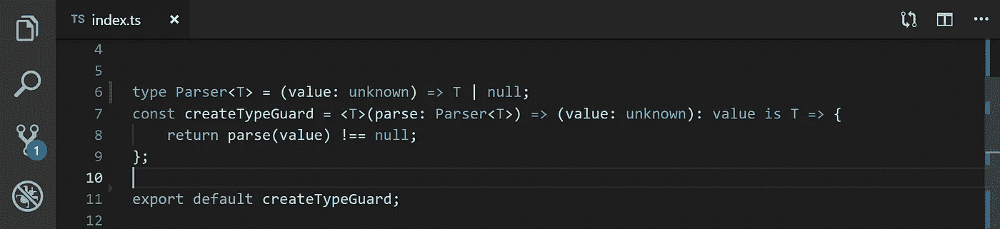

# TypeScript:保持类型保护安全并保持最新

> 原文：<https://levelup.gitconnected.com/typescript-keeping-type-guards-safe-and-up-to-date-2457d52bd722>



VS 代码和类型脚本

## *泛型类型保护帮助我们写出更好的代码，更少的错误*

我喜欢 TypeScript，并发现类型安全对我的代码有很大的好处。然而，[型守卫](https://www.typescriptlang.org/docs/handbook/advanced-types.html#type-guards-and-differentiating-types)一直是我不完全确定的一个特性。类型保护允许您在执行操作之前检查变量的类型。在普通的 JavaScript 中，它看起来像下面这样

```
**let** pet = getSmallPet();  
// Each of these property accesses will cause an error 
**if** (pet.swim) {     
  pet.swim(); 
} **else** **if** (pet.fly) {     
  pet.fly(); 
}
```

# 设置:配置我们的全球 TS

在这个例子中，我们将使用下面的全局增强，这是这个故事中唯一的缺点。

如果您不想使用全局增强，请查看本文末尾提到的库。

从现在开始，我们将学习如何创建安全型守卫。

# 创建类型保护

比方说，我们有如下界面。

此接口的不安全类型保护可能如下所示。

除非我们给我们的接口添加一个新的属性`something`,否则这工作得很好。

我们需要记住更新`isPerson`函数。TypeScript 不会警告我们新属性未被检查。如果我们不更新我们的`isPerson`函数，代码可能会不稳定，因为该函数甚至不检查属性`something`的存在。

值得庆幸的是，有一种方法可以使类型守卫安全并意识到任何变化。

我们可以编写解析器，而不是编写典型的不安全类型保护。

这个函数是静态类型的，每当我们改变`Person`的接口时，TypeScript 会警告我们这个变化，我们必须更新我们的`parsePerson`函数。

这很有效，但是几天后会变得很烦人。总是创建一个新的变量并检查`null`会让人精疲力尽。

我们可以用这样的东西！

这是一个简单的函数，需要一些数据和一个解析器。我们对数据应用解析器，如果结果不为空，则数据格式正确。

在我们的代码中，我们可以这样使用`checkType`函数。

这样看起来好多了！但是…

编写 always `checkType(data, parsePerson)`并不完全是我们想要验证数据结构的方式。

我们想用这样的函数`isPerson(data)`对吧？

# 正确的解决方案

这是期待已久的创造优雅型警卫的方法。

接受解析器并返回安全类型保护的函数

然后我们可以使用。

万岁！

`createTypeGuard`接受一个解析器并返回一个类型安全的类型保护，这意味着，每当我们改变`Person`接口时，我们将被 TypeScript 警告。在操场上检查一下[http://bit.ly/ts-safe-typeguard](http://bit.ly/ts-safe-typeguard)

# 代码概述

# 结论

尽量少写类型保护，如果要写，就写泛型。

不安全类型的守卫可能会成为你代码中的一个新的`any`，并可能使你的应用程序变得不稳定。

我已经创建了一个小库，你可以用它在你的项目中创建安全类型的守卫。如果您决定使用这个库，也没有必要进行全局增强。查看这里[https://www.npmjs.com/package/create-typeguard](https://www.npmjs.com/package/create-typeguard)

如果你不想错过我这边的任何新文章，你可以在我的推特上关注我[https://twitter.com/michalszorad](https://twitter.com/michalszorad)

[](https://gitconnected.com/learn/typescript) [## 学习 TypeScript -最佳 TypeScript 教程(2019) | gitconnected

### 18 大 TypeScript 教程-免费学习 TypeScript。课程由开发人员提交并投票，从而实现…

gitconnected.com](https://gitconnected.com/learn/typescript)  [## Limmero -构建 web 应用程序

### Limmero 是一个专注于 web 应用和前端技术的软件开发团队。React | TypeScript | JavaScript …

limmero.com](https://limmero.com/)