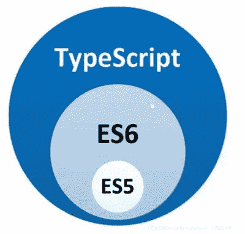
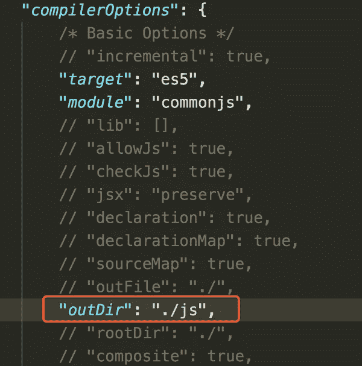
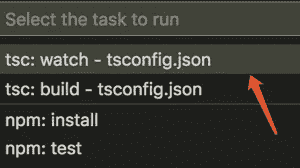

# TypeScript 学习笔记 I:安装编译和基本类型

> 原文：<https://levelup.gitconnected.com/typescript-learning-notes-i-installing-compilation-and-basic-types-3720dd9bc494>


TypeScript 是微软开发的开源编程语言，TypeScript 是一个超级 javaScript，遵循最新的 ES6、Es5 规范，扩展了 Javascript 的语法，TypeScript 更像是后端的 Java，C#面向对象的语言让 JS 可以开发大型企业项目。

谷歌也在大力支持 TypeScript 的推广，谷歌的 Angular2.x+基于 Typescript 语法，最新的 Vue，React 也可以与 Typescript 集成。



## 1.TypeScript 的安装和编译

安装:

```
npm install -g typescript
```

在项目中执行以下命令以生成 TypeScript 配置文件。

```
tsc -init
```

在生成的 TypeScript 配置文件`tsconfig.json`中修改编译后的文件存储地址。



通过执行以下命令从编写的 TypeScript 文件生成 JavaScript，其中 helloWord 是文件名。

```
tsc helloWord.ts
```

让开发工具自动编译 Ts 文件，以 VS 代码为例。

点击菜单任务-运行任务，选择 tsc:monitor-tsconfig.json，代码自动生成。



## 2.基本类型

Typescript 添加了类型检查，以便使编写的代码更加标准化和易于维护。标识符一旦定义了类型，就不能再修改，主要有以下几种数据类型。

1.  **布尔**

**2。编号**

```
var num:number=123;

num='str';           // incorrect

num=456;             // correct
```

**3。字符串**

```
var str:string='this is TypeScript';

str=true;            // incorrect

str='Hello World';  // correct
```

**4。数组**

```
// The first method
var arr:number[]=[11,22,33];

// The second method
var arr:Array<number>=[11,22,33];
```

**5。元组**

指定数组中每个位置的元素的类型。

```
var arr:[number,string]=[123,'this is TypeScript'];
```

**6。枚举**

**7。任何**

`any` 型有什么用？

**8。未定义**

**9。空值**

10。作废

一般用来定义没有任何返回值的方法，类似 C++。

11。从不

表示从不出现的值，这意味着声明为 never 的变量只能由 never 类型赋值。

参考:[https://www . typescriptlang . org/docs/handbook/basic-types . html](https://www.typescriptlang.org/docs/handbook/basic-types.html)

感谢您的阅读，我将在下一篇文章中介绍函数的定义以及 TypeScript 中关于类和继承的知识，如果您对我的文章感兴趣，可以在 [Medium](https://hyhwell.medium.com/) 或 [Twitter](https://twitter.com/Maxwell_hyh) 上关注我。