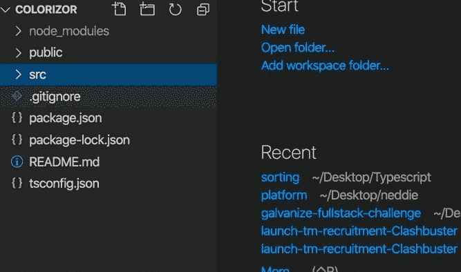
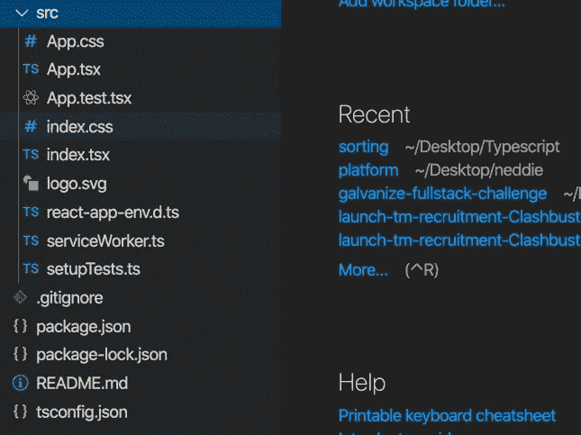
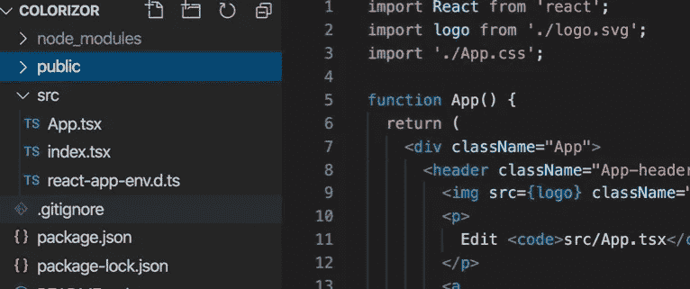
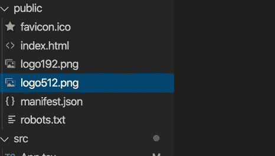
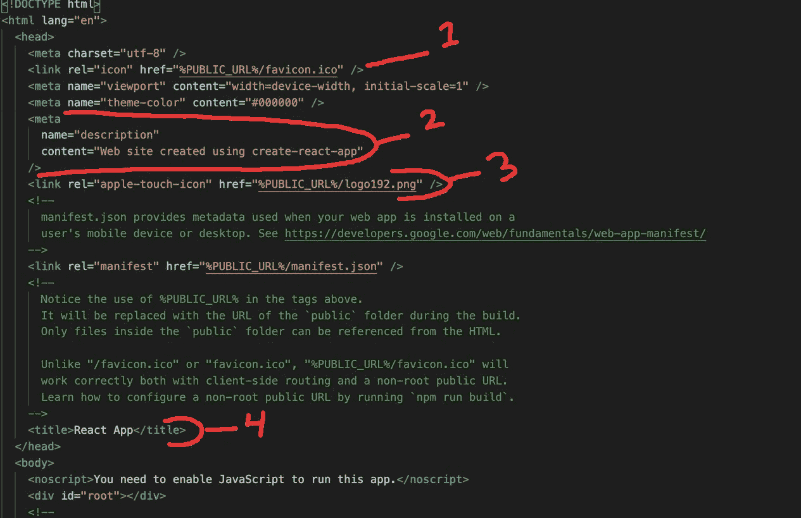
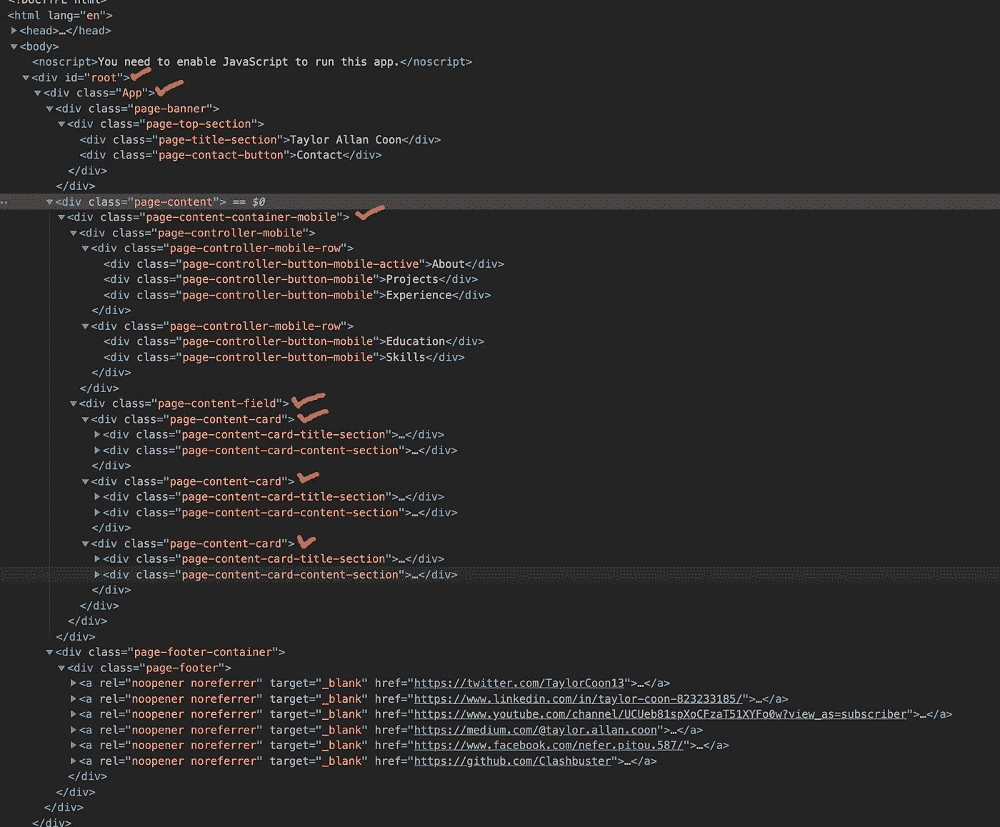
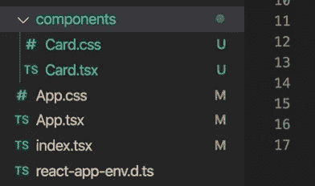
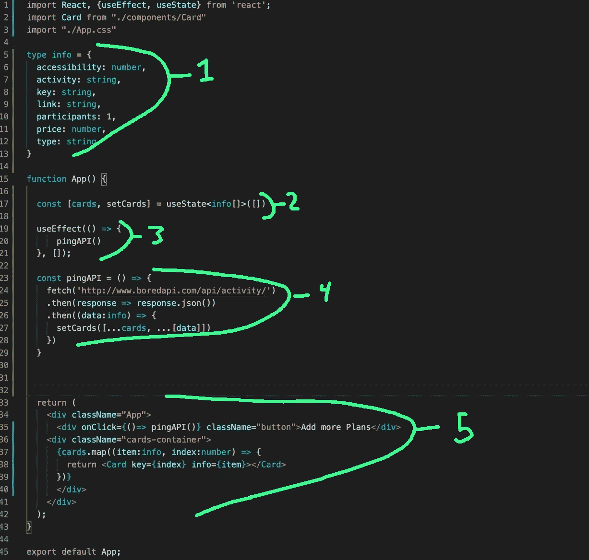
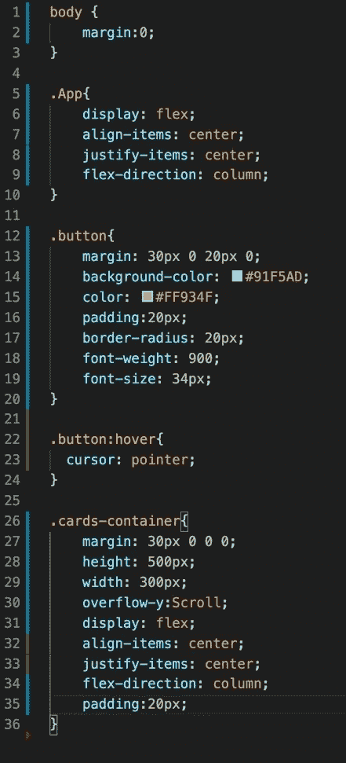

# 打字稿:10 分钟内用 React 做一个前端

> 原文：<https://levelup.gitconnected.com/typescript-make-a-front-end-with-react-in-10-minutes-94f034200b5b>

10 分钟内用 react 做一个前端。


这就是我

当我开始使用这个堆栈时，我有许多天真的问题，这些问题从未得到解答，直到我被迫从事某个巨大的整体项目一段时间。

> 我的 CSS 文件放在哪里？
> 
> 我如何将事物模块化？
> 
> 我的回购应该是什么样的？

我会阻止你问这些问题。对于本教程，请安装 vscode、npm、node、typescript。

导航到一个目录。键入以下内容:

```
npx create-react-app application-name --template typescriptcd application namecode .
```

我们的违约回购看起来像这样。



导航到 src 目录。



看看那些膨胀的器皿。使用 npx create react app 工具为我们做了很多好事。它设置我们的环境并自动构建所有这些文件，默认情况下，它甚至会设置一些测试内容。

一旦我们到了这一步，重要的是要对你的项目负责，并根据你的想法改变它。我要做的是删除这些文件。

```
App.css
App.test.tsx
index.css
logo.svg
serviceWorker.ts
setupTests.ts
```

那东西很有用，但我们不需要它有三个原因。

1.  如果你对测试一无所知，你最好把它们放在一边，直到你投资正确地设置它们。
2.  测试对于企业项目来说是强制性的，但是除非您的项目发展到一定程度，否则您不需要任何测试(或者任何其他扩展解决方案，比如 redux)。如果你的项目少于 15 个组件，Redux/tests 可能会带来更多的麻烦。
3.  我喜欢删除 CSS 文件，因为我喜欢以不同的方式组织它们。

现在，我们的回购看起来像这样。



点击 App.tsx，删除 App.tsx 返回声明和徽标导入中的所有内容，直到它看起来像这样。

导航到您的公共目录。看起来是这样的:



删除这两个 logo.png 文件，打开你的 index.html。

在我们的 index.html，我们想改变一些生活质量方面的小事情。

这是你的 index.html 档案的样子，我已经强调了你应该考虑的事情。



1.  无论链接的是什么照片/图标，它都会出现在你的浏览器标签上
2.  无论内容部分中的字符串是什么，当你在许多主要的社交媒体位置(如 discord)链接你的网站时，如果你不改变它，它会显示“使用 create-react-app 创建的网站”,当你试图与朋友分享新网站的链接时。我建议把它改成像“泰勒的个人网站”这样运动的网站
3.  这里链接的任何东西都会显示在 IOS 设备上。
4.  无论 *<标题></标题>* 标签中有什么，都会出现在你的 chrome 浏览器标签上。

## 随心所欲地改变所有这些。

# 让我们谈谈反应

现在，我们已经删除了所有的臃肿的软件，我们有一个准系统空反应应用程序来制作东西。

让我们讨论一下如何使用 react 让内容出现在我们的浏览器窗口中。

出现在我们浏览器中的所有东西要么是 HTML 文档，要么是编译成 HTML 的东西。所有改变 HTML 外观的东西要么是 CSS，要么是编译成 CSS 的东西。

所有动态改变 HTML 的东西都是 Javascript 或者编译成 Javascript 的东西。

Typescript 向下编译成 Javascript。JSX 是编译成 HTML 的子域。TSX 向下编译到 JSX，因此向下编译到 HTML。如果我们决定使用任何 CSS 预处理程序，比如 SASS，都可以编译成 CSS，但是对于本教程，我将使用普通的 CSS。

React 是一个基于组件的渲染交付系统。你可能已经见过其他一些这样的系统，因为它是目前世界上最受欢迎的渲染框架类型(看看 Vue，Angular，Unity 等。)都是基于组件的系统。

我们组织组件的方式和我们在传统的普通 JS 项目中组织 HTML 的方式是一样的。与传统 JS 的主要区别是，我们有一个完整的 HTML 文件，它可能会也可能不会被分成片段。

基于组件的系统的不同之处在于，我们将 HTML 片段分解成组件，每个组件都有自己特定的 JS 部分和 CSS 引用。

例如，这是我的个人网站，除了我在每个 div 上加了一个红色的勾号，这是它自己的模块化组件。每个检查代表一个完整的 react 模块，具有自己的功能。



为了在 React 中呈现我们想要的任何东西，我们所要做的就是引用特定的组件，并将它们注入到每个模块的返回语句中。

我将使用 React 钩子和函数组件，只是因为我认为它们比状态组件更容易、更轻便、更干净。此外，Javascript 是一种函数式语言，它看起来是正确的。

我要做的是找到一个开源免费的 web-API，使用这个链接提供一些数据。

[](https://github.com/public-apis/public-apis#animals) [## 公共 API/公共 API

### 用于软件和 web 开发的免费 API 集合列表。这个项目的公共 API 可以在…

github.com](https://github.com/public-apis/public-apis#animals) 

在这个列表中，我选择了 bored API。我要去查询一下，把我无聊的时候可以做的活动随机列一个小清单。

 [## 无聊的 API

### 编辑描述

www.boredapi.com](https://www.boredapi.com/documentation) 

我将制作一个非常小而简单的应用程序来演示 React 的基本原理。有了这些知识，你就可以无限扩张。

# 组织—



我们可以看到的第一件事是，我已经组织了我的存储库，将组件保存在一个单独的文件夹中。此外，每个组件都引用自己的 CSS 文件，并且 CSS 文件与目录中的模块相耦合。如果我有更多的组件或者更多的前端页面，我会把它们组织得更深。其中每个页面都有自己的目录，每个页面上的每个组件在每个页面目录中都有自己的目录。

# 每个模块的功能

一般来说，每个模块都只有专门处理的模板代码，不要混淆。下面是每个模块通常的样子。



1.  一些类型声明让 typescript 编译器高兴。
2.  状态管理就是管理那些会“改变状态”的东西当关于这个组件的某些东西改变时，这个组件的状态也改变了。我已经用 react 钩子创建了一个状态变量。因为这个页面唯一会改变的是我获取的任务数量，所以这是我需要的唯一变量。
3.  初始提取，以便页面从一张卡开始。
4.  用于获取在被调用时更新状态的处理程序。
5.  这是我们模块的返回语句，其中包含了将在该组件中存储的所有 HTML 材料。考虑到这是父组件，它也包含所有的卡。因为卡片是它们自己的组件，所以我在导入中引用卡片，并根据状态变量中有多少项来创建尽可能多的卡片。

# 在我的 CSS 中



这张照片包含了我的父应用组件上使用的 100%的 CSS。请注意，它不是很长。我们喜欢这样。如果有人想以后来修改我的代码，他们只需要阅读大约 30 行代码。

他们会确切地知道在哪里查找，因为如果有任何视觉错误，他们可以看到它与页面上的特定组件相关，并导航到该目录。

所有其他的 CSS 都保存在 Card 目录下的 my Card.css 文件中。

# 最终产品

现在我们有了。一个基本的 React 前端，具有良好的组织习惯。

祝你周末愉快！