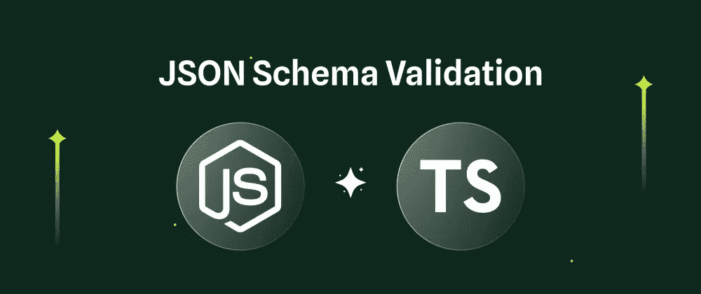

# Typescript 错过了这一点，但您不应该错过——运行时类型验证

> 原文：<https://levelup.gitconnected.com/typescript-missed-this-but-you-shouldnt-runtime-type-validation-aa8a81ce4289>

本文旨在演示使用 Typescript 时运行时类型检查的重要性和方法。作为一种构建时语言，它在 Typescript 中被遗漏了。

*   Typescript 中遗漏了什么
*   介绍佐德
*   进一步地

TL；DR 代码 repo [此处](https://github.com/caopengau/typescript-type-validation)。让我们开始吧…



# 一个 Typescript 会遗漏什么的例子

```
// Typescript definition
type Bank = {
  id: number;
  uid: string;
  account_number: string;
  iban: string;
  bank_name: string;
  routing_number: string;
  swift_bic: string;
};// communicates with external API
const fetchData = (): Promise<Bank> => {};const processBank = (bank: Bank) => {};const main = async () => {
  const data = await fetchData();
  processBank(data);  // might fail if data is in bad shape!!!
};
```

原因是外部 API 可能返回不符合`Bank`类型的对象，并且没有错误处理，`processBank`中的业务逻辑可能会产生意外/不希望的结果。

# 有什么教训？

一般的经验法则是:

> 验证应用程序的所有外部来源。

外部来源是外部的或无法访问您的应用程序的任何东西。一些例子:

*   API 响应
*   文件内的内容
*   来自用户的输入
*   无类型库

有两种方法可以在 Typescript 中验证运行时类型:通过第三个库 `**Zod**`或者通过**构建定制的类型守卫**。各有利弊。

# 介绍[佐德](https://www.npmjs.com/package/zod)

[Zod](https://zod.dev/) 是 Typescript 的类型和在 Javascript 中实施类型之间缺少的环节。它允许您定义模式、推断类型并在一次刷卡中验证数据。

我们的`Bank`类型可以这样定义:

```
import { z } from "zod";
const BankZModel = z.object({
  id: z.number(),
  uid: z.string(),
  account_number: z.string(),
  iban: z.string(),
  bank_name: z.string(),
  routing_number: z.string(),
  swift_bic: z.string(),
});
```

然后可以从该模式中提取(推断)类型。

```
type Bank = z.infer<typeof BankZModel>;
```

验证看起来像这样

```
const bankApiRes = await fetchData();
const bank = BankZModel.parse(bankApiRes) 
// BankZModel.parse will throw error if bankApiRes does not comply with Bank type
```

现在我们有了一个类型和经过验证的数据，我们需要编写的代码只比没有验证函数时多一点点。在运行时，它要么保证我们的数据处于良好状态，要么大声地抛出错误以引起开发人员的注意，防止程序无声地失败和累积损失。

请随时查看 zod 官方文档以了解更多信息。它支持多种数据类型，如`map` `set` `object`。它还为您正在定义的类型的键和值提供了许多修饰符。它还介绍了异步情况和 safeParse，safe parse 不会抛出错误，而是允许您决定在解析成功或失败时做什么。Zod 将满足您的数据验证需求。

# `Customised Type`警卫

类型保护是一些执行运行时检查的表达式，它保证类型在某个范围内。

```
// Using type predicates
const isBank = (obj: any): obj is Bank => {
  return (
    obj.id !== undefined &&
    obj.uid !== undefined &&
    obj.account_number !== undefined &&
    obj.iban !== undefined &&
    obj.bank_name !== undefined &&
    obj.routing_number !== undefined &&
    obj.swift_bic !== undefined
  );
};// Using the in operator
const isBank = (obj: any): boolean => {
  return (
    "id" in obj &&
    "uid" in obj &&
    "account_number" in obj &&
    "iban" in obj &&
    "bank_name" in obj &&
    "routing_number" in obj &&
    "swift_bic" in obj
  );
}
```

使用 type guard，我们可以编写自定义控件，控制我们希望如何验证类型以及如何处理错误、警告和日志记录的各个方面。收集业务规则和在类型保护中实现适当处理级别所需的时间和精力越多。

## 延伸阅读:

*   [TypeScript 必备基础知识—类型别名和接口](/typescript-must-know-fundamentals-for-your-next-tech-interview-or-project-255ae70df0a3)
*   [像专家一样使用打字键盘](/use-typescript-keyof-like-a-pro-56f3a3d06b73)
*   [打字班——从零到英雄](/typescript-classes-from-zero-to-hero-a429a3c96189)
*   [使用类和装饰器的下一级 Typescript 运行时类型验证](/next-level-your-typescript-runtime-type-validation-using-class-and-decorators-ddd2ce3c86f3)
*   [掌握类型脚本泛型:终极指南](/mastering-typescript-generics-the-ultimate-guide-3a62afeff44)
*   [打字技巧和提示:立即成为专业人员](https://bootcamp.uxdesign.cc/typescript-tricks-and-tips-become-a-pro-in-no-time-5390aba151be)
*   [TypeScript 中的泛型——愚蠢简化的基础知识](/generics-in-typescript-must-know-fundamentals-stupidly-simplified-e7b4d7ffc0e3)
*   [Typescript 枚举陷阱和解决方案必须知道](/typescript-enum-pitfalls-and-solutions-must-know-bb971cb0f7d2)
*   [掌握类型脚本泛型—终极指南—基本接口技术](https://bootcamp.uxdesign.cc/mastering-typescript-generics-the-ultimate-guide-essential-interface-techniques-86e793cf1fc)
*   【Javascript 开发者经常忽略的 Typescript 特性
*   掌握打字稿中的交集和并集类型:终极指南和基本技巧

如果你觉得这个指南有帮助，请鼓掌并跟我来。通过[链接](https://medium.com/@caopengau/membership)加入 medium，获取我和所有其他优秀作家在 medium 上发表的所有优质文章。

# 分级编码

感谢您成为我们社区的一员！在你离开之前:

*   👏为故事鼓掌，跟着作者走👉
*   📰查看[级编码出版物](https://levelup.gitconnected.com/?utm_source=pub&utm_medium=post)中的更多内容
*   🔔关注我们:[推特](https://twitter.com/gitconnected) | [LinkedIn](https://www.linkedin.com/company/gitconnected) | [时事通讯](https://newsletter.levelup.dev)

🚀👉 [**加入升级人才集体，找到一份惊艳的工作**](https://jobs.levelup.dev/talent/welcome?referral=true)