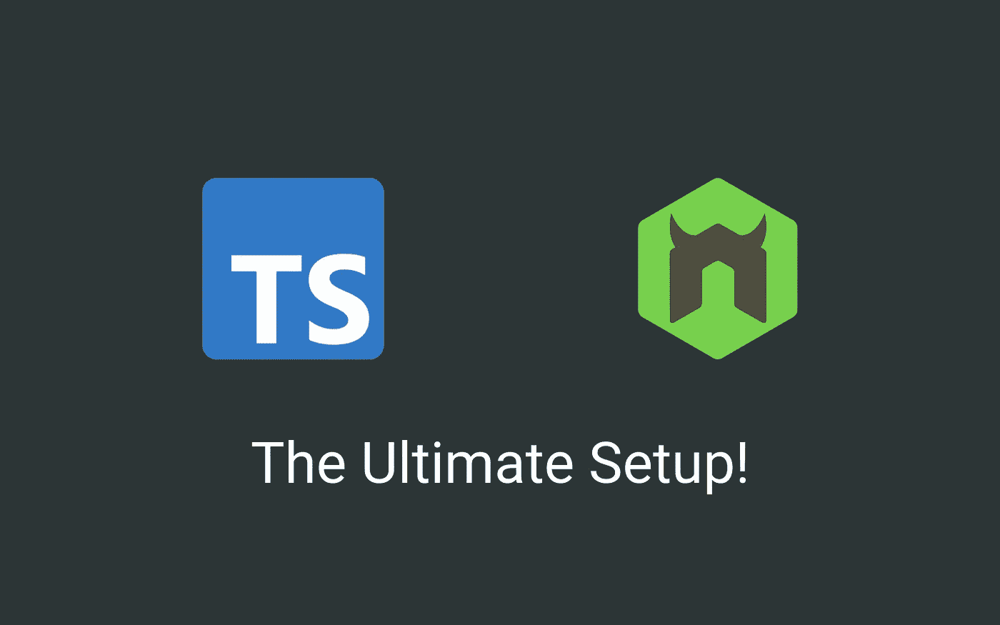
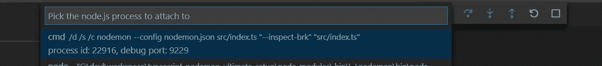

# TypeScript & Nodemon —终极设置！

> 原文：<https://levelup.gitconnected.com/typescript-nodemon-the-ultimate-setup-7200aa60cc8b>

## 了解如何设置 TypeScript 和 Nodemon 来提高您的工作效率并轻松开发！

设置 TypeScript 和 Nodemon 有时会很棘手，在本文中，我将向您展示如何轻松设置 TypeScript 和 Nodemon！

在[github 资源库](https://github.com/talohana/typescript-nodemon-ultimate-setup)中找到本文的完整源代码

## 创建一个示例项目

让我们从创建一个示例项目开始，我们将通过运行:

`mkdir typescript-nodemon-ultimate-setup`

接下来，通过运行以下命令创建最小 npm 包:

`npm init -y or yarn init -y`

> *注意:为了减少冗长，对于本文的其余部分，我将使用 npm 并省略 yarn 命令*

添加所需依赖:
`npm i -D typescript ts-node nodemon @types/node`

通过运行`npx tsc --init`初始化 TypeScript

最后，我们需要一些源代码，所以让我们创建包含以下类型脚本的`src/index.ts`文件:

## 添加 Nodemon

Nodemon 可以用各种方式配置，我将通过在我们的项目根文件夹中添加`nodemon.json`用一个 json 文件来配置它:

让我们看一下配置:

*   可重启—一个我们可以用来手动重启程序的命令
*   忽略—我们不希望在更改时触发程序重启的文件列表
*   监视—当发生变化时，我们希望触发程序重启的路径列表
*   execMap —文件类型/扩展名与运行时之间的映射
*   env —要包含的环境变量
*   ext —节点监控的文件扩展名

为了运行和调试我们的设置，在`package.json`文件中添加两个脚本:

注意`dev:debug`脚本添加了`--inspect-brk`标志，这告诉 node 暂停程序执行，直到附加了调试器，这可以替换为
`--inspect`标志，以便在不暂停的情况下进行调试。

现在我们可以用`npm run dev`运行我们的程序，试着改变一些东西，看看程序用更新的代码重新运行！

## 使用 VSCode 调试

这个难题的最后一部分是添加 VSCode 调试配置。

创建包含以下配置的`.vscode/launch.json`文件:

现在，当我们通过`npm run dev:debug`启动 nodemon 时，程序会暂停，直到我们连接到它:

附加后，VSCode 将在第一行代码停止，您可以轻松地调试您的程序！