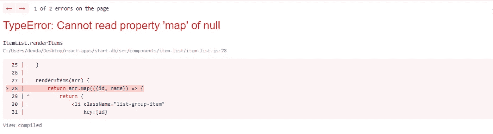
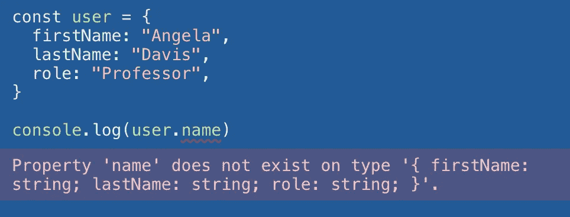

# 打字稿，第 1 部分:简介

> 原文：<https://levelup.gitconnected.com/typescript-part-1-an-introduction-b00ade194c4>


照片由[伯纳德·赫曼特](https://unsplash.com/@bernardhermant?utm_source=unsplash&utm_medium=referral&utm_content=creditCopyText)在 [Unsplash](https://unsplash.com/s/photos/typewriter?utm_source=unsplash&utm_medium=referral&utm_content=creditCopyText) 上拍摄

> 本文是 TypeScript 系列文章的一部分:
> 
> 打字稿，第一部分:简介
> 
> [TypeScript，第 2 部分:向应用程序添加 TypeScript](https://link.medium.com/S1eGx97DSmb)
> 
> [TypeScript，第 3 部分:使用自定义类型](https://link.medium.com/XMFlJgDDSmb)

在我的 JavaScript 之旅的早期，我喜欢这种语言提供的灵活性。有什么不喜欢的？JavaScript 提供了一种超级简单的编程体验，在这种体验中，我可以做任何我想做的事情，绝对没有任何阻碍。喜欢这个。

也就是说，我喜欢那个*，直到*我开始感受到它的后果。很快，随着我的工作变得越来越复杂，规模越来越大，用 JavaScript 编程开始感觉像是我玩过的最无趣的打地鼠游戏——我发现这种体验并不独特。我后来了解到，这很大程度上源于这样一个事实，即如前所述，JavaScript 极其灵活，而且是动态类型化的，这个术语将是本系列的核心。


在 [Unsplash](https://unsplash.com/s/photos/dynamic?utm_source=unsplash&utm_medium=referral&utm_content=creditCopyText) 上[赛·阿·布尔拉](https://unsplash.com/@sai_abhinivesh?utm_source=unsplash&utm_medium=referral&utm_content=creditCopyText)的照片

# 静态类型与动态类型

首先要理解的是，对于编程语言来说，静态类型化或动态类型化意味着什么:

## 动态的

*   在运行时检查类型
*   变量具有灵活的数据类型
*   JavaScript、Ruby、Python、PHP

## 静态

*   类型是在编译时检查的
*   变量要求在使用前声明其数据类型
*   Go，Java，C，Haskell

在动态类型语言中，您可以这样做:

```
let num = 5;num = "flamingo";
```

代码是完全有效的，尽管完全令人困惑。在静态类型语言中，你不能这样做。一旦用 number 类型的值声明了`num`，变量`num`只能被重新分配给另一个数字。如果最初声明变量时没有赋值，则在声明时需要类型赋值，如下所示:

```
var num int
```

在上面的代码中，`int`确定了`num`变量只能被赋值给一个整数，甚至在第一次赋值时也会被强制执行。


塞萨尔·卡里瓦里诺·阿拉贡在 [Unsplash](https://unsplash.com/s/photos/order?utm_source=unsplash&utm_medium=referral&utm_content=creditCopyText) 上的照片

# 类型的好处

那么，为什么要强制类型呢？答案很简单——它让你的生活更轻松。强制类型可以减少代码中的错误。这看起来眼熟吗？



不幸的是，我相信是这样的。看看错误消息开头写的内容:`TypeError`。在你代码的某个地方，你认为你在一个数组上调用了`.map()`，但实际上你是在一个`null`值上调用它。

这个怎么样？


还是这个？


这些都是`TypeErrors`，这些都可以通过类型强制和类型检查大大减轻甚至消除。想象一下，如果不是在应用程序使用期间等待错误发生，而是在您的文本编辑器中*收到一条小小的弯曲下划线和错误`Property ‘split’ does not exist on type ‘number’`，或`This expression is not callable`，或`Object is possibly ‘null’`。*

在 React 中，有一些其他的包旨在帮助满足这种需求，比如`PropTypes`这样的工具支持类型强制和检查组件之间传递的属性。但是道具只是开始。


# 你好，打字稿

用它自己的话说—

> **TypeScript** 是一种强类型编程语言，它构建在 JavaScript 之上，在任何规模下都能为您提供更好的工具。

由微软创建和维护(谢谢！)，TypeScript 允许您为应用程序配置类型强制规则，并提供应用这些规则的语法。从假设允许所有东西都是类型`any`(从语法上看，它与没有 TypeScript 的应用程序没有任何区别)到强制每个变量、返回值、参数等的显式类型。

如前所述，TypeScript 是 ***强*** 类型化的，而不是 ***静态*** 类型化的，这就是为什么您仍然拥有这种灵活性。类型可以被覆盖(虽然我不建议这样做)，可以被可变性组合(例如，`let num number | string`可以声明一个可以被赋值为数字或字符串的变量，除此之外别无其他)，等等。最终，它会编译成 JavaScript，并且仍然是动态类型的。



[https://www.typescriptlang.org/](https://www.typescriptlang.org/)

这几乎没有触及 TypeScript 所能提供的皮毛。接下来，我们将介绍如何将 TypeScript 添加到您的 JavaScript 应用程序中(我们将在 React 中工作)，并深入研究 TypeScript 中可供我们使用的各种类型。