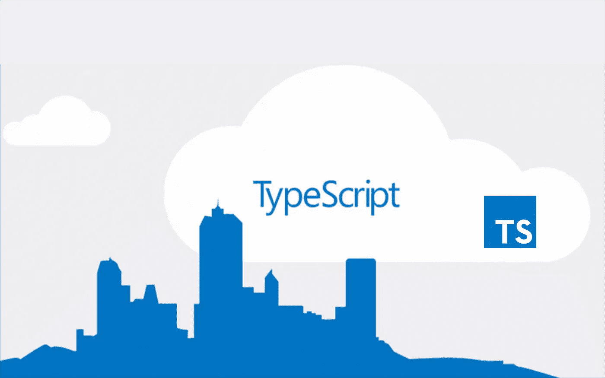
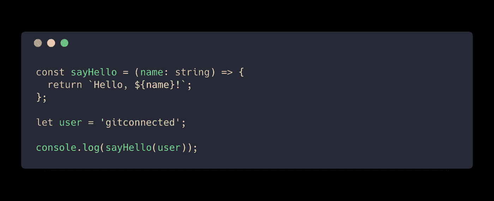
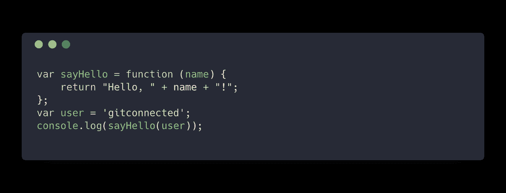
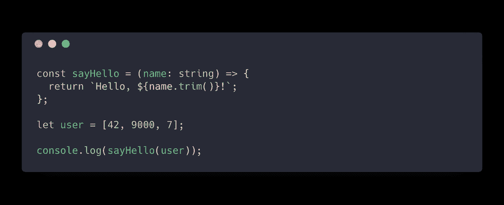
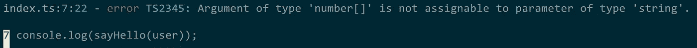
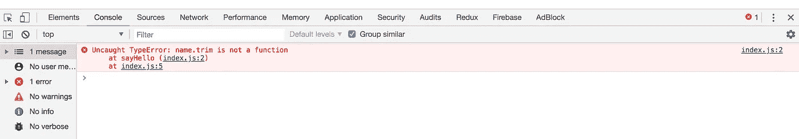

# TypeScript 快速入门指南

> 原文：<https://levelup.gitconnected.com/typescript-quick-start-guide-7257c2b71538>



本文将向您展示如何快速启动并运行 TypeScript，并且我们将讨论使用 TS 的利与弊。TypeScript 是 JavaScript 和 TC39 标准的超集。使用 TS，我们能够为代码中的变量定义简单和复杂的静态类型。

TypeScript 是简单的 JavaScript，可选地为变量添加类型。当使用 TypeScript 编码时，您可以使用现代 JavaScript 语法(ES2015+)进行编写，编译器会将 TypeScript ( `.ts`)转换为 JavaScript ( `.js`)，并提供将 JavaScript 转换为早期版本(如 ES5)的能力。

> 请注意，如果您为浏览器使用模块解析，如`require()`或`import/export`，您仍需要为浏览器使用捆绑器，如 Webpack、Rollup 或 SystemJS。

[](https://gitconnected.com/learn/typescript) [## 学习 TypeScript -最佳 TypeScript 教程(2019) | gitconnected

### 打字稿的前 17 门课程。教程由开发者提交并投票，使您能够找到最好的…

gitconnected.com](https://gitconnected.com/learn/typescript) 

# 安装 TypeScript

首先使用以下任一 npm 安装 TypeScript:

```
npm install -g typescript
```

或纱线:

```
yarn global add typescript
```

一旦在全球范围内安装，您将在终端中使用`tsc`命令。

# 编译. ts 文件

使用您的终端，使用以下命令创建一个名为`ts-simple`的新目录:

```
mkdir ts-simple
```

`cd`到这个目录并创建一个`index.ts`文件。在这个文件中，我们将创建一个名为`sayHello`的函数，它带有一个类型为`string`的参数`name`。



现在使用`tsc`来编译您的`index.ts`:

```
tsc index.ts
```

这创建了一个`index.js`，它从`sayHello`函数参数中移除了类型，并将文件转换成 ES5 代码。生成的 JS 文件可以安全地在浏览器或节点上运行。您的 JavaScript 文件将如下所示:



要对此进行测试，请使用以下命令运行新创建的文件:

```
node index.js
// "Hello, gitconnected!"
```

[](https://gitconnected.com/portfolio-api) [## 组合 API -轻松发展您的编码事业| gitconnected

### 消除在每个单独位置手动更新您的详细信息的痛苦。只需在您的中更改一次数据…

gitconnected.com](https://gitconnected.com/portfolio-api) 

# TypeScript 编译错误

TypeScript 的好处之一是，如果类型不匹配，它可以自动捕捉代码中的错误。例如，想象在上面的例子中，我们想要在传入的字符串上调用`.trim()`函数。如果我们传入任何其他类型的变量，可能会导致我们的代码在生产中抛出一个错误，而不是在之前捕获它。让我们通过错误地将数组传递给函数来看看我们更新后的示例:



当我们运行`tsc index.ts`时，这会导致下面的 TypeScript 错误:



如果我们没有 TypeScript 保护我们，并允许我们在将代码交付生产之前修复错误，那么我们的用户在访问我们的网站时可能会遇到以下错误。



# 其他类型脚本文件扩展名

除了`.ts`文件，还可以使用`.d.ts`文件向预先存在的 JavasScript 库中添加类型，或者使用`.tsx`文件在 React 应用程序的 TypeScript 中编写 JSX 语法。

# 打字稿的好处

*   **在编码时捕捉 bug，而不是在生产中**。类型允许我们在问题变坏之前识别它们。
*   **智能感知和代码完成**。大多数主流 IDE 和文本编辑器都支持 TypeScript，包括 VS Code 和 Atom。它们提供了强大的 TypeScript 集成，可以自动完成代码，指示函数参数而无需查看源代码，并提供内联错误识别。
*   **改进代码可读性**。当您拥有强类型的变量、函数和对象时，TS 提供的结构使得推理新代码变得更加容易。它消除了许多关于数据将呈现何种形状的猜谜游戏。
*   **写 ES2015+** 。TypeScript 编译器处理所有现代 JavaScript，并可以向后编译到以前版本的 JS 以实现兼容性。
*   **可选静态打字**。TypeScript 不要求所有内容都是静态类型的，因此您可以增量转换项目。
*   **大生态系统**。TypeScript 自 2012 年以来一直存在，这段时间让它发展了一个强大的生态系统。许多开源包本身就提供了 TypeScript 类型，使得集成更加容易。
*   **增加职业机会**。TypeScript 的采用率正在迅速上升，它已经被包括谷歌和微软在内的许多大型科技公司整合。通过理解 TypeScript，你在找工作时增加了你的市场竞争力。
*   **额外好处:在使用带 React 的 TypeScript 时不需要** `**PropTypes**` **。如果您使用 TypeScript，您不再需要管理 React 的 PropTypes，这允许您更快地捕捉错误，并使 props 与代码中使用的类型更紧密地耦合。**

# 打字稿的缺点

*   **编写新代码的前期成本更高**。由于需要更多的代码，它可能会减慢新功能的开发速度，这可能不是每个公司/初创公司的理想权衡。
*   **另一个与**保持同步的库。如果你想与 TS 保持同步，随着新版本的出现，它将需要一些重构。
*   **JavaScript 工程师的学习曲线**。TypeScript 将花费更多的时间来培养那些以前只用 JS 编码的工程师。
*   **复杂类型可能很难弄清楚**。如果您正在将 TypeScript 集成到一个现有的代码库中，那么您可能会遇到这样的麻烦:正确地输入所有内容，以及处理复杂的数据结构，而这些数据结构在只有 JS 时“刚刚工作”。
*   **更详细的代码**。虽然这种结构最终是有帮助的，但代价是与 JavaScript 相比，您将使用更多的字符来编写相同数量的代码。
*   你还需要一个捆扎机。Webpack，SystemJS 等。)的一些语法，如 ES2015 模块的`import` /`export`**。**

您有兴趣在 React 中使用 TypeScript 吗？[查看此文>](/typescript-and-react-using-create-react-app-a-step-by-step-guide-to-setting-up-your-first-app-6deda70843a4)

[](https://gitconnected.com/portfolio-api) [## 组合 API -轻松发展您的编码事业| gitconnected

### 消除在每个单独位置手动更新您的详细信息的痛苦。只需在您的中更改一次数据…

gitconnected.com](https://gitconnected.com/portfolio-api)