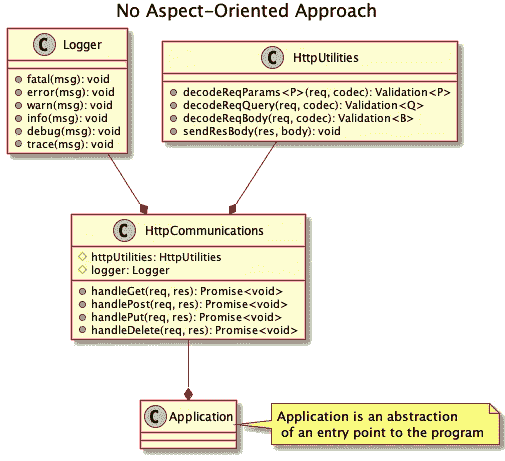
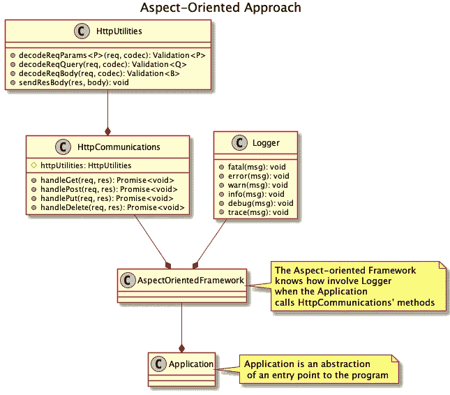

# 打字稿间谍大师

> 原文：<https://levelup.gitconnected.com/typescript-spymasters-7902ad895b6d>

冷战期间，各种各样的小说家普及了间谍头子的概念。间谍头子是管理间谍网的人，在冲突中，他无疑是任何重要力量的重要人物。如果我告诉你我们可以把间谍大师引入打字稿呢？

由 [Lucas Santos](https://unsplash.com/@_staticvoid?utm_source=medium&utm_medium=referral) 在 [Unsplash](https://unsplash.com?utm_source=medium&utm_medium=referral) 拍摄的照片

# 间谍

首先，我们需要定义基本面。在 TypeScript 上下文中，间谍是代理对另一个对象的所有访问并记录交互的对象。Sinon.js 库提供了一个示例性的 spy 实现。我在下面的一个片段中使用了它。

使用 Sinon.js 库的例子。

作为一个练习，考虑在 TypeScript 中自己实现 spies，而不用查看 Sinon.js 实现。我在本文的**解决方案**章节中提供了这个问题的答案。

我们为什么需要间谍？

在一些场景中，比如测试，我们想知道一个特定的函数是否:

*   叫做，
*   多少次了，还有，
*   用哪些参数(包括上下文变量`this`)。

此外，您可以跟踪函数返回值。您还可以检查函数是否抛出了异常。

间谍怎么可能知道函数调用者呢？请自行解决，作为练习。同样，我在本文的**解决方案**章节中回答了这个问题。

除了测试，还有其他用例。我们可以使用它进行日志记录、审计、调试，或者基于传入的函数参数执行额外的操作。如果你是一个经验丰富的开发人员，短语*面向方面编程*可能会让你想起什么。这是有原因的。

# 面向方面编程

面向方面编程需要一篇独立的文章——也许我很快就会写一篇。这种范式最重要的原则是分离横切关注点以增加代码模块化。

为此，我们需要首先认识到这些*交叉关注点*。

例如，HTTP 后端需要一些与 HTTP 通信相关的代码，可能还需要一些日志记录。我们通常会编写一个类来完成这两项工作。这个类是一个跨领域的问题，因为它将两个功能(HTTP 通信和日志记录)组合为一个方面。

使用非面向方面方法的项目的 UML 图。

我们可以分别实现这两个功能，一个不知道另一个的存在。我们将把日志转移到一个不同的类中，公开两个方法:

*   一个用于打印功能参数，
*   一个用于打印函数返回值或返回的异常。

一个问题仍然存在——我们如何将这两个类结合在一起？

理想情况下，我们将使用一个框架，在 HTTP 通信正在进行时启用日志记录。这意味着框架会窥探(没有双关语的意思！)并在需要时调用适当的日志记录方法。

使用面向方面方法的项目的 UML 图。

显然，spies 是 AOP 库的原始实现。一个库，而不是一个框架，因为我们需要建立自己的间谍。

我提到 AOP 是因为我们可以使用它的术语和发现。间谍提取关于函数使用的元信息。您可以通过一些建议来利用它，这些建议是添加到您的业务逻辑中的独立代码。如果你单独维护你的建议，你可以在你的代码库中为不同的对象使用它们。

# 间谍组织的首脑

至此，我们已经定义了什么是间谍，以及我们为什么要使用他们。此外，我解释了它们与面向方面编程的明显联系。现在，我们为什么需要间谍头子？

如果我们有间谍，我们可以直接把他们交给他们的附属国。因为它们是代理，我们不需要改变依赖代码的类型。这就是代码模块化近来越来越受欢迎的原因。

我建议我们把间谍组织在一个间谍头子之下——一个保存所有间谍参考资料的对象。通过这种方式，我们可以将所有这些信息集中在一个地方，进行集中管理，就像在计划经济中一样。spymaster 对象还允许我们切换到不同的间谍——这违反了不变性原则。

现在，您可能希望将 spymasters 传递给实现业务逻辑的代码。如果你这么做了会发生什么？您必须更改所有依赖项中的签名，暴露我们的 spymaster 用法。这不是很隐秘，是吗？

一个好的间谍头子会让他们的间谍伪装起来，并保持行动的隐蔽性。我们必须以同样的方式行动。我们不是直接注入一个间谍，而是将一个代理传递给这个间谍，保持签名处于检查状态。每次我们换一个不同的间谍，间谍代理保持不变。

这意味着我们可以建立以下规则:

> 间谍代理对某些对象的访问，间谍头子代理对间谍的访问。

如果你仔细看看，间谍代理是间谍的间谍，这使得间谍大师成为一个终极代理人，因此得名。

# 我的图书馆

由于我已经介绍了间谍头子的概念，我需要首先向你们展示我为什么需要它。

如果您编写了许多测试，您可能会花费大量的时间来建立集成测试的依赖关系。您可能最终得到一个为每个测试用例创建相同依赖集的测试套件，只有一个依赖是不同的。

幸运的是，我们可以轻松地节省时间和代码。我们可以在间谍头子手下使用间谍，并把这些间谍作为附属品传递。为了替换特定测试套件的特定间谍，我们将要求 spymaster 这样做，而无需重新创建所有依赖项。

一个间谍大师取代引擎盖下的间谍参考的例子。

你可以说 spymaster 是一个间接的依赖注入容器。我同意这一发现，但这不是计划中的功能，而且它超出了 spymaster 需要做的范围。

我的名为`@grzpab/ts-spymasters`的库可以在 [GitHub](https://github.com/grzpab/ts-spymaster) 和 [NPM](https://www.npmjs.com/package/@grzpab/ts-spymaster) 上下载。使用前请阅读`README`文件。

# 解决方法

我们如何自己实现间谍？

通过使用代理 API。我将在回答第二个问题时提供用法示例:

我们怎样才能告诉间谍打电话的人呢？

一般来说，我们需要检查函数调用栈来了解调用者。在函数中获取调用堆栈最简单的方法是抛出一个错误。它需要被抛出它的同一个可调用函数立即捕获。

提取错误后，我们可以检查它的堆栈属性。它是包含堆栈跟踪的可选字符串。我们需要从顶部取出存储在第三行中的信息。为什么是 3 号线？由于 Node.js 构建跟踪的方式。

间谍通常是构建在代理 API 或合成代理实现之上的对象。当来电者访问间谍时，我们需要提取来电者信息。您可以在下面的代码片段中看到一个参考实现:

检查函数调用方的示例代码片段。

# 摘要

你可能想知道为什么我把间谍头子和冷战联系起来，为什么这篇文章如此频繁地提到那个时代。除了作为一名软件开发人员和技术内容作者，我对 20 世纪的历史很感兴趣。我不打算写历史文章，但也许我会在我即将发表的编程文章中用到我的知识。