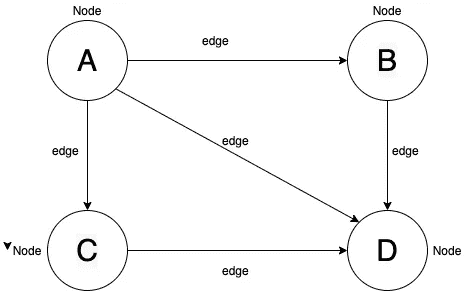
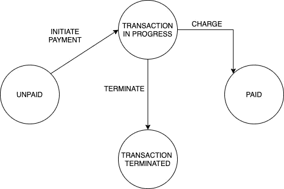

# 类型脚本状态机

> 原文：<https://levelup.gitconnected.com/typescript-state-machine-a6fa24f45130>

编程如今变得如此流行，以至于几乎每个人都可以开始编程。每天都有许多问题出现，有些解决了，有些没有。事实是，每个程序员大约有 50%的时间使用另一个库或包来完成他的任务。但是他们中很少有人真正知道事情是如何运作的。

我一直觉得有趣的一个话题是状态机，通常是图。状态机可以解决这么多问题——应用程序状态、路由、处理针对各种实体调用的操作等等。总是实现状态机或使用库是一个好主意。但是理解状态机如何工作是很重要的。

为了更好地理解状态机，我们必须首先理解图数据结构。

# 图形数据结构



图 1 —图表表示

每个图形结构由两个主要部分组成:

*   节点
*   优势

节点是信息的持有者。每个节点可以有 N 个来自自身的输出，它们被称为边。例如，节点 A 自身有三个输出，即从 A 到 B 的边。因此，我们可以将图定义为具有多个输入和多个输出的数据结构。

图 1 中的图形结构有四个节点:A、B、C、d。这些节点是信息的持有者，通过边，它们可以到达其他节点。所以我们可以说，边是从一个节点到另一个节点的途径。

因此为了将来参考，我们将边缘称为**转换**。

如果我们在谈论本地图结构，我们可以定义以下类:

要点 1 —类边缘。

类边至少由三个属性组成:

*   自-边来自的节点
*   到-边到达的节点
*   价格——通常是表示边的权重的值。它用于人工智能和计算机网络中的多种算法，以选择选择哪种方式或寻找节点之间的最短距离

要点 2 —类节点。

当我们定义这些实体时，我们可以用边连接节点来建模我们的图。所以我们需要做的是:

要点 3 —类图。

当然，这是一个基本的定义，所以这些几乎都是扩展的。Connect 方法只是提供了一种用一条边连接两个节点的方法。所以它在两个节点之间创建了一条边。

因为我们正在讨论状态机，所以我做这个介绍是为了给你提供一个图如何工作的例子。基本上它是一组节点和边。你可以很容易地在它们之间穿行。因此，如果我们将此转换为状态机，我们可以定义新的实体或类似的实体。

# 状态机

先说别的，先说状态机是用来干嘛的。许多路由器被实现为状态机。基本上，您正在访问的页面只是这些路由器中的状态，您调用转换。因此，通过将路由器实现为状态机，你可以创建中间件和围绕转换的钩子。让我们看看下图中的状态机。



图 2 —支付状态机

当我们谈论图片(图 2)上定义的支付时，我们可以得出结论，它由四种状态组成。这些状态是:

*   未付款的
*   交易正在进行中
*   交易终止
*   有报酬的

当我们在上一节中讨论图形时，我们可以说这些状态在图形结构中被表示为节点。图中的边是状态之间的转换，它们是:

*   开始付款
*   结束的
*   费用

所以现在我们知道了支付流程的每一部分都发生了什么。我们可以很容易地调试它，或做一些日志，等等。

我的想法是不要实现一个特定的状态机，它只用于一个目的。我想做得更多，我想实现一个通用的状态机，可以实现任何业务逻辑。它将如何工作，我们可以通过状态机代码来讨论。

# 通用状态机

首先，让我们定义我们将在状态机中使用的接口。

要点 4 —过渡接口。

顾名思义，转换表示状态之间的转换。它是由它来自的状态、它结束的状态以及触发转换的动作来定义的。

要点 5 —处理程序接口。

处理程序是在动作发生时调用的方法。例如，如果我们有一个定义为 **CREATE_ACTION** 的动作，那么处理程序将是名为 **onCreateAction 的方法。**当我们想要为特定的业务逻辑使用我们的状态机时，处理程序被定义。

要点 6 —状态机配置接口。

StateMachineConfig 是一个定义状态机配置的接口。当我们创建一个状态机时，我们在构造函数中提供对象，它告诉状态机它的初始状态，状态机中存在哪些转换，以及当转换发生时应该调用的处理程序。

现在，当我们知道我们的状态机有哪些类型时，我们可以描述状态机是如何工作的。想法是把重点放在转换上，而不是状态上。如果我们这样做，我们将担心处理程序、动作和结束状态将是处理转换的一部分。

动作是如何触发的？触发动作的想法来自于 flux 架构。动作被分派。但是要做调度，我们必须知道我们在什么状态下调度一个动作。所以流程看起来像这样:

```
for(state).dispatch(action, payload);
```

这将引发针对国家的诉讼。有效载荷只是一个对象或任何其他数据，程序员使用它在状态或转换之间传递信息。这个针对状态的动作调度调用在状态机的配置中定义的适当的处理程序。状态机配置如下所示:

要点 7 —状态机配置示例。

所以如果我们触发了**为(“待定”)。dispatch("accept "，{})** ，它将触发 Accept 处理程序上的**，并执行一些工作。For 方法定义为:**

要点 8 —用于方法实施。

现在我们看到，状态机进入由前一个状态定义的状态，并针对它调用操作。私有方法 **dispatch** 获得一个适当的处理程序并调用它。

要点 9 —私人调度方法。

动作处理程序存储特定动作的处理程序的散列数据结构。通过这样做，每个动作都被映射到处理程序。当状态机实例化时生成动作处理程序散列，并用 **populateActionHandlerHash 填充。**

要点 10 —填充操作处理程序哈希方法实现。

方法 generateActionEvent name 只是为给定的动作创建处理程序名(CREATE -> onCreate)。

# 结论

状态机非常重要，它们为项目提供了稳定性。尽可能使用它们，不要回避它们。我们之前在节中讨论的状态机是通用的，它可以用于任何业务逻辑。因此，我们关注于转换，并且定义了处理程序。之后，一个简单的动作调度就足以完成一个特定的目标。