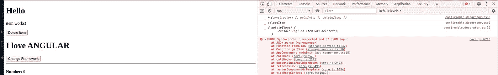
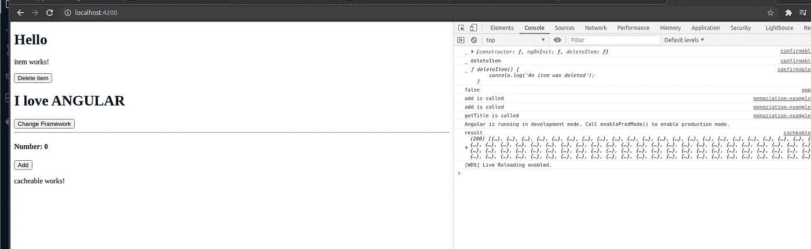

# JS 开发人员的 Typescript 提示和技巧(第 2 部分)

> 原文：<https://levelup.gitconnected.com/typescript-tips-and-tricks-for-js-developers-part2-d7d750769b5f>


# 介绍🚩：

你好，🇩🇪🇹🇳:

今天我很高兴向大家介绍我的第二部分，关于打字技巧和窍门。我得到了关于[第一部分](https://ahmedrebai.medium.com/typescript-tips-and-tricks-with-typescript-for-angular-developers-ea000f50550c)的积极反馈，该部分没有涵盖所有可用的技巧和 Typescript 提供的丰富皮肤，所以我决定添加第二部分来讨论:

*   定制装饰
*   更深层次的泛型(约束)

希望对 bog ✍️亲爱的社区有帮助，阅读愉快:)

# #Tip1:自定义装饰🔧 🔨

我们将从 Typescript 提供的一个非常有趣和有用的功能开始:“自定义装饰者”🛡🛡。

Decorators 是一种添加注释的方式🚧和元编程语法添加到类及其属性或参数中，

例如，在 Angular 中，我们可以使用 Decorators 的用例列表如下:

*   通过`ngOnchanges`跟踪组件属性变化。
*   调用`unsubscribe`避免内存泄漏。
*   角度区域之外的复杂计算。
*   计算执行时间
*   处理和记录错误。
*   使用*存储 API。*
*   页面参数

等等…

**问题** ⛔️:

在开发项目中的一些特性时，您将处理日常操作、重复的任务和重复的代码🚩！这将随着项目的发展而产生不良影响！

**解决方案** ✅:

有了 typescript，我们可以从定制装饰器特性中获益

我将展示一个如何实现**自定义装饰器(安全)**的例子

因此，我们将实现一个注释“Safe ”,添加该注释是为了避免在处理**存储 API** ⛑时出现意外错误

代码解释✂️:

*   **safedirectorparams**:定义可以传递给装饰者的参数类型
*   **safedirectorloglevel**:代表可用日志记录级别的枚举类型
*   **导出函数安全< T >** :定义我们装饰者的名字
*   **const original method = descriptor . value**:我们首先缓存原始的方法实现
*   **const log level = params . log level | | safedirectorloglevel。默认**:获取当前日志级别
*   **descriptor . value = function(…args){:**我们的自定义逻辑(对于我们的情况，当捕获到错误时，我们将选择创建一个控制台消息或您的自定义错误处理程序，并返回我们的描述符(装饰符)
*   **存储服务**实现:

现在我们将把装饰器添加到我们的**存储服务**中实现的方法中

*   **应用组件 ts** :

现在，我们将在 app 组件中注入我们的服务，并对 localStorage 中一个不存在的项目进行调用:“test”，然后检查两个场景(不带“@Safe”，带“@Safe”)

```
*import* { *Component* } *from* '@angular/core';*import* { *StorageService* } *from* './services/storage.service';*@Component*({selector: 'app-root',templateUrl: './app.component.html',styleUrls: ['./app.component.scss'],})*export* *class* AppComponent {*title* *=* 'customDecoratorwith';*constructor*(*private* storageService*:* StorageService) {}*ngOnInit*() {***console*.*log*(*StorageService*.*getItem*('test'));**}}
```

*   没有**装饰器的结果安全** ✖️:



*   使用**装饰器安全** ✔️的结果:



# #Tip2:更深层次的泛型(约束)🔧 🔨：

现在我将试着解释一些在之前的博客中没有提到的关于类型脚本泛型的有趣的事情:"**泛型约束** " ⛏.

所以正如我们所说的，TypeScript 泛型帮助我们编写可重用的代码，但是有些事情我们应该考虑使用泛型🚩：

1.  这个函数或类是否需要处理多种数据类型**❔**
2.  这个函数或类**会在❔的多个地方使用吗**

此外，我们可以通过使用“关键字扩展”对泛型类型参数应用约束，以进行更多的类型检查，并确保类型属性存在。

**代码示例**📙 ✍️:

我们正在实现一个通用函数 **getLength(args: T)** ，它将返回作为 **params** 传递的参数的*长度*！

**问题** ⛔️:但是如果 args 没有长度属性！🚫 🚫

(将会抛出一个错误)

**解决方案** ✅:

定义接口 **functtArgs** 用于类型检查，并通过添加

```
<T extends functArgs>
```

我们告诉我们的编译器只接受具有长度属性的参数！

# **参考文献**📓 📕 **:**

*   [https://blog . dev genius . io/custom-method-decorators-in-angular-a-http-cache-decorator-fb21d 1e 09932](https://blog.devgenius.io/custom-method-decorators-in-angular-a-http-cache-decorator-fb21d1e09932)
*   [https://github.com/DmitriyKhirniy/typescript-decorators](https://github.com/DmitriyKhirniy/typescript-decorators)
*   [https://level up . git connected . com/building-custom-typescript-decorators-for-angular-4595816 e7b 87](/building-custom-typescript-decorators-for-angular-4595816e7b87)
*   [https://www . typescripttutorial . net/typescript-tutorial/typescript-generics/](https://www.typescripttutorial.net/typescript-tutorial/typescript-generics/)
*   [https://blog . log rocket . com/getting-started-with-typescript-generics/](https://blog.logrocket.com/getting-started-with-typescript-generics/)

# 结论✍️:

总之，在 Typescript 技巧的第 2 部分中，我只是试图涵盖和解释一些有趣的特性，如**自定义装饰符**和**通用约束**，这些特性在 JS 开发人员编写服务器端或客户端代码时会很有帮助。⛹ ⛏

等待您的反馈:)

你可以跟着我:

[推特](https://twitter.com/RebaiAhmed_)

[Github](https://github.com/Rebaiahmed)

谢谢🙏