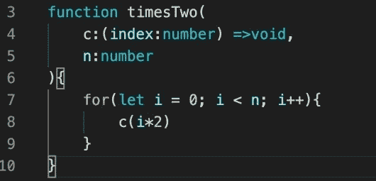
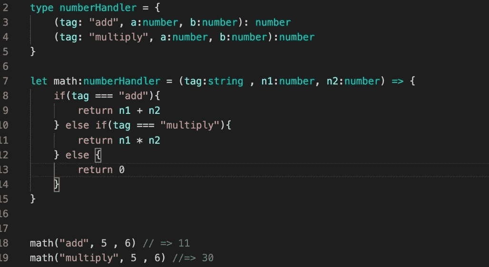
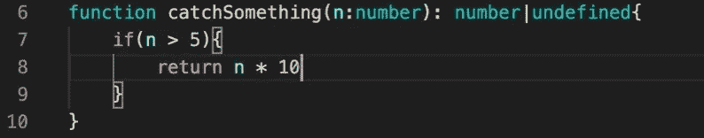
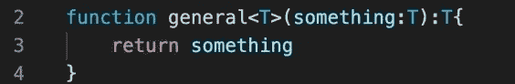
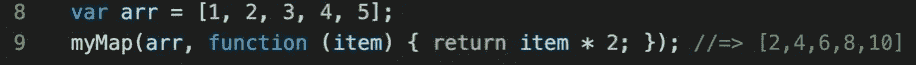
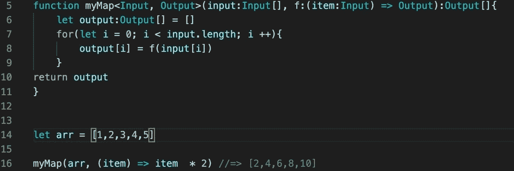
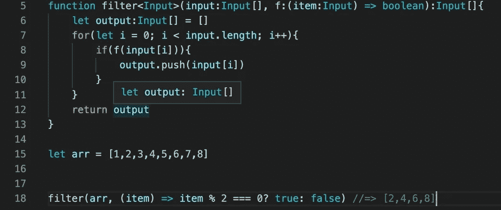
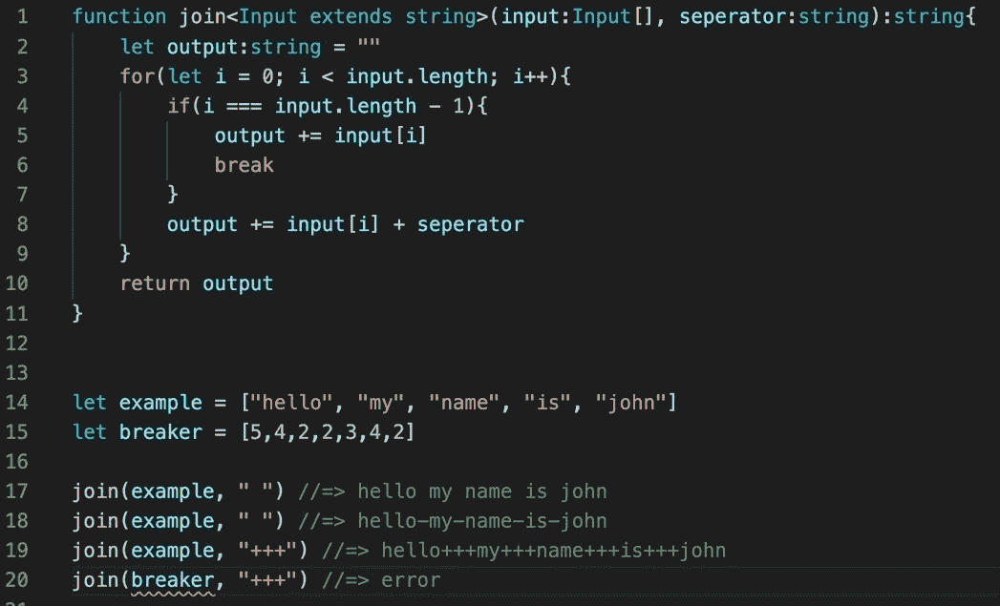
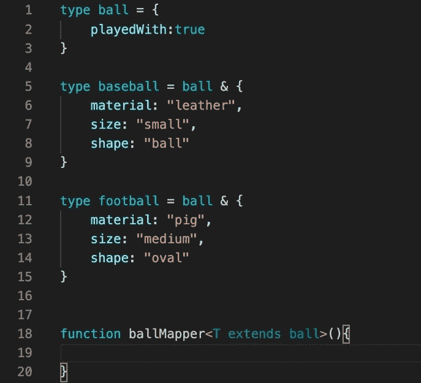

# Typescript:任何函数的类型签名。

> 原文：<https://levelup.gitconnected.com/typescript-type-signatures-for-any-function-c21a22596d1c>


今天我将描述如何为各种 javascript 函数编写类型签名。这将有助于读者缩小类型，增加可靠性，类型依赖性，等等。

类型签名就像任何给定代码段的蓝图。它告诉编译器事物是什么。类型良好的程序更可靠，运行速度更快。它们还为编译器提供了许多额外的信息，帮助我们更快地识别错误。

# 函数类型签名的“hello world”。

对函数进行类型化的最基本方法是声明参数和返回。

```
const returnArg = (arg:number):number => {
return arg
}
```

正如您所看到的，参数是数字类型的，括号与函数体的返回语句具有相同的类型声明。

如果我们改变返回，我们可以改变类型签名。这是完全相同的函数，除了它返回一个字符串而不是一个数字。

```
const returnArg = (arg:number):string => {
return "yow"
}
```

函数体内部的任何内容都与 typescript 中的其他内容类型相同。函数体可以被视为它自己的独立程序。

由于 Typescript 的推断，如果不总是键入 return 语句，效果几乎一样。

```
const returnArg = (first:number, second:number) => {
return first + second
}
```

在这个例子中，我们没有显式地输入函数 return，但是因为两个参数都是显式的数字，所以编译器足够聪明，知道它们不能是其他任何数字。

# 类型级别和值级别

我们也可以将类型签名从函数语法中提取出来，单独编写。

```
//type level
type add = (a:number, b:number) => number//value level
let addNow:add = (a, b) => {return a+b}
```

在这个例子中，我们已经严格地分离了类型级和值级代码，但是这个函数的工作方式是一样的，并且和其他函数一样类型化。

# 同样的游戏，不同的名字

这两个的编译方式是一样的。一个是速记语法，另一个是完整签名。

```
//shorthand
type add = (a:number, b:number) => number//full signaturetype add = {(a:number, b:number):number
}
```

# 上下文类型

我们从编译器得到的推论比更清晰的语法给我们提供了更多的能力。我们可以为函数编写类型签名，然后在声明它们之前调用它们。



在这个例子中，我们已经告诉编译器，有一个带有特定类型签名的函数“c ”,我们想调用它 n 次。这可能看起来很奇怪，因为我们只提供了一个签名，而不是我们通常会提供的声明体。

当然，“c”实际上不会被调用，直到父函数“timesTwo”被调用。当我们准备好的时候，我们可以内联声明“c”。

```
timesTwo(n => console.log(n), 8)
```

当我们调用“timesTwo”时，它足够聪明地将我们的内联函数识别为“c ”,并采用我们声明的类型签名。

在这种情况下，它从 0 开始将每次迭代乘以 2。

理解这一点的一个好方法是，我们将为变量“c”传递一个函数，我们知道它将以这种特殊的方式运行，但我们不知道“c”看起来是什么样的，直到调用“timesTwo”。

# 重载函数

在大多数静态类型语言中，我们希望我们的函数尽可能的隔离和调整。换句话说…理想情况下，我们的函数将只接受一个东西并输出一个东西，我们可以尽可能地保持我们的类型。然而，由于 Javascript 是一种动态语言，我们无法避免重载函数。尽管它们的结构很脆弱，但它们已经融入了我们日常使用的大多数公共库和约定中。

> 重载函数是具有多个调用签名的函数

动态语言打开了重载函数的大门。它们随处可见。

例如，假设我们想要一个多用途函数，用数字来做事情。



它像其他函数一样工作，除了我们必须在函数体中提供逻辑，告诉编译器我们在做不同的事情。

我们也可以在类型上使用 OR 运算符来处理重载函数。



# 无商标消费品

假设我们想输入一些东西，尽管我们不知道它看起来像什么。作为一个比喻。我们不知道外星人访问地球时会是什么样子或行为，但我们知道当他们来的时候，我们会试着和他们交流。

同样的逻辑也适用于我们的编程。我们可以创建一个函数，说它将接收一些值，忽略细节，然后尝试用它做一个特定的任务。



泛型的语法是通过将别名放在函数名后面的箭头括号中来实现的。

我们说某样东西是某种类型，这个函数的返回语句也是同一种类型，不管是什么类型。

泛型最常用于动态语言的内置函数中。

例如，在 Javascript 中，我们有 map 函数。

## 地图



我们可以通过告诉编译器我们将传入某个泛型数组来键入这个函数，输出将是一个不同的泛型数组。关于这些类型，我们唯一能确定的是返回的数组和输入数组的类型不同。



## 过滤器

过滤器也是一样。我们传入一个通用数组，在返回一个数组之前，删除所有不符合标准的值。filter 的一个关键区别是，我们实际上并没有改变输入数组中的元素，因此输出数组具有相同的类型。



有时我们需要通用，但是我们仍然希望缩小我们的类型。例如，假设我们想要一个通用函数，它将专门处理字符串数组。

这叫做给我们的泛型加上一个上限。

## 加入



在这个例子中，我们创建了通用的 Join 函数，只是它只对字符串数组有效。

当我们想要构造特定领域的泛型函数时，上限泛型变得更加有用。假设我们有一个程序，它对球进行了分级，我们想创建一个通用函数，这个函数只适用于我们在健身房里找到的项目。



我们就是这么做的。使用“球映射器”,我们可以映射到任何子分类上，但它只对球层次内的对象有效。

# 结论

这就是我目前要讲的全部内容。

当然，还有其他约定可以使用。其中一个主要的是生成器函数，但是我跳过了它们，因为它们在最近的版本中没有得到很好的支持。

下次见。