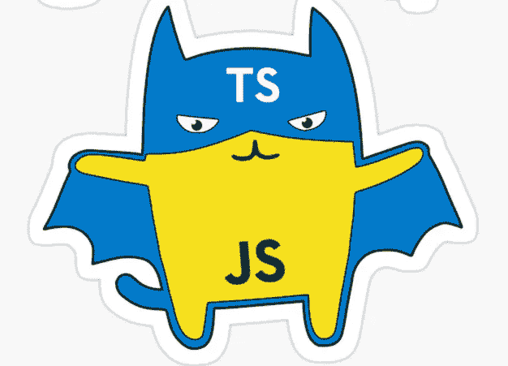

# 打字稿打字警卫很奇怪

> 原文：<https://levelup.gitconnected.com/typescript-typeguards-are-weird-723104df508d>



**引擎盖下的 Typescript 是 Javascript，Javascript 很诡异**。Typescript 的前提是通过使用在编译时而不是运行时捕获类型错误的类型系统，为 Javascript 带来一些健康。显式地编写类型而不使用类型强制几乎不需要额外的时间，但是给了我们在开发过程中拥有更好的工具的好处，也给了我们交付无 bug 软件的更好的确定性。

# 打字稿箱

即使是 Javascript 的创始人 Brendan Eich 也后悔仓促进行类型强制，从而使它变得草率。如果您不熟悉术语“类型强制”,我想快速向您解释一下它的含义:

> Javascript 中的类型强制允许进行隐式类型转换，这允许对不同类型的变量进行操作。注意，每个 Javascript 变量都有一个类型，即使它没有被明确指定。

由于类型强制，类似这样的意外情况实际上会发生:

```
const nope = Array(10).join("nope" - 1) + " Batman!";console.log(nope); // --> NaNNaNNaNNaNNaNNaNNaNNaNNaN Batman!const a = [ 1, 2, 3 ];
const b = [ 1, 2, 3 ];console.log(a + b); //-> 1,2,31,2,3
```

这清楚地表明了我的观点，我们确实需要 Typescript。老实说，Typescript 是 Javascript 有史以来最好的东西，但是它仍然不能解决 Javascript 的所有问题，原因很简单:

Typescript**trans files**到 Javascript，这意味着 Typescript 代码永远不会被执行，但总是被转换成 Javascript。一方面，这意味着我们在运行时无法访问 Typescript 类型，但另一方面，它允许轻松地从 Javascript 迁移到 Typescript，因为它可以逐步完成。

# 类型 of

在面向对象的编程中，类型保护，如 typeof 或 instanceof，用于确定变量的类型或类。这对于多态性(允许在运行时将具体的子类插入超类定义中)特别有用，可以构建类似工厂模式的东西，根据一些内部逻辑创建某个对象:

抓住你了。这是第一次接球。你可能期望 x 的类型是小的，y 的类型是大的，因为这是一种常见的 OOP 实践。有两件事需要知道:

1.  运行时没有 Typescript。typeof()在运行时执行，因此无权访问 Typescript 类型定义。

2.Javascript 中的类基本上只是构造函数和具有特定原型的对象的大量语法糖。

请注意，如果在接口上使用 typeof，输出仍然是“Object ”,因为接口不会转换为 javascript 中的任何内容。每个有接口类型的变量基本上都是原型对象。

# 实例 of

另一方面，Instanceof 对我们来说确实非常有用，因为它实际上可以通过查看对象原型是否继承了指定对象定义的原型来确定具体的类。

例如，`**p instanceof Person**`将查看`**p.prototype**`是否继承自`**Person.prototype**`。请注意，我故意使用了 inherit 这个词，因为一个对象原型与其所有的超/基原型是链接在一起的。

例如，几乎所有的原型都继承自 Object.prototype

在这个例子中，我们可以看到 x 的原型按照这个顺序链接了小对象、基类和对象。因此，这些类的 instanceof 返回 true，而 Big 的 instanceof 返回 false。

通过一些 Javascript 魔术，我们可以手动将类 Small 的原型更改为 Big.prototype。这样，使用 Small 构造函数创建的变量实例现在将成为 Small、BaseClass、Object 的实例，但也是 Big 的实例，因为 Big 和 Small 现在共享同一个原型。

这意味着只要原型相同，instanceof 就会返回 true。

# 接口

这一小段是为了明确说明接口不能以有意义的方式与 typeof 或 instanceof 一起使用，因为当 Typescript 转换为 Javascript 时，接口被完全删除，因为它们只包含变量和类型定义。得出接口只存在于 Typescript 空间中，因此在运行时不存在的结论是没有用的，相反，typeof 和 instanceof 是在运行时执行的。

# 结论

Typescript 很棒，但是由于它不存在于运行时中，我们仍然必须记住 Javascript 函数，即使类型是在 Typescript 中定义的，typeof 和 instanceof 函数与 Typescript 没有任何关系。您已经了解到 typeof 对于检查一个对象是否继承自一个类不是很有用，但是 instanceof 在这种情况下会有所帮助。接口不应与 typeof 或 instanceof 一起使用。