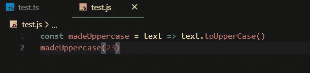
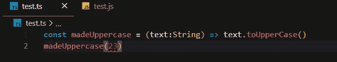
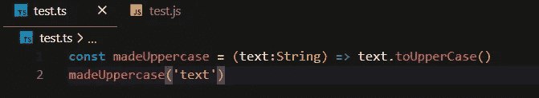
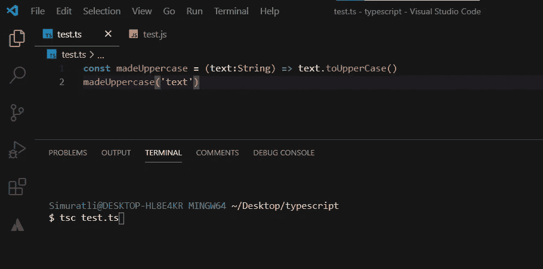
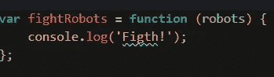
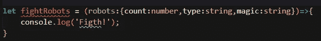

# 类型脚本类型

> 原文：<https://levelup.gitconnected.com/typescript-types-66863eb6c435>


顾名思义，TypeScript 通过添加类型来扩展 JavaScript。Typescript 是一种强类型、面向对象和编译的开源语言。

让我们学习打字稿

谁能理解这些图像中的逻辑？


打字稿:


JavaScript:



在 typescript 文件中，我们可以看到一个红色的小下划线，它显示了一个小错误。这是因为它是一种强类型语言。发生这个错误是因为 ***toUpperCase()*** 是一个字符串方法。让我们通过声明**文本**项的类型来解决这个问题。



现在我们在数字下面看到这条错误线，因为 **23** 不是一个字符串。让我们也确定这个数字。



错误线将消失。

> 注意，TypeScript 被编译成 JavaScript(它只是 JavaScript 的超集，很像 C++到 C)

我们如何开始打字？首先，您必须将 typescript 下载到您的桌面。打开你的终端，写下这段代码。

`npm install typescript --save-dev`

这就够了。之后，您必须转到 visual studio 代码或其他 IDE 或文本编辑器，并创建一个. ts 文件。写一些打字稿代码，打开你的终端。写下 `tsc test.ts`(或者随便你的文件名)。



您可以看到 test.js 文件被自动创建，typeScript 代码被转换为 javaScript 代码。

# Javascript 中的类型

Javascript 有 7 种数据类型。他们划分了原始数据类型和其他类型。其他定义为对象。

## 原始数据类型。

*   `String`
*   `Number`
*   `Undefined`
*   `Null`
*   `Symbol`
*   `Boolean`

## 目标

*   函数是一级对象。
*   数组是特殊的对象。
*   原型是对象。

## 如何在 Typescript 中定义布尔类型:

```
TypeScript:
  **let** isCool**:**boolean **=** true;
How it converted to Javascript:
  **var** isCool **=** true;
```

## 如何在 Typescript 中定义数字类型:

```
TypeScript:
  **let** age**:**number **=** 12How it converted to Javascript:
  **var** age **=** 12;
```

## 如何在 Typescript 中定义字符串类型:

```
TypeScript:
  **let** eyeColor**:**string **=** 'red'How it converted to Javascript:
  **var** eyeColor **=** 'red';
```

## 如何在 Typescript 中定义字符串数组:

```
TypeScript:
  **let** pets**:**string[]**=** ['cat','dog']
  //or
  **let** pets2**:**Array<string> **=** ['cat','dog']How it converted to Javascript:
  **var** pets **=** ['cat', 'dog'];
  **var** pets2 **=** ['cat', 'dog'];
```

## 如何在 Typescript 中定义对象:

```
TypeScript:
  **let** wizard**:**object **=** {
     a:"Joghn"
   }How it converted to Javascript:
  **var** wizard **=** {
      a: "Joghn"
   };
```

## 如何在 Typescript 中定义元组(数字和字符串数组):

```
TypeScript:
  **let** baskets**:**[string,number];
  baskets **=** ['fsdfs',3]How it converted to Javascript:
 **var** baskets;
 baskets **=** ['fsdfs', 3];
```

## 如何在 Typescript 中定义枚举:

```
TypeScript:
  **enum** Size {Small**=**1,Medium**=**2,Large**=**3}
  **let** sizename**:**string **=** Size[2]
  console.log(sizename);How it converted to Javascript:
 **var** Size;
(**function** (Size) {
Size[Size["Small"] **=** 1] **=** "Small";
Size[Size["Medium"] **=** 2] **=** "Medium";
Size[Size["Large"] **=** 3] **=** "Large";
})(Size **||** (Size **=** {}));
**var** sizename **=** Size[2];
console**.**log(sizename);
```

## 如果我们想归还任何东西

```
TypeScript:
  **let** whatever**:**any **=** 'sdfsdf'How it converted to Javascript:
  **var** whatever **=** 'sdfsdf'
```

## 如果我们不归还任何东西

```
TypeScript:
  **let** sing **=** ()**:**void **=>**{
    console.log('lalalal');
  }How it converted to Javascript:
  **var** sing **=** **function** () {
    console**.**log('lalalal');
  };
```

## 如果我们返回一个错误

```
TypeScript:
 **let** error **=** ()**:**never **=>**{
  **throw** Error('sa')
}How it converted to Javascript:
  **var** error **=** **function** () {
    **throw** Error('sa');
  };
```

## 类型脚本中的接口

**接口**是在应用程序中定义契约的结构。它定义了类要遵循的语法。

```
TypeScript:
```


```
How it converted to Javascript:
```



这是描述 ***界面*** 的代码



现在你知道了很多关于 typescript 的事情😎


Github: [链接](https://github.com/Simuratli)

BitBucket: [链接](https://bitbucket.org/Simuratli/)

Linkedin: [链接](https://www.linkedin.com/in/elcan-simuratli-36678818a/)

为了支持我:[帕特里翁](https://www.patreon.com/simuratli)