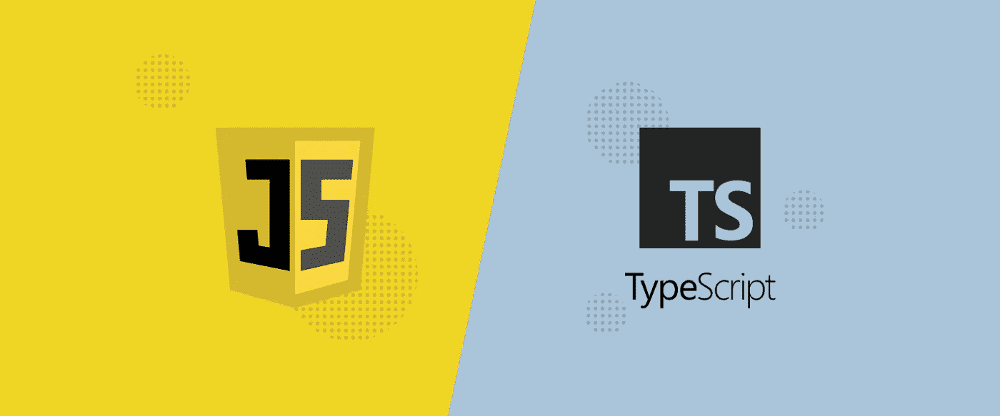
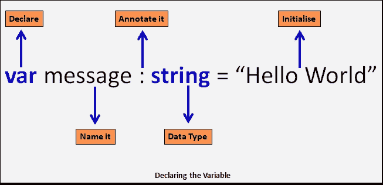
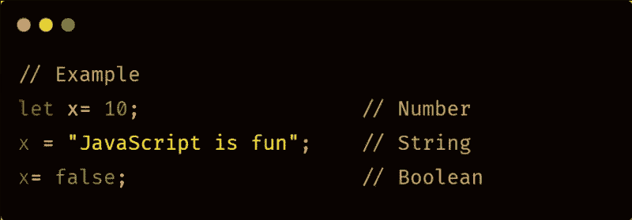
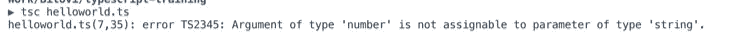

# TypeScript 与 JavaScript:全面的比较

> 原文：<https://levelup.gitconnected.com/typescript-vs-javascript-a-comprehensive-comparison-d923a7a5c3f3>

# 介绍

如果你是一名 web 开发人员，你可能听说过 TypeScript 和 JavaScript。但是这些语言到底是什么，它们之间有什么不同？

TypeScript 和 JavaScript 都是广泛用于构建 web 应用程序的编程语言。但是，虽然它们有一些相似之处，但它们也有一些关键的不同，使它们适合不同类型的项目。

在这篇博文中，我们将深入探究 TypeScript 和 JavaScript 的世界，并对这两种语言进行比较。我们将讨论它们的历史、语法、语言特性、采用等等。在这篇文章结束时，你会对哪种语言适合你的项目有更好的理解。

# 历史和背景

在我们深入研究 TypeScript 和 JavaScript 的本质细节之前，让我们先回顾一下这两种语言的历史和背景。

JavaScript 最初是由 Netscape 在 20 世纪 90 年代中期开发的，作为一种给网页增加交互性的方法。它很快被广泛采用，并成为构建 web 应用程序的标准语言。今天，全世界有数百万开发人员使用 JavaScript，并且所有现代 web 浏览器都支持它。

另一方面，TypeScript 是微软在 2012 年开发的。它是作为一种向 JavaScript 添加静态类型的方式而创建的，许多开发人员认为这是该语言中缺少的一个特性。静态类型允许开发人员指定变量、函数参数和返回值的数据类型，这有助于在编译时而不是运行时捕捉错误。

TypeScript 代码看起来非常类似于 JavaScript 代码，但是增加了一些用于指定数据类型的语法元素。这允许开发人员使用 TypeScript 作为 JavaScript 的“超集”，这意味着任何有效的 JavaScript 代码也是有效的 TypeScript 代码。然而，TypeScript 添加了一些 JavaScript 中没有的语言特性，我们将在本文后面讨论。

因此，创建 TypeScript 的主要动机是将静态类型添加到 JavaScript 中，许多开发人员认为这是该语言中缺少的功能。这使得 TypeScript 在需要高水平代码可维护性和健壮性的大型项目中特别受欢迎。

# 语法和语言特征

现在我们已经介绍了 TypeScript 和 JavaScript 的历史和背景，让我们继续讨论这两种语言的语法和语言特性。

在高层次上，TypeScript 和 JavaScript 的语法非常相似。两种语言都使用相似的控制结构(例如，if-else 语句，for 循环)、数据类型(例如，数字、字符串、布尔值)和运算符(例如，加法、减法、比较)。然而，TypeScript 和 JavaScript 之间有一些关键的区别。

TypeScript 和 JavaScript 的主要区别之一是静态类型系统。正如我们前面提到的，TypeScript 允许开发人员指定变量、函数参数和返回值的数据类型。这是使用类型注释完成的，类型注释放在变量或函数名之后。

相比之下，JavaScript 使用动态类型系统，这意味着变量的数据类型可以在运行时改变。如果变量的使用方式与其数据类型不一致，这可能会导致运行时错误。

除了静态类型之外，TypeScript 还包括许多 JavaScript 中没有的其他语言特性。其中包括接口和类，接口允许开发人员定义自定义类型，类提供了一种在 JavaScript 中定义面向对象编程结构的方法。

总的来说，TypeScript 和 JavaScript 的语法和语言功能是相似的，但是 TypeScript 添加了一个静态类型系统和其他语言功能，可以帮助提高代码的可维护性和健壮性。

# 利弊

使用 TypeScript 的主要优点之一是静态类型系统，它可以帮助在编译时捕捉错误并提高代码的可维护性。这对于具有大量代码库的大型项目尤其有用，因为它有助于防止运行时错误，并使重构和修改代码更加容易。

另一方面，使用 TypeScript 的一个缺点是，它为不熟悉静态类型的开发人员增加了一条学习曲线。它还需要更多的样板代码，编译起来比 JavaScript 慢。

相比之下，使用 JavaScript 的主要优点之一是它的动态类型系统，这使得开发人员可以更加灵活和富有创造性地使用他们的代码。它的编写和编译速度也比 TypeScript 快，并且拥有更大的开发人员社区和更多可用资源。

然而，使用 JavaScript 的一个缺点是，由于其动态类型系统，它更容易出现运行时错误。这可能使调试和测试更具挑战性，并可能影响代码的整体可靠性和健壮性。

总的来说，TypeScript 和 JavaScript 各有利弊，两种语言之间的选择将取决于项目的具体需求和目标。如果您想利用静态类型和其他语言特性，TypeScript 可能是更好的选择。如果您想要一种更灵活、更轻量级的语言来支持更大的开发人员社区，JavaScript 可能是您的不二之选。

# 结论

在这篇博文中，我们比较了 TypeScript 和 JavaScript，这两种流行的编程语言被广泛用于构建 web 应用程序和其他软件。

我们研究了这些语言的历史和背景、语法和语言特性、采用情况和社区支持，以及使用每种语言的利弊。

总的来说，TypeScript 是 JavaScript 的静态类型超集，它增加了额外的语言特性，并支持编译时的类型检查。它得到了许多流行的库和框架的支持，并在希望提高代码可靠性和可维护性的开发人员中获得了越来越多的关注。

另一方面，JavaScript 是一种动态、轻量级、灵活的语言，被大型开发人员社区广泛使用和支持。它的编写和编译速度很快，并允许开发人员更有创造性和表现力地使用他们的代码。

在决定使用 TypeScript 还是 JavaScript 时，考虑项目的特定需求和目标很重要。如果您想利用静态类型和附加的语言特性，并且如果您正在处理一个具有大量代码库的大型项目，那么 TypeScript 可能是更好的选择。

如果您想要一种更轻量级、更灵活的语言来支持更大的开发人员社区，或者如果您正在从事一个更小或更敏捷的项目，JavaScript 可能是一个不错的选择。

最后，在 TypeScript 和 JavaScript 之间的选择将取决于您的个人偏好和项目的需求。这两种语言各有优缺点，在做出决定之前权衡利弊是很重要的。

如果你喜欢这个内容，并希望看到更多，请考虑在媒体上关注我。编码快乐！