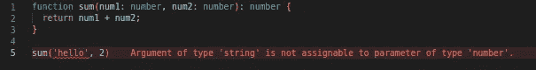

# 打字稿——它是关于什么的？

> 原文：<https://levelup.gitconnected.com/typescript-what-is-it-all-about-4c9dea82cd32>

几天前，我发表了一篇名为“[TypeScript——‘any’和‘unknown’Type](https://medium.com/@abongsjoel/typescript-difference-between-any-and-unknown-types-1fff4bf232a?source=your_stories_page-------------------------------------)s”的文章，从我的一些仍在从事 Web 开发的追随者的反应中，我意识到他们中的一些人并不知道 TypeScript 是关于什么的。

所以在这篇文章中，我将简单介绍一下 **TypeScript** 。


为了更好地理解 **TypeScript** 是什么，让我们从 **JavaScript** 开始。

# **JavaScript**

简单来说， **JavaScript** *(常缩写为* ***JS*** *也称为****ECMAScript****)*是一种用于网页编程的编程语言。也就是说，它是一种网页脚本语言。然而，许多非浏览器环境也使用它，如 [Node.js](https://developer.mozilla.org/en-US/docs/Glossary/Node.js) 、 [Apache CouchDB](https://couchdb.apache.org/) 和 [Adobe Acrobat](https://opensource.adobe.com/dc-acrobat-sdk-docs/acrobatsdk/) 。

更技术上来说， **JavaScript** 是一种轻量级的，解释型的，或者说[实时](https://en.wikipedia.org/wiki/Just-in-time_compilation)编译型的编程语言，具有[一级函数](https://developer.mozilla.org/en-US/docs/Glossary/First-class_Function)。它是一种基于原型、多范例、单线程的动态语言，支持面向对象、命令式和声明式风格。点击了解更多关于 JavaScript [的信息。](https://developer.mozilla.org/en-US/docs/Web/JavaScript/About_JavaScript)

Javascript 被世界各地的程序员用来创建动态和交互式的网络内容，如应用程序和浏览器。JavaScript 如此受欢迎，以至于它是世界上使用最多的编程语言，被所有网站的 97.0%用作客户端编程语言。

现在，开始打字稿。

# **打字稿**

基本上， **TypeScript** *(通常缩写为****TS****)*是添加了类型语法的 JavaScript。 [W3Schools](https://www.w3schools.com/) 将 **TypeScript** 定义为添加静态类型的 **JavaScript** 的语法超集。这基本上意味着 **TypeScript** 在 **JavaScript** 之上添加语法，允许开发者添加类型。

因此，JS 语法是合法的 TS。**语法**是指我们编写文本形成程序的方式。

我们也可以说 **TypeScript** 是具有最新 [ECMAScript](https://en.wikipedia.org/wiki/ECMAScript) 特性和静态类型系统的 **JavaScript** 。 **TypeScript** 编译成 **JavaScript** ，所以浏览器运行 **JavaScript** 而不是 TypeScript。

# 示例:

这里有一个简单的函数在 **JavaScript** 中，它接受两个参数(数字)并返回它们的和:

```
function sum(num1, num2) {
  return num1 + num2;
}
```

这就是我们如何在**类型脚本**中编写相同的函数:

```
function sum(num1: *number*, num2: *number*): *number* {
  return num1 + num2;
}
```

语法:

```
sum(num1: *number*, num2: *number*): *number*
```

清楚地告诉我们，函数`sum`接受两个参数:`num1`是一个`*number*`和`num2`是一个`*number*`，最后一个`*number*`表示函数的返回类型，一个`number`。

如果我们试图调用上面的`sum`函数，传递给它一个不是数字的东西，例如:

```
sum('hello', 2)
```

使用**TypeScript**,**TypeScirpt**编译器将立即给字符串“hello”加下划线，并给出一条错误消息:



使用 JavaScript，我们在运行程序之前不会收到任何类似的警告。

要了解更多关于 **TypeScript** 中使用的原语类型，请查看本文。

# 使用 TypeScript 的优势

以下是使用**类型脚本**优于 **JavaScript** 的一些优势:

1.  TypeScript 的类型系统有助于我们在开发阶段(预编译阶段)在代码进入生产阶段之前捕捉代码中的错误。
2.  **TypeScript** 帮助我们记录代码。例如，只要看看上面的`sum`函数，我们就可以很容易地知道它接受什么类型的参数，以及它的返回类型是什么。
3.  **TypeScript** 帮助我们编写可靠的代码，并改善我们的开发者体验。
4.  TypeScript 允许我们在我们的 TypeScript 代码中使用 ECMAScript 的最新发展。

# **结论**

**TypeScript** 是包含类型的 **JavaScirpt** 。因此，不学习 **JavaScipt** 我们就无法学习 **TypeScript** 。 **TypeScript** 与 **JavaScript** 共享语法和运行时行为，所以我们对 **JavaScript** 的任何了解都同时在帮助我们学习 **TypeScript** 。

此外，如上所述， **TypeScript** 比 **JavaScript** 有许多优势。点击了解更多关于 TypeScript [的信息。](https://www.w3schools.com/typescript/index.php)

如果我们使用像 **React** 这样的库或框架，建立一个 **React** 项目来处理 **TypeScript** 是可能的，也是非常容易的。在此了解更多关于使用 TypeScript 和 React 的信息[。](https://blog.logrocket.com/using-typescript-with-react-tutorial-examples/)

因此，如果你是一名开发人员，希望构建一个合理规模的应用程序，我会建议你在前端使用 **TypeScript** 而不是 **JavaScript** 。

— -

如果你喜欢这篇文章，请留下一些掌声，如果你还不喜欢的话，请确保在 Medium 上关注我。你也可以订阅，以便在我发表文章时收到电子邮件，为什么不为我买一台高保真音响呢？谢了。