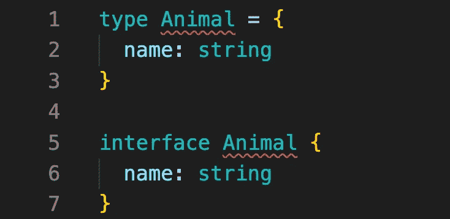
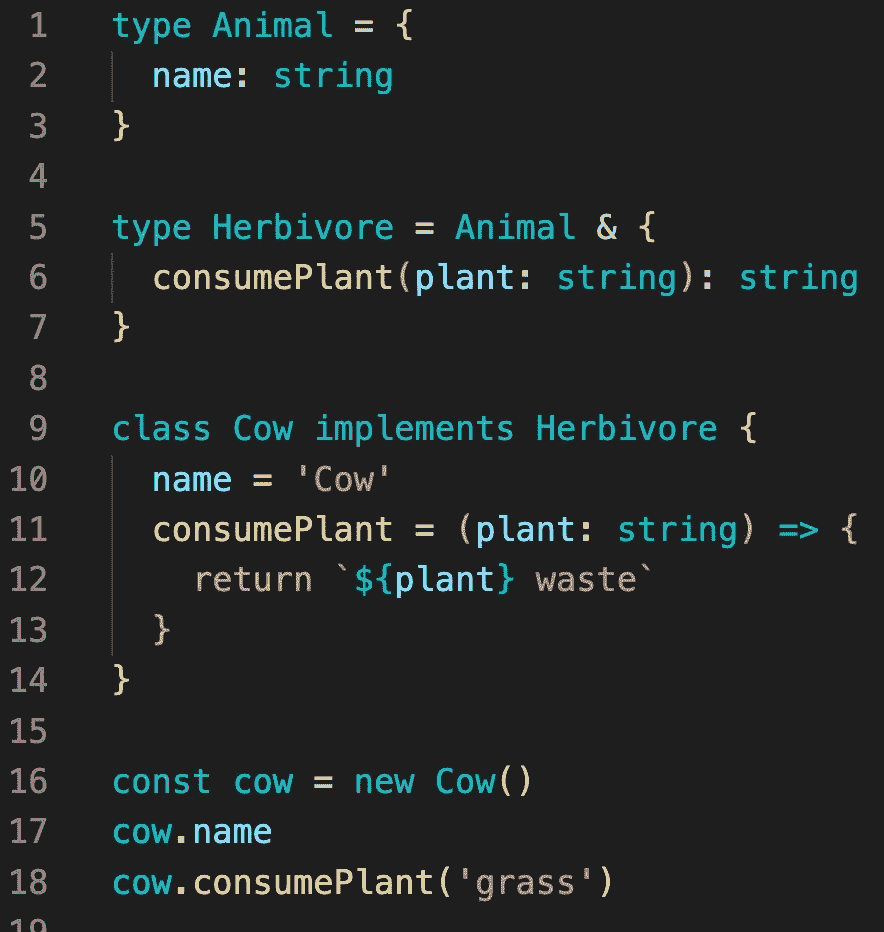
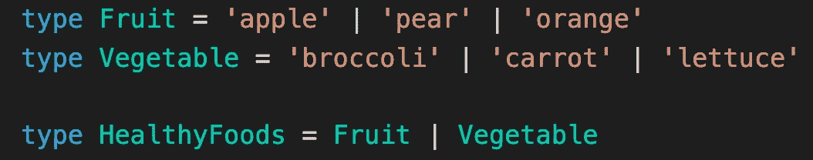
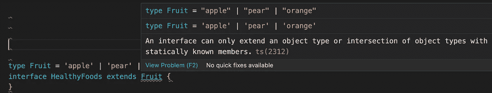
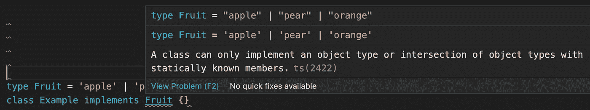
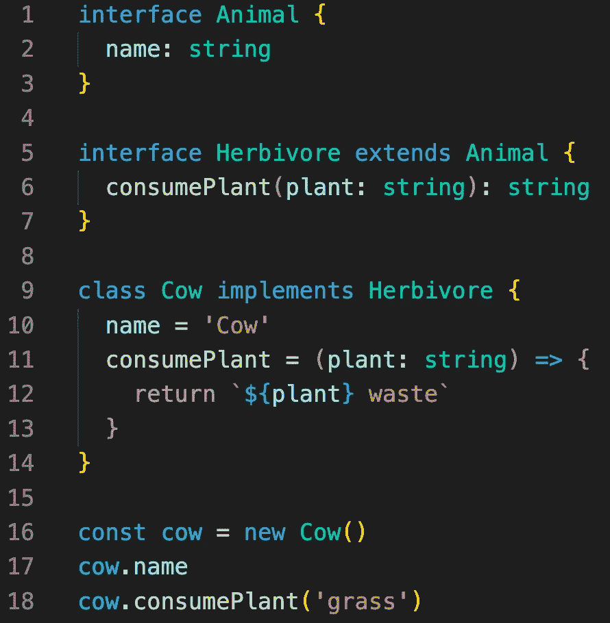
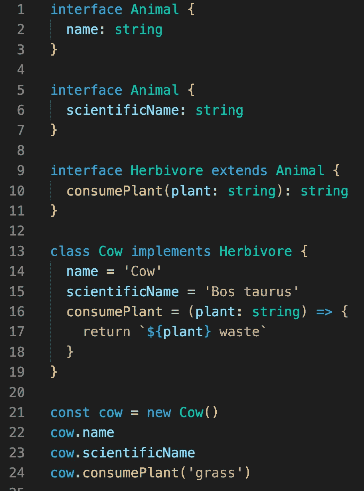

# TypeScript:类型和接口有什么区别？

> 原文：<https://levelup.gitconnected.com/typescript-what-is-the-difference-between-type-and-interface-9085b88ee531>

你是否开始在你的个人或工作项目中使用 TypeScript，并且仍然试图找出`type`和`interface`之间的*真正的*区别是什么？或者使用 TypeScript 已经有一段时间了，但没有做更多的研究就使用了其中的一个或另一个？我也有同样的问题，并仔细研究了不同之处，这样你就可以下定决心了。

首先，`type`的正确术语是`type alias`，但是我们可以在本文中使用简写。只知道正确的术语是`type alias`。

`Type aliases`和`interfaces`非常相似，很多情况下你可以自由选择。`interface`的几乎所有特性在`type`中都可用，关键区别在于`type`不能被重新打开来添加新属性，而`interface`总是可扩展的。

# **类型**

> 类型别名是任何类型的名称。类型别名不仅可以用来表示原语，还可以表示对象类型、联合类型、元组和交集。

类型允许您定义一个形状或别名基本类型。使用类型允许您获得编译时警告而不是运行时异常，并更快地发现实现中的错误。使用`&`符号，你可以扩展一个现有的类型，这种语法比`interfaces`使用的`extends`关键字更简洁。

在这个例子中，我们取了一个基础`type`、`Animal`，然后用`Herbivore`扩展它，并添加另一个属性。从这里我们可以看到，创建一个实现了`type`的类可以为它们提供值，然后该类的一个实例可以利用这些属性。

联合类型只能通过`type`关键字实现:

在本例中，我们采用两个不同的`types`并创建两者的组合。这称为联合类型，可用于对您使用的有效值和形状进行更多检查。

在使用带有`type`的 union 操作符时，有两种明确的限制情况。

1.  **如果您在** `**type**` **定义中使用了联合运算符** `**|**` **，则不能在带有** `**type**` **的** `**interface**` **上使用** `**extends**` **。**

**2。如果在您的** `**type**` **定义中使用了联合运算符** `**|**` **，则不能在带有** `**type**` **的类上使用** `**implements**` **。**

# **接口**

> TypeScript 的核心原则之一是类型检查关注值的形状。这有时被称为“鸭分型”或“结构亚分型”。在 TypeScript 中，`interfaces`扮演了命名这些类型的角色，并且是在您的代码中定义契约以及在您的项目之外使用代码定义契约的强大方法。

如上所述，`interfaces`还允许你用不同的语法定义一个对象的形状，还允许你做一些叫做`declaration merging`的事情。`interfaces`的语法有点长，但是它们可以做`type`能做的一切。

在本例中，我们从一个`Animal` `interface`开始，并在此基础上为一个`Herbivore`创建一个新的`interface`。`Herbivore`有一个`consumePlant`函数，并且全部由`Cow`类实现。

之前我提到过`declaration merging`，你只能用`interface`来做这件事。这是一个确切的例子。

对于`declaration merging`，你有多个同名的接口，它们*全部*合并成一个接口。乍一看，这很可怕，是你的团队容易犯的错误。然而，如果您需要扩展您正在使用的库，那么这就是您可以使用的工具。如果您正在构建一个库，其他人可能想要扩展 Props 或输入来完成他们的用例，那么考虑更多地使用接口。

# 结论

如果你遇到上面两个例子中任何一个带有`type`的例子，你正试图实现某个东西，但是语言阻止你这么做，那么你将被迫进入`interface`或者`type`。然而，如果你正在寻找一个通用的经验法则，`type`有一个更简洁的语法，当你试图做`declaration merging`或者扩展一个现有的`interface`或者库的时候，你只需要拉进一个`interface`。如果你是一个库的作者，那么本指南将使用一个`interface`作为你的缺省值，这样使用你的库的人就可以扩展对他们有意义的功能。您不能使用`interface`创建联合、交集或元组，因此在创建它们时使用`type`。

如果你想更深入地了解，我在 TypeScript lang 网站上给出了我的例子，该网站有更多优秀的资源来了解 TypeScript 语言的不同特性。也可以看看我学的这篇[优秀文章](https://medium.com/@martin_hotell/interface-vs-type-alias-in-typescript-2-7-2a8f1777af4c)或者[这篇](https://dev.to/toluagboola/type-aliases-vs-interfaces-in-typescript-3ggg)。

如果你喜欢这篇文章，考虑[订阅媒体](https://medium.com/@ascourter/membership)！

如果你或你的公司有兴趣找人进行技术面试，那么请在 Twitter ( [@Exosyphon](http://twitter.com/Exosyphon) )上给我发 DM，或者访问我的[网站](https://andrewcourter.com/)。如果你喜欢这样的话题，那么你可能也会喜欢我的 [Youtube 频道](https://www.youtube.com/channel/UCx3Vist13GWLzRPvhUxQ3Jg)。如果你想支持更多像这样的内容 [buymeacoffee](https://www.buymeacoffee.com/andrewcourter) 。祝您愉快！

# 分级编码

感谢您成为我们社区的一员！更多内容见[升级编码出版物](https://levelup.gitconnected.com/)。
跟随:[推特](https://twitter.com/gitconnected)，[领英](https://www.linkedin.com/company/gitconnected)，[通迅](https://newsletter.levelup.dev/)
**升一级正在改造理工大招聘➡️** [**加入我们的人才集体**](https://jobs.levelup.dev/talent/welcome?referral=true)